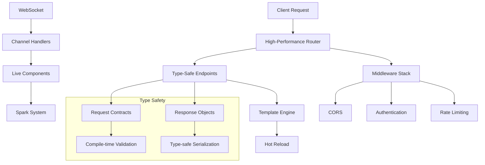

<div style="text-align:center"></div>

# Azu Web Framework

[](https://www.codacy.com/manual/eliasjpr/azu?utm_source=github.com&utm_medium=referral&utm_content=eliasjpr/azu&utm_campaign=Badge_Grade) [](https://github.com/azutoolkit/azu/actions/workflows/crystal.yml) [](https://github.com/azutoolkit/azu/actions/workflows/github-code-scanning/codeql)

**Azu** is a high-performance, type-safe web framework for Crystal that emphasizes developer productivity, compile-time safety, and real-time capabilities. Built with modern web development patterns, Azu provides a robust foundation for building scalable applications with elegant, expressive syntax.

## 🚀 Key Features

### Type-Safe Architecture

- **Compile-time type checking** for requests, responses, and parameters
- **Type-safe endpoint pattern** with structured request/response contracts
- **Zero-runtime overhead** parameter validation and serialization

### Real-Time Capabilities

- **WebSocket channels** with automatic connection management
- **Live components** with client-server synchronization
- **Spark system** for reactive UI updates without page reloads

### Performance-Optimized

- **High-performance routing** with LRU cache and path optimization
- **Template hot reloading** in development with production caching
- **Efficient file upload handling** with streaming and size limits

### Developer Experience

- **Comprehensive error handling** with detailed debugging information
- **Content negotiation** supporting JSON, HTML, XML, and plain text
- **Flexible middleware system** for cross-cutting concerns
- **Environment-aware configuration** with sensible defaults

## 📊 Performance Characteristics

- **Sub-millisecond routing** with cached path resolution
- **Memory-efficient** request/response handling
- **Concurrent WebSocket** connections with lightweight fiber-based architecture
- **Zero-allocation** parameter parsing for common scenarios
- **Template compilation** with optional hot-reloading for development

## 🏗️ Architecture Overview



## 🛠️ Installation

1. Add the dependency to your `shard.yml`:

```yaml
dependencies:
  azu:
    github: azutoolkit/azu
    version: ~> 0.4.14
```

2. Run `shards install`

3. Require Azu in your application:

```crystal
require "azu"
```

## 🎯 Complete Quickstart Guide

This guide walks through building a complete Azu application with all major features in logical order.

### 1. Project Configuration

Create your main application file with comprehensive configuration:

```crystal
# src/my_app.cr
require "azu"

module MyApp
  include Azu

  # Application configuration
  configure do
    # Server settings
    port = ENV.fetch("PORT", "4000").to_i
    host = ENV.fetch("HOST", "0.0.0.0")

    # SSL/TLS configuration
    ssl_cert = ENV["SSL_CERT"]?
    ssl_key = ENV["SSL_KEY"]?

    # Template configuration
    templates.path = ["src/templates", "src/views"]
    template_hot_reload = ENV.fetch("CRYSTAL_ENV", "development") == "development"

    # File upload configuration
    upload.max_file_size = 50.megabytes
    upload.temp_dir = "tmp/uploads"
    upload.buffer_size = 8192

    # Cache configuration
    cache_config.enabled = true
    cache_config.store = "memory"
    cache_config.max_size = 1000
    cache_config.default_ttl = 300

    # Performance monitoring (optional)
    performance_enabled = ENV.fetch("PERFORMANCE_MONITORING", "false") == "true"

    # Development tools
    if env.development?
      performance_profiling_enabled = true
      performance_memory_monitoring = true
    end
  end
end

# Load application components
require "./models/*"
require "./services/*"
require "./requests/*"
require "./responses/*"
require "./validators/*"
require "./endpoints/*"
require "./channels/*"
require "./middleware/*"
```

### 2. Server Startup

Create a dedicated server file to start your application:

```crystal
# server.cr
require "./src/my_app"

# Build handler chain with explicit typing to avoid Crystal type inference issues

  MyApp.start [
    Azu::Handler::RequestId.new,                     # Enhanced request ID tracking
    Azu::Handler::DevDashboard.new,                  # Development Dashboard at /dev-dashboard
    MyApp::CONFIG.performance_monitor.not_nil!,     # Performance metrics collection (shared instance)
    Azu::Handler::Rescuer.new,                       # Enhanced error handling
    Azu::Handler::Logger.new,                        # Request logging
  ]

  MyApp.start [
    Azu::Handler::RequestId.new, # Enhanced request ID tracking
    Azu::Handler::Rescuer.new,   # Enhanced error handling
    Azu::Handler::Logger.new,    # Request logging
  ]


puts "🚀 MyApp server starting on http://#{MyApp::CONFIG.host}:#{MyApp::CONFIG.port}"
```

To run your application:

```bash
# Development
crystal run server.cr

# Production build
crystal build server.cr --release
./server

# With environment variables
CRYSTAL_ENV=production PORT=8080 crystal run server.cr
```

### 3. Request Contracts with Validation

Define type-safe request objects with comprehensive validation:

```crystal
# src/requests/user_request.cr
struct UserRequest
  include Azu::Request

  getter name : String
  getter email : String
  getter age : Int32?
  getter profile_image : Azu::Params::Multipart::File?

  def initialize(@name = "", @email = "", @age = nil, @profile_image = nil)
  end

    # Built-in validation rules
  validate :name, presence: true, length: {min: 2, max: 50}
  validate :email, presence: true, format: /\A[\w+\-.]+@[a-z\d\-]+(\.[a-z\d\-]+)*\.[a-z]+\z/i
  validate :age, numericality: {greater_than: 0, less_than: 150}, if: ->{ age }

  # Use custom validators (defined in section 4)
  use EmailValidator
  use UniqueRecordValidator
  use AgeValidator
  use FileValidator
end

# src/requests/search_request.cr
struct SearchRequest
  include Azu::Request

  getter query : String
  getter page : Int32
  getter per_page : Int32
  getter sort : String
  getter filters : Hash(String, String)

  def initialize(@query = "", @page = 1, @per_page = 20, @sort = "created_at", @filters = {} of String => String)
  end

  validate :query, presence: true, length: {min: 1}
  validate :page, numericality: {greater_than: 0}
  validate :per_page, numericality: {greater_than: 0, less_than_or_equal_to: 100}
  validate :sort, inclusion: {in: %w(name email created_at updated_at)}
end
```

### 4. Custom Validators

Create reusable validation logic using Azu's validator pattern:

```crystal
# src/validators/email_validator.cr
class EmailValidator < Azu::Validator
  getter :record, :field, :message

  EMAIL_REGEX = /\A[\w+\-.]+@[a-z\d\-]+(\.[a-z\d\-]+)*\.[a-z]+\z/i

  def initialize(@record : User)
    @field = :email
    @message = "Email must be valid!"
  end

  def valid? : Array(Schema::Error)
    errors = [] of Schema::Error

    email = @record.email
    return errors if email.empty?

    unless EMAIL_REGEX.match(email)
      errors << Schema::Error.new(@field, @message)
    end

    errors
  end
end

# src/validators/unique_record_validator.cr
class UniqueRecordValidator < Azu::Validator
  getter :record, :field, :message

  def initialize(@record : User)
    @field = :email
    @message = "Email must be unique!"
  end

  def valid? : Array(Schema::Error)
    errors = [] of Schema::Error

    # Check if email already exists in database
    if User.where(email: @record.email).where { id != @record.id }.exists?
      errors << Schema::Error.new(@field, @message)
    end

    errors
  end
end

# src/validators/age_validator.cr
class AgeValidator < Azu::Validator
  getter :record, :field, :message

  def initialize(@record : User)
    @field = :age
    @message = "Age must be between 13 and 120!"
  end

  def valid? : Array(Schema::Error)
    errors = [] of Schema::Error

    age = @record.age
    return errors unless age # Skip if age is nil

    unless (13..120).includes?(age)
      errors << Schema::Error.new(@field, @message)
    end

    errors
  end
end

# src/validators/file_validator.cr
class FileValidator < Azu::Validator
  getter :record, :field, :message

  IMAGE_EXTENSIONS = %w(.jpg .jpeg .png .gif .webp)

  def initialize(@record : User)
    @field = :profile_image
    @message = "Profile image must be a valid image file!"
  end

  def valid? : Array(Schema::Error)
    errors = [] of Schema::Error

    # This assumes your User model has a profile_image_path field
    return errors unless @record.profile_image_url

    extension = File.extname(@record.profile_image_url || "").downcase
    unless IMAGE_EXTENSIONS.includes?(extension)
      errors << Schema::Error.new(@field, @message)
    end

    errors
  end
end
```

**Using Custom Validators in Models:**

```crystal
# src/models/user.cr
struct User
  include Azu::Request

  property id : Int64?
  property name : String
  property email : String
  property age : Int32?
  property profile_image_url : String?

  def initialize(@name = "", @email = "", @age = nil, @profile_image_url = nil)
  end

  # Use custom validators
  use EmailValidator
  use UniqueRecordValidator
  use AgeValidator
  use FileValidator

  # Built-in validations still work alongside custom validators
  validate :name, presence: true, length: {min: 2, max: 50}
end
```

**Advanced Custom Validator Example:**

```crystal
# src/validators/password_strength_validator.cr
class PasswordStrengthValidator < Azu::Validator
  getter :record, :field, :message

  def initialize(@record : User)
    @field = :password
    @message = "Password must contain at least 8 characters, one uppercase, one lowercase, and one number!"
  end

  def valid? : Array(Schema::Error)
    errors = [] of Schema::Error

    password = @record.password
    return errors if password.empty?

    # Check length
    if password.size < 8
      errors << Schema::Error.new(@field, "Password must be at least 8 characters long!")
      return errors
    end

    # Check for uppercase letter
    unless password.match(/[A-Z]/)
      errors << Schema::Error.new(@field, "Password must contain at least one uppercase letter!")
    end

    # Check for lowercase letter
    unless password.match(/[a-z]/)
      errors << Schema::Error.new(@field, "Password must contain at least one lowercase letter!")
    end

    # Check for number
    unless password.match(/[0-9]/)
      errors << Schema::Error.new(@field, "Password must contain at least one number!")
    end

    # Check for special character (optional)
    unless password.match(/[!@#$%^&*(),.?":{}|<>]/)
      errors << Schema::Error.new(@field, "Password should contain at least one special character!")
    end

    errors
  end
end
```

### 5. Data Models

Define your data models (example with CQL ORM):

```crystal
# src/models/user.cr
require "cql"

struct User
  include CQL::Model(Int64)
  db_context ExampleDB, :users

  property id : Int64
  property name : String
  property email : String
  property age : Int32?
  property profile_image_url : String?
  property created_at : Time
  property updated_at : Time

  # Associations
  has_many :posts, Post, foreign_key: :user_id
  has_one :profile, UserProfile, foreign_key: :user_id

  # Validations at model level
  validates :name, presence: true, length: {min: 2}
  validates :email, presence: true, uniqueness: true, format: EmailValidator::EMAIL_REGEX

  # Callbacks
  before_save :update_timestamps
  before_create :set_defaults

  # Scopes
  scope :active, ->{ where(active: true) }
  scope :recent, ->{ order(:created_at, :desc) }

  def full_profile
    "#{name} <#{email}>"
  end
end

# src/models/post.cr
class Post
  include CQL::Model(Int64)

  property id : Int64
  property title : String
  property content : String
  property user_id : Int64
  property published : Bool
  property created_at : Time
  property updated_at : Time

  belongs_to :user, User, foreign_key: :user_id

  validates :title, presence: true, length: {min: 5}
  validates :content, presence: true
  validates :user_id, presence: true

  scope :published, ->{ where(published: true) }
  scope :by_user, ->(user_id : Int64){ where(user_id: user_id) }
end
```

### 6. Services (Business Logic)

Organize business logic in service classes:

```crystal
# src/services/user_service.cr
module UserService
  extend self

  def create_user(request : UserRequest) : User
    # Validate request
    raise Azu::Response::ValidationError.new(request.errors) unless request.valid?

    # Handle file upload if present
    profile_image_url = nil
    if file = request.profile_image
      profile_image_url = FileUploadService.upload_image(file)
    end

    # Create user
    user = User.new(
      name: request.name,
      email: request.email,
      age: request.age,
      profile_image_url: profile_image_url
    )

    unless user.save
      raise Azu::Response::ValidationError.new(user.errors)
    end

    # Send welcome email
    EmailService.send_welcome_email(user)

    user
  end

  def find_user(id : Int64) : User?
    User.find(id)
  rescue CQL::RecordNotFound
    nil
  end

  def search_users(request : SearchRequest) : Array(User)
    query = User.query

    # Apply search filter
    unless request.query.empty?
      query = query.where {
        users.name.like(request.query) ||
        users.email.like(request.query)
      }
    end

    # Apply sorting
    case request.sort
    when "name"
      query = query.order(:name)
    when "email"
      query = query.order(:email)
    when "created_at"
      query = query.order(:created_at, :desc)
    end

    # Apply pagination
    offset = (request.page - 1) * request.per_page
    query.limit(request.per_page).offset(offset).to_a
  end

  def email_exists?(email : String) : Bool
    User.where(email: email).exists?
  end

  def update_user(id : Int64, request : UserRequest) : User
    user = find_user(id)
    raise Azu::Response::NotFoundError.new("User not found") unless user

    user.name = request.name unless request.name.empty?
    user.email = request.email unless request.email.empty?
    user.age = request.age if request.age

    # Handle profile image update
    if file = request.profile_image
      # Delete old image if exists
      FileUploadService.delete_file(user.profile_image_url) if user.profile_image_url

      # Upload new image
      user.profile_image_url = FileUploadService.upload_image(file)
    end

    unless user.save
      raise Azu::Response::ValidationError.new(user.errors)
    end

    user
  end
end

# src/services/file_upload_service.cr
module FileUploadService
  extend self

  UPLOAD_DIR = "public/uploads"
  ALLOWED_EXTENSIONS = %w(.jpg .jpeg .png .gif .pdf .doc .docx)

    def upload_image(file : Azu::Params::Multipart::File) : String
    # Validate file manually since this is a service-level validation
    # Model-level validation would use the FileValidator class
    validate_file_size!(file, 5.megabytes)

    unless valid_image?(file)
      raise Azu::Response::ValidationError.new("file", "Invalid image format")
    end

    # Generate secure filename
    extension = File.extname(file.filename || "")
    filename = "#{Random::Secure.hex(16)}#{extension}"
    upload_path = Path[UPLOAD_DIR, "images", filename].to_s

    # Ensure directory exists
    Dir.mkdir_p(Path[UPLOAD_DIR, "images"].to_s)

    # Copy file from temp location
    File.copy(file.temp_path, upload_path)

    # Clean up temp file
    file.cleanup

        # Return relative URL
    "/uploads/images/#{filename}"
  end

  def delete_file(url : String?)
    return unless url && !url.empty?

    # Convert URL to file path
    file_path = Path["public", url.lstrip('/')].to_s
    File.delete(file_path) if File.exists?(file_path)
  end

  private def validate_file_size!(file : Azu::Params::Multipart::File, max_size : UInt64)
    if file.size > max_size
      raise Azu::Response::ValidationError.new(
        "file",
        "File size (#{file.size} bytes) exceeds maximum allowed size (#{max_size} bytes)"
      )
    end
  end

  private def valid_image?(file : Azu::Params::Multipart::File) : Bool
    return false unless file.filename
    extension = File.extname(file.filename.not_nil!).downcase
    %w(.jpg .jpeg .png .gif .webp).includes?(extension)
  end
end
```

### 7. Response Objects

Create structured response objects:

```crystal
# src/responses/user_response.cr
struct UserResponse
  include Azu::Response
  include JSON::Serializable

  getter id : Int64
  getter name : String
  getter email : String
  getter age : Int32?
  getter profile_image_url : String?
  getter created_at : String

  def initialize(user : User)
    @id = user.id
    @name = user.name
    @email = user.email
    @age = user.age
    @profile_image_url = user.profile_image_url
    @created_at = user.created_at.to_s("%Y-%m-%d %H:%M:%S")
  end

  def render
    to_json
  end
end

# src/responses/user_list_response.cr
struct UserListResponse
  include Azu::Response
  include JSON::Serializable

  getter users : Array(UserResponse)
  getter pagination : PaginationResponse

  def initialize(@users : Array(UserResponse), @pagination : PaginationResponse)
  end

  def render
    to_json
  end
end

# src/responses/pagination_response.cr
struct PaginationResponse
  include JSON::Serializable

  getter page : Int32
  getter per_page : Int32
  getter total : Int32
  getter total_pages : Int32

  def initialize(@page : Int32, @per_page : Int32, @total : Int32)
    @total_pages = (@total.to_f / @per_page.to_f).ceil.to_i
  end
end

# src/responses/user_page_response.cr
struct UserPageResponse
  include Azu::Response
  include Azu::Templates::Renderable

  getter user : User
  getter posts : Array(Post)

  def initialize(@user : User, @posts : Array(Post))
  end

  def render
    view "users/show.html", {
      "user" => {
        "id" => user.id,
        "name" => user.name,
        "email" => user.email,
        "profile_image_url" => user.profile_image_url
      },
      "posts" => posts.map { |post|
        {
          "id" => post.id,
          "title" => post.title,
          "content" => post.content,
          "created_at" => post.created_at.to_s("%B %d, %Y")
        }
      },
      "title" => "#{user.name}'s Profile"
    }
  end
end
```

### 8. Type-Safe Endpoints

Create endpoints that connect everything together:

```crystal
# src/endpoints/user_endpoints.cr
struct CreateUserEndpoint
  include Azu::Endpoint(UserRequest, UserResponse)

  post "/api/users"

  def call : UserResponse
    user = UserService.create_user(request)
    UserResponse.new(user)
  rescue ex : Azu::Response::ValidationError
    raise ex
  rescue ex
    raise Azu::Response::InternalServerError.new("Failed to create user: #{ex.message}")
  end
end

struct GetUserEndpoint
  include Azu::Endpoint(EmptyRequest, UserResponse)

  get "/api/users/:id"

  def call : UserResponse
    user_id = path_params["id"].to_i64
    user = UserService.find_user(user_id)

    unless user
      raise Azu::Response::NotFoundError.new("User not found")
    end

    UserResponse.new(user)
  end
end

struct SearchUsersEndpoint
  include Azu::Endpoint(SearchRequest, UserListResponse)

  get "/api/users"

  def call : UserListResponse
    users = UserService.search_users(request)
    user_responses = users.map { |user| UserResponse.new(user) }

    # Get total count for pagination
    total = User.count
    pagination = PaginationResponse.new(request.page, request.per_page, total)

    UserListResponse.new(user_responses, pagination)
  end
end

struct UserProfilePageEndpoint
  include Azu::Endpoint(EmptyRequest, UserPageResponse)

  get "/users/:id"

  def call : UserPageResponse
    user_id = path_params["id"].to_i64
    user = UserService.find_user(user_id)

    unless user
      raise Azu::Response::NotFoundError.new("User not found")
    end

    posts = Post.by_user(user_id).published.recent.limit(10).to_a
    UserPageResponse.new(user, posts)
  end
end

# File upload endpoint
struct UploadAvatarEndpoint
  include Azu::Endpoint(FileUploadRequest, FileUploadResponse)

  post "/api/users/:id/avatar"

  def call : FileUploadResponse
    user_id = path_params["id"].to_i64
    user = UserService.find_user(user_id)

    unless user
      raise Azu::Response::NotFoundError.new("User not found")
    end

    # Validate file
    unless request.file
      raise Azu::Response::ValidationError.new("file", "Avatar file is required")
    end

    # Upload and update user
    avatar_url = FileUploadService.upload_image(request.file.not_nil!)
    user.profile_image_url = avatar_url
    user.save!

    FileUploadResponse.new(
      filename: File.basename(avatar_url),
      url: avatar_url,
      size: request.file.not_nil!.size
    )
  end
end
```

### 9. Crinja Templates with Layouts

Create template layouts and pages:

```html
<!-- src/templates/layouts/base.html -->
<!DOCTYPE html>
<html lang="en">
  <head>
    <meta charset="UTF-8" />
    <meta name="viewport" content="width=device-width, initial-scale=1.0" />
    <title>My App</title>
    <link
      href="https://cdn.jsdelivr.net/npm/tailwindcss@2.2.19/dist/tailwind.min.css"
      rel="stylesheet"
    />
    
  </head>
  <body class="bg-gray-100">
    <nav class="bg-blue-600 text-white p-4">
      <div class="container mx-auto flex justify-between items-center">
        <h1 class="text-xl font-bold">
          <a href="/" class="hover:text-blue-200">My App</a>
        </h1>
        <div class="space-x-4">
          <a href="/users" class="hover:text-blue-200">Users</a>
          <a href="/posts" class="hover:text-blue-200">Posts</a>
        </div>
      </div>
    </nav>

    <main class="container mx-auto py-8">
      
      <div
        class="bg-green-100 border border-green-400 text-green-700 px-4 py-3 rounded mb-4"
      >
        {{ flash_message }}
      </div>
       
    </main>

    <footer class="bg-gray-800 text-white p-4 mt-8">
      <div class="container mx-auto text-center">
        <p>&copy; 2024 My App. Built with Azu Framework.</p>
      </div>
    </footer>

    
  </body>
</html>

<!-- src/templates/users/show.html -->
 {{ user.name }}'s Profile -
My App 
<div class="bg-white rounded-lg shadow-md overflow-hidden">
  <div class="bg-gradient-to-r from-blue-500 to-purple-600 p-6 text-white">
    <div class="flex items-center space-x-4">
      
      
      
      <div
        class="w-20 h-20 rounded-full bg-gray-300 flex items-center justify-center border-4 border-white"
      >
        <span class="text-2xl text-gray-600">{{ user.name[0] | upper }}</span>
      </div>
      

      <div>
        <h1 class="text-3xl font-bold">{{ user.name }}</h1>
        <p class="text-blue-100">{{ user.email }}</p>
        
        <p class="text-sm text-blue-200">Age: {{ user.age }}</p>
        
      </div>
    </div>
  </div>

  <div class="p-6">
    <h2 class="text-2xl font-semibold mb-4">Recent Posts</h2>

    
    <div class="space-y-4">
      
      <article class="border-l-4 border-blue-500 pl-4 py-2">
        <h3 class="text-lg font-medium text-gray-900">
          <a href="/posts/{{ post.id }}" class="hover:text-blue-600">
            {{ post.title }}
          </a>
        </h3>
        <p class="text-gray-600 mt-1">{{ post.content | truncate(150) }}</p>
        <p class="text-sm text-gray-500 mt-2">{{ post.created_at }}</p>
      </article>
      
    </div>
    
    <p class="text-gray-600">No posts yet.</p>
    
  </div>
</div>


<!-- src/templates/users/index.html -->
 Users - My App

<div class="flex justify-between items-center mb-6">
  <h1 class="text-3xl font-bold">Users</h1>
  <a
    href="/users/new"
    class="bg-blue-600 hover:bg-blue-700 text-white px-4 py-2 rounded-lg transition"
  >
    Add New User
  </a>
</div>

<div class="bg-white rounded-lg shadow-md overflow-hidden">
  <div class="grid grid-cols-1 md:grid-cols-2 lg:grid-cols-3 gap-6 p-6">
    
    <div class="border rounded-lg p-4 hover:shadow-lg transition">
      <div class="flex items-center space-x-3 mb-3">
        
        
        
        <div
          class="w-12 h-12 rounded-full bg-blue-500 flex items-center justify-center"
        >
          <span class="text-white font-semibold"
            >{{ user.name[0] | upper }}</span
          >
        </div>
        

        <div>
          <h3 class="font-semibold text-gray-900">{{ user.name }}</h3>
          <p class="text-sm text-gray-600">{{ user.email }}</p>
        </div>
      </div>

      <div class="flex justify-between items-center">
        <span class="text-sm text-gray-500">{{ user.created_at }}</span>
        <a
          href="/users/{{ user.id }}"
          class="text-blue-600 hover:text-blue-800 font-medium"
        >
          View Profile
        </a>
      </div>
    </div>
    
  </div>
</div>

```

### 10. Live Components

Create interactive components with real-time updates:

```crystal
# src/components/user_counter_component.cr
class UserCounterComponent
  include Azu::Component

  property count : Int32 = 0
  property user_id : Int64

  def initialize(@user_id : Int64)
    @count = User.count.to_i
  end

  def content
    div(class: "bg-white p-4 rounded-lg shadow-md") do
      h3(class: "text-lg font-semibold mb-2") { text "Total Users" }
      div(class: "flex items-center justify-between") do
        span(class: "text-3xl font-bold text-blue-600") { text @count.to_s }
        button(
          class: "bg-blue-600 hover:bg-blue-700 text-white px-3 py-1 rounded",
          onclick: "refresh_count"
        ) { text "Refresh" }
      end
    end
  end

  def on_event(name, data)
    case name
    when "refresh_count"
      @count = User.count.to_i
      refresh # Automatically updates the client
    end
  end
end

# src/components/chat_component.cr
class ChatComponent
  include Azu::Component

  property messages : Array(Hash(String, String)) = [] of Hash(String, String)
  property current_user : String = "Anonymous"

  def initialize(@current_user : String)
  end

  def content
    div(class: "bg-white rounded-lg shadow-md") do
      div(class: "p-4 border-b") do
        h3(class: "text-lg font-semibold") { text "Live Chat" }
      end

      div(class: "h-64 overflow-y-auto p-4 space-y-2") do
        @messages.each do |message|
          div(class: "flex space-x-2") do
            span(class: "font-semibold text-blue-600") { text "#{message["user"]}:" }
            span { text message["text"] }
          end
        end
      end

      div(class: "p-4 border-t") do
        form(onsubmit: "send_message", class: "flex space-x-2") do
          input(
            type: "text",
            name: "message",
            placeholder: "Type a message...",
            class: "flex-1 px-3 py-2 border rounded-lg focus:ring-2 focus:ring-blue-500"
          )
          button(
            type: "submit",
            class: "bg-blue-600 hover:bg-blue-700 text-white px-4 py-2 rounded-lg"
          ) { text "Send" }
        end
      end
    end
  end

  def on_event(name, data)
    case name
    when "send_message"
      if message_text = data["message"]?.try(&.as_s)
        unless message_text.empty?
          @messages << {
            "user" => @current_user,
            "text" => message_text,
            "timestamp" => Time.utc.to_s
          }
          refresh

          # Broadcast to other connected clients
          broadcast("new_message", {
            "user" => @current_user,
            "text" => message_text
          })
        end
      end
    when "receive_message"
      if user = data["user"]?.try(&.as_s)
        if text = data["text"]?.try(&.as_s)
          @messages << {
            "user" => user,
            "text" => text,
            "timestamp" => Time.utc.to_s
          }
          refresh
        end
      end
    end
  end
end
```

### 11. WebSocket Channels

Create real-time communication channels:

```crystal
# src/channels/chat_channel.cr
class ChatChannel < Azu::Channel
  SUBSCRIBERS = [] of HTTP::WebSocket

  ws "/chat"

  def on_connect
    SUBSCRIBERS << socket.not_nil!
    user_count = SUBSCRIBERS.size

    # Notify all clients about new user
    broadcast_to_all("user_joined", {
      "message" => "A user joined the chat",
      "user_count" => user_count
    })

    # Send current user count to new connection
    send_to_socket("connection_established", {
      "message" => "Welcome to the chat!",
      "user_count" => user_count
    })
  end

  def on_message(message : String)
    begin
      data = JSON.parse(message)
      event_type = data["type"]?.try(&.as_s) || "message"

      case event_type
      when "chat_message"
        handle_chat_message(data)
      when "typing_start"
        handle_typing_start(data)
      when "typing_stop"
        handle_typing_stop(data)
      else
        send_error("Unknown message type: #{event_type}")
      end
    rescue JSON::ParseError
      send_error("Invalid JSON format")
    rescue ex
      send_error("Error processing message: #{ex.message}")
    end
  end

  def on_close(code, message)
    SUBSCRIBERS.delete(socket)
    user_count = SUBSCRIBERS.size

    # Notify remaining users
    broadcast_to_all("user_left", {
      "message" => "A user left the chat",
      "user_count" => user_count
    })
  end

  private def handle_chat_message(data)
    username = data["username"]?.try(&.as_s) || "Anonymous"
    text = data["text"]?.try(&.as_s) || ""

    return if text.empty?

    # Validate message length
    if text.size > 500
      send_error("Message too long (max 500 characters)")
      return
    end

    # Broadcast message to all subscribers
    message_data = {
      "type" => "chat_message",
      "username" => username,
      "text" => text,
      "timestamp" => Time.utc.to_unix_ms
    }

    broadcast_to_all("new_message", message_data)
  end

  private def handle_typing_start(data)
    username = data["username"]?.try(&.as_s) || "Anonymous"

    broadcast_to_others("user_typing", {
      "username" => username,
      "typing" => true
    })
  end

  private def handle_typing_stop(data)
    username = data["username"]?.try(&.as_s) || "Anonymous"

    broadcast_to_others("user_typing", {
      "username" => username,
      "typing" => false
    })
  end

  private def broadcast_to_all(event : String, data)
    message = {
      "event" => event,
      "data" => data
    }.to_json

    SUBSCRIBERS.each do |subscriber|
      begin
        subscriber.send(message)
      rescue ex
        # Remove disconnected subscribers
        SUBSCRIBERS.delete(subscriber)
      end
    end
  end

  private def broadcast_to_others(event : String, data)
    message = {
      "event" => event,
      "data" => data
    }.to_json

    SUBSCRIBERS.each do |subscriber|
      next if subscriber == socket # Skip current socket

      begin
        subscriber.send(message)
      rescue ex
        SUBSCRIBERS.delete(subscriber)
      end
    end
  end

  private def send_to_socket(event : String, data)
    message = {
      "event" => event,
      "data" => data
    }.to_json

    socket.not_nil!.send(message)
  rescue ex
    # Handle send error
  end

  private def send_error(error_message : String)
    send_to_socket("error", {"message" => error_message})
  end
end

# src/channels/notification_channel.cr
class NotificationChannel < Azu::Channel
  @@user_sockets = {} of String => HTTP::WebSocket

  ws "/notifications/:user_id"

  def on_connect
    user_id = path_params["user_id"]
    @@user_sockets[user_id] = socket.not_nil!

    # Send any pending notifications
    send_pending_notifications(user_id)
  end

  def on_message(message : String)
    # Handle ping/pong for connection keep-alive
    if message == "ping"
      socket.not_nil!.send("pong")
    end
  end

  def on_close(code, message)
    # Remove user socket from tracking
    user_id = path_params["user_id"]
    @@user_sockets.delete(user_id)
  end

  # Class method to send notification to specific user
  def self.notify_user(user_id : String, notification : Hash(String, String | Int32))
    if socket = @@user_sockets[user_id]?
      begin
        message = {
          "type" => "notification",
          "data" => notification
        }.to_json

        socket.send(message)
      rescue ex
        # Remove disconnected socket
        @@user_sockets.delete(user_id)
      end
    end
  end

  private def send_pending_notifications(user_id : String)
    # This would typically fetch from a database
    # For demo purposes, sending a welcome notification
    notification = {
      "id" => 1,
      "title" => "Welcome!",
      "message" => "You are now connected to real-time notifications",
      "type" => "info"
    }

    send_to_socket("notification", notification)
  end
end
```

### 12. Custom Middleware

Create middleware for cross-cutting concerns:

```crystal
# src/middleware/authentication_middleware.cr
class AuthenticationMiddleware
  include HTTP::Handler

  def call(context)
    # Skip authentication for certain paths
    if public_path?(context.request.path)
      call_next(context)
      return
    end

    # Check for authentication token
    token = extract_token(context.request)

    unless token && valid_token?(token)
      context.response.status = HTTP::Status::UNAUTHORIZED
      context.response.content_type = "application/json"
      context.response.print({
        "error" => "Authentication required",
        "message" => "Please provide a valid authentication token"
      }.to_json)
      return
    end

    # Add user information to context
    if user = get_user_from_token(token)
      context.set("current_user", user)
    end

    call_next(context)
  end

  private def public_path?(path : String) : Bool
    public_paths = ["/", "/login", "/register", "/health", "/assets"]
    public_paths.any? { |public_path| path.starts_with?(public_path) }
  end

  private def extract_token(request : HTTP::Request) : String?
    # Try Authorization header first
    if auth_header = request.headers["Authorization"]?
      if auth_header.starts_with?("Bearer ")
        return auth_header[7..-1]
      end
    end

    # Try query parameter
    request.query_params["token"]?
  end

  private def valid_token?(token : String) : Bool
    # Implement your token validation logic
    # This could check JWT, database tokens, etc.
    token.size > 10 # Simple validation for demo
  end

  private def get_user_from_token(token : String) : User?
    # Implement user lookup from token
    # This would typically decode JWT or query database
    User.first? # Simple demo
  end
end

# src/middleware/cors_middleware.cr
class CustomCorsMiddleware
  include HTTP::Handler

  def initialize(@allowed_origins : Array(String) = ["*"],
                 @allowed_methods : Array(String) = ["GET", "POST", "PUT", "DELETE", "OPTIONS"],
                 @allowed_headers : Array(String) = ["Content-Type", "Authorization"],
                 @max_age : Int32 = 86400)
  end

  def call(context)
    request = context.request
    response = context.response

    # Set CORS headers
    if origin = request.headers["Origin"]?
      if @allowed_origins.includes?("*") || @allowed_origins.includes?(origin)
        response.headers["Access-Control-Allow-Origin"] = origin
      end
    end

    response.headers["Access-Control-Allow-Methods"] = @allowed_methods.join(", ")
    response.headers["Access-Control-Allow-Headers"] = @allowed_headers.join(", ")
    response.headers["Access-Control-Max-Age"] = @max_age.to_s
    response.headers["Access-Control-Allow-Credentials"] = "true"

    # Handle preflight requests
    if request.method == "OPTIONS"
      response.status = HTTP::Status::NO_CONTENT
      return
    end

    call_next(context)
  end
end

# src/middleware/rate_limiting_middleware.cr
class RateLimitingMiddleware
  include HTTP::Handler

  @@request_counts = {} of String => {count: Int32, reset_time: Time}

  def initialize(@requests_per_minute : Int32 = 60)
  end

  def call(context)
    client_ip = get_client_ip(context.request)
    current_time = Time.utc

    # Clean old entries
    cleanup_old_entries(current_time)

    # Check rate limit
    if rate_limited?(client_ip, current_time)
      context.response.status = HTTP::Status::TOO_MANY_REQUESTS
      context.response.content_type = "application/json"
      context.response.headers["Retry-After"] = "60"
      context.response.print({
        "error" => "Rate limit exceeded",
        "message" => "Too many requests. Please try again later."
      }.to_json)
      return
    end

    # Increment counter
    increment_counter(client_ip, current_time)

    call_next(context)
  end

  private def get_client_ip(request : HTTP::Request) : String
    # Check for forwarded IP headers
    if forwarded_for = request.headers["X-Forwarded-For"]?
      return forwarded_for.split(",").first.strip
    end

    if real_ip = request.headers["X-Real-IP"]?
      return real_ip
    end

    # Fall back to remote address
    request.remote_address.try(&.to_s) || "unknown"
  end

  private def rate_limited?(client_ip : String, current_time : Time) : Bool
    if entry = @@request_counts[client_ip]?
      # Reset counter if minute has passed
      if current_time >= entry[:reset_time]
        return false
      end

      # Check if limit exceeded
      return entry[:count] >= @requests_per_minute
    end

    false
  end

  private def increment_counter(client_ip : String, current_time : Time)
    if entry = @@request_counts[client_ip]?
      if current_time >= entry[:reset_time]
        # Reset counter
        @@request_counts[client_ip] = {
          count: 1,
          reset_time: current_time + 1.minute
        }
      else
        # Increment counter
        @@request_counts[client_ip] = {
          count: entry[:count] + 1,
          reset_time: entry[:reset_time]
        }
      end
    else
      # Create new entry
      @@request_counts[client_ip] = {
        count: 1,
        reset_time: current_time + 1.minute
      }
    end
  end

  private def cleanup_old_entries(current_time : Time)
    @@request_counts.select! do |ip, entry|
      current_time < entry[:reset_time]
    end
  end
end
```

### 13. Background Jobs with JoobQ

Implement asynchronous job processing for long-running tasks:

**Add JoobQ to your `shard.yml`:**

```yaml
dependencies:
  azu:
    github: azutoolkit/azu
    version: ~> 0.4.14
  joobq:
    github: azutoolkit/joobq
    version: ~> 1.0.0
```

**Job Examples:**

```crystal
# src/jobs/email_job.cr
struct EmailJob
  include JoobQ::Job

  # Name of the queue to be processed by
  @queue   = "default"
  # Number Of Retries for this job
  @retries = 3
  # Job Expiration
  @expires = 1.days.total_seconds.to_i

  def initialize(@email_address : String, @subject : String, @body : String)
  end

  def perform
    # Logic to send email
    EmailService.send_email(@email_address, @subject, @body)
    Log.info { "Email sent to #{@email_address}" }
  rescue ex
    Log.error(exception: ex) { "Failed to send email to #{@email_address}" }
    raise ex # Let JoobQ handle retries
  end
end

# src/jobs/image_processing_job.cr
struct ImageProcessingJob
  include JoobQ::Job

  @queue   = "images"
  @retries = 2
  @expires = 30.minutes.total_seconds.to_i

  def initialize(@user_id : Int64, @image_path : String, @sizes : Array(String))
  end

  def perform
    user = User.find(@user_id)
    return unless user

    @sizes.each do |size|
      # Process image for different sizes (thumbnail, medium, large)
      processed_path = ImageProcessor.resize(@image_path, size)

      # Update user's image URLs
      case size
      when "thumbnail"
        user.thumbnail_url = processed_path
      when "medium"
        user.medium_image_url = processed_path
      when "large"
        user.large_image_url = processed_path
      end
    end

    user.save!
    Log.info { "Processed images for user #{@user_id}" }
  end
end

# src/jobs/notification_job.cr
struct NotificationJob
  include JoobQ::Job

  @queue   = "notifications"
  @retries = 5
  @expires = 6.hours.total_seconds.to_i

  def initialize(@user_id : Int64, @type : String, @message : String, @data : Hash(String, String))
  end

  def perform
    # Send real-time notification via WebSocket
    NotificationChannel.notify_user(@user_id.to_s, {
      "type" => @type,
      "message" => @message,
      "data" => @data,
      "timestamp" => Time.utc.to_unix_ms
    })

    # Store notification in database for offline users
    Notification.create!(
      user_id: @user_id,
      type: @type,
      message: @message,
      data: @data.to_json,
      created_at: Time.utc
    )

    Log.info { "Notification sent to user #{@user_id}" }
  end
end

# src/jobs/cleanup_job.cr
struct CleanupJob
  include JoobQ::Job

  @queue   = "maintenance"
  @retries = 1
  @expires = 2.hours.total_seconds.to_i

  def initialize(@days_old : Int32 = 30)
  end

  def perform
    cutoff_date = Time.utc - @days_old.days

    # Clean up old temporary files
    temp_files_deleted = cleanup_temp_files(cutoff_date)

    # Clean up old sessions
    sessions_deleted = cleanup_old_sessions(cutoff_date)

    # Clean up old logs
    logs_deleted = cleanup_old_logs(cutoff_date)

    Log.info { "Cleanup completed: #{temp_files_deleted} files, #{sessions_deleted} sessions, #{logs_deleted} logs" }
  end

  private def cleanup_temp_files(cutoff_date : Time) : Int32
    count = 0
    Dir.glob("tmp/uploads/*").each do |file_path|
      if File.info(file_path).modification_time < cutoff_date
        File.delete(file_path)
        count += 1
      end
    end
    count
  end

  private def cleanup_old_sessions(cutoff_date : Time) : Int32
    # This would depend on your session storage implementation
    # Example for database-stored sessions:
    # Session.where { created_at < cutoff_date }.delete_all
    0
  end

  private def cleanup_old_logs(cutoff_date : Time) : Int32
    count = 0
    Dir.glob("logs/*.log").each do |log_file|
      if File.info(log_file).modification_time < cutoff_date
        File.delete(log_file)
        count += 1
      end
    end
    count
  end
end

# src/jobs/report_generation_job.cr
struct ReportGenerationJob
  include JoobQ::Job

  @queue   = "reports"
  @retries = 2
  @expires = 1.hour.total_seconds.to_i

  def initialize(@user_id : Int64, @report_type : String, @date_range : String)
  end

  def perform
    user = User.find(@user_id)
    return unless user

    # Generate report based on type
    report_data = case @report_type
    when "user_activity"
      generate_user_activity_report(user, @date_range)
    when "sales"
      generate_sales_report(user, @date_range)
    when "analytics"
      generate_analytics_report(user, @date_range)
    else
      raise "Unknown report type: #{@report_type}"
    end

    # Save report to file
    report_path = save_report(report_data, @report_type, @date_range)

    # Notify user that report is ready
    NotificationJob.new(
      user_id: @user_id,
      type: "report_ready",
      message: "Your #{@report_type} report is ready for download",
      data: {"download_url" => report_path}
    ).enqueue

    Log.info { "Generated #{@report_type} report for user #{@user_id}" }
  end

  private def generate_user_activity_report(user, date_range)
    # Implementation for user activity report
    {"total_logins" => 42, "pages_visited" => 156}
  end

  private def generate_sales_report(user, date_range)
    # Implementation for sales report
    {"total_sales" => 1250.50, "orders_count" => 28}
  end

  private def generate_analytics_report(user, date_range)
    # Implementation for analytics report
    {"unique_visitors" => 890, "page_views" => 3420}
  end

  private def save_report(data, type, date_range)
    filename = "#{type}_#{date_range}_#{Time.utc.to_unix}.json"
    filepath = Path["reports", filename].to_s

    Dir.mkdir_p("reports")
    File.write(filepath, data.to_json)

    "/downloads/#{filename}"
  end
end
```

**Configure JoobQ in your application:**

```crystal
# src/my_app.cr (add to configuration)
module MyApp
  include Azu

  configure do
    # ... existing configuration ...

    # JoobQ Configuration
    JoobQ.configure do |config|
      config.store = JoobQ::RedisStore.new(
        host: ENV.fetch("REDIS_HOST", "localhost"),
        port: ENV.fetch("REDIS_PORT", "6379").to_i,
        password: ENV["REDIS_PASSWORD"]?,
        database: ENV.fetch("REDIS_DB", "0").to_i
      )

      # Queue configurations
      config.queues = {
        "default" => 2,       # 2 workers for default queue
        "images" => 1,        # 1 worker for image processing
        "notifications" => 3, # 3 workers for notifications
        "reports" => 1,       # 1 worker for report generation
        "maintenance" => 1    # 1 worker for maintenance tasks
      }

      # Global job settings
      config.failed_job_expiry = 7.days
      config.dead_job_expiry = 30.days
    end
  end
end

# Load job files
require "./jobs/*"
```

**Using Jobs in Your Application:**

```crystal
# In your endpoints
struct CreateUserEndpoint
  include Azu::Endpoint(UserRequest, UserResponse)

  post "/api/users"

  def call : UserResponse
    user = UserService.create_user(request)

    # Queue welcome email job
    EmailJob.new(
      email_address: user.email,
      subject: "Welcome to MyApp!",
      body: "Thank you for joining us, #{user.name}!"
    ).enqueue

    # Queue image processing if profile image was uploaded
    if request.profile_image
      ImageProcessingJob.new(
        user_id: user.id,
        image_path: user.profile_image_url.not_nil!,
        sizes: ["thumbnail", "medium", "large"]
      ).enqueue
    end

    UserResponse.new(user)
  end
end

# Schedule recurring jobs
# This could be in a separate scheduler file or cron job
CleanupJob.new(days_old: 30).enqueue_in(1.day)

# Delayed job execution
EmailJob.new(
  email_address: "user@example.com",
  subject: "Reminder",
  body: "Don't forget to complete your profile!"
).enqueue_in(2.hours)

# High priority job
NotificationJob.new(
  user_id: user.id,
  type: "urgent",
  message: "Security alert: New login detected",
  data: {"ip" => request.remote_address, "timestamp" => Time.utc.to_s}
).enqueue_at(Time.utc)
```

**Worker Process:**

```crystal
# worker.cr
require "./src/my_app"

# Start the job processor
JoobQ.start
```

**Running Jobs:**

```bash
# Start web server
crystal run server.cr

# Start job workers (in separate terminal)
crystal run worker.cr

# Or in production with multiple workers
crystal build worker.cr --release
./worker &
./worker &
./worker &
```

### 14. Complete Application Structure

Here's how your complete project structure should look:

```
my_app/
├── src/
│   ├── my_app.cr              # Main application configuration
│   ├── models/
│   │   ├── user.cr
│   │   └── post.cr
│   ├── services/
│   │   ├── user_service.cr
│   │   └── file_upload_service.cr
│   ├── requests/
│   │   ├── user_request.cr
│   │   └── search_request.cr
│   ├── responses/
│   │   ├── user_response.cr
│   │   └── user_list_response.cr
│   ├── validators/
│   │   ├── email_validator.cr
│   │   └── file_validator.cr
│   ├── endpoints/
│   │   └── user_endpoints.cr
│   ├── channels/
│   │   ├── chat_channel.cr
│   │   └── notification_channel.cr
│   ├── middleware/
│   │   ├── authentication_middleware.cr
│   │   ├── cors_middleware.cr
│   │   └── rate_limiting_middleware.cr
│   ├── components/
│   │   ├── user_counter_component.cr
│   │   └── chat_component.cr
│   ├── jobs/
│   │   ├── email_job.cr
│   │   ├── image_processing_job.cr
│   │   ├── notification_job.cr
│   │   ├── cleanup_job.cr
│   │   └── report_generation_job.cr
├── server.cr                  # Application entry point
├── worker.cr                  # Background job worker
└── public/                    # Static assets
│   └── templates/
│       ├── layouts/
│       │   └── base.html
│       └── users/
│           ├── show.html
│           └── index.html
    └── uploads/
        └── images/
├── shard.yml                  # Dependencies
```

This comprehensive quickstart guide demonstrates:

- ✅ **Configuration**: Complete application setup with environment-aware settings
- ✅ **Server Startup**: Dedicated entry point with conditional middleware loading
- ✅ **Requests**: Type-safe request objects with comprehensive validation
- ✅ **Custom Validators**: Reusable validation classes inheriting from Azu::Validator
- ✅ **Models**: Database models with relationships, validations, and business logic
- ✅ **Services**: Business logic separation and organization
- ✅ **Responses**: Structured JSON and HTML responses
- ✅ **Endpoints**: RESTful endpoints with proper error handling
- ✅ **Templates**: Crinja templates with layouts and inheritance
- ✅ **Components**: Live, interactive components with real-time updates
- ✅ **Channels**: WebSocket channels for real-time communication
- ✅ **Middleware**: Custom middleware for authentication, CORS, and rate limiting
- ✅ **Background Jobs**: Asynchronous job processing with JoobQ for emails, image processing, and maintenance
- ✅ **File Uploads**: Secure multipart file handling with validation
- ✅ **Complete Structure**: Production-ready project organization

Each component follows Azu's type-safe patterns and integrates seamlessly with the framework's architecture.

## 🔌 Real-Time Features

### WebSocket Channels

```crystal
class ChatChannel < Azu::Channel
  ws "/chat"

  def on_connect
    broadcast("user_joined", {user: current_user.name})
  end

  def on_message(message : String)
    data = JSON.parse(message)
    broadcast("message", {
      user: current_user.name,
      text: data["text"],
      timestamp: Time.utc
    })
  end

  def on_close(code, message)
    broadcast("user_left", {user: current_user.name})
  end
end
```

### Live Components

```crystal
class CounterComponent
  include Azu::Component

  property count = 0

  def content
    div do
      h2 { text "Count: #{@count}" }
      button(onclick: "increment") { text "+" }
      button(onclick: "decrement") { text "-" }
    end
  end

  def on_event(name, data)
    case name
    when "increment"
      @count += 1
      refresh # Automatically updates the client
    when "decrement"
      @count -= 1
      refresh
    end
  end
end

# In your template
<%= CounterComponent.mount.render %>
<%= Azu::Spark.javascript_tag %>
```

## 🛡️ Error Handling

Azu provides comprehensive error handling with structured error responses:

```crystal
# Built-in error types
raise Azu::Response::ValidationError.new("email", "is invalid")
raise Azu::Response::AuthenticationError.new("Login required")
raise Azu::Response::AuthorizationError.new("Admin access required")
raise Azu::Response::RateLimitError.new(retry_after: 60)

# Custom error handling
struct MyEndpoint
  include Azu::Endpoint(MyRequest, MyResponse)

  def call : MyResponse
    validate_request!
    process_request
  rescue ex : ValidationError
    Azu::Response::ValidationError.new(ex.field_errors)
  end
end
```

### Error Response Formats

Azu automatically formats errors based on content negotiation:

```json
// JSON format
{
  "Title": "Validation Error",
  "Detail": "Request validation failed",
  "ErrorId": "err_123456",
  "Fingerprint": "abc123",
  "FieldErrors": {
    "email": ["is invalid", "is required"]
  }
}
```

## 📁 File Uploads

Handle file uploads with built-in optimization and validation:

```crystal
struct FileUploadRequest
  include Azu::Request

  getter avatar : Azu::Params::Multipart::File?
  getter description : String
end

struct UploadEndpoint
  include Azu::Endpoint(FileUploadRequest, UploadResponse)

  post "/upload"

  def call : UploadResponse
    if file = request.avatar
      # File is automatically streamed to temp directory
      validate_file_size!(file, max: 5.megabytes)
      validate_file_type!(file, allowed: %w(.jpg .png .gif))

      # Process the file
      final_path = save_file(file)
      file.cleanup # Clean up temp file

      UploadResponse.new(url: final_path)
    else
      raise Azu::Response::ValidationError.new("avatar", "is required")
    end
  end
end
```

## 🎨 Templates & Views

### Template Integration

```crystal
struct UserPage
  include Azu::Response
  include Azu::Templates::Renderable

  def initialize(@user : User, @posts : Array(Post))
  end

  def render
    view "users/show.html", {
      user: @user,
      posts: @posts,
      title: "User Profile"
    }
  end
end

# Template: templates/users/show.html
# <h1>{{ user.name }}</h1>
# <div class="posts">
#   
#     <article>{{ post.content }}</article>
#   
# </div>
```

### Hot Reloading

Templates automatically reload in development:

```crystal
# In development
Azu::CONFIG.template_hot_reload = true

# In production
Azu::CONFIG.template_hot_reload = false
```

## ⚙️ Configuration

Azu provides environment-aware configuration:

```crystal
# config/application.cr
Azu::CONFIG.configure do |config|
  config.port = ENV.fetch("PORT", "4000").to_i
  config.host = ENV.fetch("HOST", "0.0.0.0")

  # SSL configuration
  config.ssl_cert = ENV["SSL_CERT"]?
  config.ssl_key = ENV["SSL_KEY"]?

  # File upload limits
  config.upload.max_file_size = 10.megabytes
  config.upload.temp_dir = "/tmp/uploads"

  # Template configuration
  config.templates.path = ["templates", "views"]
  config.templates.error_path = "errors"
end
```

## 🔒 Middleware

### Built-in Middleware

```crystal
Azu.start [
  Azu::Handler::Rescuer.new,     # Error handling
  Azu::Handler::Logger.new,      # Request logging
  Azu::Handler::CORS.new,        # CORS headers
  Azu::Handler::CSRF.new,        # CSRF protection
  Azu::Handler::Throttle.new,    # Rate limiting
  Azu::Handler::Static.new,      # Static files
  # Your endpoints here
]
```

### Custom Middleware

```crystal
class AuthenticationHandler
  include HTTP::Handler

  def call(context)
    unless authenticated?(context)
      context.response.status = HTTP::Status::UNAUTHORIZED
      context.response.print "Authentication required"
      return
    end

    call_next(context)
  end

  private def authenticated?(context)
    context.request.headers["Authorization"]?.try(&.starts_with?("Bearer "))
  end
end
```

## 🚄 Routing Performance

Azu's router includes several performance optimizations:

### Path Caching

```crystal
# Frequently accessed paths are cached
router = Azu::Router.new
router.get("/api/users/:id", UserEndpoint.new)

# First request: builds and caches path
# Subsequent requests: uses cached resolution
```

### Method Pre-computation

```crystal
# HTTP methods are pre-computed at initialization
# Zero allocation for method matching during request processing
```

### LRU Cache Management

```crystal
# Automatic cache eviction for optimal memory usage
# Default cache size: 1000 entries
# Configurable cache size and TTL
```

## 🧪 Testing

Azu provides excellent testing support:

```crystal
require "spec"
require "azu"

describe UserEndpoint do
  it "creates user successfully" do
    request = UserRequest.new(
      name: "John Doe",
      email: "john@example.com",
      age: 30
    )

    endpoint = UserEndpoint.new
    endpoint.request = request

    response = endpoint.call
    response.should be_a(UserResponse)
  end
end

describe ChatChannel do
  it "handles messages correctly" do
    socket = MockWebSocket.new
    channel = ChatChannel.new(socket)

    channel.on_message({"text" => "Hello"}.to_json)

    # Verify message was processed
  end
end
```

## 📈 Performance Benchmarks

| Feature             | Performance | Memory        |
| ------------------- | ----------- | ------------- |
| Router (cached)     | ~0.1ms      | 0 allocations |
| Endpoint processing | ~0.5ms      | Minimal       |
| WebSocket message   | ~0.2ms      | Constant      |
| Template rendering  | ~1-5ms      | Cached        |
| File upload (1MB)   | ~10ms       | Streaming     |

## 🌟 Advanced Features

### Content Negotiation

```crystal
# Automatic content type detection and response formatting
# Supports: JSON, HTML, XML, Plain Text
# Based on Accept headers and content type
```

### Request Validation

```crystal
struct ProductRequest
  include Azu::Request

  getter name : String
  getter price : Float64
  getter category : String

  validate name, presence: true, length: {min: 3, max: 50}
  validate price, presence: true, numericality: {greater_than: 0}
  validate category, inclusion: {in: %w(electronics books clothing)}
end
```

### Environment Management

```crystal
# Automatic environment detection
case Azu::CONFIG.env
when .development?
  # Development-specific configuration
when .production?
  # Production optimizations
when .test?
  # Testing configuration
end
```

## 🤝 Contributing

1. Fork it (<https://github.com/azutoolkit/azu/fork>)
2. Create your feature branch (`git checkout -b my-new-feature`)
3. Commit your changes (`git commit -am 'Add some feature'`)
4. Push to the branch (`git push origin my-new-feature`)
5. Create a new Pull Request

## 📚 Documentation

For comprehensive documentation, visit: [Azu Toolkit Documentation](https://azutopia.gitbook.io/azu/)

## 🎯 Use Cases

Azu excels in:

- **API Development** - Type-safe REST and GraphQL APIs
- **Real-time Applications** - Chat, gaming, live dashboards
- **Web Applications** - Full-stack apps with server-side rendering
- **Microservices** - High-performance service architectures
- **IoT Backends** - Efficient WebSocket communication

## 📄 License

This project is licensed under the MIT License - see the [LICENSE](LICENSE) file for details.

## 🙏 Contributors

- [Elias J. Perez](https://github.com/eliasjpr) - creator and maintainer

---

**Ready to build something amazing?** Start with Azu today and experience the power of type-safe, high-performance web development in Crystal.

## Performance Monitoring (Optional)

Performance monitoring in Azu is **completely optional** and disabled by default. When disabled, it adds zero overhead to your application.

### Enabling Performance Monitoring

Set the environment variable or enable it at compile time:

```bash
# Enable performance monitoring
export PERFORMANCE_MONITORING=true

# Optional: Enable detailed profiling (development only)
export PERFORMANCE_PROFILING=true
export PERFORMANCE_MEMORY_MONITORING=true
```

Or compile with the flag:

```bash
crystal build --define=performance_monitoring src/app.cr
```

### Using Performance Monitoring

When enabled, add the performance monitor to your handler chain:

```crystal
require "azu"

# Only available when performance monitoring is enabled

  performance_monitor = Azu::Handler::PerformanceMonitor.new


MyApp.start [
  
    performance_monitor,
  
  Azu::Handler::Logger.new,
  Azu::Handler::Static.new
]
```

### Performance Features (When Enabled)

- **Request Metrics**: Response times, memory usage, error rates
- **Component Tracking**: Mount/unmount/refresh performance
- **Cache Metrics**: Hit rates, operation timings
- **Memory Monitoring**: Leak detection and memory profiling
- **Development Dashboard**: Real-time performance visualization

### Zero Overhead When Disabled

When `PERFORMANCE_MONITORING=false` (default):

- No performance monitoring code is compiled
- No memory overhead for metrics collection
- No timing overhead for operations
- Components run without tracking
- Cache operations run without metrics

This makes Azu suitable for both development (with monitoring) and production (without overhead).

### Performance API (When Enabled)

```crystal
# Enable performance tracking for specific components
component.enable_performance_tracking

# Access performance data
if monitor = Azu::CONFIG.performance_monitor
  stats = monitor.stats
  puts "Average response time: #{stats.avg_response_time}ms"
  puts "Error rate: #{stats.error_rate}%"
end
```

## Configuration

```crystal
Azu.configure do |config|
  config.port = 4000
  config.host = "0.0.0.0"

  # Performance monitoring (only when enabled)
  config.performance_enabled = true  # Default: false
  config.performance_profiling_enabled = true  # Default: false
  config.performance_memory_monitoring = true  # Default: false
end
```

## Documentation

For complete documentation, visit: [Azu Documentation](docs/)

## Contributing

Please read [CONTRIBUTING.md](CONTRIBUTING.md) for details on our code of conduct and development process.

## License

This project is licensed under the MIT License - see the [LICENSE](LICENSE) file for details.
