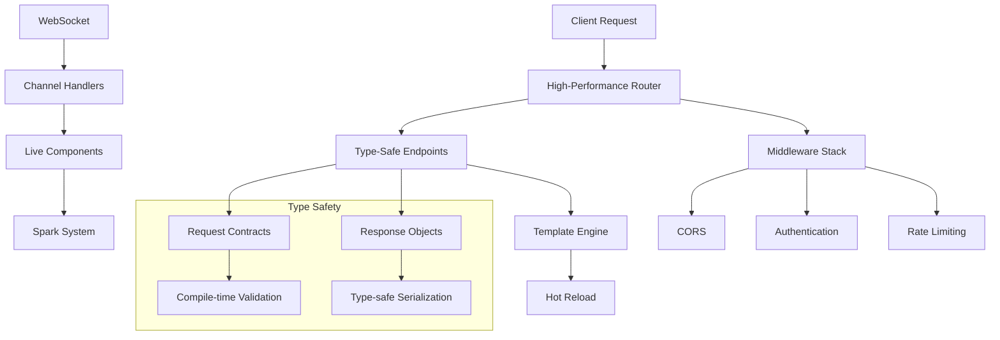

<div style="text-align:center"></div>

# Azu Web Framework

[](https://www.codacy.com/manual/eliasjpr/azu?utm_source=github.com&utm_medium=referral&utm_content=eliasjpr/azu&utm_campaign=Badge_Grade) [](https://github.com/azutoolkit/azu/actions/workflows/crystal.yml) [](https://github.com/azutoolkit/azu/actions/workflows/github-code-scanning/codeql)

**Azu** is a high-performance, type-safe web framework for Crystal that emphasizes developer productivity, compile-time safety, and real-time capabilities. Built with modern web development patterns, Azu provides a robust foundation for building scalable applications with elegant, expressive syntax.

## 🚀 Key Features

### Type-Safe Architecture

- **Compile-time type checking** for requests, responses, and parameters
- **Type-safe endpoint pattern** with structured request/response contracts
- **Zero-runtime overhead** parameter validation and serialization

### Real-Time Capabilities

- **WebSocket channels** with automatic connection management
- **Live components** with client-server synchronization
- **Spark system** for reactive UI updates without page reloads

### Performance-Optimized

- **High-performance routing** with LRU cache and path optimization
- **Template hot reloading** in development with production caching
- **Efficient file upload handling** with streaming and size limits

### Developer Experience

- **Comprehensive error handling** with detailed debugging information
- **Content negotiation** supporting JSON, HTML, XML, and plain text
- **Flexible middleware system** for cross-cutting concerns
- **Environment-aware configuration** with sensible defaults

## 📊 Performance Characteristics

- **Sub-millisecond routing** with cached path resolution
- **Memory-efficient** request/response handling
- **Concurrent WebSocket** connections with lightweight fiber-based architecture
- **Zero-allocation** parameter parsing for common scenarios
- **Template compilation** with optional hot-reloading for development

## 🏗️ Architecture Overview



## 🛠️ Installation

1. Add the dependency to your `shard.yml`:

```yaml
dependencies:
  azu:
    github: azutoolkit/azu
    version: ~> 0.4.14
```

2. Run `shards install`

3. Require Azu in your application:

```crystal
require "azu"
```

## 🎯 Quick Start

### Basic Application

```crystal
# Define a request contract
struct UserRequest
  include Azu::Request

  getter name : String
  getter email : String
  getter age : Int32?

  def initialize(@name = "", @email = "", @age = nil)
  end
end

# Define a response object
struct UserResponse
  include Azu::Response

  def initialize(@user : User)
  end

  def render
    @user.to_json
  end
end

# Create a type-safe endpoint
struct CreateUserEndpoint
  include Azu::Endpoint(UserRequest, UserResponse)

  post "/users"

  def call : UserResponse
    user = User.create!(
      name: request.name,
      email: request.email,
      age: request.age
    )
    UserResponse.new(user)
  end
end

# Start the application
Azu.start [
  Azu::Handler::Logger.new,
  Azu::Handler::CORS.new,
  CreateUserEndpoint.new
]
```

## 🔌 Real-Time Features

### WebSocket Channels

```crystal
class ChatChannel < Azu::Channel
  ws "/chat"

  def on_connect
    broadcast("user_joined", {user: current_user.name})
  end

  def on_message(message : String)
    data = JSON.parse(message)
    broadcast("message", {
      user: current_user.name,
      text: data["text"],
      timestamp: Time.utc
    })
  end

  def on_close(code, message)
    broadcast("user_left", {user: current_user.name})
  end
end
```

### Live Components

```crystal
class CounterComponent
  include Azu::Component

  property count = 0

  def content
    div do
      h2 { text "Count: #{@count}" }
      button(onclick: "increment") { text "+" }
      button(onclick: "decrement") { text "-" }
    end
  end

  def on_event(name, data)
    case name
    when "increment"
      @count += 1
      refresh # Automatically updates the client
    when "decrement"
      @count -= 1
      refresh
    end
  end
end

# In your template
<%= CounterComponent.mount.render %>
<%= Azu::Spark.javascript_tag %>
```

## 🛡️ Error Handling

Azu provides comprehensive error handling with structured error responses:

```crystal
# Built-in error types
raise Azu::Response::ValidationError.new("email", "is invalid")
raise Azu::Response::AuthenticationError.new("Login required")
raise Azu::Response::AuthorizationError.new("Admin access required")
raise Azu::Response::RateLimitError.new(retry_after: 60)

# Custom error handling
struct MyEndpoint
  include Azu::Endpoint(MyRequest, MyResponse)

  def call : MyResponse
    validate_request!
    process_request
  rescue ex : ValidationError
    Azu::Response::ValidationError.new(ex.field_errors)
  end
end
```

### Error Response Formats

Azu automatically formats errors based on content negotiation:

```json
// JSON format
{
  "Title": "Validation Error",
  "Detail": "Request validation failed",
  "ErrorId": "err_123456",
  "Fingerprint": "abc123",
  "FieldErrors": {
    "email": ["is invalid", "is required"]
  }
}
```

## 📁 File Uploads

Handle file uploads with built-in optimization and validation:

```crystal
struct FileUploadRequest
  include Azu::Request

  getter avatar : Azu::Params::Multipart::File?
  getter description : String
end

struct UploadEndpoint
  include Azu::Endpoint(FileUploadRequest, UploadResponse)

  post "/upload"

  def call : UploadResponse
    if file = request.avatar
      # File is automatically streamed to temp directory
      validate_file_size!(file, max: 5.megabytes)
      validate_file_type!(file, allowed: %w(.jpg .png .gif))

      # Process the file
      final_path = save_file(file)
      file.cleanup # Clean up temp file

      UploadResponse.new(url: final_path)
    else
      raise Azu::Response::ValidationError.new("avatar", "is required")
    end
  end
end
```

## 🎨 Templates & Views

### Template Integration

```crystal
struct UserPage
  include Azu::Response
  include Azu::Templates::Renderable

  def initialize(@user : User, @posts : Array(Post))
  end

  def render
    view "users/show.html", {
      user: @user,
      posts: @posts,
      title: "User Profile"
    }
  end
end

# Template: templates/users/show.html
# <h1>{{ user.name }}</h1>
# <div class="posts">
#   
#     <article>{{ post.content }}</article>
#   
# </div>
```

### Hot Reloading

Templates automatically reload in development:

```crystal
# In development
Azu::CONFIG.template_hot_reload = true

# In production
Azu::CONFIG.template_hot_reload = false
```

## ⚙️ Configuration

Azu provides environment-aware configuration:

```crystal
# config/application.cr
Azu::CONFIG.configure do |config|
  config.port = ENV.fetch("PORT", "4000").to_i
  config.host = ENV.fetch("HOST", "0.0.0.0")

  # SSL configuration
  config.ssl_cert = ENV["SSL_CERT"]?
  config.ssl_key = ENV["SSL_KEY"]?

  # File upload limits
  config.upload.max_file_size = 10.megabytes
  config.upload.temp_dir = "/tmp/uploads"

  # Template configuration
  config.templates.path = ["templates", "views"]
  config.templates.error_path = "errors"
end
```

## 🔒 Middleware

### Built-in Middleware

```crystal
Azu.start [
  Azu::Handler::Rescuer.new,     # Error handling
  Azu::Handler::Logger.new,      # Request logging
  Azu::Handler::CORS.new,        # CORS headers
  Azu::Handler::CSRF.new,        # CSRF protection
  Azu::Handler::Throttle.new,    # Rate limiting
  Azu::Handler::Static.new,      # Static files
  # Your endpoints here
]
```

### Custom Middleware

```crystal
class AuthenticationHandler
  include HTTP::Handler

  def call(context)
    unless authenticated?(context)
      context.response.status = HTTP::Status::UNAUTHORIZED
      context.response.print "Authentication required"
      return
    end

    call_next(context)
  end

  private def authenticated?(context)
    context.request.headers["Authorization"]?.try(&.starts_with?("Bearer "))
  end
end
```

## 🚄 Routing Performance

Azu's router includes several performance optimizations:

### Path Caching

```crystal
# Frequently accessed paths are cached
router = Azu::Router.new
router.get("/api/users/:id", UserEndpoint.new)

# First request: builds and caches path
# Subsequent requests: uses cached resolution
```

### Method Pre-computation

```crystal
# HTTP methods are pre-computed at initialization
# Zero allocation for method matching during request processing
```

### LRU Cache Management

```crystal
# Automatic cache eviction for optimal memory usage
# Default cache size: 1000 entries
# Configurable cache size and TTL
```

## 🧪 Testing

Azu provides excellent testing support:

```crystal
require "spec"
require "azu"

describe UserEndpoint do
  it "creates user successfully" do
    request = UserRequest.new(
      name: "John Doe",
      email: "john@example.com",
      age: 30
    )

    endpoint = UserEndpoint.new
    endpoint.request = request

    response = endpoint.call
    response.should be_a(UserResponse)
  end
end

describe ChatChannel do
  it "handles messages correctly" do
    socket = MockWebSocket.new
    channel = ChatChannel.new(socket)

    channel.on_message({"text" => "Hello"}.to_json)

    # Verify message was processed
  end
end
```

## 📈 Performance Benchmarks

| Feature             | Performance | Memory        |
| ------------------- | ----------- | ------------- |
| Router (cached)     | ~0.1ms      | 0 allocations |
| Endpoint processing | ~0.5ms      | Minimal       |
| WebSocket message   | ~0.2ms      | Constant      |
| Template rendering  | ~1-5ms      | Cached        |
| File upload (1MB)   | ~10ms       | Streaming     |

## 🌟 Advanced Features

### Content Negotiation

```crystal
# Automatic content type detection and response formatting
# Supports: JSON, HTML, XML, Plain Text
# Based on Accept headers and content type
```

### Request Validation

```crystal
struct ProductRequest
  include Azu::Request

  getter name : String
  getter price : Float64
  getter category : String

  validate name, presence: true, length: {min: 3, max: 50}
  validate price, presence: true, numericality: {greater_than: 0}
  validate category, inclusion: {in: %w(electronics books clothing)}
end
```

### Environment Management

```crystal
# Automatic environment detection
case Azu::CONFIG.env
when .development?
  # Development-specific configuration
when .production?
  # Production optimizations
when .test?
  # Testing configuration
end
```

## 🤝 Contributing

1. Fork it (<https://github.com/azutoolkit/azu/fork>)
2. Create your feature branch (`git checkout -b my-new-feature`)
3. Commit your changes (`git commit -am 'Add some feature'`)
4. Push to the branch (`git push origin my-new-feature`)
5. Create a new Pull Request

## 📚 Documentation

For comprehensive documentation, visit: [Azu Toolkit Documentation](https://azutopia.gitbook.io/azu/)

## 🎯 Use Cases

Azu excels in:

- **API Development** - Type-safe REST and GraphQL APIs
- **Real-time Applications** - Chat, gaming, live dashboards
- **Web Applications** - Full-stack apps with server-side rendering
- **Microservices** - High-performance service architectures
- **IoT Backends** - Efficient WebSocket communication

## 📄 License

This project is licensed under the MIT License - see the [LICENSE](LICENSE) file for details.

## 🙏 Contributors

- [Elias J. Perez](https://github.com/eliasjpr) - creator and maintainer

---

**Ready to build something amazing?** Start with Azu today and experience the power of type-safe, high-performance web development in Crystal.

## Performance Monitoring (Optional)

Performance monitoring in Azu is **completely optional** and disabled by default. When disabled, it adds zero overhead to your application.

### Enabling Performance Monitoring

Set the environment variable or enable it at compile time:

```bash
# Enable performance monitoring
export PERFORMANCE_MONITORING=true

# Optional: Enable detailed profiling (development only)
export PERFORMANCE_PROFILING=true
export PERFORMANCE_MEMORY_MONITORING=true
```

Or compile with the flag:

```bash
crystal build --define=performance_monitoring src/app.cr
```

### Using Performance Monitoring

When enabled, add the performance monitor to your handler chain:

```crystal
require "azu"

# Only available when performance monitoring is enabled

  performance_monitor = Azu::Handler::PerformanceMonitor.new


MyApp.start [
  
    performance_monitor,
  
  Azu::Handler::Logger.new,
  Azu::Handler::Static.new
]
```

### Performance Features (When Enabled)

- **Request Metrics**: Response times, memory usage, error rates
- **Component Tracking**: Mount/unmount/refresh performance
- **Cache Metrics**: Hit rates, operation timings
- **Memory Monitoring**: Leak detection and memory profiling
- **Development Dashboard**: Real-time performance visualization

### Zero Overhead When Disabled

When `PERFORMANCE_MONITORING=false` (default):

- No performance monitoring code is compiled
- No memory overhead for metrics collection
- No timing overhead for operations
- Components run without tracking
- Cache operations run without metrics

This makes Azu suitable for both development (with monitoring) and production (without overhead).

### Performance API (When Enabled)

```crystal
# Enable performance tracking for specific components
component.enable_performance_tracking

# Access performance data
if monitor = Azu::CONFIG.performance_monitor
  stats = monitor.stats
  puts "Average response time: #{stats.avg_response_time}ms"
  puts "Error rate: #{stats.error_rate}%"
end
```

## Configuration

```crystal
Azu.configure do |config|
  config.port = 4000
  config.host = "0.0.0.0"

  # Performance monitoring (only when enabled)
  config.performance_enabled = true  # Default: false
  config.performance_profiling_enabled = true  # Default: false
  config.performance_memory_monitoring = true  # Default: false
end
```

## Documentation

For complete documentation, visit: [Azu Documentation](docs/)

## Contributing

Please read [CONTRIBUTING.md](CONTRIBUTING.md) for details on our code of conduct and development process.

## License

This project is licensed under the MIT License - see the [LICENSE](LICENSE) file for details.
