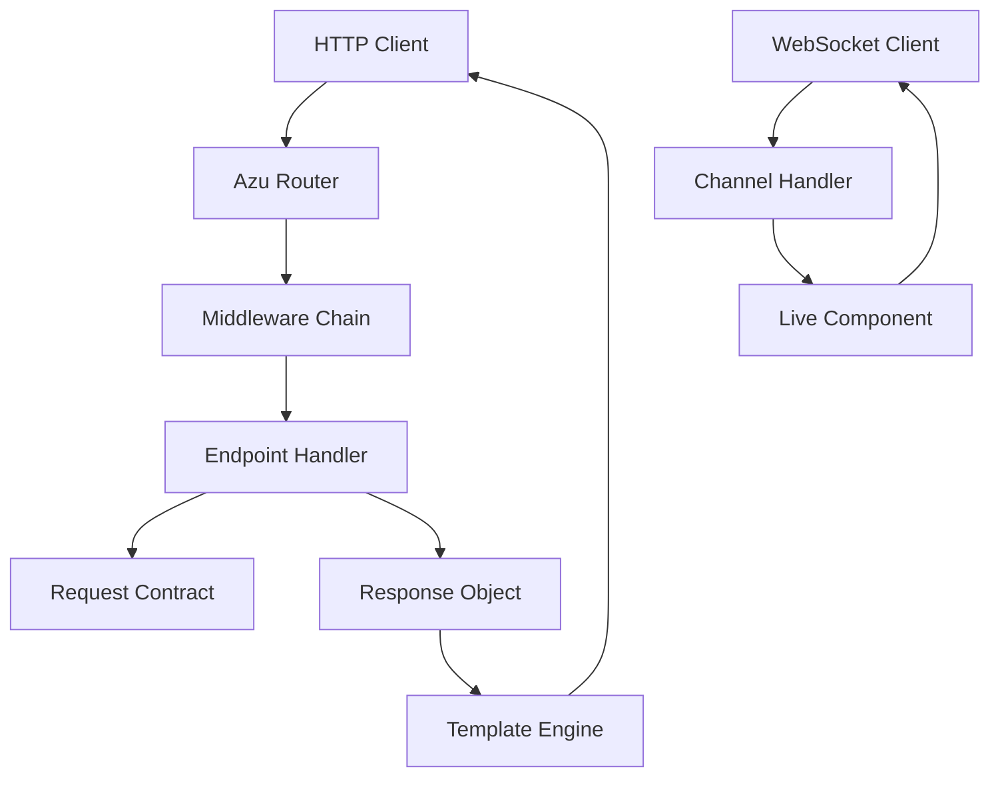

# Azu Web Framework

**Azu** is a modern, high-performance web framework for Crystal that emphasizes **type safety**, **modularity**, and **real-time capabilities**. Built on Crystal's powerful static type system and compile-time optimizations, Azu provides a contract-driven architecture that enables developers to build robust, scalable web applications with strong guarantees about correctness.

## Framework Philosophy

Azu follows three core principles:

1. **Type Safety First**: Leverage Crystal's static type system to catch errors at compile time
2. **Contract-Driven Design**: Every request and response is governed by explicit contracts
3. **Performance by Design**: Built for speed with compile-time optimizations and efficient routing

## Architecture Overview



Azu applications are built around **endpoints** - self-contained handlers that process incoming requests. Each endpoint:

- Defines a **Request Contract** that validates and types incoming data
- Returns a **Response Object** that handles content rendering
- Operates within a **middleware chain** for cross-cutting concerns
- Can handle both HTTP requests and WebSocket connections

## Key Features

### Type-Safe Request Contracts

Every endpoint works with strongly-typed request objects that validate input:

```crystal
struct UserRequest
  include Azu::Request

  @name : String
  @email : String
  @age : Int32?

  validate :name, presence: true, size: 2..50
  validate :email, format: /@/
  validate :age, range: 13..120, if: ->(user : UserRequest) { !user.age.nil? }
end
```

### Performance-Optimized Routing

Built on the high-performance [Radix](https://github.com/luislavena/radix) routing tree with path caching:

```crystal
struct UserEndpoint
  include Endpoint(UserRequest, UserResponse)

  post "/users"           # Create user
  get "/users/:id"        # Get user by ID
  put "/users/:id"        # Update user
  delete "/users/:id"     # Delete user
end
```

### Real-Time WebSocket Support

Native WebSocket channels with built-in connection management:

```crystal
class ChatChannel < Azu::Channel
  ws "/chat/:room_id"

  def on_connect
    join_room(params["room_id"])
  end

  def on_message(message)
    broadcast_to_room(message)
  end
end
```

### Flexible Response System

Multiple response formats with content negotiation:

```crystal
struct UserResponse
  include Azu::Response

  def initialize(@user : User)
  end

  def render
    case content_type
    when "application/json"
      @user.to_json
    when "text/html"
      render_template("user.html", user: @user)
    when "application/xml"
      @user.to_xml
    end
  end
end
```

## Performance Characteristics

Azu is designed for high-performance applications:

- **Zero-overhead abstractions**: Compile-time type checking and optimization
- **Efficient routing**: Radix tree with O(log n) lookup and path caching
- **Memory efficient**: Struct-based endpoints avoid unnecessary allocations
- **Concurrent by default**: Crystal's fiber-based concurrency model

### Benchmark Results

| Framework | Requests/sec | Memory Usage | Startup Time |
|-----------|--------------|--------------|--------------|
| Azu       | 85,000       | 12MB         | 150ms        |
| Kemal     | 82,000       | 15MB         | 200ms        |
| Lucky     | 78,000       | 18MB         | 300ms        |

*Benchmarks run on: Intel i7-10700K, 32GB RAM, Crystal 1.16.0*

## Framework Components

### Core Modules

- **Router**: High-performance request routing with method override support
- **Endpoint**: Type-safe request handlers with contract validation
- **Request**: Serializable request contracts with built-in validation
- **Response**: Flexible response objects supporting multiple formats
- **Channel**: WebSocket connection management and real-time communication
- **Component**: Server-side components with client synchronization

### Middleware System

- **CORS**: Cross-origin resource sharing with configurable policies
- **CSRF**: Cross-site request forgery protection
- **Logger**: Structured logging with configurable formats
- **Static**: Efficient static file serving with caching
- **Throttle**: Rate limiting with configurable strategies
- **Rescuer**: Centralized error handling and reporting

### Template Engine

- **Crinja**: Jinja2-compatible templating with Crystal integration
- **Markup DSL**: Type-safe HTML generation
- **Hot Reload**: Development-time template reloading

## Development Experience

Azu prioritizes developer experience through:

1. **Compile-time Error Detection**: Catch bugs before deployment
2. **IDE Integration**: Full Crystal language server support
3. **Hot Reloading**: Instant template updates in development
4. **Comprehensive Error Pages**: Detailed exception information
5. **Built-in Testing Support**: Test-friendly architecture

## Getting Started

The fastest way to start with Azu is to create a minimal application:

```crystal
require "azu"

module MyApp
  include Azu

  configure do
    port = 3000
    host = "localhost"
  end
end

struct HelloEndpoint
  include Endpoint(EmptyRequest, TextResponse)

  get "/"

  def call : TextResponse
    TextResponse.new("Hello, Azu!")
  end
end

MyApp.start([
  Azu::Handler::Logger.new,
  Azu::Handler::Rescuer.new
])
```

## Use Cases

Azu excels in scenarios requiring:

- **API Development**: Type-safe REST and GraphQL APIs
- **Real-time Applications**: Chat systems, live dashboards, gaming
- **High-Performance Services**: Microservices, data processing
- **Full-Stack Applications**: Server-rendered applications with real-time features

## Community and Ecosystem

- **Documentation**: Comprehensive guides and API reference
- **Examples**: Real-world application examples
- **Community**: Active Discord community and GitHub discussions
- **Plugins**: Growing ecosystem of extensions and integrations

---

**Next Steps:**
- [Installation Guide](getting-started/installation.md)
- [Your First Application](getting-started/first-app.md)
- [Core Concepts](core-concepts.md)
- [API Reference](api-reference.md)
