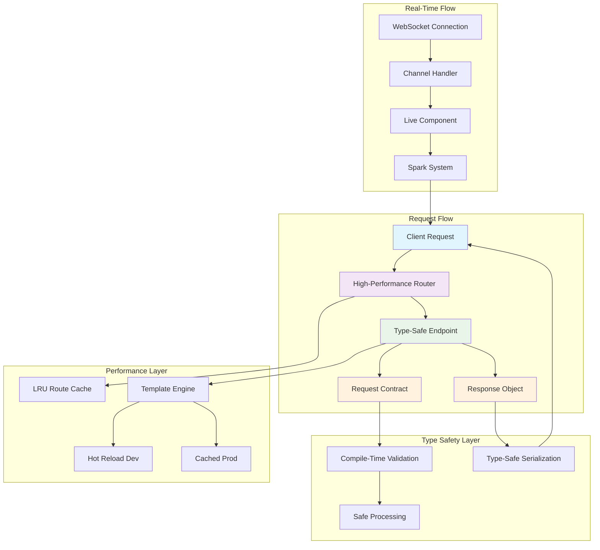

# Azu Web Framework

**High-performance, type-safe web framework for Crystal**

Azu is a modern web framework built for Crystal that emphasizes compile-time safety, developer productivity, and real-time capabilities. Designed for software architects and experienced developers who value explicit contracts, predictable performance, and elegant code.

## Why Azu?

Azu solves the fundamental tension between developer productivity and runtime safety by moving validation and type checking to compile time. Unlike traditional web frameworks that discover errors at runtime, Azu catches issues during compilation, resulting in more reliable applications and confident deployments.

## Key Differentiators

### 🔒 **Compile-Time Type Safety**

- **Zero runtime overhead** parameter validation
- **Type-safe endpoint contracts** with structured request/response objects
- **Compile-time route verification** prevents broken links

### ⚡ **Performance-First Architecture**

- **Sub-millisecond routing** with LRU cache optimization
- **Memory-efficient** request handling with zero-allocation paths
- **Concurrent WebSocket** connections using Crystal's fiber-based concurrency

### 🔄 **Real-Time by Design**

- **WebSocket channels** with automatic connection management
- **Live components** with client-server synchronization
- **Spark system** for reactive UI updates without page reloads

### 🛠️ **Developer Experience**

- **Comprehensive error reporting** with structured debugging information
- **Hot template reloading** for rapid development iteration
- **Environment-aware configuration** with sensible defaults

## At a Glance

```crystal
# Type-safe request contract
struct CreateUserRequest
  include Azu::Request

  getter name : String
  getter email : String
  getter age : Int32?

  validate name, presence: true, length: {min: 2}
  validate email, presence: true, format: /@/
end

# Structured response object
struct UserResponse
  include Azu::Response

  def initialize(@user : User)
  end

  def render
    {
      id: @user.id,
      name: @user.name,
      email: @user.email,
      created_at: @user.created_at
    }.to_json
  end
end

# Type-safe endpoint
struct CreateUserEndpoint
  include Azu::Endpoint(CreateUserRequest, UserResponse)

  post "/users"

  def call : UserResponse
    # Request is validated at compile time
    user = User.create!(
      name: create_user_request.name,
      email: create_user_request.email,
      age: create_user_request.age
    )

    UserResponse.new(user)
  end
end
```

## Architecture Overview

Azu follows a **contract-first** approach where endpoints define explicit input/output types, enabling compile-time verification and self-documenting APIs.



## Performance Characteristics

| Feature                 | Latency | Memory        | Scalability          |
| ----------------------- | ------- | ------------- | -------------------- |
| **Route Resolution**    | ~0.1ms  | 0 allocations | Cached LRU           |
| **Endpoint Processing** | ~0.5ms  | Minimal heap  | Fiber-based          |
| **WebSocket Messages**  | ~0.2ms  | Constant      | Thousands concurrent |
| **Template Rendering**  | 1-5ms   | Cached        | Hot reload dev       |
| **Type Validation**     | 0ms     | Compile-time  | Zero runtime cost    |

## Real-Time Capabilities

Azu includes built-in support for real-time applications through WebSocket channels and live components:

```crystal
# WebSocket channel for real-time chat
class ChatChannel < Azu::Channel
  ws "/chat/:room_id"

  def on_connect
    join_room(params["room_id"])
    broadcast_to_room("user_joined", current_user)
  end

  def on_message(message : String)
    data = JSON.parse(message)
    broadcast_to_room("message", {
      user: current_user.name,
      text: data["text"],
      timestamp: Time.utc
    })
  end
end

# Live component with automatic updates
class UserListComponent
  include Azu::Component

  property users : Array(User) = [] of User

  def content
    div(class: "user-list") do
      users.each do |user|
        div(class: "user-card") do
          h3 { text user.name }
          p { text user.status }
        end
      end
    end
  end

  def on_event(name, data)
    case name
    when "refresh"
      @users = User.online
      refresh # Automatically updates clients
    end
  end
end
```

## Who Uses Azu?

Azu is ideal for teams and projects that prioritize:

- **High-performance APIs** requiring predictable latency
- **Real-time applications** with WebSocket requirements
- **Type-safe codebases** with compile-time validation
- **Scalable architectures** built on explicit contracts
- **Developer productivity** with rapid feedback loops

## Quick Start

Get started with Azu in under 5 minutes:

1. **Add to your `shard.yml`:**

```yaml
dependencies:
  azu:
    github: azutoolkit/azu
    version: ~> 0.5.2
```

2. **Create your first endpoint:**

```crystal
require "azu"

struct HelloEndpoint
  include Azu::Endpoint(Azu::Request::Empty, Azu::Response::Text)

  get "/"

  def call
    text "Hello, Azu!"
  end
end

Azu.start [HelloEndpoint.new]
```

3. **Run your application:**

```bash
crystal run app.cr
```

Your server starts at `http://localhost:4000` with type-safe routing, comprehensive error handling, and development-friendly logging.

## What's Next?

- **[Getting Started →](getting-started.md)** - Install Azu and build your first application
- **[Architecture →](architecture.md)** - Understand Azu's design principles and data flow
- **[Core Concepts →](core-concepts.md)** - Master endpoints, requests, and responses
- **[Real-Time Features →](real-time.md)** - Build WebSocket channels and live components

---

**Ready to build something amazing?** Azu combines Crystal's performance with modern web development patterns to create applications that are both fast and maintainable.
