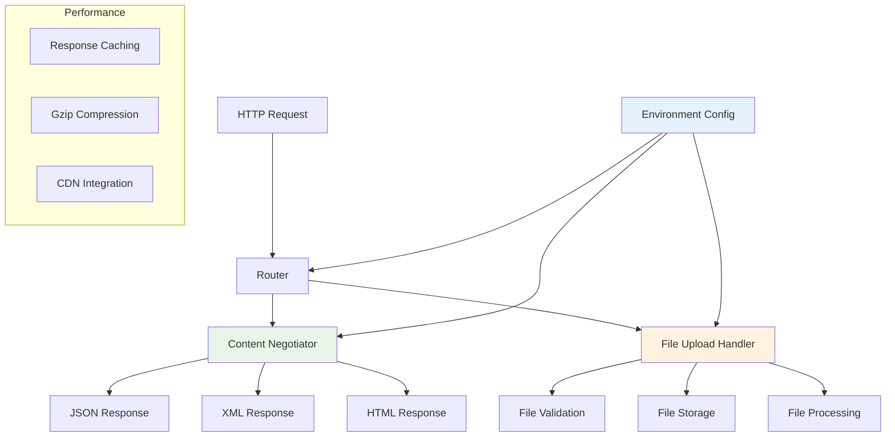

# Advanced Usage

Azu provides advanced features for building sophisticated web applications. This section covers file uploads, content negotiation, environment management, and performance tuning techniques.

## Overview

Advanced features in Azu are designed for:

- **File handling** with streaming and validation
- **Content negotiation** for multi-format APIs
- **Environment management** for different deployment scenarios
- **Performance optimization** for high-traffic applications
- **Security hardening** for production deployments

## Architecture



## Key Features

### 1. **File Uploads**

- Streaming file uploads with progress tracking
- File type validation and virus scanning
- Image processing and optimization
- Secure file storage with access controls

### 2. **Content Negotiation**

- Automatic format detection based on Accept headers
- Multi-format API responses (JSON, XML, HTML)
- Custom content type handlers
- Version-aware API responses

### 3. **Environment Management**

- Environment-specific configuration
- Feature flags and toggles
- Database connection pooling
- Logging and monitoring setup

### 4. **Performance Tuning**

- Response caching strategies
- Database query optimization
- Background job processing
- CDN integration

## Quick Start

### File Upload Endpoint

```crystal
struct FileUploadEndpoint
  include Endpoint(FileUploadRequest, FileUploadResponse)

  post "/upload"

  def call : FileUploadResponse
    # Validate file
    unless request.file.valid?
      return FileUploadResponse.error("Invalid file")
    end

    # Process file
    file_info = process_upload(request.file)

    FileUploadResponse.success(file_info)
  end

  private def process_upload(file : UploadedFile) : FileInfo
    # Generate unique filename
    filename = "#{UUID.random}_#{file.filename}"

    # Save to storage
    File.write("uploads/#{filename}", file.content)

    # Process if image
    if file.image?
      process_image(filename)
    end

    FileInfo.new(
      id: UUID.random,
      filename: filename,
      size: file.size,
      content_type: file.content_type
    )
  end
end
```

### Content Negotiation

```crystal
struct UserEndpoint
  include Endpoint(UserRequest, UserResponse)

  get "/users/:id"

  def call : UserResponse
    user = find_user(params["id"])

    case content_type
    when "application/json"
      UserResponse.json(user)
    when "application/xml"
      UserResponse.xml(user)
    when "text/html"
      UserResponse.html(user)
    else
      UserResponse.json(user) # Default
    end
  end
end
```

### Environment Configuration

```crystal
# config/environments/development.cr
Azu::Environment.configure :development do |config|
  config.log_level = :debug
  config.database_url = "postgresql://localhost/azu_dev"
  config.cache_enabled = false
  config.hot_reload = true
end

# config/environments/production.cr
Azu::Environment.configure :production do |config|
  config.log_level = :info
  config.database_url = ENV["DATABASE_URL"]
  config.cache_enabled = true
  config.cdn_url = ENV["CDN_URL"]
  config.ssl_redirect = true
end
```

## File Uploads

Azu provides comprehensive file upload capabilities with:

- **Streaming uploads** for large files
- **File validation** and security checks
- **Image processing** and optimization
- **Progress tracking** and resumable uploads

[Learn more about File Uploads →](advanced/file-uploads.md)

## Content Negotiation

Content negotiation allows your API to serve multiple formats:

- **Automatic format detection** based on Accept headers
- **Custom content type handlers**
- **Version-aware responses**
- **Multi-format serialization**

[Learn more about Content Negotiation →](advanced/content-negotiation.md)

## Environment Management

Environment management helps you configure your application for different deployment scenarios:

- **Environment-specific settings**
- **Feature flags and toggles**
- **Database and cache configuration**
- **Security and performance settings**

[Learn more about Environment Management →](advanced/environments.md)

## Performance Tuning

Performance tuning techniques for high-traffic applications:

- **Response caching strategies**
- **Database optimization**
- **Background job processing**
- **CDN and asset optimization**

[Learn more about Performance Tuning →](advanced/performance-tuning.md)

## Security Best Practices

### 1. **File Upload Security**

- Validate file types and content
- Scan for malware and viruses
- Use secure file storage
- Implement access controls

### 2. **API Security**

- Use HTTPS in production
- Implement rate limiting
- Validate all input data
- Use proper authentication

### 3. **Environment Security**

- Use environment variables for secrets
- Implement proper logging
- Monitor for security issues
- Regular security updates

## Performance Optimization

### 1. **Caching Strategies**

- Response caching for static content
- Database query caching
- Template fragment caching
- CDN integration for assets

### 2. **Database Optimization**

- Connection pooling
- Query optimization
- Index management
- Read replicas for scaling

### 3. **Background Processing**

- Async job processing
- File processing queues
- Email sending queues
- Data import/export jobs

## Monitoring and Debugging

### 1. **Application Monitoring**

- Request/response logging
- Performance metrics
- Error tracking
- Health checks

### 2. **Development Tools**

- Hot reloading
- Debug logging
- Performance profiling
- Memory usage tracking

## Next Steps

- [File Uploads Deep Dive](advanced/file-uploads.md) - Handle file uploads securely
- [Content Negotiation Guide](advanced/content-negotiation.md) - Build multi-format APIs
- [Environment Management](advanced/environments.md) - Configure for different environments
- [Performance Tuning](advanced/performance-tuning.md) - Optimize your application

## Examples

Check out the [playground examples](../playground/) for complete working examples of:

- File upload with progress tracking
- Multi-format API responses
- Environment-specific configuration
- Performance optimization techniques

---

**Ready to build advanced features?** Start with [File Uploads](advanced/file-uploads.md) to handle user file uploads, then explore [Content Negotiation](advanced/content-negotiation.md) for building flexible APIs.
