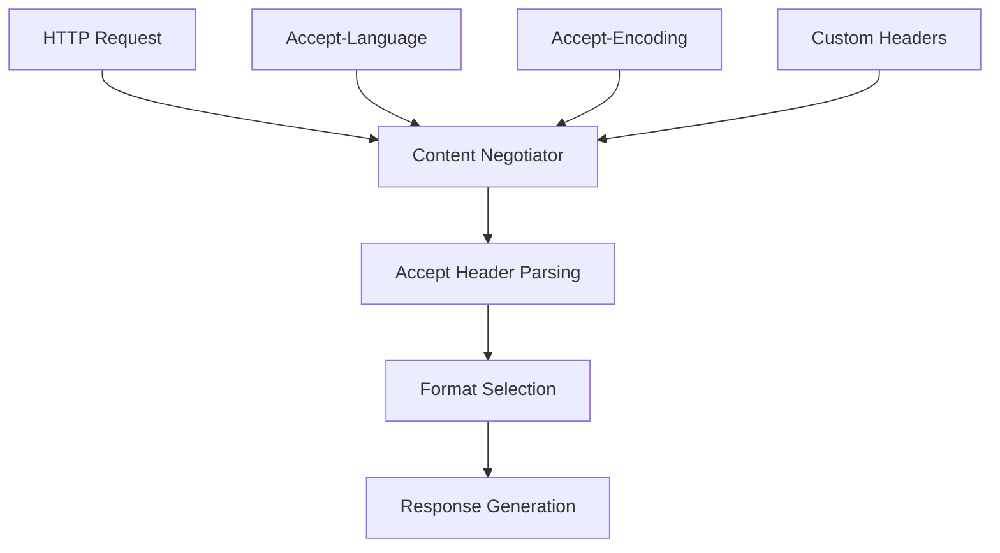

# Content Negotiation in Azu

Azu provides sophisticated content negotiation capabilities, allowing your endpoints to respond with different content types based on client preferences. This guide covers handling multiple response formats, language negotiation, and custom content types.

## Overview



## Basic Content Negotiation

### Accept Header Handling

```crystal
struct ContentNegotiationRequest
  include Request

  getter accept : String?
  getter accept_language : String?
  getter accept_encoding : String?

  def initialize(@accept = nil, @accept_language = nil, @accept_encoding = nil)
  end

  def self.from_headers(headers : HTTP::Headers) : self
    new(
      accept: headers["Accept"]?,
      accept_language: headers["Accept-Language"]?,
      accept_encoding: headers["Accept-Encoding"]?
    )
  end
end

struct ContentNegotiationResponse
  include Response

  getter content : String
  getter content_type : String
  getter language : String?

  def initialize(@content, @content_type, @language = nil)
  end

  def render : String
    content
  end

  def headers : HTTP::Headers
    headers = HTTP::Headers.new
    headers["Content-Type"] = content_type
    headers["Content-Language"] = language if language
    headers
  end
end

struct ContentNegotiationEndpoint
  include Endpoint(ContentNegotiationRequest, ContentNegotiationResponse)

  get "/api/data"

  def call : ContentNegotiationResponse
    negotiator = Azu::ContentNegotiator.new(request.accept)

    case negotiator.best_match(["application/json", "application/xml", "text/html"])
    when "application/json"
      render_json
    when "application/xml"
      render_xml
    when "text/html"
      render_html
    else
      render_json  # Default fallback
    end
  end

  private def render_json : ContentNegotiationResponse
    data = {
      "message" => "Hello World",
      "timestamp" => Time.utc.to_unix,
      "format" => "json"
    }

    ContentNegotiationResponse.new(
      data.to_json,
      "application/json; charset=utf-8"
    )
  end

  private def render_xml : ContentNegotiationResponse
    xml = <<-XML
      <?xml version="1.0" encoding="UTF-8"?>
      <response>
        <message>Hello World</message>
        <timestamp>#{Time.utc.to_unix}</timestamp>
        <format>xml</format>
      </response>
      XML

    ContentNegotiationResponse.new(
      xml,
      "application/xml; charset=utf-8"
    )
  end

  private def render_html : ContentNegotiationResponse
    html = <<-HTML
      <!DOCTYPE html>
      <html>
        <head><title>Data</title></head>
        <body>
          <h1>Hello World</h1>
          <p>Timestamp: #{Time.utc.to_unix}</p>
          <p>Format: HTML</p>
        </body>
      </html>
      HTML

    ContentNegotiationResponse.new(
      html,
      "text/html; charset=utf-8"
    )
  end
end
```

## Advanced Content Negotiation

### Multi-Format Endpoint

```crystal
struct MultiFormatRequest
  include Request

  getter format : String?
  getter language : String?

  def initialize(@format = nil, @language = nil)
  end

  def self.from_params(params : Params) : self
    new(
      format: params.get_string?("format"),
      language: params.get_string?("lang")
    )
  end

  def self.from_headers(headers : HTTP::Headers) : self
    new(
      format: extract_format_from_accept(headers["Accept"]?),
      language: extract_language_from_accept(headers["Accept-Language"]?)
    )
  end

  private def self.extract_format_from_accept(accept : String?) : String?
    return nil unless accept

    # Parse Accept header and return preferred format
    if accept.includes?("application/json")
      "json"
    elsif accept.includes?("application/xml")
      "xml"
    elsif accept.includes?("text/html")
      "html"
    else
      nil
    end
  end

  private def self.extract_language_from_accept(accept_language : String?) : String?
    return nil unless accept_language

    # Parse Accept-Language header and return preferred language
    if accept_language.includes?("en")
      "en"
    elsif accept_language.includes?("es")
      "es"
    elsif accept_language.includes?("fr")
      "fr"
    else
      "en"  # Default
    end
  end
end

struct MultiFormatResponse
  include Response

  getter data : Hash(String, String)
  getter format : String
  getter language : String

  def initialize(@data, @format, @language)
  end

  def render : String
    case format
    when "json"
      render_json
    when "xml"
      render_xml
    when "html"
      render_html
    else
      render_json
    end
  end

  def content_type : String
    case format
    when "json"
      "application/json; charset=utf-8"
    when "xml"
      "application/xml; charset=utf-8"
    when "html"
      "text/html; charset=utf-8"
    else
      "application/json; charset=utf-8"
    end
  end

  private def render_json : String
    data.to_json
  end

  private def render_xml : String
    String.build do |str|
      str << "<?xml version=\"1.0\" encoding=\"UTF-8\"?>\n"
      str << "<response>\n"
      data.each do |key, value|
        str << "  <#{key}>#{value}</#{key}>\n"
      end
      str << "</response>"
    end
  end

  private def render_html : String
    String.build do |str|
      str << "<!DOCTYPE html>\n"
      str << "<html lang=\"#{language}\">\n"
      str << "<head><title>Data</title></head>\n"
      str << "<body>\n"
      data.each do |key, value|
        str << "<p><strong>#{key}:</strong> #{value}</p>\n"
      end
      str << "</body>\n"
      str << "</html>"
    end
  end
end

struct MultiFormatEndpoint
  include Endpoint(MultiFormatRequest, MultiFormatResponse)

  get "/api/multi-format"

  def call : MultiFormatResponse
    format = request.format || "json"
    language = request.language || "en"

    data = {
      "message" => get_localized_message(language),
      "timestamp" => Time.utc.to_unix.to_s,
      "format" => format,
      "language" => language
    }

    MultiFormatResponse.new(data, format, language)
  end

  private def get_localized_message(language : String) : String
    case language
    when "en"
      "Hello World"
    when "es"
      "Hola Mundo"
    when "fr"
      "Bonjour le Monde"
    else
      "Hello World"
    end
  end
end
```

## Language Negotiation

### Internationalization Support

```crystal
class LanguageNegotiator
  SUPPORTED_LANGUAGES = ["en", "es", "fr", "de", "ja"]
  DEFAULT_LANGUAGE = "en"

  def self.negotiate(accept_language : String?) : String
    return DEFAULT_LANGUAGE unless accept_language

    # Parse Accept-Language header
    languages = parse_accept_language(accept_language)

    # Find best match
    languages.each do |lang, quality|
      if SUPPORTED_LANGUAGES.includes?(lang)
        return lang
      end
    end

    DEFAULT_LANGUAGE
  end

  private def self.parse_accept_language(accept_language : String) : Array(Tuple(String, Float64))
    languages = [] of Tuple(String, Float64)

    accept_language.split(",").each do |part|
      if part.includes?(";")
        lang, quality_part = part.split(";", 2)
        quality = quality_part.split("=", 2)[1]?.try(&.to_f) || 1.0
        languages << {lang.strip, quality}
      else
        languages << {part.strip, 1.0}
      end
    end

    # Sort by quality (highest first)
    languages.sort_by { |_, quality| -quality }
  end
end

struct LocalizedRequest
  include Request

  getter language : String

  def initialize(@language)
  end

  def self.from_headers(headers : HTTP::Headers) : self
    language = LanguageNegotiator.negotiate(headers["Accept-Language"]?)
    new(language)
  end
end

struct LocalizedResponse
  include Response

  getter content : String
  getter language : String

  def initialize(@content, @language)
  end

  def render : String
    content
  end

  def headers : HTTP::Headers
    headers = HTTP::Headers.new
    headers["Content-Type"] = "text/html; charset=utf-8"
    headers["Content-Language"] = language
    headers
  end
end

struct LocalizedEndpoint
  include Endpoint(LocalizedRequest, LocalizedResponse)

  get "/localized"

  def call : LocalizedResponse
    content = generate_localized_content(request.language)
    LocalizedResponse.new(content, request.language)
  end

  private def generate_localized_content(language : String) : String
    case language
    when "en"
      "<h1>Welcome to our application</h1><p>This is the English version.</p>"
    when "es"
      "<h1>Bienvenido a nuestra aplicación</h1><p>Esta es la versión en español.</p>"
    when "fr"
      "<h1>Bienvenue dans notre application</h1><p>Ceci est la version française.</p>"
    when "de"
      "<h1>Willkommen in unserer Anwendung</h1><p>Dies ist die deutsche Version.</p>"
    when "ja"
      "<h1>アプリケーションへようこそ</h1><p>これは日本語版です。</p>"
    else
      "<h1>Welcome to our application</h1><p>This is the English version.</p>"
    end
  end
end
```

## Custom Content Types

### API Versioning with Content Types

```crystal
struct VersionedRequest
  include Request

  getter version : String
  getter format : String

  def initialize(@version, @format)
  end

  def self.from_headers(headers : HTTP::Headers) : self
    accept = headers["Accept"]? || ""

    # Parse custom content types like "application/vnd.myapp.v1+json"
    if accept.includes?("application/vnd.myapp.v1")
      version = "v1"
    elsif accept.includes?("application/vnd.myapp.v2")
      version = "v2"
    else
      version = "v1"  # Default
    end

    format = if accept.includes?("+json")
      "json"
    elsif accept.includes?("+xml")
      "xml"
    else
      "json"  # Default
    end

    new(version, format)
  end
end

struct VersionedResponse
  include Response

  getter data : Hash(String, String)
  getter version : String
  getter format : String

  def initialize(@data, @version, @format)
  end

  def render : String
    case format
    when "json"
      data.to_json
    when "xml"
      render_xml
    else
      data.to_json
    end
  end

  def content_type : String
    case format
    when "json"
      "application/vnd.myapp.#{version}+json"
    when "xml"
      "application/vnd.myapp.#{version}+xml"
    else
      "application/vnd.myapp.#{version}+json"
    end
  end

  private def render_xml : String
    String.build do |str|
      str << "<?xml version=\"1.0\" encoding=\"UTF-8\"?>\n"
      str << "<response version=\"#{version}\">\n"
      data.each do |key, value|
        str << "  <#{key}>#{value}</#{key}>\n"
      end
      str << "</response>"
    end
  end
end

struct VersionedEndpoint
  include Endpoint(VersionedRequest, VersionedResponse)

  get "/api/versioned"

  def call : VersionedResponse
    data = case request.version
    when "v1"
      {
        "message" => "Hello from v1",
        "version" => "1.0",
        "deprecated" => "false"
      }
    when "v2"
      {
        "message" => "Hello from v2",
        "version" => "2.0",
        "deprecated" => "false",
        "new_feature" => "available"
      }
    else
      {
        "message" => "Hello from v1",
        "version" => "1.0",
        "deprecated" => "false"
      }
    end

    VersionedResponse.new(data, request.version, request.format)
  end
end
```

## Response Format Selection

### Dynamic Format Selection

```crystal
class ResponseFormatter
  def self.format(data : Hash, format : String, options : Hash = {} of String => String) : String
    case format
    when "json"
      format_json(data, options)
    when "xml"
      format_xml(data, options)
    when "csv"
      format_csv(data, options)
    when "yaml"
      format_yaml(data, options)
    else
      format_json(data, options)
    end
  end

  private def self.format_json(data : Hash, options : Hash) : String
    if options["pretty"]? == "true"
      JSON.build do |json|
        json.object do
          data.each do |key, value|
            json.field key, value
          end
        end
      end
    else
      data.to_json
    end
  end

  private def self.format_xml(data : Hash, options : Hash) : String
    root_element = options["root"]? || "data"

    String.build do |str|
      str << "<?xml version=\"1.0\" encoding=\"UTF-8\"?>\n"
      str << "<#{root_element}>\n"
      data.each do |key, value|
        str << "  <#{key}>#{value}</#{key}>\n"
      end
      str << "</#{root_element}>"
    end
  end

  private def self.format_csv(data : Hash, options : Hash) : String
    String.build do |str|
      str << "key,value\n"
      data.each do |key, value|
        str << "#{key},#{value}\n"
      end
    end
  end

  private def self.format_yaml(data : Hash, options : Hash) : String
    # This would typically use a YAML library
    # For now, return a simple representation
    String.build do |str|
      data.each do |key, value|
        str << "#{key}: #{value}\n"
      end
    end
  end
end

struct DynamicFormatRequest
  include Request

  getter format : String
  getter options : Hash(String, String)

  def initialize(@format, @options = {} of String => String)
  end

  def self.from_params(params : Params) : self
    format = params.get_string?("format") || "json"
    options = {
      "pretty" => params.get_string?("pretty") || "false",
      "root" => params.get_string?("root") || "data"
    }

    new(format, options)
  end
end

struct DynamicFormatResponse
  include Response

  getter content : String
  getter content_type : String

  def initialize(@content, @content_type)
  end

  def render : String
    content
  end
end

struct DynamicFormatEndpoint
  include Endpoint(DynamicFormatRequest, DynamicFormatResponse)

  get "/api/dynamic-format"

  def call : DynamicFormatResponse
    data = {
      "message" => "Hello World",
      "timestamp" => Time.utc.to_unix.to_s,
      "format" => request.format
    }

    content = ResponseFormatter.format(data, request.format, request.options)
    content_type = get_content_type(request.format)

    DynamicFormatResponse.new(content, content_type)
  end

  private def get_content_type(format : String) : String
    case format
    when "json"
      "application/json; charset=utf-8"
    when "xml"
      "application/xml; charset=utf-8"
    when "csv"
      "text/csv; charset=utf-8"
    when "yaml"
      "application/x-yaml; charset=utf-8"
    else
      "application/json; charset=utf-8"
    end
  end
end
```

## Testing Content Negotiation

### Content Negotiation Testing

```crystal
describe "ContentNegotiationEndpoint" do
  it "responds with JSON when Accept header requests JSON" do
    endpoint = ContentNegotiationEndpoint.new

    headers = HTTP::Headers.new
    headers["Accept"] = "application/json"

    request = ContentNegotiationRequest.from_headers(headers)
    response = endpoint.call(request)

    assert response.content_type == "application/json; charset=utf-8"
    assert response.content.includes?("\"format\":\"json\"")
  end

  it "responds with XML when Accept header requests XML" do
    endpoint = ContentNegotiationEndpoint.new

    headers = HTTP::Headers.new
    headers["Accept"] = "application/xml"

    request = ContentNegotiationRequest.from_headers(headers)
    response = endpoint.call(request)

    assert response.content_type == "application/xml; charset=utf-8"
    assert response.content.includes?("<format>xml</format>")
  end

  it "responds with HTML when Accept header requests HTML" do
    endpoint = ContentNegotiationEndpoint.new

    headers = HTTP::Headers.new
    headers["Accept"] = "text/html"

    request = ContentNegotiationRequest.from_headers(headers)
    response = endpoint.call(request)

    assert response.content_type == "text/html; charset=utf-8"
    assert response.content.includes?("<h1>Hello World</h1>")
  end

  it "defaults to JSON when no Accept header is provided" do
    endpoint = ContentNegotiationEndpoint.new

    request = ContentNegotiationRequest.new
    response = endpoint.call(request)

    assert response.content_type == "application/json; charset=utf-8"
  end
end

describe "LanguageNegotiator" do
  it "negotiates English language" do
    language = LanguageNegotiator.negotiate("en-US,en;q=0.9,es;q=0.8")
    assert language == "en"
  end

  it "negotiates Spanish language" do
    language = LanguageNegotiator.negotiate("es-ES,es;q=0.9,en;q=0.8")
    assert language == "es"
  end

  it "defaults to English for unsupported languages" do
    language = LanguageNegotiator.negotiate("zh-CN,zh;q=0.9")
    assert language == "en"
  end

  it "defaults to English when no Accept-Language header" do
    language = LanguageNegotiator.negotiate(nil)
    assert language == "en"
  end
end
```

## Best Practices

### 1. Always Provide a Default Format

```crystal
# Good: Always have a fallback
def select_format(accept : String?) : String
  case accept
  when .try(&.includes?("application/json"))
    "json"
  when .try(&.includes?("application/xml"))
    "xml"
  else
    "json"  # Default fallback
  end
end

# Avoid: No fallback
def select_format(accept : String?) : String
  case accept
  when .try(&.includes?("application/json"))
    "json"
  when .try(&.includes?("application/xml"))
    "xml"
  end  # No fallback!
end
```

### 2. Use Quality Values in Accept Headers

```crystal
# Good: Respect quality values
def parse_accept_header(accept : String) : Array(Tuple(String, Float64))
  accept.split(",").map do |part|
    if part.includes?(";q=")
      media_type, quality = part.split(";q=", 2)
      {media_type.strip, quality.to_f}
    else
      {part.strip, 1.0}
    end
  end.sort_by { |_, quality| -quality }
end

# Avoid: Ignore quality values
def parse_accept_header(accept : String) : Array(String)
  accept.split(",").map(&.strip)
end
```

### 3. Set Appropriate Content-Type Headers

```crystal
# Good: Set proper content type
def content_type(format : String) : String
  case format
  when "json"
    "application/json; charset=utf-8"
  when "xml"
    "application/xml; charset=utf-8"
  when "html"
    "text/html; charset=utf-8"
  end
end

# Avoid: Generic content type
def content_type(format : String) : String
  "text/plain"  # Too generic
end
```

### 4. Handle Language Negotiation Properly

```crystal
# Good: Proper language negotiation
def negotiate_language(accept_language : String?) : String
  return "en" unless accept_language

  languages = parse_accept_language(accept_language)
  supported = ["en", "es", "fr"]

  languages.each do |lang, _|
    return lang if supported.includes?(lang)
  end

  "en"  # Default
end

# Avoid: Simple string matching
def negotiate_language(accept_language : String?) : String
  return "en" unless accept_language

  if accept_language.includes?("es")
    "es"
  elsif accept_language.includes?("fr")
    "fr"
  else
    "en"
  end
end
```

## Next Steps

- [Environment Management](advanced/environments.md) - Configure content negotiation per environment
- [Performance Tuning](advanced/performance-tuning.md) - Optimize content negotiation performance
- [File Uploads](advanced/file-uploads.md) - Handle file uploads with content negotiation
- [API Reference](api-reference.md) - Explore content negotiation APIs
