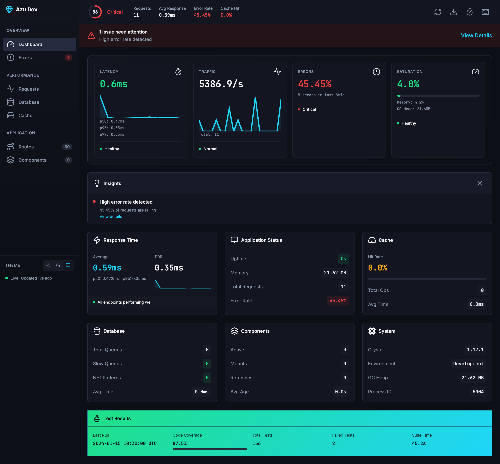
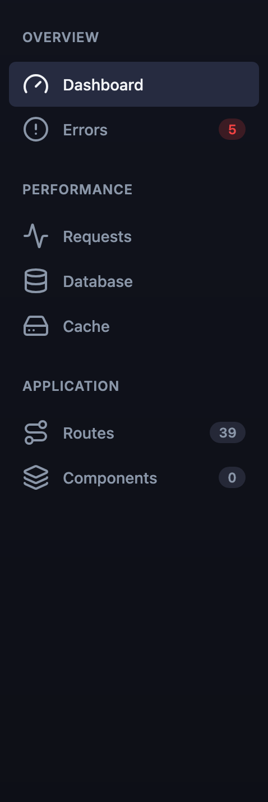
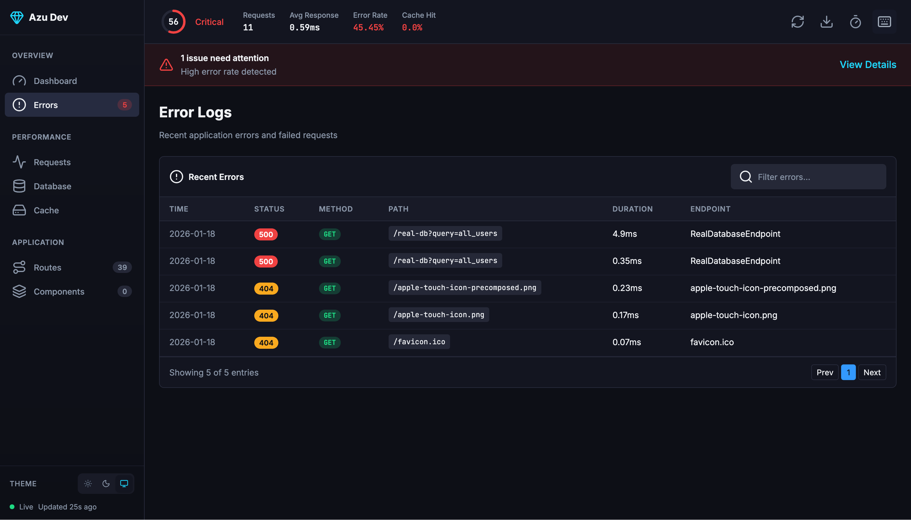
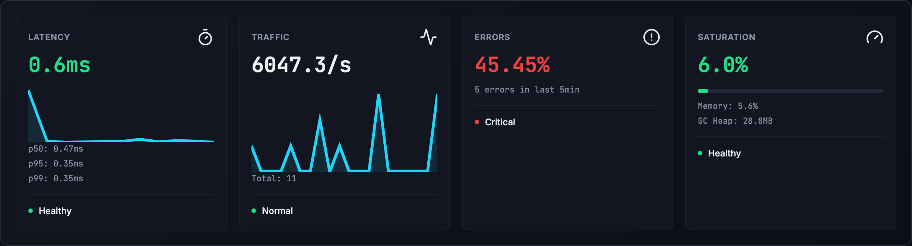
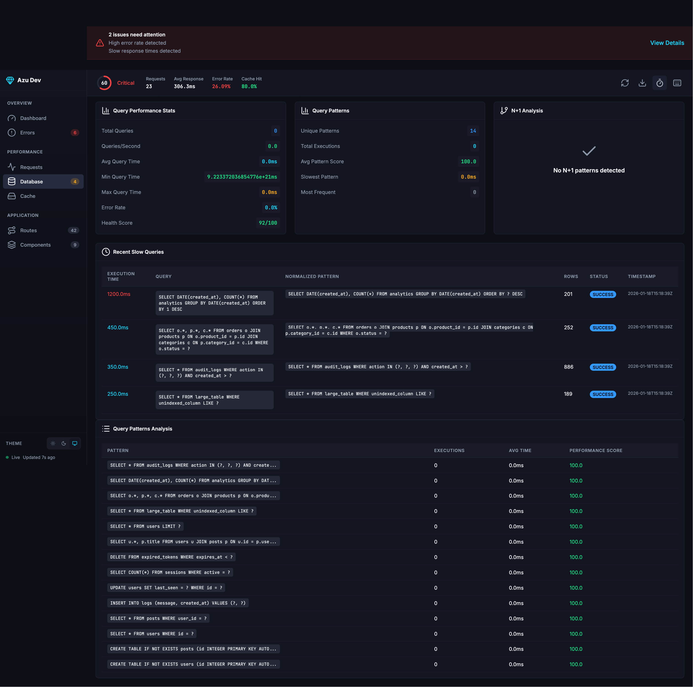
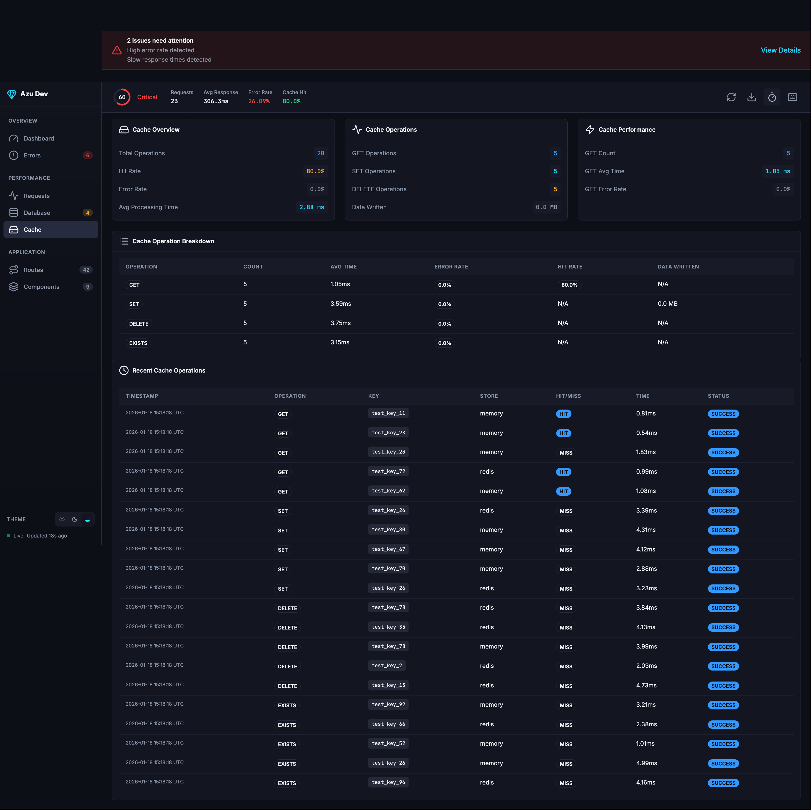
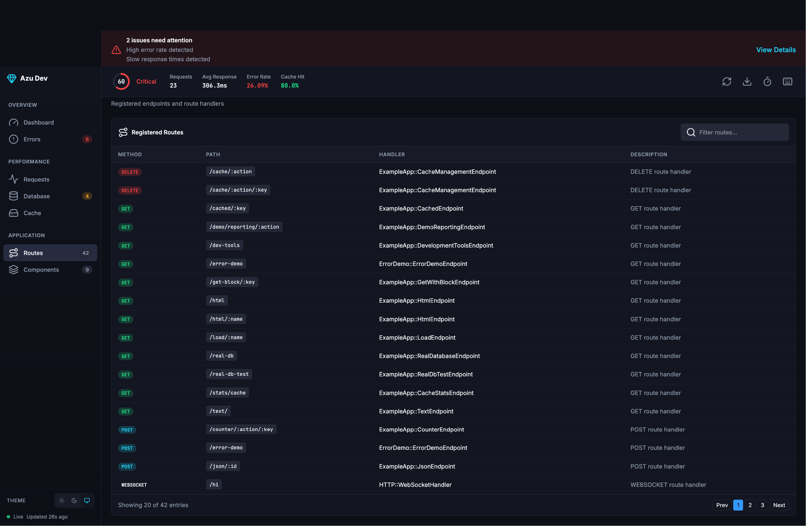
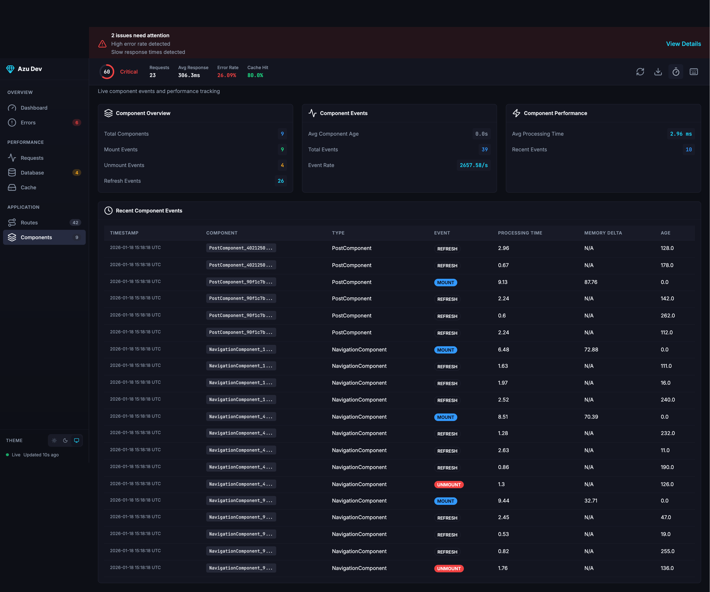

# Development Dashboard Visual Guide

A visual walkthrough of the Azu Development Dashboard interface and features.

> **Prerequisite**: Enable performance monitoring for full functionality:
> ```bash
> PERFORMANCE_MONITORING=true crystal run playground/example_app.cr
> ```
> Then visit: `http://localhost:4000/dev-dashboard`

---

## Dashboard Overview



The Azu Development Dashboard provides real-time insights into your application's performance, database queries, cache efficiency, and component lifecycle.

### Key Visual Elements

| Element | Location | Purpose |
|---------|----------|---------|
| **Sidebar Navigation** | Left side | Quick access to all sections |
| **Health Score Ring** | Top-left header | At-a-glance application health (0-100) |
| **Quick Stats** | Top header | Key metrics summary |
| **Golden Signals Panel** | Main content area | SRE-standard monitoring metrics |
| **Alert Banner** | Below header | Critical issues requiring attention |
| **Insights Panel** | Main content | Smart recommendations and warnings |

---

## Navigation & Layout

### Sidebar Navigation



The sidebar organizes dashboard sections into three groups:

| Group | Sections | Purpose |
|-------|----------|---------|
| **Overview** | Dashboard, Errors | Primary monitoring views |
| **Performance** | Requests, Database, Cache | Performance analysis |
| **Application** | Routes, Components | Application structure |

### Navigation Badges

Badges indicate items requiring attention:

- **Red badge** - Error count requiring attention
- **Yellow badge** - Warnings present
- **Gray badge** - Informational counts (routes, components)

---

## Health Monitoring

### Health Score Ring



The health score provides an instant visual indicator of application health:

| Score Range | Status | Color | Typical Causes |
|-------------|--------|-------|----------------|
| 90-100 | Healthy | Green | All systems operating normally |
| 70-89 | Warning | Yellow | Elevated errors, slow responses, or low cache hit rates |
| 0-69 | Critical | Red | High error rates, N+1 queries, or severe performance issues |

**Health Score Factors:**

- Error rate (up to -30 points)
- Average response time (up to -20 points)
- Cache hit rate (up to -15 points)
- N+1 query patterns (up to -15 points)
- Slow queries (up to -10 points)

---

## Golden Signals



The Four Golden Signals follow Google SRE best practices:

### Latency

- **Avg Response Time** - Mean request duration
- **P50/P95/P99** - Percentile distribution
- **Sparkline** - Visual trend over recent requests

**Status Thresholds:**

| Status | Average Response Time |
|--------|----------------------|
| Healthy | < 100ms |
| Warning | 100-500ms |
| Critical | > 500ms |

### Traffic

- **Requests/Second** - Current throughput
- **Total Requests** - Cumulative count
- **Sparkline** - Request volume over time

### Errors

- **Error Rate** - Percentage of failed requests
- **Error Count** - Absolute count in recent window

**Status Thresholds:**

| Status | Error Rate |
|--------|-----------|
| Healthy | < 1% |
| Warning | 1-5% |
| Critical | > 5% |

### Saturation

- **Memory %** - Current memory utilization
- **GC Heap** - Garbage collector heap size
- **Progress Bar** - Visual utilization indicator

**Status Thresholds:**

| Status | Memory Usage |
|--------|-------------|
| Healthy | < 70% |
| Warning | 70-85% |
| Critical | > 85% |

---

## Insights & Alerts

### Alert Banner


Displays when issues need immediate attention:

- **Critical (Red)** - High error rates, critical N+1 patterns
- **Warning (Yellow)** - Elevated issues not yet critical

### Insights Panel


Smart observations about your application:

| Insight Type | Severity | Typical Message |
|--------------|----------|-----------------|
| High Error Rate | Critical | "High error rate detected - X% failing" |
| N+1 Queries | Critical/Warning | "N+1 query patterns detected" |
| Slow Response | Warning | "Slow response times - P95 is Xms" |
| Low Cache Hit | Info/Warning | "Cache could be more effective" |

Each insight includes a "View details" action linking to the relevant section.

---

## Section Deep Dives

### Overview Section


The default view showing:

- Golden Signals panel
- Insights panel (if issues exist)
- Six metric summary cards:
  - Response Time (Average, P99, sparkline)
  - Application Status (Uptime, Memory, Requests, Error Rate)
  - Cache Summary (Hit Rate, Total Ops, Avg Time)
  - Database Info (Queries, Slow Queries, N+1 Patterns)
  - Components (Active, Mount/Unmount/Refresh Events)
  - System Information (Crystal Version, Environment, GC stats)
- Test Results card (if available)

### Errors Section


**Table Columns:**

| Column | Description |
|--------|-------------|
| Time | When the error occurred |
| Status | HTTP status code (4xx/5xx badges) |
| Method | HTTP method with color coding |
| Path | Request path |
| Duration | Processing time |
| Endpoint | Handler class |

Shows a success message when no errors exist.

### Requests Section


Two-panel layout:

- **Response Time** - Average, P95, P99 with sparkline visualization
- **Throughput** - Requests/second with sparkline visualization

### Database Section



**Overview Cards:**

- Query Performance Stats (Total queries, Avg/Min/Max time)
- Query Patterns (Unique patterns, execution counts)
- N+1 Analysis (Issues by severity: Critical/High/Medium/Low)

**Tables:**

- **Slow Queries** - Recent queries exceeding threshold


- **Query Patterns** - Normalized SQL with execution counts and performance scores

### Cache Section



**Overview Cards:**

- Cache Overview - Operations, hit rate, error rate, avg processing time
- Cache Operations - GET/SET/DELETE breakdown, data written
- Cache Performance - Timing metrics per operation type

**Tables:**

- Operation Breakdown - Per-operation statistics
- Recent Operations - Individual cache events with keys, hit status, timing

### Routes Section



Lists all registered routes with:

**Method Badges:**

| Color | HTTP Method |
|-------|-------------|
| Green | GET |
| Orange | POST |
| Cyan | PUT, PATCH |
| Red | DELETE |
| Gray | WEBSOCKET |

**Columns:** Method, Path (with parameters), Handler class, Description

### Components Section



Tracks Azu component lifecycle:

- **Overview Cards:** Total components, Mount/Unmount/Refresh counts, Avg age
- **Events Table:** Component ID, Type, Event, Processing time, Memory delta, Timestamp

---

## Keyboard Navigation


Press `?` to view all keyboard shortcuts.

### Navigation Shortcuts

| Keys | Action |
|------|--------|
| `g` then `o` | Go to Overview |
| `g` then `e` | Go to Errors |
| `g` then `q` | Go to Requests |
| `g` then `d` | Go to Database |
| `g` then `c` | Go to Cache |
| `g` then `r` | Go to Routes |
| `g` then `p` | Go to Components |

### Action Shortcuts

| Key | Action |
|-----|--------|
| `r` | Refresh data |
| `/` | Focus search |
| `e` | Export metrics |
| `?` | Show shortcuts |
| `Esc` | Close modal |

---

## Theming


### Available Themes

| Theme | Icon | Description |
|-------|------|-------------|
| Light | Sun | Clean light background |
| Dark | Moon | Rich dark with blue undertones (default) |
| System | Monitor | Follows OS preference |

Toggle themes using the buttons in the sidebar footer.

### Color Semantics

| Color | Meaning |
|-------|---------|
| Green | Healthy/Success |
| Yellow/Orange | Warning |
| Red | Critical/Error |
| Cyan | Crystal/Performance highlight |

---

## Quick Reference

### Accessing the Dashboard

```
http://localhost:4000/dev-dashboard
```

### Development Tools

```bash
# Generate test data for screenshots
curl "http://localhost:4000/dev-tools?action=generate_test_data"

# Simulate errors
curl "http://localhost:4000/dev-tools?action=simulate_errors"

# Clear all metrics
curl "http://localhost:4000/dev-dashboard?clear=true"
```

### Status Indicators

| Indicator | Meaning |
|-----------|---------|
| Green dot (pulsing) | Live connection |
| Green progress/ring | Healthy metric |
| Yellow progress/ring | Warning threshold |
| Red progress/ring | Critical threshold |

---

**See Also:**

- [Development Dashboard Technical Guide](development-dashboard.md) - Detailed configuration and API
- [Performance Monitoring](../performance/monitoring.md) - Enabling performance metrics
