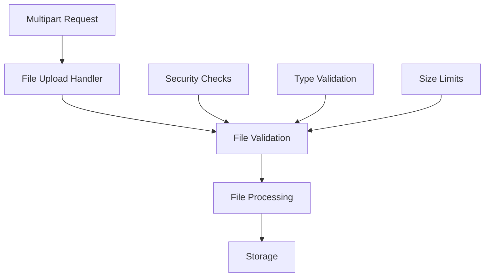

# File Uploads in Azu

Azu provides robust file upload handling with type safety, validation, and efficient processing. This guide covers handling multipart form data, file validation, and secure file storage patterns.

## Overview



## Basic File Upload

### Simple File Upload Endpoint

```crystal
struct FileUploadRequest
  include Request

  getter file : Azu::FileUpload
  getter description : String?

  def initialize(@file, @description = nil)
  end

  def self.from_params(params : Params) : self
    new(
      file: params.get_file("file"),
      description: params.get_string?("description")
    )
  end
end

struct FileUploadResponse
  include Response

  getter filename : String
  getter size : Int64
  getter url : String

  def initialize(@filename, @size, @url)
  end

  def render : String
    {
      filename: filename,
      size: size,
      url: url,
      message: "File uploaded successfully"
    }.to_json
  end
end

struct FileUploadEndpoint
  include Endpoint(FileUploadRequest, FileUploadResponse)

  post "/upload"

  def call : FileUploadResponse
    # Validate file
    validate_file!(request.file)

    # Process and store file
    filename = generate_filename(request.file)
    file_path = store_file(request.file, filename)

    FileUploadResponse.new(
      filename: filename,
      size: request.file.size,
      url: "/files/#{filename}"
    )
  end

  private def validate_file!(file : Azu::FileUpload)
    raise "File is required" if file.nil?
    raise "File too large" if file.size > 10.megabytes
    raise "Invalid file type" unless allowed_file_type?(file.filename)
  end

  private def allowed_file_type?(filename : String) : Bool
    allowed_extensions = [".jpg", ".jpeg", ".png", ".gif", ".pdf"]
    allowed_extensions.any? { |ext| filename.downcase.ends_with?(ext) }
  end

  private def generate_filename(file : Azu::FileUpload) : String
    extension = File.extname(file.filename)
    "#{Random::Secure.hex(16)}#{extension}"
  end

  private def store_file(file : Azu::FileUpload, filename : String) : String
    upload_dir = "uploads"
    Dir.mkdir_p(upload_dir)

    file_path = File.join(upload_dir, filename)
    File.write(file_path, file.content)

    file_path
  end
end
```

## Advanced File Upload Patterns

### Multiple File Upload

```crystal
struct MultipleFileUploadRequest
  include Request

  getter files : Array(Azu::FileUpload)
  getter category : String

  def initialize(@files, @category)
  end

  def self.from_params(params : Params) : self
    files = params.get_files("files")
    category = params.get_string("category")

    new(files, category)
  end
end

struct MultipleFileUploadResponse
  include Response

  getter uploaded_files : Array(Hash(String, String))
  getter errors : Array(String)

  def initialize(@uploaded_files, @errors)
  end

  def render : String
    {
      uploaded_files: uploaded_files,
      errors: errors,
      total_uploaded: uploaded_files.size,
      total_errors: errors.size
    }.to_json
  end
end

struct MultipleFileUploadEndpoint
  include Endpoint(MultipleFileUploadRequest, MultipleFileUploadResponse)

  post "/upload/multiple"

  def call : MultipleFileUploadResponse
    uploaded_files = [] of Hash(String, String)
    errors = [] of String

    request.files.each_with_index do |file, index|
      begin
        validate_file!(file)
        filename = store_file(file, request.category)

        uploaded_files << {
          "original_name" => file.filename,
          "stored_name" => filename,
          "size" => file.size.to_s,
          "url" => "/files/#{request.category}/#{filename}"
        }
      rescue ex
        errors << "File #{index + 1} (#{file.filename}): #{ex.message}"
      end
    end

    MultipleFileUploadResponse.new(uploaded_files, errors)
  end

  private def validate_file!(file : Azu::FileUpload)
    raise "File is required" if file.nil?
    raise "File too large" if file.size > 5.megabytes
    raise "Invalid file type" unless allowed_file_type?(file.filename)
  end

  private def allowed_file_type?(filename : String) : Bool
    allowed_extensions = [".jpg", ".jpeg", ".png", ".gif"]
    allowed_extensions.any? { |ext| filename.downcase.ends_with?(ext) }
  end

  private def store_file(file : Azu::FileUpload, category : String) : String
    upload_dir = File.join("uploads", category)
    Dir.mkdir_p(upload_dir)

    filename = generate_filename(file)
    file_path = File.join(upload_dir, filename)
    File.write(file_path, file.content)

    filename
  end

  private def generate_filename(file : Azu::FileUpload) : String
    extension = File.extname(file.filename)
    "#{Random::Secure.hex(16)}#{extension}"
  end
end
```

## File Validation

### Comprehensive File Validation

```crystal
class FileValidator
  MAX_FILE_SIZE = 10.megabytes
  ALLOWED_EXTENSIONS = [".jpg", ".jpeg", ".png", ".gif", ".pdf", ".doc", ".docx"]
  ALLOWED_MIME_TYPES = [
    "image/jpeg",
    "image/png",
    "image/gif",
    "application/pdf",
    "application/msword",
    "application/vnd.openxmlformats-officedocument.wordprocessingml.document"
  ]

  def self.validate(file : Azu::FileUpload) : ValidationResult
    errors = [] of String

    # Check if file exists
    errors << "File is required" if file.nil?

    # Check file size
    if file && file.size > MAX_FILE_SIZE
      errors << "File size exceeds maximum allowed size of #{MAX_FILE_SIZE / 1.megabyte}MB"
    end

    # Check file extension
    if file && !allowed_extension?(file.filename)
      errors << "File type not allowed. Allowed types: #{ALLOWED_EXTENSIONS.join(", ")}"
    end

    # Check MIME type
    if file && !allowed_mime_type?(file.content_type)
      errors << "File MIME type not allowed"
    end

    # Check for malicious content
    if file && contains_malicious_content?(file)
      errors << "File appears to contain malicious content"
    end

    ValidationResult.new(errors.empty?, errors)
  end

  private def self.allowed_extension?(filename : String) : Bool
    extension = File.extname(filename).downcase
    ALLOWED_EXTENSIONS.includes?(extension)
  end

  private def self.allowed_mime_type?(content_type : String) : Bool
    ALLOWED_MIME_TYPES.includes?(content_type)
  end

  private def self.contains_malicious_content?(file : Azu::FileUpload) : Bool
    # Check for common malicious patterns
    content = file.content.to_s

    # Check for executable content in image files
    if file.content_type.starts_with?("image/")
      return content.includes?("<?php") || content.includes?("<script")
    end

    false
  end
end

struct ValidationResult
  getter valid : Bool
  getter errors : Array(String)

  def initialize(@valid, @errors)
  end
end
```

## Image Processing

### Image Upload with Processing

```crystal
struct ImageUploadRequest
  include Request

  getter image : Azu::FileUpload
  getter resize : Bool
  getter width : Int32?
  getter height : Int32?

  def initialize(@image, @resize = false, @width = nil, @height = nil)
  end

  def self.from_params(params : Params) : self
    new(
      image: params.get_file("image"),
      resize: params.get_bool?("resize") || false,
      width: params.get_int?("width"),
      height: params.get_int?("height")
    )
  end
end

struct ImageUploadResponse
  include Response

  getter original_url : String
  getter thumbnail_url : String?
  getter dimensions : Hash(String, Int32)

  def initialize(@original_url, @thumbnail_url = nil, @dimensions = {} of String => Int32)
  end

  def render : String
    {
      original_url: original_url,
      thumbnail_url: thumbnail_url,
      dimensions: dimensions
    }.to_json
  end
end

struct ImageUploadEndpoint
  include Endpoint(ImageUploadRequest, ImageUploadResponse)

  post "/upload/image"

  def call : ImageUploadResponse
    # Validate image
    validate_image!(request.image)

    # Store original image
    original_filename = store_image(request.image)
    original_url = "/images/#{original_filename}"

    # Process image if requested
    thumbnail_url = nil
    dimensions = get_image_dimensions(request.image)

    if request.resize && request.width && request.height
      thumbnail_filename = create_thumbnail(request.image, request.width.not_nil!, request.height.not_nil!)
      thumbnail_url = "/images/thumbnails/#{thumbnail_filename}"
    end

    ImageUploadResponse.new(original_url, thumbnail_url, dimensions)
  end

  private def validate_image!(file : Azu::FileUpload)
    raise "File is required" if file.nil?
    raise "File too large" if file.size > 5.megabytes

    unless image_file?(file.filename)
      raise "File must be an image (jpg, jpeg, png, gif)"
    end
  end

  private def image_file?(filename : String) : Bool
    image_extensions = [".jpg", ".jpeg", ".png", ".gif"]
    image_extensions.any? { |ext| filename.downcase.ends_with?(ext) }
  end

  private def store_image(file : Azu::FileUpload) : String
    upload_dir = "uploads/images"
    Dir.mkdir_p(upload_dir)

    filename = generate_filename(file)
    file_path = File.join(upload_dir, filename)
    File.write(file_path, file.content)

    filename
  end

  private def generate_filename(file : Azu::FileUpload) : String
    extension = File.extname(file.filename)
    "#{Random::Secure.hex(16)}#{extension}"
  end

  private def get_image_dimensions(file : Azu::FileUpload) : Hash(String, Int32)
    # This would typically use an image processing library
    # For now, return placeholder dimensions
    {"width" => 800, "height" => 600}
  end

  private def create_thumbnail(file : Azu::FileUpload, width : Int32, height : Int32) : String
    # This would typically use an image processing library
    # For now, just return a placeholder filename
    "thumb_#{generate_filename(file)}"
  end
end
```

## Secure File Storage

### Cloud Storage Integration

```crystal
class CloudStorageService
  def self.upload_file(file : Azu::FileUpload, path : String) : String
    # Example with AWS S3 (would need aws-sdk-crystal)
    # s3_client = Aws::S3::Client.new
    # s3_client.put_object(
    #   bucket: "my-bucket",
    #   key: path,
    #   body: file.content
    # )
    # return s3_client.get_object(bucket: "my-bucket", key: path).url

    # For now, return a placeholder URL
    "https://storage.example.com/#{path}"
  end

  def self.delete_file(path : String) : Bool
    # Example with AWS S3
    # s3_client = Aws::S3::Client.new
    # s3_client.delete_object(bucket: "my-bucket", key: path)
    true
  end
end

struct SecureFileUploadRequest
  include Request

  getter file : Azu::FileUpload
  getter folder : String

  def initialize(@file, @folder)
  end

  def self.from_params(params : Params) : self
    new(
      file: params.get_file("file"),
      folder: params.get_string("folder")
    )
  end
end

struct SecureFileUploadResponse
  include Response

  getter url : String
  getter filename : String
  getter size : Int64

  def initialize(@url, @filename, @size)
  end

  def render : String
    {
      url: url,
      filename: filename,
      size: size
    }.to_json
  end
end

struct SecureFileUploadEndpoint
  include Endpoint(SecureFileUploadRequest, SecureFileUploadResponse)

  post "/upload/secure"

  def call : SecureFileUploadResponse
    # Validate file
    validate_file!(request.file)

    # Generate secure path
    filename = generate_secure_filename(request.file)
    path = "#{request.folder}/#{filename}"

    # Upload to cloud storage
    url = CloudStorageService.upload_file(request.file, path)

    SecureFileUploadResponse.new(url, filename, request.file.size)
  end

  private def validate_file!(file : Azu::FileUpload)
    raise "File is required" if file.nil?
    raise "File too large" if file.size > 50.megabytes
    raise "Invalid file type" unless allowed_file_type?(file.filename)
  end

  private def allowed_file_type?(filename : String) : Bool
    allowed_extensions = [".pdf", ".doc", ".docx", ".txt", ".jpg", ".png"]
    allowed_extensions.any? { |ext| filename.downcase.ends_with?(ext) }
  end

  private def generate_secure_filename(file : Azu::FileUpload) : String
    extension = File.extname(file.filename)
    timestamp = Time.utc.to_unix
    hash = Random::Secure.hex(16)
    "#{timestamp}_#{hash}#{extension}"
  end
end
```

## Progress Tracking

### Upload Progress Monitoring

```crystal
class UploadProgressTracker
  @@uploads = {} of String => UploadProgress

  def self.track_upload(upload_id : String, total_size : Int64)
    @@uploads[upload_id] = UploadProgress.new(upload_id, total_size)
  end

  def self.update_progress(upload_id : String, bytes_uploaded : Int64)
    if progress = @@uploads[upload_id]?
      progress.update_progress(bytes_uploaded)
    end
  end

  def self.get_progress(upload_id : String) : UploadProgress?
    @@uploads[upload_id]?
  end

  def self.complete_upload(upload_id : String)
    @@uploads.delete(upload_id)
  end
end

struct UploadProgress
  getter upload_id : String
  getter total_size : Int64
  getter bytes_uploaded : Int64
  getter status : String
  getter started_at : Time

  def initialize(@upload_id, @total_size)
    @bytes_uploaded = 0_i64
    @status = "uploading"
    @started_at = Time.utc
  end

  def update_progress(bytes : Int64)
    @bytes_uploaded = bytes
    @status = "completed" if @bytes_uploaded >= @total_size
  end

  def percentage : Float64
    return 0.0 if @total_size == 0
    (@bytes_uploaded.to_f / @total_size.to_f) * 100.0
  end

  def duration : Time::Span
    Time.utc - @started_at
  end
end

struct ProgressTrackingEndpoint
  include Endpoint(ProgressRequest, ProgressResponse)

  get "/upload/progress/:upload_id"

  def call : ProgressResponse
    upload_id = request.params.get_string("upload_id")
    progress = UploadProgressTracker.get_progress(upload_id)

    if progress
      ProgressResponse.new(
        upload_id: progress.upload_id,
        percentage: progress.percentage,
        status: progress.status,
        duration: progress.duration
      )
    else
      ProgressResponse.new(
        upload_id: upload_id,
        percentage: 0.0,
        status: "not_found",
        duration: Time::Span.zero
      )
    end
  end
end

struct ProgressRequest
  include Request

  getter upload_id : String

  def initialize(@upload_id)
  end

  def self.from_params(params : Params) : self
    new(params.get_string("upload_id"))
  end
end

struct ProgressResponse
  include Response

  getter upload_id : String
  getter percentage : Float64
  getter status : String
  getter duration : Time::Span

  def initialize(@upload_id, @percentage, @status, @duration)
  end

  def render : String
    {
      upload_id: upload_id,
      percentage: percentage,
      status: status,
      duration_seconds: duration.total_seconds
    }.to_json
  end
end
```

## Testing File Uploads

### File Upload Testing

```crystal
describe "FileUploadEndpoint" do
  it "handles valid file upload" do
    endpoint = FileUploadEndpoint.new

    # Create mock file upload
    file_content = "test file content"
    file = Azu::FileUpload.new(
      filename: "test.jpg",
      content_type: "image/jpeg",
      content: IO::Memory.new(file_content),
      size: file_content.bytesize.to_i64
    )

    request = FileUploadRequest.new(file, "Test description")
    response = endpoint.call(request)

    assert response.filename.is_a?(String)
    assert response.size == file_content.bytesize.to_i64
    assert response.url.starts_with?("/files/")
  end

  it "rejects files that are too large" do
    endpoint = FileUploadEndpoint.new

    # Create large file
    large_content = "x" * (11 * 1024 * 1024) # 11MB
    file = Azu::FileUpload.new(
      filename: "large.jpg",
      content_type: "image/jpeg",
      content: IO::Memory.new(large_content),
      size: large_content.bytesize.to_i64
    )

    request = FileUploadRequest.new(file, "Large file")

    expect_raises(Exception, "File too large") do
      endpoint.call(request)
    end
  end

  it "rejects invalid file types" do
    endpoint = FileUploadEndpoint.new

    file = Azu::FileUpload.new(
      filename: "test.exe",
      content_type: "application/octet-stream",
      content: IO::Memory.new("executable content"),
      size: 1024_i64
    )

    request = FileUploadRequest.new(file, "Executable file")

    expect_raises(Exception, "Invalid file type") do
      endpoint.call(request)
    end
  end
end
```

## Best Practices

### 1. Always Validate Files

```crystal
# Good: Comprehensive validation
def validate_file!(file : Azu::FileUpload)
  raise "File is required" if file.nil?
  raise "File too large" if file.size > MAX_SIZE
  raise "Invalid file type" unless allowed_type?(file.filename)
  raise "Malicious content detected" if malicious?(file)
end

# Avoid: No validation
def process_file(file : Azu::FileUpload)
  # Process without validation
end
```

### 2. Use Secure Filenames

```crystal
# Good: Secure filename generation
def generate_filename(file : Azu::FileUpload) : String
  extension = File.extname(file.filename)
  "#{Random::Secure.hex(16)}#{extension}"
end

# Avoid: Using original filename
def generate_filename(file : Azu::FileUpload) : String
  file.filename  # Security risk
end
```

### 3. Implement File Size Limits

```crystal
# Good: Explicit size limits
MAX_FILE_SIZE = 10.megabytes
MAX_TOTAL_SIZE = 100.megabytes

def validate_size!(file : Azu::FileUpload)
  raise "File too large" if file.size > MAX_FILE_SIZE
end

# Avoid: No size limits
def process_file(file : Azu::FileUpload)
  # No size checking
end
```

### 4. Use Content-Type Validation

```crystal
# Good: Validate MIME types
ALLOWED_MIME_TYPES = ["image/jpeg", "image/png", "application/pdf"]

def validate_mime_type!(file : Azu::FileUpload)
  unless ALLOWED_MIME_TYPES.includes?(file.content_type)
    raise "Invalid content type"
  end
end

# Avoid: Trust file extension only
def validate_file(file : Azu::FileUpload)
  # Only check file extension
end
```

## Next Steps

- [Content Negotiation](advanced/content-negotiation.md) - Handle different content types
- [Environment Management](advanced/environments.md) - Configure upload settings per environment
- [Performance Tuning](advanced/performance-tuning.md) - Optimize file upload performance
- [Middleware](middleware.md) - Add upload-specific middleware
