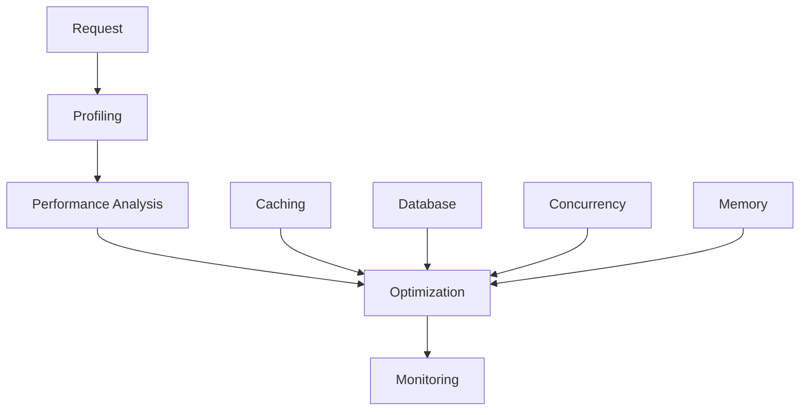

# Performance Tuning in Azu

Azu is designed for high performance, but understanding how to optimize your application can significantly improve response times and throughput. This guide covers profiling, caching strategies, database optimization, and scaling techniques.

## Overview



## Performance Profiling

### Built-in Profiling

```crystal
class PerformanceProfiler
  @@metrics = {} of String => Array(Float64)
  @@start_times = {} of String => Time

  def self.start_timer(name : String)
    @@start_times[name] = Time.utc
  end

  def self.end_timer(name : String) : Float64
    if start_time = @@start_times[name]?
      duration = (Time.utc - start_time).total_milliseconds
      @@metrics[name] ||= [] of Float64
      @@metrics[name] << duration
      @@start_times.delete(name)
      duration
    else
      0.0
    end
  end

  def self.get_metrics(name : String) : Hash(String, Float64)?
    if measurements = @@metrics[name]?
      {
        "count" => measurements.size.to_f,
        "avg" => measurements.sum / measurements.size,
        "min" => measurements.min,
        "max" => measurements.max,
        "p95" => percentile(measurements, 0.95),
        "p99" => percentile(measurements, 0.99)
      }
    end
  end

  private def self.percentile(values : Array(Float64), p : Float64) : Float64
    sorted = values.sort
    index = (p * (sorted.size - 1)).round.to_i
    sorted[index]
  end
end

# Profiling middleware
class ProfilingMiddleware < Azu::Handler::Base
  def call(context : HTTP::Server::Context)
    PerformanceProfiler.start_timer("request_#{context.request.path}")

    begin
      call_next(context)
    ensure
      PerformanceProfiler.end_timer("request_#{context.request.path}")
    end
  end
end

# Usage in endpoints
struct ProfiledEndpoint
  include Endpoint(ProfiledRequest, ProfiledResponse)

  get "/api/profiled"

  def call : ProfiledResponse
    PerformanceProfiler.start_timer("database_query")

    # Simulate database query
    sleep(0.1)
    data = fetch_data_from_database

    PerformanceProfiler.end_timer("database_query")

    PerformanceProfiler.start_timer("data_processing")

    # Process data
    processed_data = process_data(data)

    PerformanceProfiler.end_timer("data_processing")

    ProfiledResponse.new(processed_data)
  end

  private def fetch_data_from_database : Array(String)
    ["item1", "item2", "item3"]
  end

  private def process_data(data : Array(String)) : Hash(String, String)
    {
      "count" => data.size.to_s,
      "items" => data.join(", "),
      "timestamp" => Time.utc.to_unix.to_s
    }
  end
end

struct ProfiledRequest
  include Request

  def initialize
  end
end

struct ProfiledResponse
  include Response

  getter data : Hash(String, String)

  def initialize(@data)
  end

  def render : String
    data.to_json
  end
end
```

### Performance Metrics Endpoint

```crystal
struct MetricsEndpoint
  include Endpoint(MetricsRequest, MetricsResponse)

  get "/api/metrics"

  def call : MetricsResponse
    metrics = {} of String => Hash(String, Float64)

    # Collect metrics for different operations
    if db_metrics = PerformanceProfiler.get_metrics("database_query")
      metrics["database_query"] = db_metrics
    end

    if processing_metrics = PerformanceProfiler.get_metrics("data_processing")
      metrics["data_processing"] = processing_metrics
    end

    if request_metrics = PerformanceProfiler.get_metrics("request_/api/profiled")
      metrics["request_/api/profiled"] = request_metrics
    end

    MetricsResponse.new(metrics)
  end
end

struct MetricsRequest
  include Request

  def initialize
  end
end

struct MetricsResponse
  include Response

  getter metrics : Hash(String, Hash(String, Float64))

  def initialize(@metrics)
  end

  def render : String
    metrics.to_json
  end
end
```

## Caching Strategies

### Memory Caching

```crystal
class MemoryCache
  @@cache = {} of String => CacheEntry
  @@max_size = 1000
  @@ttl = 300 # 5 minutes default

  def self.get(key : String) : String?
    if entry = @@cache[key]?
      if entry.expires_at > Time.utc
        entry.value
      else
        @@cache.delete(key)
        nil
      end
    end
  end

  def self.set(key : String, value : String, ttl : Int32 = @@ttl)
    # Evict oldest entries if cache is full
    if @@cache.size >= @@max_size
      oldest_key = @@cache.min_by { |_, entry| entry.created_at }.first
      @@cache.delete(oldest_key)
    end

    @@cache[key] = CacheEntry.new(value, ttl)
  end

  def self.delete(key : String)
    @@cache.delete(key)
  end

  def self.clear
    @@cache.clear
  end

  def self.size : Int32
    @@cache.size
  end
end

struct CacheEntry
  getter value : String
  getter created_at : Time
  getter expires_at : Time

  def initialize(@value, ttl : Int32)
    @created_at = Time.utc
    @expires_at = @created_at + Time::Span.new(seconds: ttl)
  end
end

# Cached endpoint
struct CachedEndpoint
  include Endpoint(CachedRequest, CachedResponse)

  get "/api/cached/:id"

  def call : CachedResponse
    cache_key = "user_#{request.id}"

    # Try to get from cache first
    if cached_data = MemoryCache.get(cache_key)
      CachedResponse.new(cached_data, true)
    else
      # Fetch from database
      data = fetch_user_data(request.id)
      json_data = data.to_json

      # Cache for 5 minutes
      MemoryCache.set(cache_key, json_data, 300)

      CachedResponse.new(json_data, false)
    end
  end

  private def fetch_user_data(id : String) : Hash(String, String)
    # Simulate database query
    sleep(0.1)
    {
      "id" => id,
      "name" => "User #{id}",
      "email" => "user#{id}@example.com",
      "created_at" => Time.utc.to_unix.to_s
    }
  end
end

struct CachedRequest
  include Request

  getter id : String

  def initialize(@id)
  end

  def self.from_params(params : Params) : self
    new(params.get_string("id"))
  end
end

struct CachedResponse
  include Response

  getter data : String
  getter cached : Bool

  def initialize(@data, @cached)
  end

  def render : String
    {
      "data" => JSON.parse(data),
      "cached" => cached,
      "timestamp" => Time.utc.to_unix
    }.to_json
  end
end
```

### Redis Caching

```crystal
class RedisCache
  @@redis : Redis::Client?

  def self.client : Redis::Client
    @@redis ||= Redis::Client.new(
      host: ENV["REDIS_HOST"]? || "localhost",
      port: (ENV["REDIS_PORT"]? || "6379").to_i,
      database: (ENV["REDIS_DB"]? || "0").to_i
    )
  end

  def self.get(key : String) : String?
    client.get(key)
  end

  def self.set(key : String, value : String, ttl : Int32 = 300)
    client.setex(key, ttl, value)
  end

  def self.delete(key : String)
    client.del(key)
  end

  def self.exists?(key : String) : Bool
    client.exists(key) > 0
  end

  def self.increment(key : String) : Int64
    client.incr(key)
  end
end

# Redis cached endpoint
struct RedisCachedEndpoint
  include Endpoint(RedisCachedRequest, RedisCachedResponse)

  get "/api/redis-cached/:id"

  def call : RedisCachedResponse
    cache_key = "user_#{request.id}"

    # Try Redis cache first
    if cached_data = RedisCache.get(cache_key)
      RedisCachedResponse.new(cached_data, true)
    else
      # Fetch from database
      data = fetch_user_data(request.id)
      json_data = data.to_json

      # Cache in Redis for 10 minutes
      RedisCache.set(cache_key, json_data, 600)

      RedisCachedResponse.new(json_data, false)
    end
  end

  private def fetch_user_data(id : String) : Hash(String, String)
    # Simulate database query
    sleep(0.2)
    {
      "id" => id,
      "name" => "User #{id}",
      "email" => "user#{id}@example.com",
      "created_at" => Time.utc.to_unix.to_s
    }
  end
end
```

## Database Optimization

### Connection Pooling

```crystal
class DatabasePool
  @@pool : DB::Pool(DB::Database)?

  def self.pool : DB::Pool(DB::Database)
    @@pool ||= DB::Pool.new(
      connection_string: ENV["DATABASE_URL"]? || "sqlite://./app.db",
      initial_pool_size: 5,
      max_pool_size: 20,
      max_idle_pool_size: 10,
      checkout_timeout: 5.0,
      retry_attempts: 3,
      retry_delay: 0.1
    )
  end

  def self.with_connection(&block : DB::Database -> T) : T forall T
    pool.using do |db|
      block.call(db)
    end
  end

  def self.query_one(sql : String, args : Array = [] of String) : String?
    with_connection do |db|
      db.query_one(sql, args: args, as: String)
    end
  end

  def self.query_all(sql : String, args : Array = [] of String) : Array(String)
    with_connection do |db|
      db.query_all(sql, args: args, as: String)
    end
  end
end

# Optimized database endpoint
struct OptimizedDbEndpoint
  include Endpoint(OptimizedDbRequest, OptimizedDbResponse)

  get "/api/optimized-db/:id"

  def call : OptimizedDbResponse
    PerformanceProfiler.start_timer("database_query")

    # Use connection pool
    user_data = DatabasePool.query_one(
      "SELECT name, email FROM users WHERE id = ?",
      [request.id]
    )

    PerformanceProfiler.end_timer("database_query")

    if user_data
      OptimizedDbResponse.new({
        "id" => request.id,
        "name" => user_data,
        "email" => "user#{request.id}@example.com"
      })
    else
      OptimizedDbResponse.new({
        "error" => "User not found"
      })
    end
  end
end
```

### Query Optimization

```crystal
class QueryOptimizer
  def self.optimize_query(sql : String) : String
    # Add query hints for better performance
    case sql
    when /SELECT.*FROM users/
      sql.gsub("SELECT", "SELECT /*+ INDEX(users idx_users_id) */")
    when /SELECT.*FROM posts/
      sql.gsub("SELECT", "SELECT /*+ INDEX(posts idx_posts_user_id) */")
    else
      sql
    end
  end

  def self.batch_query(ids : Array(String)) : Array(Hash(String, String))
    return [] of Hash(String, String) if ids.empty?

    placeholders = ids.map { "?" }.join(", ")
    sql = "SELECT id, name, email FROM users WHERE id IN (#{placeholders})"

    DatabasePool.with_connection do |db|
      db.query_all(sql, args: ids, as: {String, String, String}).map do |row|
        {
          "id" => row[0],
          "name" => row[1],
          "email" => row[2]
        }
      end
    end
  end
end

# Batch query endpoint
struct BatchQueryEndpoint
  include Endpoint(BatchQueryRequest, BatchQueryResponse)

  post "/api/batch-query"

  def call : BatchQueryResponse
    PerformanceProfiler.start_timer("batch_query")

    # Process batch query
    results = QueryOptimizer.batch_query(request.ids)

    PerformanceProfiler.end_timer("batch_query")

    BatchQueryResponse.new(results)
  end
end

struct BatchQueryRequest
  include Request

  getter ids : Array(String)

  def initialize(@ids)
  end

  def self.from_params(params : Params) : self
    ids_param = params.get_string("ids")
    ids = ids_param.split(",").map(&.strip)
    new(ids)
  end
end
```

## Concurrency and Parallelism

### Async Processing

```crystal
class AsyncProcessor
  def self.process_parallel(tasks : Array(-> String)) : Array(String)
    channels = tasks.map do |task|
      channel = Channel(String).new
      spawn do
        channel.send(task.call)
      end
      channel
    end

    channels.map(&.receive)
  end

  def self.process_with_timeout(task : -> String, timeout : Time::Span) : String?
    channel = Channel(String?).new

    spawn do
      begin
        result = task.call
        channel.send(result)
      rescue ex
        channel.send(nil)
      end
    end

    select
    when result = channel.receive
      result
    when timeout(timeout)
      nil
    end
  end
end

# Parallel processing endpoint
struct ParallelEndpoint
  include Endpoint(ParallelRequest, ParallelResponse)

  get "/api/parallel"

  def call : ParallelResponse
    PerformanceProfiler.start_timer("parallel_processing")

    # Create tasks
    tasks = [
      ->{ fetch_user_data("1") },
      ->{ fetch_user_data("2") },
      ->{ fetch_user_data("3") },
      ->{ fetch_user_data("4") },
      ->{ fetch_user_data("5") }
    ]

    # Process in parallel
    results = AsyncProcessor.process_parallel(tasks)

    PerformanceProfiler.end_timer("parallel_processing")

    ParallelResponse.new(results)
  end

  private def fetch_user_data(id : String) : String
    # Simulate API call
    sleep(0.1)
    {
      "id" => id,
      "name" => "User #{id}",
      "timestamp" => Time.utc.to_unix
    }.to_json
  end
end
```

### Background Jobs

```crystal
class BackgroundJobProcessor
  @@jobs = Channel(BackgroundJob).new(1000)
  @@workers = 4

  def self.start_workers
    @@workers.times do |i|
      spawn do
        worker_loop(i)
      end
    end
  end

  def self.enqueue(job : BackgroundJob)
    @@jobs.send(job)
  end

  private def self.worker_loop(worker_id : Int32)
    loop do
      job = @@jobs.receive

      begin
        job.execute
        Log.info { "Worker #{worker_id} completed job #{job.id}" }
      rescue ex
        Log.error { "Worker #{worker_id} failed job #{job.id}: #{ex.message}" }
      end
    end
  end
end

struct BackgroundJob
  getter id : String
  getter task : -> Void

  def initialize(@id, @task)
  end

  def execute
    task.call
  end
end

# Background job endpoint
struct BackgroundJobEndpoint
  include Endpoint(BackgroundJobRequest, BackgroundJobResponse)

  post "/api/background-job"

  def call : BackgroundJobResponse
    job_id = Random::Secure.hex(8)

    # Enqueue background job
    job = BackgroundJob.new(job_id) do
      # Simulate long-running task
      sleep(5)
      Log.info { "Background job #{job_id} completed" }
    end

    BackgroundJobProcessor.enqueue(job)

    BackgroundJobResponse.new(job_id, "Job queued successfully")
  end
end
```

## Memory Optimization

### Object Pooling

```crystal
class ObjectPool(T)
  @@pool = [] of T
  @@max_size = 100
  @@factory : -> T

  def self.initialize(factory : -> T, max_size : Int32 = 100)
    @@factory = factory
    @@max_size = max_size
  end

  def self.acquire : T
    if @@pool.empty?
      @@factory.call
    else
      @@pool.pop
    end
  end

  def self.release(obj : T)
    if @@pool.size < @@max_size
      @@pool << obj
    end
  end
end

# Memory optimized endpoint
struct MemoryOptimizedEndpoint
  include Endpoint(MemoryOptimizedRequest, MemoryOptimizedResponse)

  get "/api/memory-optimized"

  def call : MemoryOptimizedResponse
    # Use object pooling for expensive objects
    buffer = ObjectPool(IO::Memory).acquire

    begin
      # Use buffer for processing
      buffer << "Processed data"
      result = buffer.to_s

      MemoryOptimizedResponse.new(result)
    ensure
      # Release buffer back to pool
      ObjectPool(IO::Memory).release(buffer)
    end
  end
end
```

## Performance Testing

### Load Testing

```crystal
class LoadTester
  def self.run_load_test(endpoint : String, duration : Time::Span, concurrency : Int32)
    start_time = Time.utc
    end_time = start_time + duration

    channels = concurrency.times.map do |i|
      channel = Channel(LoadTestResult).new

      spawn do
        worker_loop(endpoint, start_time, end_time, channel, i)
      end

      channel
    end

    # Collect results
    results = channels.flat_map(&.receive_all)

    # Calculate statistics
    calculate_statistics(results)
  end

  private def self.worker_loop(endpoint : String, start_time : Time, end_time : Time, channel : Channel(LoadTestResult), worker_id : Int32)
    results = [] of LoadTestResult

    while Time.utc < end_time
      request_start = Time.utc

      begin
        # Make HTTP request
        response = HTTP::Client.get(endpoint)
        duration = (Time.utc - request_start).total_milliseconds

        results << LoadTestResult.new(
          worker_id: worker_id,
          duration: duration,
          status_code: response.status_code,
          success: response.success?
        )
      rescue ex
        duration = (Time.utc - request_start).total_milliseconds
        results << LoadTestResult.new(
          worker_id: worker_id,
          duration: duration,
          status_code: 0,
          success: false,
          error: ex.message
        )
      end
    end

    channel.send_all(results)
  end

  private def self.calculate_statistics(results : Array(LoadTestResult)) : LoadTestStatistics
    durations = results.map(&.duration)
    successful = results.count(&.success)
    failed = results.size - successful

    LoadTestStatistics.new(
      total_requests: results.size,
      successful_requests: successful,
      failed_requests: failed,
      average_duration: durations.sum / durations.size,
      min_duration: durations.min,
      max_duration: durations.max,
      p95_duration: percentile(durations, 0.95),
      p99_duration: percentile(durations, 0.99)
    )
  end

  private def self.percentile(values : Array(Float64), p : Float64) : Float64
    sorted = values.sort
    index = (p * (sorted.size - 1)).round.to_i
    sorted[index]
  end
end

struct LoadTestResult
  getter worker_id : Int32
  getter duration : Float64
  getter status_code : Int32
  getter success : Bool
  getter error : String?

  def initialize(@worker_id, @duration, @status_code, @success, @error = nil)
  end
end

struct LoadTestStatistics
  getter total_requests : Int32
  getter successful_requests : Int32
  getter failed_requests : Int32
  getter average_duration : Float64
  getter min_duration : Float64
  getter max_duration : Float64
  getter p95_duration : Float64
  getter p99_duration : Float64

  def initialize(@total_requests, @successful_requests, @failed_requests, @average_duration, @min_duration, @max_duration, @p95_duration, @p99_duration)
  end
end

# Load testing endpoint
struct LoadTestEndpoint
  include Endpoint(LoadTestRequest, LoadTestResponse)

  post "/api/load-test"

  def call : LoadTestResponse
    duration = Time::Span.new(seconds: request.duration_seconds)
    concurrency = request.concurrency

    statistics = LoadTester.run_load_test(
      request.endpoint,
      duration,
      concurrency
    )

    LoadTestResponse.new(statistics)
  end
end

struct LoadTestRequest
  include Request

  getter endpoint : String
  getter duration_seconds : Int32
  getter concurrency : Int32

  def initialize(@endpoint, @duration_seconds, @concurrency)
  end

  def self.from_params(params : Params) : self
    new(
      params.get_string("endpoint"),
      params.get_int("duration_seconds"),
      params.get_int("concurrency")
    )
  end
end

struct LoadTestResponse
  include Response

  getter statistics : LoadTestStatistics

  def initialize(@statistics)
  end

  def render : String
    {
      "total_requests" => statistics.total_requests,
      "successful_requests" => statistics.successful_requests,
      "failed_requests" => statistics.failed_requests,
      "average_duration_ms" => statistics.average_duration,
      "min_duration_ms" => statistics.min_duration,
      "max_duration_ms" => statistics.max_duration,
      "p95_duration_ms" => statistics.p95_duration,
      "p99_duration_ms" => statistics.p99_duration
    }.to_json
  end
end
```

## Best Practices

### 1. Use Connection Pooling

```crystal
# Good: Use connection pool
def fetch_user(id : String)
  DatabasePool.with_connection do |db|
    db.query_one("SELECT * FROM users WHERE id = ?", [id])
  end
end

# Avoid: Create new connections
def fetch_user(id : String)
  DB.open(ENV["DATABASE_URL"]) do |db|
    db.query_one("SELECT * FROM users WHERE id = ?", [id])
  end
end
```

### 2. Implement Caching Strategically

```crystal
# Good: Cache expensive operations
def get_user_profile(id : String)
  cache_key = "user_profile_#{id}"

  if cached = MemoryCache.get(cache_key)
    return cached
  end

  profile = fetch_user_profile_from_db(id)
  MemoryCache.set(cache_key, profile.to_json, 300)
  profile
end

# Avoid: No caching
def get_user_profile(id : String)
  fetch_user_profile_from_db(id)  # Expensive operation
end
```

### 3. Use Parallel Processing

```crystal
# Good: Process in parallel
def fetch_multiple_users(ids : Array(String))
  tasks = ids.map { |id| ->{ fetch_user(id) } }
  AsyncProcessor.process_parallel(tasks)
end

# Avoid: Sequential processing
def fetch_multiple_users(ids : Array(String))
  ids.map { |id| fetch_user(id) }  # Sequential
end
```

### 4. Monitor Performance

```crystal
# Good: Profile operations
def expensive_operation
  PerformanceProfiler.start_timer("expensive_operation")

  result = perform_expensive_operation

  PerformanceProfiler.end_timer("expensive_operation")
  result
end

# Avoid: No monitoring
def expensive_operation
  perform_expensive_operation  # No visibility
end
```

## Next Steps

- [Environment Management](advanced/environments.md) - Configure performance settings per environment
- [File Uploads](advanced/file-uploads.md) - Optimize file upload performance
- [Content Negotiation](advanced/content-negotiation.md) - Performance considerations for content types
- [API Reference](api-reference.md) - Explore performance-related APIs
