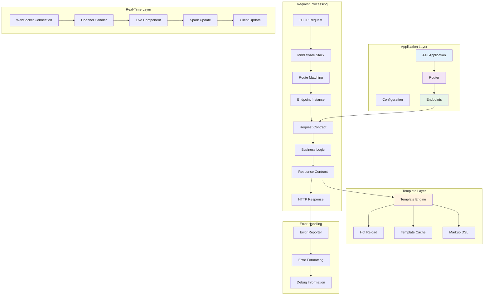

# Architecture

Azu's architecture is built around three core principles: **type safety**, **performance**, and **explicit contracts**. Understanding these principles is essential for building robust applications with Azu.

## Design Philosophy

### Contract-First Development

Azu enforces **explicit contracts** between client and server through typed request/response objects. This approach eliminates runtime surprises and makes APIs self-documenting.

```crystal
# Contract: What the endpoint expects and returns
struct UserEndpoint
  include Azu::Endpoint(CreateUserRequest, UserResponse)

  post "/users"

  def call : UserResponse
    # Compile-time guarantees:
    # ✅ create_user_request is valid CreateUserRequest
    # ✅ Must return UserResponse
    # ✅ Route "/users" exists and is correctly typed
    user = User.create!(create_user_request.to_h)
    UserResponse.new(user)
  end
end
```

### Zero-Runtime Validation

Traditional frameworks validate requests at runtime, adding latency and potential failures. Azu moves validation to compile-time:

```crystal
struct ProductRequest
  include Azu::Request

  getter name : String
  getter price : Float64
  getter category : String

  # Validation happens at compile-time
  validate name, presence: true, length: {min: 3, max: 50}
  validate price, presence: true, numericality: {greater_than: 0}
  validate category, inclusion: {in: %w(electronics books clothing)}
end

# At runtime: zero validation overhead
# At compile-time: full type and constraint checking
```

### Performance-First Design

Every architectural decision prioritizes performance without sacrificing developer experience:

- **Route caching** with LRU eviction for frequently accessed paths
- **Zero-allocation** parameter parsing for common scenarios
- **Template compilation** with hot reloading in development
- **Fiber-based concurrency** for handling thousands of WebSocket connections

## System Architecture



## Request-Response Lifecycle

### 1. Request Arrival

```crystal
# 1. HTTP request arrives at the server
# 2. Middleware stack processes request
# 3. Router matches request to endpoint

class LoggingMiddleware
  include HTTP::Handler

  def call(context)
    start_time = Time.monotonic
    call_next(context)
    duration = Time.monotonic - start_time

    Log.info { "#{context.request.method} #{context.request.path} #{duration.total_milliseconds}ms" }
  end
end
```

### 2. Route Resolution

```crystal
# Azu's router uses optimized path matching
module Azu
  class Router
    # Routes are pre-compiled and cached
    def add_route(method, path, handler)
      @radix_tree.add(path, RouteHandler.new(method, handler))
      @route_cache.clear # Invalidate cache on new routes
    end

    def find_route(method, path)
      # Check LRU cache first
      if cached = @route_cache[cache_key(method, path)]
        return cached
      end

      # Perform tree lookup and cache result
      result = @radix_tree.find(path)
      @route_cache[cache_key(method, path)] = result
      result
    end
  end
end
```

### 3. Endpoint Instantiation

```crystal
# Each request gets a fresh endpoint instance
struct UserEndpoint
  include Azu::Endpoint(UserRequest, UserResponse)

  # Instance variables for request-specific data
  @context : HTTP::Server::Context? = nil
  @params : Params(UserRequest)? = nil

  def call : UserResponse
    # Fresh instance = no state leakage between requests
    # All data comes from request contract
    user = create_user(user_request)
    UserResponse.new(user)
  end
end
```

### 4. Request Contract Processing

```crystal
# Request contracts provide type-safe parameter access
struct UserRequest
  include Azu::Request

  getter name : String
  getter email : String
  getter age : Int32?

  # Automatic deserialization from:
  # - JSON request body
  # - URL parameters
  # - Form data
  # - Query string

  def initialize(@name = "", @email = "", @age = nil)
  end
end

# In endpoint:
def call : UserResponse
  # user_request is automatically populated and validated
  # No manual parameter extraction needed
  create_user(user_request.name, user_request.email, user_request.age)
end
```

### 5. Response Generation

```crystal
# Response contracts ensure consistent output
struct UserResponse
  include Azu::Response

  def initialize(@user : User)
  end

  def render
    # Content negotiation handled automatically
    case @context.request.accept_header
    when .includes?("application/json")
      render_json
    when .includes?("text/html")
      render_html
    else
      render_json # Default
    end
  end

  private def render_json
    {
      id: @user.id,
      name: @user.name,
      email: @user.email,
      created_at: @user.created_at.to_rfc3339
    }.to_json
  end

  private def render_html
    view "users/show.html", user: @user
  end
end
```

## Type Safety Architecture

### Compile-Time Guarantees

Azu's type system provides several compile-time guarantees:

```crystal
# ✅ Endpoint contract is enforced
struct UserEndpoint
  include Azu::Endpoint(UserRequest, UserResponse)

  def call : UserResponse
    # ❌ This won't compile - wrong return type
    # return "string"

    # ❌ This won't compile - undefined method
    # user_request.invalid_field

    # ✅ This compiles - correct contract
    UserResponse.new(user_request.to_user)
  end
end

# ✅ Route helpers are type-checked
UserEndpoint.path(id: 123)  # Returns "/users/123"
# ❌ This won't compile - id is required
# UserEndpoint.path()
```

### Runtime Safety Features

While prioritizing compile-time safety, Azu also provides runtime protections:

```crystal
# Request validation with detailed error messages
struct ProductRequest
  include Azu::Request

  getter name : String
  getter price : Float64

  validate name, presence: true, message: "Product name is required"
  validate price, numericality: {greater_than: 0}, message: "Price must be positive"
end

# Automatic error responses for validation failures
def call : ProductResponse
  raise error("Validation failed", 422, product_request.error_messages) unless product_request.valid?

  # Safe to use validated data
  product = Product.create!(product_request.to_h)
  ProductResponse.new(product)
end
```

## Performance Architecture

### Route Caching Strategy

```crystal
# LRU cache with configurable size and TTL
class RouteCache
  def initialize(@max_size = 1000, @ttl = 1.hour)
    @cache = Hash(String, CacheEntry).new
    @access_order = Deque(String).new
  end

  def get(key : String)
    if entry = @cache[key]?
      if entry.expired?
        @cache.delete(key)
        @access_order.delete(key)
        nil
      else
        # Move to front (most recently used)
        @access_order.delete(key)
        @access_order.unshift(key)
        entry.value
      end
    end
  end

  def set(key : String, value)
    # Evict least recently used if at capacity
    if @cache.size >= @max_size && !@cache.has_key?(key)
      lru_key = @access_order.pop
      @cache.delete(lru_key)
    end

    @cache[key] = CacheEntry.new(value, @ttl.from_now)
    @access_order.delete(key) # Remove if exists
    @access_order.unshift(key) # Add to front
  end
end
```

### Memory-Efficient Request Handling

```crystal
# Zero-allocation parameter parsing for common cases
struct Params(T)
  def initialize(@request : HTTP::Request)
    # Lazy parsing - only parse when accessed
    @query_params : HTTP::Params? = nil
    @form_params : HTTP::Params? = nil
    @json_body : String? = nil
  end

  def to_query : String
    # Build query string without allocations when possible
    if @query_params.nil? && @form_params.nil?
      @request.query || ""
    else
      # Only allocate when parameters were modified
      build_query_string
    end
  end
end
```

### Template Performance

```crystal
# Development: Hot reloading for rapid iteration
# Production: Pre-compiled templates for optimal performance

class Templates
  def initialize(@environment : Environment)
    @cache = {} of String => CompiledTemplate
    @file_mtimes = {} of String => Time
  end

  def load(template_path : String)
    if @environment.development?
      load_with_hot_reload(template_path)
    else
      load_with_cache(template_path)
    end
  end

  private def load_with_hot_reload(template_path : String)
    current_mtime = File.info(template_path).modification_time

    if cached_mtime = @file_mtimes[template_path]?
      if current_mtime > cached_mtime
        # File changed, reload template
        @cache.delete(template_path)
        @file_mtimes[template_path] = current_mtime
      end
    else
      @file_mtimes[template_path] = current_mtime
    end

    @cache[template_path] ||= compile_template(template_path)
  end
end
```

## Error Handling Architecture

Azu provides comprehensive error handling with structured error responses and detailed debugging information.

### Error Hierarchy

```crystal
# Base error class with rich context
abstract class Azu::Response::Error
  property status : HTTP::Status
  property title : String
  property detail : String
  property source : String
  property errors : Array(String)
  property context : ErrorContext?
  property error_id : String
  property fingerprint : String

  # Automatic error formatting based on Accept header
  def render(context : HTTP::Server::Context)
    case context.request.accept_header
    when .includes?("application/json")
      render_json
    when .includes?("text/html")
      render_html(context)
    when .includes?("application/xml")
      render_xml
    else
      render_text
    end
  end
end

# Specific error types with domain context
class ValidationError < Error
  getter field_errors : Hash(String, Array(String))

  def initialize(@field_errors)
    super(
      title: "Validation Error",
      status: HTTP::Status::UNPROCESSABLE_ENTITY,
      detail: "Request validation failed"
    )
  end
end
```

## Concurrency Model

Azu leverages Crystal's fiber-based concurrency for high-performance request handling:

```crystal
# Each request is handled in a separate fiber
# WebSocket connections are multiplexed efficiently
class Azu::Server
  def start
    server = HTTP::Server.new(handlers) do |context|
      # Each request spawns a new fiber
      spawn handle_request(context)
    end

    server.listen
  end

  private def handle_request(context)
    # Fiber-local storage for request context
    # No thread safety concerns
    @router.process(context)
  rescue ex
    handle_error(ex, context)
  end
end

# WebSocket connections share fibers efficiently
class ChatChannel < Azu::Channel
  CONNECTIONS = Set(HTTP::WebSocket).new

  def on_connect
    CONNECTIONS << socket
    # Fiber-safe operations
    spawn periodic_heartbeat
  end

  def broadcast(message)
    # Concurrent broadcast to all connections
    CONNECTIONS.each do |socket|
      spawn socket.send(message)
    end
  end
end
```

---

**Next Steps:**

- **[Type Safety →](architecture/type-safety.md)** - Deep dive into compile-time guarantees
- **[Performance Design →](architecture/performance.md)** - Understand optimization strategies
- **[Request-Response Lifecycle →](architecture/request-response-lifecycle.md)** - Follow a request through the system
