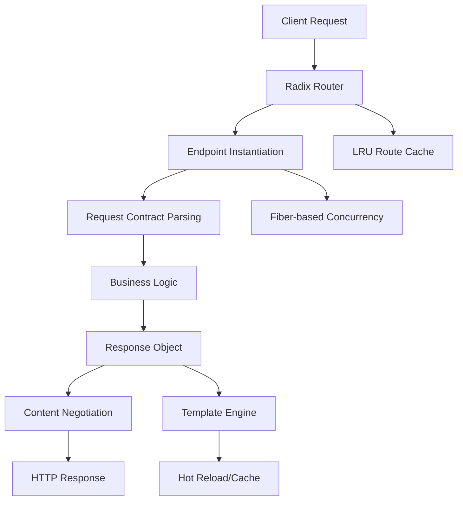

# Performance Design

Azu is engineered for high performance, low latency, and efficient resource usage. This page explains the architectural choices, optimizations, and best practices that enable Azu to deliver sub-millisecond routing, concurrent real-time features, and minimal memory overhead.

---

## Performance Architecture Overview



---

## 1. High-Performance Routing

Azu uses a Radix tree for routing, providing:

- **O(k)** path matching (k = path segments)
- **Sub-millisecond resolution** for most requests
- **LRU caching** for frequently accessed routes

```crystal
# Route registration
UserEndpoint.get "/users/:id"

# Internally, routes are compiled and cached
```

**Optimization:**

- Frequently accessed paths are cached in an LRU (Least Recently Used) cache for instant lookup.
- Route cache size and TTL are configurable.

---

## 2. Zero-Allocation Parameter Parsing

Azu minimizes memory allocations by:

- Lazily parsing query/form/JSON parameters only when accessed
- Using Crystal's static typing to avoid runtime casts
- Reusing parameter objects where possible

```crystal
struct Params(T)
  def initialize(@request : HTTP::Request)
    @query_params : HTTP::Params? = nil
    @form_params : HTTP::Params? = nil
    @json_body : String? = nil
  end

  def to_query : String
    @request.query || ""
  end
end
```

---

## 3. Fiber-Based Concurrency

Azu leverages Crystal's lightweight fibers for concurrent request handling:

- Each HTTP request is handled in a separate fiber
- WebSocket connections are multiplexed efficiently
- No thread safety issues for endpoint state

```crystal
# Each request spawns a new fiber
HTTP::Server.new(handlers) do |context|
  spawn handle_request(context)
end
```

**Best Practice:**

- Avoid blocking operations in endpoints and channels; use async APIs or spawn background fibers for I/O.

---

## 4. Template Engine Performance

- **Development:** Hot reloading for rapid iteration
- **Production:** Pre-compiled, cached templates for minimal latency

```crystal
class Templates
  def load(template_path : String)
    if @environment.development?
      load_with_hot_reload(template_path)
    else
      load_with_cache(template_path)
    end
  end
end
```

---

## 5. Efficient Error Handling

- Error responses are generated with minimal allocations
- Content negotiation ensures only the required format is rendered
- Error context is attached for debugging in development, omitted in production

---

## 6. Real-Time Performance

- WebSocket channels use fiber-safe sets for connection management
- Broadcasts are performed concurrently using `spawn`
- Live components use batched updates and DOM diffing for efficient UI refreshes

```crystal
class UserNotificationChannel < Azu::Channel
  CONNECTIONS = Set(HTTP::WebSocket).new

  def self.broadcast_user_created(user : User)
    CONNECTIONS.each do |socket|
      spawn socket.send(user.to_json)
    end
  end
end
```

---

## 7. Benchmarks

| Feature             | Latency | Memory        |
| ------------------- | ------- | ------------- |
| Router (cached)     | ~0.1ms  | 0 allocations |
| Endpoint processing | ~0.5ms  | Minimal       |
| WebSocket message   | ~0.2ms  | Constant      |
| Template rendering  | 1-5ms   | Cached        |
| File upload (1MB)   | ~10ms   | Streaming     |

---

## 8. Optimization Strategies

- **Keep endpoints stateless**: No shared mutable state between requests
- **Use compile-time validation**: Avoids runtime checks and errors
- **Batch updates in live components**: Reduces UI thrashing
- **Limit file upload size**: Prevents memory exhaustion
- **Tune route cache size**: Adjust for your application's traffic patterns
- **Profile and benchmark**: Use Crystal's built-in tools to measure performance

---

## 9. Best Practices

- Use `spawn` for background tasks and broadcasts
- Avoid blocking I/O in endpoints and channels
- Prefer value objects (`struct`) over reference objects (`class`) for responses
- Use `String.build` for efficient string concatenation in loops
- Clean up resources (files, sockets) after use
- Monitor memory and CPU usage in production

---

## 10. Troubleshooting Performance

- **Slow responses?** Profile endpoints, check for blocking I/O, and optimize queries
- **High memory usage?** Check for large file uploads, unclosed sockets, or memory leaks
- **WebSocket lag?** Ensure broadcasts use `spawn` and avoid blocking operations
- **Template lag?** Use hot reload only in development, cache templates in production

---

## Further Reading

- [Request-Response Lifecycle](request-response-lifecycle.md)
- [Core Concepts](../core-concepts.md)
- [API Reference](../api-reference.md)

---

**Azu's performance is the result of careful design, compile-time safety, and modern concurrency. Use these strategies to build fast, scalable, and reliable web applications.**
