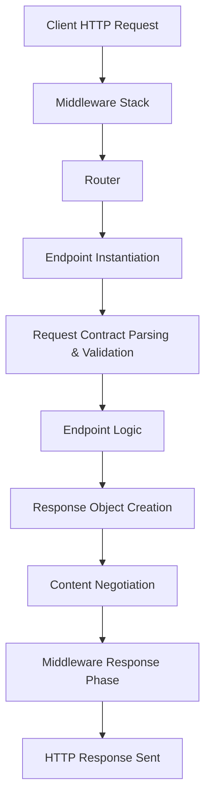

# Request-Response Lifecycle

Understanding the request-response lifecycle in Azu is essential for building robust, high-performance web applications. This guide walks through each stage, from the initial HTTP request to the final response sent to the client, highlighting type safety, middleware, endpoint execution, and error handling.

---

## Overview Diagram



---

## 1. Client HTTP Request

A client (browser, API consumer, etc.) sends an HTTP request to the Azu server. This request may include:

- Path and query parameters
- Headers (Accept, Content-Type, etc.)
- Cookies
- Body (JSON, form data, multipart, etc.)

---

## 2. Middleware Stack

The request enters the middleware stack, which can include:

- **Request ID tracking** (`Azu::Handler::RequestId`)
- **Error handling** (`Azu::Handler::Rescuer`)
- **Logging** (`Azu::Handler::Logger`)
- **CORS, CSRF, Throttle, Static, Custom handlers**

Each middleware can inspect, modify, or short-circuit the request/response.

```crystal
MyApp.start [
  Azu::Handler::RequestId.new,
  Azu::Handler::Rescuer.new,
  Azu::Handler::Logger.new,
  # ...
]
```

---

## 3. Router

Azu uses a high-performance Radix tree router to match the request path and HTTP method to a registered endpoint.

- **Path parameters** are extracted and made available to the endpoint.
- **Route caching** ensures sub-millisecond resolution for frequent paths.

```crystal
# Example route registration
UserEndpoint.get "/users/:id"
```

---

## 4. Endpoint Instantiation

A new instance of the endpoint struct/class is created for each request. This ensures:

- No shared state between requests
- Thread/fiber safety
- Clean, isolated logic

```crystal
struct UserEndpoint
  include Azu::Endpoint(UserRequest, UserResponse)
  get "/users/:id"
  def call : UserResponse
    # ...
  end
end
```

---

## 5. Request Contract Parsing & Validation

Azu automatically parses incoming data into the request contract type:

- **Path/query/form/JSON** data is mapped to contract fields
- **Validation** is performed at compile-time and runtime
- **Errors** are aggregated for structured reporting

```crystal
struct UserRequest
  include Azu::Request
  getter id : Int64
  validate id, presence: true
end

# In endpoint
def call : UserResponse
  unless user_request.valid?
    raise Azu::Response::ValidationError.new(user_request.errors.group_by(&.field))
  end
  # ...
end
```

---

## 6. Endpoint Logic

The endpoint's `call` method executes business logic, using only validated, type-safe data from the request contract. This is where you:

- Query databases
- Perform computations
- Call services
- Build response objects

```crystal
def call : UserResponse
  user = User.find(user_request.id)
  UserResponse.new(user)
end
```

---

## 7. Response Object Creation

The endpoint returns a response object (struct/class including `Azu::Response`). This object:

- Encapsulates all response data
- Implements a `render` method for output
- Supports multiple formats (JSON, HTML, XML, etc.)

```crystal
struct UserResponse
  include Azu::Response
  def initialize(@user : User); end
  def render
    {id: @user.id, name: @user.name}.to_json
  end
end
```

---

## 8. Content Negotiation

Azu automatically selects the response format based on the `Accept` header:

- `application/json` → JSON
- `text/html` → HTML (via templates)
- `application/xml` → XML
- `text/plain` → Plain text

You can override or extend this in your response object.

---

## 9. Middleware (Response Phase)

After the response is generated, it passes back through the middleware stack. Middleware can:

- Log the response
- Set additional headers
- Transform or compress the response

---

## 10. HTTP Response Sent

The final response is sent to the client, including:

- Status code
- Headers
- Body (JSON, HTML, etc.)

---

## Error Handling

Azu provides robust error handling at every stage:

- **Validation errors** return structured error responses
- **Unhandled exceptions** are caught by `Azu::Handler::Rescuer`
- **Custom error types** (authentication, authorization, rate limiting, etc.)

```crystal
raise Azu::Response::ValidationError.new({"email" => ["is invalid"]})
raise Azu::Response::AuthenticationError.new("Login required")
raise Azu::Response::NotFound.new("/users/999")
```

---

## Best Practices

- Always use request/response contracts for type safety
- Validate all input before processing
- Use middleware for cross-cutting concerns
- Return structured error responses
- Keep endpoint logic focused and stateless

---

## Further Reading

- [Core Concepts](../core-concepts.md)
- [API Reference](../api-reference.md)
- [Middleware](../middleware.md)

---

**Azu's request-response lifecycle is designed for clarity, safety, and performance. Mastering it is key to building reliable, maintainable web applications.**
