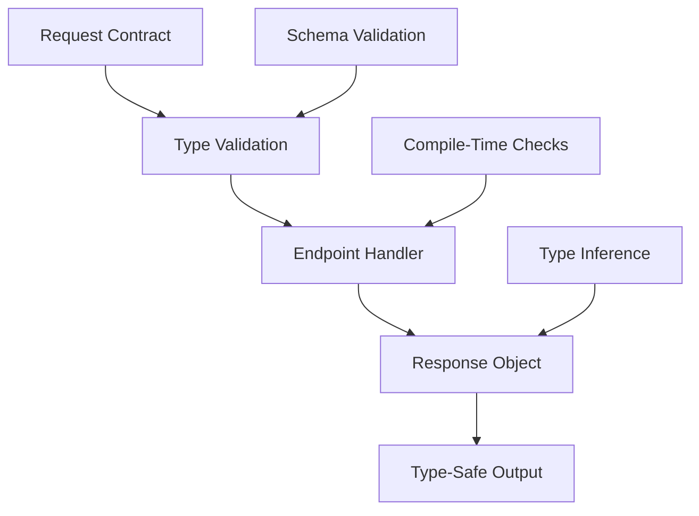

# Type Safety in Azu

Azu's type safety system is built on Crystal's powerful static type system, providing compile-time guarantees that eliminate entire classes of runtime errors. This document explores how Azu leverages type safety throughout the framework.

## Overview



## Request Contracts

### Type-Safe Parameter Extraction

```crystal
struct UserRequest
  include Request

  getter id : Int32
  getter name : String
  getter email : String
  getter age : Int32?

  def initialize(@id, @name, @email, @age = nil)
  end

  # Compile-time validation
  def self.from_params(params : Params) : self
    new(
      id: params.get_int("id"),
      name: params.get_string("name"),
      email: params.get_string("email"),
      age: params.get_int?("age")
    )
  end
end
```

### Schema Validation

```crystal
struct CreateUserRequest
  include Request

  getter name : String
  getter email : String
  getter age : Int32

  # Schema-based validation
  def self.schema
    Schema.new(
      name: String,
      email: String,
      age: Int32
    )
  end

  def self.from_params(params : Params) : self
    validated = schema.validate(params.to_h)

    new(
      name: validated["name"].as(String),
      email: validated["email"].as(String),
      age: validated["age"].as(Int32)
    )
  end
end
```

## Endpoint Type Safety

### Compile-Time Route Registration

```crystal
struct UserEndpoint
  include Endpoint(UserRequest, UserResponse)

  # Compile-time route definition
  get "/users/:id"

  def call : UserResponse
    # Type-safe access to request data
    user_id = request.id
    user_name = request.name

    # Compile-time guarantee that response matches contract
    UserResponse.new(user: find_user(user_id))
  end
end
```

### Generic Endpoints

```crystal
struct ApiEndpoint(T, U)
  include Endpoint(T, U)

  get "/api/:resource"

  def call : U
    # Type-safe generic handling
    result = process_request(request)
    U.new(result)
  end
end
```

## Response Type Safety

### Structured Responses

```crystal
struct UserResponse
  include Response

  getter user : User
  getter status : Int32

  def initialize(@user, @status = 200)
  end

  def render : String
    # Type-safe JSON serialization
    {
      id: user.id,
      name: user.name,
      email: user.email
    }.to_json
  end
end
```

### Error Response Types

```crystal
struct ErrorResponse
  include Response

  getter error : String
  getter code : Int32
  getter details : Hash(String, String)?

  def initialize(@error, @code = 400, @details = nil)
  end

  def render : String
    {
      error: error,
      code: code,
      details: details
    }.to_json
  end
end
```

## WebSocket Type Safety

### Typed Channel Messages

```crystal
class ChatChannel < Azu::Channel
  ws "/ws/chat/:room_id"

  # Type-safe message handling
  def on_message(message : String)
    parsed = JSON.parse(message)

    case parsed["type"].as(String)
    when "message"
      handle_message(parsed["content"].as(String))
    when "join"
      handle_join(parsed["user"].as(String))
    else
      # Compile-time exhaustive checking
      raise "Unknown message type"
    end
  end

  private def handle_message(content : String)
    broadcast({
      type: "message",
      content: content,
      timestamp: Time.utc.to_unix
    }.to_json)
  end

  private def handle_join(user : String)
    broadcast({
      type: "join",
      user: user
    }.to_json)
  end
end
```

## Component Type Safety

### Typed Component Props

```crystal
class UserCard < Azu::Component
  getter user : User
  getter show_email : Bool

  def initialize(@user, @show_email = false)
  end

  def content
    div class: "user-card" do
      h3 user.name
      p "ID: #{user.id}"

      if show_email
        p "Email: #{user.email}"
      end
    end
  end

  def on_event(event : String, data : Hash(String, JSON::Any))
    case event
    when "toggle_email"
      @show_email = !@show_email
      update_content
    when "edit"
      # Type-safe event handling
      handle_edit(data["field"].as(String), data["value"].as(String))
    end
  end
end
```

## Compile-Time Optimizations

### Method Resolution

```crystal
# Compile-time method resolution
def process_user(user : User) : String
  user.name
end

def process_user(user : AdminUser) : String
  "Admin: #{user.name}"
end

# Crystal resolves the correct method at compile time
```

### Type Inference

```crystal
# Crystal infers types automatically
users = [] of User  # Explicit type annotation
users << User.new("John", "john@example.com")

# Type inference in blocks
users.map(&.name)  # Returns Array(String)
users.select(&.active?)  # Returns Array(User)
```

## Benefits of Type Safety

### 1. Compile-Time Error Detection

```crystal
# This won't compile - type mismatch
def get_user_name(user : User) : String
  user.id  # Error: Int32 cannot be assigned to String
end
```

### 2. Refactoring Safety

```crystal
# Renaming a field is safe - compiler catches all usages
struct User
  getter full_name : String  # Renamed from 'name'
end

# Compiler will show all places that need updating
```

### 3. API Contract Enforcement

```crystal
# Endpoint contract is enforced at compile time
struct UserEndpoint
  include Endpoint(UserRequest, UserResponse)

  def call : UserResponse
    # Must return UserResponse, not any other type
    UserResponse.new(user: find_user(request.id))
  end
end
```

## Best Practices

### 1. Use Explicit Types for Public APIs

```crystal
# Good: Explicit return type
def find_user(id : Int32) : User?
  # Implementation
end

# Avoid: Implicit return type for public methods
def find_user(id)
  # Implementation
end
```

### 2. Leverage Union Types

```crystal
# Union types for flexible but type-safe APIs
def process_result(result : User | Error) : String
  case result
  when User
    "User: #{result.name}"
  when Error
    "Error: #{result.message}"
  end
end
```

### 3. Use Type Guards

```crystal
def handle_data(data : JSON::Any) : String
  case data
  when String
    data
  when Int32
    data.to_s
  when Array
    data.join(", ")
  else
    raise "Unsupported data type"
  end
end
```

### 4. Prefer Structs Over Classes

```crystal
# Good: Immutable value objects
struct Point
  getter x : Float64
  getter y : Float64

  def initialize(@x, @y)
  end
end

# Use classes only when you need inheritance or mutable state
```

## Type Safety in Testing

### Type-Safe Test Helpers

```crystal
# Type-safe test data creation
def create_test_user(name : String = "Test User") : User
  User.new(
    id: Random.new.rand(1000),
    name: name,
    email: "#{name.downcase.gsub(/\s+/, ".")}@example.com"
  )
end

# Type-safe assertions
def assert_user_response(response : UserResponse, expected_user : User)
  assert response.user.id == expected_user.id
  assert response.user.name == expected_user.name
end
```

## Performance Impact

Type safety in Azu has minimal runtime overhead:

- **Compile-time checks**: No runtime cost
- **Type annotations**: Optimized away by compiler
- **Method resolution**: Resolved at compile time
- **Memory safety**: No garbage collection overhead

## Next Steps

- [Request Contracts](core-concepts/requests.md) - Learn about type-safe request handling
- [Response Objects](core-concepts/responses.md) - Explore structured response patterns
- [Endpoints](core-concepts/endpoints.md) - Master endpoint type safety
- [Testing](testing.md) - Write type-safe tests
