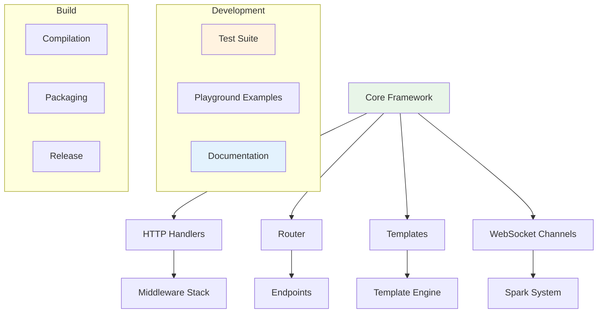

# Contributing

Thank you for your interest in contributing to Azu! This guide will help you get started with development, understand our code standards, and contribute effectively.

## Overview

Contributing to Azu involves:

- **Setting up** the development environment
- **Understanding** the codebase architecture
- **Following** coding standards and conventions
- **Writing** tests for new features
- **Submitting** pull requests and reviews

## Development Setup

### Prerequisites

- **Crystal Language** (1.2.x or later)
- **Git** for version control
- **PostgreSQL** for database testing
- **Redis** for session and cache testing

### Quick Setup

1. **Clone the Repository**

   ```bash
   git clone https://github.com/your-org/azu.git
   cd azu
   ```

2. **Install Dependencies**

   ```bash
   shards install
   ```

3. **Setup Database**

   ```bash
   # Create test database
   createdb azu_test
   createdb azu_dev
   ```

4. **Run Tests**

   ```bash
   crystal spec
   ```

5. **Start Development Server**
   ```bash
   crystal run playground/example_app.cr
   ```

[Learn more about Development Setup →](contributing/setup.md)

## Project Architecture



## Key Components

### 1. **Core Framework** (`src/azu/`)

- Main framework modules and classes
- HTTP request/response handling
- Routing and middleware system
- Configuration management

### 2. **Handlers** (`src/azu/handler/`)

- HTTP middleware handlers
- Authentication and authorization
- Logging and error handling
- Static file serving

### 3. **Templates** (`src/azu/templates/`)

- Template engine integration
- Markup DSL implementation
- Hot reloading system
- Error page templates

### 4. **Playground** (`playground/`)

- Example applications
- Endpoint demonstrations
- WebSocket examples
- Template examples

## Code Standards

### 1. **Crystal Language Standards**

#### Naming Conventions

```crystal
# Use PascalCase for types
class UserEndpoint
  include Endpoint(UserRequest, UserResponse)
end

# Use snake_case for methods and variables
def handle_user_request
  user_id = params["id"]
  user = find_user(user_id)
end

# Use UPPER_CASE for constants
MAX_FILE_SIZE = 10.megabytes
DEFAULT_TIMEOUT = 30.seconds
```

#### Type Safety

```crystal
# Always use explicit types for public APIs
def process_user(user : User) : UserResponse
  # Implementation
end

# Use union types for optional values
def find_user(id : String?) : User?
  return nil unless id
  User.find(id)
end
```

#### Error Handling

```crystal
# Use custom exception classes
class UserNotFoundError < Azu::Error
  def initialize(@user_id : String)
    super("User not found: #{@user_id}")
  end
end

# Handle errors gracefully
def find_user(id : String) : User
  user = User.find(id)
  raise UserNotFoundError.new(id) unless user
  user
end
```

### 2. **Framework-Specific Standards**

#### Endpoint Structure

```crystal
struct UserEndpoint
  include Endpoint(UserRequest, UserResponse)

  # Define routes with HTTP methods
  get "/users/:id"
  post "/users"
  put "/users/:id"
  delete "/users/:id"

  # Main endpoint logic
  def call : UserResponse
    case request.method
    when "GET"
      handle_get
    when "POST"
      handle_post
    when "PUT"
      handle_put
    when "DELETE"
      handle_delete
    else
      raise Azu::Error::MethodNotAllowed.new(request.method)
    end
  end

  private def handle_get : UserResponse
    user = find_user(params["id"])
    UserResponse.new(user)
  end

  private def handle_post : UserResponse
    user = create_user(request.data)
    UserResponse.new(user, status: 201)
  end
end
```

#### Request Contracts

```crystal
struct UserRequest
  include Request

  # Define required fields with types
  getter name : String
  getter email : String
  getter age : Int32?

  # Add validation rules
  validates :name, presence: true, length: {min: 2, max: 100}
  validates :email, presence: true, format: /\A[^@\s]+@[^@\s]+\z/
  validates :age, numericality: {greater_than: 0, less_than: 150}

  # Custom validation methods
  def validate
    super
    validate_email_uniqueness if email
  end

  private def validate_email_uniqueness
    if User.exists?(email: email)
      errors.add(:email, "is already taken")
    end
  end
end
```

#### Response Objects

```crystal
struct UserResponse
  include Response

  def initialize(@user : User, @status : Int32 = 200)
  end

  def render
    {
      id: @user.id,
      name: @user.name,
      email: @user.email,
      created_at: @user.created_at
    }.to_json
  end

  def status_code : Int32
    @status
  end

  def content_type : String
    "application/json"
  end
end
```

[Learn more about Code Standards →](contributing/standards.md)

## Development Workflow

### 1. **Feature Development**

#### Create Feature Branch

```bash
# Create feature branch
git checkout -b feature/user-authentication

# Make changes and commit
git add .
git commit -m "Add user authentication endpoints"
```

#### Write Tests

```crystal
# spec/endpoints/user_endpoint_spec.cr
describe UserEndpoint do
  it "authenticates valid user" do
    request = Azu::Test::Request.new(
      method: "POST",
      path: "/auth/login",
      data: {
        "email" => "user@example.com",
        "password" => "password123"
      }
    )

    endpoint = UserEndpoint.new
    response = endpoint.call(request)

    response.status_code.should eq(200)
    response.body.should contain("token")
  end
end
```

#### Update Documentation

```markdown
# docs/core-concepts/authentication.md

# Add documentation for new authentication features
```

### 2. **Pull Request Process**

#### Create Pull Request

1. **Fork** the repository
2. **Create** feature branch
3. **Make** changes with tests
4. **Update** documentation
5. **Submit** pull request

#### Pull Request Template

```markdown
## Description

Brief description of changes

## Type of Change

- [ ] Bug fix
- [ ] New feature
- [ ] Breaking change
- [ ] Documentation update

## Testing

- [ ] Unit tests added/updated
- [ ] Integration tests added/updated
- [ ] All tests pass

## Documentation

- [ ] Documentation updated
- [ ] Examples added/updated

## Checklist

- [ ] Code follows style guidelines
- [ ] Self-review completed
- [ ] Comments added for complex code
- [ ] Documentation updated
```

### 3. **Code Review Process**

#### Review Checklist

- [ ] Code follows Crystal conventions
- [ ] Type safety maintained
- [ ] Error handling appropriate
- [ ] Tests cover new functionality
- [ ] Documentation updated
- [ ] Performance considered
- [ ] Security implications reviewed

#### Review Comments

```crystal
# Good: Specific, actionable feedback
# Consider using a more specific type here
def process_data(data : String) : String
  # Implementation
end

# Better:
def process_data(data : UserData) : ProcessedData
  # Implementation
end
```

## Testing Guidelines

### 1. **Test Organization**

#### Directory Structure

```
spec/
├── azu/                    # Framework tests
│   ├── endpoint_spec.cr
│   ├── request_spec.cr
│   └── response_spec.cr
├── playground/             # Example app tests
│   ├── endpoints/
│   └── channels/
└── support/               # Test helpers
    ├── factories.cr
    └── helpers.cr
```

#### Test Naming

```crystal
# Use descriptive test names
describe UserEndpoint do
  it "returns 404 for non-existent user" do
    # Test implementation
  end

  it "validates required fields" do
    # Test implementation
  end

  context "with admin privileges" do
    it "allows user deletion" do
      # Test implementation
    end
  end
end
```

### 2. **Test Coverage**

#### Required Coverage

- **Unit tests** for all public APIs
- **Integration tests** for endpoint flows
- **WebSocket tests** for real-time features
- **Error handling** tests for edge cases

#### Coverage Goals

- **Line coverage**: 90%+
- **Branch coverage**: 85%+
- **Function coverage**: 95%+

### 3. **Test Data Management**

#### Factories

```crystal
# spec/support/factories.cr
class UserFactory
  def self.create(attributes = {} of String => String)
    User.new(
      name: attributes["name"]? || "Test User",
      email: attributes["email"]? || "test@example.com",
      password: attributes["password"]? || "password123"
    )
  end

  def self.create_admin
    create({"role" => "admin"})
  end
end
```

#### Test Helpers

```crystal
# spec/support/helpers.cr
module TestHelpers
  def create_test_request(method : String, path : String, data = {} of String => String)
    Azu::Test::Request.new(
      method: method,
      path: path,
      data: data
    )
  end

  def create_test_user
    UserFactory.create
  end
end
```

## Documentation Standards

### 1. **Documentation Structure**

#### File Organization

```
docs/
├── README.md              # Project overview
├── getting-started.md     # Quick start guide
├── core-concepts/         # Core concepts
├── advanced/              # Advanced features
├── api-reference/         # API documentation
└── contributing/          # Contributing guides
```

#### Content Standards

- **Clear headings** with logical hierarchy
- **Code examples** for all features
- **Mermaid diagrams** for complex concepts
- **Cross-references** between related topics

### 2. **Code Examples**

#### Crystal Code Blocks

```crystal
# Always use syntax highlighting
struct UserEndpoint
  include Endpoint(UserRequest, UserResponse)

  get "/users/:id"

  def call : UserResponse
    user = find_user(params["id"])
    UserResponse.new(user)
  end
end
```

#### Interactive Examples

```crystal
# Include playground examples
# See playground/endpoints/user_endpoint.cr for complete example
```

## Release Process

### 1. **Version Management**

#### Semantic Versioning

- **Major** (X.0.0): Breaking changes
- **Minor** (0.X.0): New features, backward compatible
- **Patch** (0.0.X): Bug fixes, backward compatible

#### Release Checklist

- [ ] All tests pass
- [ ] Documentation updated
- [ ] Changelog updated
- [ ] Version bumped
- [ ] Release notes written

### 2. **Release Steps**

#### Prepare Release

```bash
# Update version
crystal run scripts/bump_version.cr

# Run full test suite
crystal spec

# Update changelog
crystal run scripts/update_changelog.cr
```

#### Create Release

```bash
# Create git tag
git tag v0.5.0

# Push tag
git push origin v0.5.0

# Create GitHub release
gh release create v0.5.0 --notes-file CHANGELOG.md
```

## Community Guidelines

### 1. **Communication**

#### Code of Conduct

- **Be respectful** and inclusive
- **Provide constructive** feedback
- **Help others** learn and grow
- **Follow project** guidelines

#### Communication Channels

- **GitHub Issues**: Bug reports and feature requests
- **GitHub Discussions**: Questions and general discussion
- **Discord**: Real-time chat and support

### 2. **Getting Help**

#### Before Asking

- **Search** existing issues and discussions
- **Read** documentation thoroughly
- **Try** to reproduce the issue
- **Prepare** minimal reproduction case

#### Asking Questions

```markdown
## Issue Description

Clear description of the problem

## Expected Behavior

What you expected to happen

## Actual Behavior

What actually happened

## Steps to Reproduce

1. Step one
2. Step two
3. Step three

## Environment

- Crystal version: 1.2.0
- Azu version: 0.5.0
- OS: macOS 12.0

## Additional Context

Any other relevant information
```

## Next Steps

- [Development Setup](contributing/setup.md) - Set up your development environment
- [Code Standards](contributing/standards.md) - Learn coding conventions
- [Roadmap](contributing/roadmap.md) - See upcoming features

## Examples

Check out the [playground examples](../playground/) for complete working examples of:

- Endpoint implementations
- WebSocket channels
- Template usage
- Testing patterns

---

**Ready to contribute?** Start with [Development Setup](contributing/setup.md) to get your environment ready, then explore [Code Standards](contributing/standards.md) to understand our conventions.
