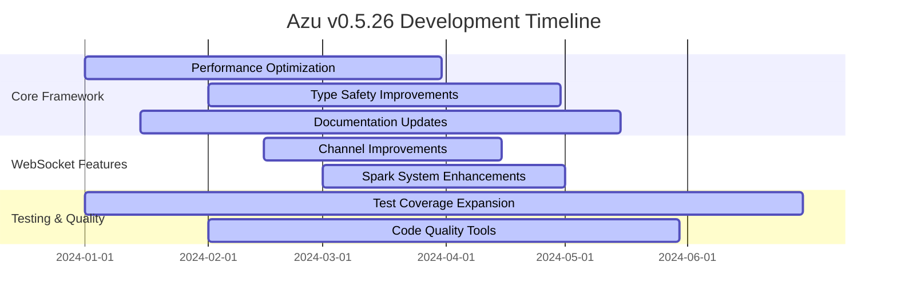
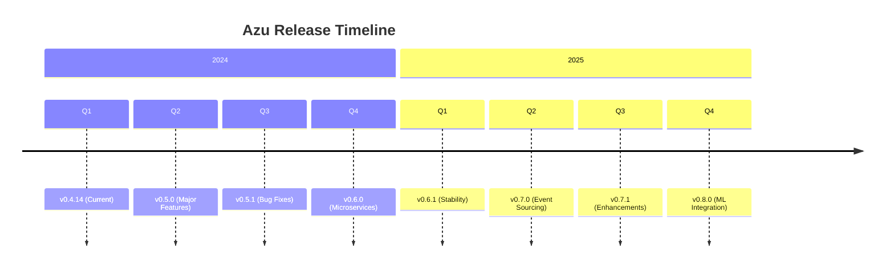

# Development Roadmap

Comprehensive roadmap for the Azu web framework development, including current priorities, future plans, and contribution opportunities.

## Overview

This roadmap outlines the development priorities, planned features, and milestones for the Azu web framework. It serves as a guide for contributors and users to understand the direction of the project.

## Current Version: v0.5.26

### Current Focus Areas



### Immediate Priorities

#### 1. Performance Optimization

```crystal
# Performance improvement targets
PERFORMANCE_TARGETS = {
  "request_throughput": "50,000+ requests/sec",
  "memory_usage": "< 10MB baseline",
  "startup_time": "< 100ms",
  "response_time": "< 2ms p95"
}

# Current focus areas
PERFORMANCE_AREAS = [
  "Handler chain optimization",
  "Memory allocation reduction",
  "Template rendering speed",
  "WebSocket connection efficiency"
]
```

#### 2. Type Safety Enhancements

```crystal
# Type safety improvements
TYPE_SAFETY_GOALS = [
  "Stricter compile-time checks",
  "Better error messages",
  "Enhanced IDE support",
  "Runtime type validation"
]

# Implementation plan
TYPE_SAFETY_PLAN = {
  "phase_1": "Enhanced endpoint type checking",
  "phase_2": "Request/response validation",
  "phase_3": "Handler type safety",
  "phase_4": "Template type checking"
}
```

#### 3. Documentation Completeness

```crystal
# Documentation goals
DOCUMENTATION_GOALS = {
  "api_coverage": "100%",
  "examples": "50+ working examples",
  "guides": "Comprehensive guides for all features",
  "tutorials": "Step-by-step tutorials"
}
```

## Upcoming Version: v0.5.0

### Major Features

#### 1. Enhanced Middleware System

```crystal
# New middleware capabilities
class EnhancedMiddleware
  include Handler

  # New: Conditional middleware execution
  def should_process?(request : HttpRequest) : Bool
    request.path.starts_with?("/api/")
  end

  # New: Middleware composition
  def compose(other : Handler) : Handler
    CompositeHandler.new(self, other)
  end

  # New: Middleware metrics
  def metrics : MiddlewareMetrics
    @metrics
  end
end
```

#### 2. Advanced Caching System

```crystal
# Multi-level caching
class AdvancedCache
  include Handler

  def initialize(
    @memory_cache : MemoryCache,
    @redis_cache : RedisCache,
    @database_cache : DatabaseCache
  )
  end

  def call(request : HttpRequest, response : Response) : Response
    # L1: Memory cache
    if cached = @memory_cache.get(cache_key(request))
      return cached
    end

    # L2: Redis cache
    if cached = @redis_cache.get(cache_key(request))
      @memory_cache.set(cache_key(request), cached)
      return cached
    end

    # L3: Database cache
    if cached = @database_cache.get(cache_key(request))
      @redis_cache.set(cache_key(request), cached)
      @memory_cache.set(cache_key(request), cached)
      return cached
    end

    # Generate fresh response
    result = @next.call(request, response)

    # Cache at all levels
    cache_response(request, result)

    result
  end
end
```

#### 3. GraphQL Support

```crystal
# GraphQL integration
class GraphQLEndpoint
  include Endpoint(GraphQLRequest, GraphQLResponse)

  post "/graphql"

  def call : GraphQLResponse
    query = @request.body["query"].as_s
    variables = @request.body["variables"]?

    result = GraphQL::Schema.execute(
      query: query,
      variables: variables,
      context: build_context
    )

    GraphQLResponse.new(result)
  end

  private def build_context : GraphQL::Context
    GraphQL::Context.new(
      current_user: @request.current_user,
      database: database_connection
    )
  end
end
```

### Breaking Changes

```crystal
# Planned breaking changes for v0.5.0
BREAKING_CHANGES_V050 = [
  {
    "component": "Handler Interface",
    "change": "Require explicit Handler include",
    "migration": "Add 'include Azu::Handler' to all handlers",
    "impact": "Medium"
  },
  {
    "component": "Endpoint Pattern",
    "change": "Require explicit return types",
    "migration": "Add return type annotations to call methods",
    "impact": "Low"
  },
  {
    "component": "Configuration",
    "change": "Use Azu::Configuration class",
    "migration": "Update configuration initialization",
    "impact": "Low"
  }
]
```

## Future Versions

### v0.6.0 - Microservices Support

```crystal
# Service discovery and communication
class ServiceRegistry
  def register_service(name : String, address : String, port : Int32)
    # Service registration logic
  end

  def discover_service(name : String) : Array(ServiceInstance)
    # Service discovery logic
  end
end

class ServiceClient
  def initialize(@registry : ServiceRegistry)
  end

  def call_service(service_name : String, request : ServiceRequest) : ServiceResponse
    instances = @registry.discover_service(service_name)
    instance = load_balancer.select(instances)

    # Make service call
    make_request(instance, request)
  end
end
```

### v0.7.0 - Event Sourcing

```crystal
# Event sourcing support
class EventStore
  def append_events(stream_id : String, events : Array(Event))
    # Append events to stream
  end

  def read_events(stream_id : String, from_version : Int64 = 0) : Array(Event)
    # Read events from stream
  end
end

class EventSourcedAggregate
  abstract def apply(event : Event)

  def load(stream_id : String)
    events = event_store.read_events(stream_id)
    events.each { |event| apply(event) }
  end

  def save
    event_store.append_events(stream_id, uncommitted_events)
  end
end
```

### v0.8.0 - Machine Learning Integration

```crystal
# ML model serving
class MLModelEndpoint
  include Endpoint(MLRequest, MLResponse)

  post "/predict"

  def call : MLResponse
    input_data = @request.body["data"]

    prediction = ml_model.predict(input_data)
    confidence = ml_model.confidence(input_data)

    MLResponse.new(
      prediction: prediction,
      confidence: confidence,
      model_version: ml_model.version
    )
  end
end
```

## Contribution Opportunities

### High Priority Areas

```crystal
# High priority contribution areas
HIGH_PRIORITY_AREAS = [
  {
    "area": "Performance Optimization",
    "description": "Improve request throughput and reduce memory usage",
    "difficulty": "Medium",
    "estimated_time": "2-4 weeks",
    "mentor": "Available"
  },
  {
    "area": "Test Coverage",
    "description": "Increase test coverage to 95%+",
    "difficulty": "Low",
    "estimated_time": "1-2 weeks",
    "mentor": "Available"
  },
  {
    "area": "Documentation",
    "description": "Complete API documentation and examples",
    "difficulty": "Low",
    "estimated_time": "1-3 weeks",
    "mentor": "Available"
  },
  {
    "area": "WebSocket Features",
    "description": "Enhance real-time capabilities",
    "difficulty": "Medium",
    "estimated_time": "2-3 weeks",
    "mentor": "Available"
  }
]
```

### Good First Issues

```crystal
# Good first issues for new contributors
GOOD_FIRST_ISSUES = [
  {
    "title": "Add missing API documentation",
    "description": "Document public methods and classes",
    "labels": ["documentation", "good first issue"],
    "estimated_time": "2-4 hours"
  },
  {
    "title": "Add unit tests for utility functions",
    "description": "Write tests for helper methods",
    "labels": ["testing", "good first issue"],
    "estimated_time": "4-6 hours"
  },
  {
    "title": "Improve error messages",
    "description": "Make error messages more user-friendly",
    "labels": ["usability", "good first issue"],
    "estimated_time": "3-5 hours"
  },
  {
    "title": "Add code examples",
    "description": "Create working examples for common use cases",
    "labels": ["documentation", "good first issue"],
    "estimated_time": "6-8 hours"
  }
]
```

### Advanced Projects

```crystal
# Advanced projects for experienced contributors
ADVANCED_PROJECTS = [
  {
    "title": "Implement GraphQL support",
    "description": "Add GraphQL endpoint and schema generation",
    "difficulty": "High",
    "estimated_time": "4-6 weeks",
    "mentor": "Available"
  },
  {
    "title": "Build caching system",
    "description": "Implement multi-level caching with invalidation",
    "difficulty": "High",
    "estimated_time": "3-5 weeks",
    "mentor": "Available"
  },
  {
    "title": "Add service mesh integration",
    "description": "Integrate with Istio/Linkerd for microservices",
    "difficulty": "High",
    "estimated_time": "5-8 weeks",
    "mentor": "Available"
  }
]
```

## Release Schedule

### Release Timeline



### Release Strategy

```crystal
# Release strategy
RELEASE_STRATEGY = {
  "major_versions": {
    "frequency": "Every 6 months",
    "breaking_changes": "Allowed",
    "migration_guide": "Required"
  },
  "minor_versions": {
    "frequency": "Every 2 months",
    "breaking_changes": "Minimal",
    "migration_guide": "Optional"
  },
  "patch_versions": {
    "frequency": "As needed",
    "breaking_changes": "None",
    "migration_guide": "None"
  }
}
```

## Community Goals

### Community Growth

```crystal
# Community growth targets
COMMUNITY_GOALS = {
  "contributors": {
    "current": 15,
    "target_2024": 50,
    "target_2025": 100
  },
  "users": {
    "current": 500,
    "target_2024": 2000,
    "target_2025": 5000
  },
  "projects": {
    "current": 25,
    "target_2024": 100,
    "target_2025": 250
  }
}
```

### Community Initiatives

```crystal
# Community initiatives
COMMUNITY_INITIATIVES = [
  {
    "name": "Azu Hackathon",
    "description": "Quarterly hackathon for new features",
    "frequency": "Quarterly",
    "next_event": "2024-04-15"
  },
  {
    "name": "Contributor Mentorship",
    "description": "Pair new contributors with experienced developers",
    "frequency": "Ongoing",
    "status": "Active"
  },
  {
    "name": "Documentation Sprint",
    "description": "Focused documentation improvement sessions",
    "frequency": "Monthly",
    "next_event": "2024-03-01"
  },
  {
    "name": "Performance Challenge",
    "description": "Competition to improve framework performance",
    "frequency": "Bi-annually",
    "next_event": "2024-06-01"
  }
]
```

## Technology Stack Evolution

### Current Stack

```crystal
# Current technology stack
CURRENT_STACK = {
  "language": "Crystal 1.16.0+",
  "database": "PostgreSQL, MySQL, SQLite",
  "cache": "Redis, Memory",
  "templates": "Crinja (Jinja2)",
  "testing": "Crystal Spec",
  "documentation": "MkDocs"
}
```

### Future Stack Additions

```crystal
# Planned technology additions
FUTURE_STACK = {
  "graphql": "GraphQL Crystal",
  "event_store": "EventStoreDB",
  "ml": "ONNX Runtime",
  "monitoring": "Prometheus, Grafana",
  "tracing": "OpenTelemetry",
  "service_mesh": "Istio/Linkerd"
}
```

## Success Metrics

### Technical Metrics

```crystal
# Technical success metrics
TECHNICAL_METRICS = {
  "performance": {
    "requests_per_second": "50,000+",
    "memory_usage": "< 10MB",
    "response_time": "< 2ms p95"
  },
  "quality": {
    "test_coverage": "95%+",
    "code_quality": "A+ grade",
    "documentation": "100% coverage"
  },
  "reliability": {
    "uptime": "99.9%+",
    "error_rate": "< 0.1%",
    "recovery_time": "< 30 seconds"
  }
}
```

### Community Metrics

```crystal
# Community success metrics
COMMUNITY_METRICS = {
  "engagement": {
    "github_stars": "1000+",
    "discord_members": "500+",
    "monthly_contributors": "20+"
  },
  "adoption": {
    "production_apps": "100+",
    "github_dependents": "500+",
    "downloads_per_month": "10,000+"
  },
  "satisfaction": {
    "user_rating": "4.5+ stars",
    "developer_experience": "Excellent",
    "community_support": "Responsive"
  }
}
```

## Getting Involved

### How to Contribute

```crystal
# Contribution pathways
CONTRIBUTION_PATHWAYS = [
  {
    "path": "Bug Reports",
    "description": "Report issues and bugs",
    "effort": "Low",
    "impact": "High"
  },
  {
    "path": "Documentation",
    "description": "Improve docs and examples",
    "effort": "Low",
    "impact": "High"
  },
  {
    "path": "Testing",
    "description": "Write tests and improve coverage",
    "effort": "Medium",
    "impact": "High"
  },
  {
    "path": "Features",
    "description": "Implement new features",
    "effort": "High",
    "impact": "High"
  },
  {
    "path": "Performance",
    "description": "Optimize and benchmark",
    "effort": "High",
    "impact": "Very High"
  }
]
```

### Mentorship Program

```crystal
# Mentorship program
MENTORSHIP_PROGRAM = {
  "mentors": [
    {
      "name": "Core Team Member",
      "expertise": ["Performance", "Architecture"],
      "availability": "10 hours/week"
    },
    {
      "name": "Senior Contributor",
      "expertise": ["Testing", "Documentation"],
      "availability": "5 hours/week"
    }
  ],
  "mentees": [
    {
      "name": "New Contributor",
      "goals": ["Learn Crystal", "Contribute to OSS"],
      "commitment": "5 hours/week"
    }
  ]
}
```

## Next Steps

### Immediate Actions

```crystal
# Immediate actions for contributors
IMMEDIATE_ACTIONS = [
  {
    "action": "Join Discord",
    "description": "Connect with the community",
    "link": "https://discord.gg/azu-framework"
  },
  {
    "action": "Star Repository",
    "description": "Show your support",
    "link": "https://github.com/azu-framework/azu"
  },
  {
    "action": "Try Azu",
    "description": "Build a simple application",
    "link": "docs/getting-started/first-app.md"
  },
  {
    "action": "Report Issues",
    "description": "Help improve the framework",
    "link": "https://github.com/azu-framework/azu/issues"
  }
]
```

### Long-term Vision

```crystal
# Long-term vision
LONG_TERM_VISION = {
  "2024": "Establish Azu as a leading Crystal web framework",
  "2025": "Build a thriving ecosystem of tools and libraries",
  "2026": "Enable enterprise adoption with advanced features",
  "2027": "Become the go-to framework for Crystal web development"
}
```

## Next Steps

- [Development Setup](setup.md) - Set up your development environment
- [Code Standards](standards.md) - Learn coding guidelines
- [Contributing Guidelines](contributing.md) - General contributing information

---

_Join us in building the future of Crystal web development with Azu!_
