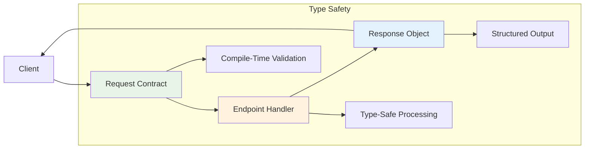

# Core Concepts

Azu's core concepts revolve around **explicit contracts**, **type safety**, and **predictable behavior**. Understanding these concepts is essential for building robust applications.

## The Contract Pattern

Azu enforces explicit contracts between clients and servers through three core components:

1. **Request Contracts** - Define what the endpoint expects
2. **Response Objects** - Define what the endpoint returns
3. **Endpoints** - Connect requests to responses with business logic



This pattern provides several benefits:

- **Self-documenting APIs** - Contracts serve as living documentation
- **Compile-time safety** - Type errors are caught before deployment
- **Focused testing** - Each component can be tested in isolation
- **Consistent behavior** - Standardized request/response handling

## Endpoints

Endpoints are the core handlers in Azu applications. Each endpoint defines a single route and encapsulates all logic for handling that specific request.

### Basic Endpoint Structure

```crystal
struct UserEndpoint
  include Azu::Endpoint(UserRequest, UserResponse)

  # HTTP method and route
  get "/users/:id"

  # Handler method - must return the specified response type
  def call : UserResponse
    user = User.find(params["id"].to_i64)
    UserResponse.new(user)
  end
end
```

### Endpoint Pattern Benefits

**Type Safety:**

```crystal
def call : UserResponse
  # ✅ This compiles - correct return type
  return UserResponse.new(user)

  # ❌ This won't compile - wrong return type
  # return "string"

  # ❌ This won't compile - undefined method
  # user_request.invalid_field
end
```

**Self-Contained Logic:**

```crystal
struct CreateProductEndpoint
  include Azu::Endpoint(CreateProductRequest, ProductResponse)

  post "/products"

  def call : ProductResponse
    # All logic contained within this endpoint
    # No shared state with other endpoints
    validate_inventory!
    product = create_product_from_request
    send_notifications(product)
    ProductResponse.new(product)
  end

  private def validate_inventory!
    # Endpoint-specific validation logic
  end

  private def create_product_from_request
    # Product creation logic
  end

  private def send_notifications(product)
    # Notification logic
  end
end
```

### HTTP Method Support

Azu supports all standard HTTP methods:

```crystal
struct ProductEndpoint
  include Azu::Endpoint(ProductRequest, ProductResponse)

  # HTTP method macros
  get "/products/:id"      # GET requests
  post "/products"         # POST requests
  put "/products/:id"      # PUT requests
  patch "/products/:id"    # PATCH requests
  delete "/products/:id"   # DELETE requests
  head "/products/:id"     # HEAD requests
  options "/products"      # OPTIONS requests
end
```

### Route Parameters

Access route parameters through the `params` method:

```crystal
struct UserEndpoint
  include Azu::Endpoint(UserRequest, UserResponse)

  get "/users/:id/posts/:post_id"

  def call : UserResponse
    user_id = params["id"].to_i64
    post_id = params["post_id"].to_i64

    user = User.find(user_id)
    post = user.posts.find(post_id)

    UserResponse.new(user, post)
  end
end
```

### Helper Methods

Endpoints provide several helper methods for common tasks:

```crystal
struct ProductEndpoint
  include Azu::Endpoint(ProductRequest, ProductResponse)

  post "/products"

  def call : ProductResponse
    # Set response status
    status 201

    # Set content type
    content_type "application/json"

    # Set custom headers
    header "X-Rate-Limit", "100"

    # Set cookies
    cookie HTTP::Cookie.new("session_id", "abc123")

    # Handle redirects
    if should_redirect?
      return redirect("/products/#{product.id}", 302)
    end

    ProductResponse.new(product)
  end
end
```

## Request Contracts

Request contracts define the structure and validation rules for incoming data. They provide type-safe access to request parameters with compile-time guarantees.

### Basic Request Structure

```crystal
struct CreateUserRequest
  include Azu::Request

  # Typed getters for request data
  getter name : String
  getter email : String
  getter age : Int32?
  getter role : String

  # Type-safe initialization
  def initialize(@name = "", @email = "", @age = nil, @role = "user")
  end
end
```

### Automatic Deserialization

Request contracts automatically deserialize data from multiple sources:

```crystal
# JSON request body
# POST /users
# Content-Type: application/json
# {"name": "Alice", "email": "alice@example.com", "age": 30}

# Form data
# POST /users
# Content-Type: application/x-www-form-urlencoded
# name=Alice&email=alice@example.com&age=30

# Query parameters
# GET /users?name=Alice&email=alice@example.com&age=30

# All automatically mapped to CreateUserRequest fields
struct CreateUserRequest
  include Azu::Request

  getter name : String
  getter email : String
  getter age : Int32?

  def initialize(@name = "", @email = "", @age = nil)
  end
end
```

### Validation Rules

Add validation rules using the Schema validation syntax:

```crystal
struct ProductRequest
  include Azu::Request

  getter name : String
  getter price : Float64
  getter category : String
  getter description : String?

  # Validation rules with custom messages
  validate name, presence: true, length: {min: 3, max: 100},
    message: "Product name must be between 3 and 100 characters"

  validate price, presence: true, numericality: {greater_than: 0},
    message: "Price must be a positive number"

  validate category, presence: true, inclusion: {in: %w(electronics books clothing)},
    message: "Category must be electronics, books, or clothing"

  validate description, length: {max: 500}, allow_nil: true,
    message: "Description cannot exceed 500 characters"
end
```

### Complex Validation

Implement custom validation logic:

```crystal
struct UserRegistrationRequest
  include Azu::Request

  getter username : String
  getter email : String
  getter password : String
  getter password_confirmation : String
  getter terms_accepted : Bool

  # Built-in validations
  validate username, presence: true, length: {min: 3, max: 20}
  validate email, presence: true, format: /\A[\w+\-.]+@[a-z\d\-]+(\.[a-z\d\-]+)*\.[a-z]+\z/i
  validate password, presence: true, length: {min: 8}
  validate terms_accepted, acceptance: true

  # Custom validation method
  def validate!
    super # Run built-in validations first

    # Custom password confirmation check
    if password != password_confirmation
      errors.add(:password_confirmation, "Passwords must match")
    end

    # Check password strength
    unless password.match(/(?=.*[a-z])(?=.*[A-Z])(?=.*\d)/)
      errors.add(:password, "Password must contain uppercase, lowercase, and number")
    end

    # Check username uniqueness (pseudo-code)
    if User.exists?(username: username)
      errors.add(:username, "Username is already taken")
    end
  end
end
```

### Nested Objects

Handle complex nested data structures:

```crystal
struct CreateOrderRequest
  include Azu::Request

  getter customer_info : CustomerInfo
  getter items : Array(OrderItem)
  getter shipping_address : Address
  getter billing_address : Address?

  def initialize(@customer_info = CustomerInfo.new,
                 @items = [] of OrderItem,
                 @shipping_address = Address.new,
                 @billing_address = nil)
  end

  struct CustomerInfo
    include Azu::Request

    getter name : String
    getter email : String
    getter phone : String?

    def initialize(@name = "", @email = "", @phone = nil)
    end

    validate name, presence: true
    validate email, presence: true, format: /@/
  end

  struct OrderItem
    include Azu::Request

    getter product_id : Int64
    getter quantity : Int32
    getter price : Float64

    def initialize(@product_id = 0_i64, @quantity = 1, @price = 0.0)
    end

    validate product_id, presence: true, numericality: {greater_than: 0}
    validate quantity, presence: true, numericality: {greater_than: 0}
    validate price, presence: true, numericality: {greater_than: 0}
  end

  struct Address
    include Azu::Request

    getter street : String
    getter city : String
    getter state : String
    getter zip_code : String
    getter country : String

    def initialize(@street = "", @city = "", @state = "", @zip_code = "", @country = "")
    end

    validate street, presence: true
    validate city, presence: true
    validate state, presence: true
    validate zip_code, presence: true, format: /^\d{5}(-\d{4})?$/
  end
end
```

### Request Usage in Endpoints

Access the request object in endpoints using the automatically generated method:

```crystal
struct CreateUserEndpoint
  include Azu::Endpoint(CreateUserRequest, UserResponse)

  post "/users"

  def call : UserResponse
    # Access via snake_case method name
    request = create_user_request

    # Validate the request
    unless request.valid?
      raise Azu::Response::ValidationError.new(
        request.errors.group_by(&.field).transform_values(&.map(&.message))
      )
    end

    # Use validated data
    user = User.create!(
      name: request.name,
      email: request.email,
      age: request.age
    )

    UserResponse.new(user)
  end
end
```

## Response Objects

Response objects define the structure and format of data returned to clients. They provide consistent, type-safe output formatting.

### Basic Response Structure

```crystal
struct UserResponse
  include Azu::Response

  def initialize(@user : User)
  end

  # Required render method
  def render
    {
      id: @user.id,
      name: @user.name,
      email: @user.email,
      created_at: @user.created_at.to_rfc3339,
      updated_at: @user.updated_at.to_rfc3339
    }.to_json
  end
end
```

### Content Negotiation

Support multiple output formats based on Accept headers:

```crystal
struct ProductResponse
  include Azu::Response

  def initialize(@product : Product)
  end

  def render
    # Automatic content negotiation based on Accept header
    case context.request.headers["Accept"]?
    when .try(&.includes?("application/json"))
      render_json
    when .try(&.includes?("text/html"))
      render_html
    when .try(&.includes?("application/xml"))
      render_xml
    else
      render_json # Default to JSON
    end
  end

  private def render_json
    {
      id: @product.id,
      name: @product.name,
      price: @product.price,
      category: @product.category,
      in_stock: @product.quantity > 0
    }.to_json
  end

  private def render_html
    view "products/show.html", product: @product
  end

  private def render_xml
    <<-XML
    <?xml version="1.0" encoding="UTF-8"?>
    <product id="#{@product.id}">
      <name>#{@product.name}</name>
      <price>#{@product.price}</price>
      <category>#{@product.category}</category>
      <in_stock>#{@product.quantity > 0}</in_stock>
    </product>
    XML
  end
end
```

### Collection Responses

Handle arrays and collections efficiently:

```crystal
struct UsersIndexResponse
  include Azu::Response

  def initialize(@users : Array(User), @total_count : Int32, @page : Int32, @per_page : Int32)
  end

  def render
    {
      users: @users.map { |user| user_json(user) },
      pagination: {
        page: @page,
        per_page: @per_page,
        total_count: @total_count,
        total_pages: (@total_count / @per_page.to_f).ceil.to_i,
        has_next: (@page * @per_page) < @total_count,
        has_prev: @page > 1
      }
    }.to_json
  end

  private def user_json(user : User)
    {
      id: user.id,
      name: user.name,
      email: user.email,
      status: user.status
    }
  end
end
```

### Error Responses

Azu provides built-in error response classes:

```crystal
# Built-in error types
raise Azu::Response::ValidationError.new(field_errors)
raise Azu::Response::AuthenticationError.new("Invalid credentials")
raise Azu::Response::AuthorizationError.new("Insufficient permissions")
raise Azu::Response::NotFound.new("/users/999")
raise Azu::Response::RateLimitError.new(retry_after: 60)

# Custom error responses
struct CustomBusinessError < Azu::Response::Error
  def initialize(business_context : String)
    super(
      title: "Business Rule Violation",
      status: HTTP::Status::UNPROCESSABLE_ENTITY,
      detail: "The operation violates business rules: #{business_context}",
      errors: [] of String
    )
  end
end
```

### Template Responses

Integrate with the template system:

```crystal
struct UserProfileResponse
  include Azu::Response
  include Azu::Templates::Renderable

  def initialize(@user : User, @posts : Array(Post))
  end

  def render
    view "users/profile.html", {
      user: @user,
      posts: @posts,
      title: "#{@user.name}'s Profile",
      meta_description: "View #{@user.name}'s profile and recent posts"
    }
  end
end
```

## Routing

Azu's routing system is built on the high-performance Radix tree with intelligent caching for optimal performance.

### Route Definition

Routes are defined directly on endpoints:

```crystal
struct UsersEndpoint
  include Azu::Endpoint(UserRequest, UserResponse)

  # Static routes
  get "/users"
  post "/users"

  # Routes with parameters
  get "/users/:id"
  put "/users/:id"
  delete "/users/:id"

  # Routes with multiple parameters
  get "/users/:user_id/posts/:post_id"

  # Routes with optional parameters (using query strings)
  get "/search" # ?q=term&page=1&limit=10
end
```

### Route Parameters

Access route parameters in endpoints:

```crystal
struct UserPostEndpoint
  include Azu::Endpoint(UserPostRequest, UserPostResponse)

  get "/users/:user_id/posts/:post_id"

  def call : UserPostResponse
    user_id = params["user_id"].to_i64
    post_id = params["post_id"].to_i64

    user = User.find(user_id)
    post = user.posts.find(post_id)

    UserPostResponse.new(user, post)
  end
end
```

### Route Helpers

Azu automatically generates route helper methods:

```crystal
struct UserEndpoint
  include Azu::Endpoint(UserRequest, UserResponse)

  get "/users/:id"
end

# Automatically generates:
UserEndpoint.path(id: 123)  # Returns "/users/123"

# Use in templates and other endpoints
redirect_url = UserEndpoint.path(id: user.id)
redirect(redirect_url)
```

### Route Constraints

Add constraints to route parameters:

```crystal
struct UserEndpoint
  include Azu::Endpoint(UserRequest, UserResponse)

  # Only match numeric IDs
  get "/users/:id" do |route|
    route.constraints(id: /\d+/)
  end

  # Match specific formats
  get "/users/:id/avatar.:format" do |route|
    route.constraints(format: /jpg|png|gif/)
  end
end
```

### Performance Characteristics

Azu's router is optimized for high-performance applications:

```crystal
# Route resolution performance
module Azu
  class Router
    # LRU cache for frequently accessed routes
    @route_cache = LRUCache(String, Route).new(capacity: 1000)

    def find_route(method : String, path : String)
      cache_key = "#{method}:#{path}"

      # Check cache first
      if cached_route = @route_cache[cache_key]?
        return cached_route
      end

      # Perform radix tree lookup
      route = @radix_tree.find(path, method)

      # Cache for future requests
      @route_cache[cache_key] = route if route

      route
    end
  end
end
```

**Performance Metrics:**

- **Route resolution**: ~0.1ms for cached routes
- **Cache hit ratio**: >95% in typical applications
- **Memory usage**: Constant with LRU eviction
- **Concurrent access**: Lock-free for read operations

---

**Next Steps:**

- **[Real-Time Features →](real-time.md)** - Master WebSocket channels and live components
- **[Templates & Views →](templates.md)** - Learn template rendering and markup DSL
- **[Middleware →](middleware.md)** - Add cross-cutting concerns to your application
- **[Testing →](testing.md)** - Write comprehensive tests for your endpoints
