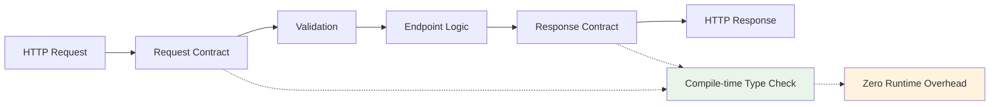
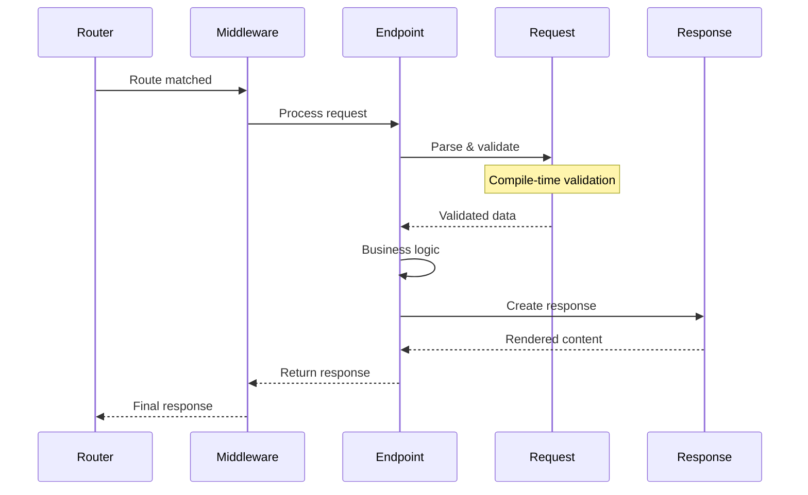

# Core Concepts

This guide explores Azu's foundational concepts that enable type-safe, high-performance web applications. Understanding these patterns is crucial for building robust applications that leverage Crystal's compile-time guarantees.

## The Contract-Driven Architecture

Azu follows a **contract-first** approach where every HTTP interaction is governed by explicit type contracts. This design philosophy provides several benefits:

- **Compile-time safety**: Invalid data structures are caught during compilation
- **Self-documenting APIs**: Request/response contracts serve as living documentation
- **Enhanced testability**: Isolated, predictable components with clear interfaces
- **Performance optimization**: Zero-runtime validation overhead



## Endpoints: The Core Handler Pattern

An **Endpoint** is a self-contained handler that processes a specific type of HTTP request and returns a specific type of response. Unlike traditional controller-action patterns, endpoints are:

- **Focused**: Each endpoint handles one specific operation
- **Type-safe**: Request and response types are explicitly declared
- **Testable**: Isolated units with no shared state
- **Composable**: Can be combined through middleware and routing

### Basic Endpoint Structure

```crystal
struct UserEndpoint
  include Endpoint(UserRequest, UserResponse)
  
  post "/users"  # Route definition
  
  def call : UserResponse  # Required method with explicit return type
    # Endpoint logic here
    UserResponse.new(user_request)
  end
end
```

### Endpoint Lifecycle



### Advanced Endpoint Patterns

#### Resource Endpoints

Handle multiple HTTP methods for a single resource:

```crystal
struct UserResourceEndpoint
  include Endpoint(UserRequest, UserResponse)
  
  get "/users/:id"      # Show user
  put "/users/:id"      # Update user
  delete "/users/:id"   # Delete user
  
  def call : UserResponse
    case method
    when .get?
      show_user
    when .put?
      update_user
    when .delete?
      delete_user
    else
      error("Method not allowed", 405)
    end
  end
  
  private def show_user
    user = find_user(params["id"])
    UserResponse.new(user)
  end
  
  private def update_user
    user = find_user(params["id"])
    user.update!(user_request.to_h)
    UserResponse.new(user)
  end
  
  private def delete_user
    user = find_user(params["id"])
    user.delete!
    EmptyResponse.new(status: 204)
  end
end
```

#### Nested Resource Endpoints

Handle hierarchical resources:

```crystal
struct CommentEndpoint
  include Endpoint(CommentRequest, CommentResponse)
  
  post "/posts/:post_id/comments"
  get "/posts/:post_id/comments/:id"
  
  def call : CommentResponse
    post = find_post(params["post_id"])
    
    case method
    when .post?
      create_comment(post)
    when .get?
      show_comment(post)
    end
  end
  
  private def create_comment(post)
    comment = post.comments.create!(comment_request.to_h)
    CommentResponse.new(comment, status: 201)
  end
  
  private def show_comment(post)
    comment = post.comments.find(params["id"])
    CommentResponse.new(comment)
  end
end
```

#### Content Negotiation Endpoints

Handle multiple response formats:

```crystal
struct ApiUserEndpoint
  include Endpoint(UserRequest, UserResponse)
  
  get "/api/users/:id"
  
  def call : UserResponse
    user = find_user(params["id"])
    
    case accept_header
    when "application/json"
      content_type "application/json"
      JsonUserResponse.new(user)
    when "application/xml"
      content_type "application/xml"
      XmlUserResponse.new(user)
    when "text/html"
      content_type "text/html"
      HtmlUserResponse.new(user)
    else
      content_type "application/json"
      JsonUserResponse.new(user)
    end
  end
  
  private def accept_header
    header["Accept"]? || "application/json"
  end
end
```

## Request Contracts: Type-Safe Input Validation

Request contracts define the expected structure and validation rules for incoming data. They integrate with Crystal's type system and the Schema validation library.

### Basic Request Structure

```crystal
struct CreateUserRequest
  include Azu::Request
  
  # Required fields with explicit types
  @name : String
  @email : String
  @age : Int32?
  
  # Getters for accessing validated data
  getter name, email, age
  
  def initialize(@name = "", @email = "", @age = nil)
  end
  
  # Validation rules with custom messages
  validate :name, presence: true, size: 2..50, 
    message: "Name must be between 2 and 50 characters"
  validate :email, presence: true, format: /@/, 
    message: "Email must be a valid email address"
  validate :age, range: 13..120, if: ->(req : CreateUserRequest) { !req.age.nil? }, 
    message: "Age must be between 13 and 120"
end
```

### Input Sources and Serialization

Request contracts can be populated from multiple sources:

```crystal
# From JSON body (POST/PUT requests)
user_request = CreateUserRequest.from_json(json_string)

# From URL-encoded form data
user_request = CreateUserRequest.from_www_form(form_data)

# From query parameters (GET requests)
user_request = CreateUserRequest.from_query(query_string)

# Direct instantiation (for testing)
user_request = CreateUserRequest.new(
  name: "John Doe",
  email: "john@example.com",
  age: 30
)
```

### Complex Validation Patterns

#### Conditional Validation

```crystal
struct UpdateUserRequest
  include Azu::Request
  
  @name : String?
  @email : String?
  @password : String?
  @password_confirmation : String?
  
  getter name, email, password, password_confirmation
  
  def initialize(@name = nil, @email = nil, @password = nil, @password_confirmation = nil)
  end
  
  # Validate only if field is present
  validate :name, size: 2..50, if: ->(req : UpdateUserRequest) { !req.name.nil? }
  validate :email, format: /@/, if: ->(req : UpdateUserRequest) { !req.email.nil? }
  
  # Cross-field validation
  validate :password_confirmation, 
    custom: ->(req : UpdateUserRequest) {
      if req.password && req.password != req.password_confirmation
        "Password confirmation doesn't match password"
      end
    }
end
```

#### Nested Object Validation

```crystal
struct AddressRequest
  include Azu::Request
  
  @street : String
  @city : String
  @country : String
  @postal_code : String
  
  getter street, city, country, postal_code
  
  def initialize(@street = "", @city = "", @country = "", @postal_code = "")
  end
  
  validate :street, presence: true
  validate :city, presence: true
  validate :country, presence: true
  validate :postal_code, format: /\A\d{5}(-\d{4})?\z/
end

struct CreateUserWithAddressRequest
  include Azu::Request
  
  @name : String
  @email : String
  @address : AddressRequest
  
  getter name, email, address
  
  def initialize(@name = "", @email = "", @address = AddressRequest.new)
  end
  
  validate :name, presence: true, size: 2..50
  validate :email, presence: true, format: /@/
  
  # Validate nested object
  def valid?
    super && address.valid?
  end
  
  def errors
    base_errors = super
    if !address.valid?
      address.errors.each do |error|
        base_errors << Error.new("address.#{error.field}", error.message)
      end
    end
    base_errors
  end
end
```

#### Collection Validation

```crystal
struct BulkCreateUsersRequest
  include Azu::Request
  
  @users : Array(CreateUserRequest)
  
  getter users
  
  def initialize(@users = [] of CreateUserRequest)
  end
  
  validate :users, presence: true, size: 1..100
  
  def valid?
    return false unless super
    users.all?(&.valid?)
  end
  
  def errors
    base_errors = super
    users.each_with_index do |user, index|
      unless user.valid?
        user.errors.each do |error|
          base_errors << Error.new("users[#{index}].#{error.field}", error.message)
        end
      end
    end
    base_errors
  end
end
```

### Error Handling and Messages

```crystal
struct UserRequest
  include Azu::Request
  
  @name : String
  @email : String
  
  def initialize(@name = "", @email = "")
  end
  
  validate :name, presence: true, size: 2..50
  validate :email, presence: true, format: /@/
  
  # Custom error messages
  def error_messages
    errors.map do |error|
      case error.field
      when "name"
        case error.code
        when "presence"
          "Name is required"
        when "size"
          "Name must be between 2 and 50 characters"
        end
      when "email"
        case error.code
        when "presence"
          "Email is required"
        when "format"
          "Email must be a valid email address"
        end
      else
        error.message
      end
    end
  end
end
```

## Response Objects: Structured Output

Response objects handle the serialization and formatting of data sent back to clients. They support multiple content types and provide a consistent interface for output generation.

### Basic Response Structure

```crystal
struct UserResponse
  include Azu::Response
  
  def initialize(@user : User, @status : Int32 = 200)
  end
  
  def render
    {
      id: @user.id,
      name: @user.name,
      email: @user.email,
      created_at: @user.created_at.to_rfc3339
    }.to_json
  end
end
```

### Content Type Handling

```crystal
struct MultiFormatUserResponse
  include Azu::Response
  
  def initialize(@user : User)
  end
  
  def render
    case content_type
    when "application/json"
      render_json
    when "application/xml"
      render_xml
    when "text/html"
      render_html
    when "text/csv"
      render_csv
    else
      render_json  # Default fallback
    end
  end
  
  private def render_json
    {
      id: @user.id,
      name: @user.name,
      email: @user.email,
      profile: {
        avatar_url: @user.avatar_url,
        bio: @user.bio
      },
      metadata: {
        created_at: @user.created_at.to_rfc3339,
        updated_at: @user.updated_at.to_rfc3339
      }
    }.to_json
  end
  
  private def render_xml
    <<-XML
    <?xml version="1.0" encoding="UTF-8"?>
    <user id="#{@user.id}">
      <name>#{@user.name}</name>
      <email>#{@user.email}</email>
      <profile>
        <avatar_url>#{@user.avatar_url}</avatar_url>
        <bio>#{@user.bio}</bio>
      </profile>
      <metadata>
        <created_at>#{@user.created_at.to_rfc3339}</created_at>
        <updated_at>#{@user.updated_at.to_rfc3339}</updated_at>
      </metadata>
    </user>
    XML
  end
  
  private def render_html
    <<-HTML
    <div class="user-card">
      <h2>#{@user.name}</h2>
      <p>Email: #{@user.email}</p>
      <p>Member since: #{@user.created_at.to_s("%B %d, %Y")}</p>
    </div>
    HTML
  end
  
  private def render_csv
    "#{@user.id},#{@user.name},#{@user.email},#{@user.created_at.to_rfc3339}"
  end
end
```

### Collection Responses

```crystal
struct UsersCollectionResponse
  include Azu::Response
  
  def initialize(@users : Array(User), @page : Int32 = 1, @per_page : Int32 = 20)
  end
  
  def render
    {
      data: @users.map { |user| user_data(user) },
      pagination: {
        page: @page,
        per_page: @per_page,
        total: @users.size,
        has_more: @users.size == @per_page
      },
      metadata: {
        generated_at: Time.utc.to_rfc3339,
        version: "v1"
      }
    }.to_json
  end
  
  private def user_data(user)
    {
      id: user.id,
      name: user.name,
      email: user.email,
      links: {
        self: "/api/users/#{user.id}",
        edit: "/api/users/#{user.id}/edit"
      }
    }
  end
end
```

### Error Responses

```crystal
struct ValidationErrorResponse
  include Azu::Response
  
  def initialize(@field_errors : Hash(String, Array(String)), @status : Int32 = 422)
  end
  
  def render
    {
      error: {
        type: "validation_error",
        message: "The request could not be processed due to validation errors",
        details: @field_errors,
        timestamp: Time.utc.to_rfc3339,
        help_url: "https://api-docs.example.com/errors/validation"
      }
    }.to_json
  end
end

struct NotFoundResponse
  include Azu::Response
  
  def initialize(@resource : String, @id : String, @status : Int32 = 404)
  end
  
  def render
    {
      error: {
        type: "not_found",
        message: "#{@resource} with id '#{@id}' was not found",
        code: "RESOURCE_NOT_FOUND",
        timestamp: Time.utc.to_rfc3339
      }
    }.to_json
  end
end
```

## Routing: URL Pattern Matching

Azu's routing system uses a high-performance radix tree for URL pattern matching, providing O(log n) lookup performance with path parameter extraction.

### Route Definition Patterns

```crystal
# Static routes
get "/users"              # Exact match
get "/api/v1/health"      # Nested static route

# Parameter routes
get "/users/:id"          # Single parameter
get "/users/:id/posts/:post_id"  # Multiple parameters

# Wildcard routes (match remaining path)
get "/files/*filepath"    # Captures everything after /files/

# HTTP method constraints
post "/users"             # Only POST requests
put "/users/:id"          # Only PUT requests
delete "/users/:id"       # Only DELETE requests

# Multiple methods for same endpoint
struct UserEndpoint
  include Endpoint(UserRequest, UserResponse)
  
  get "/users/:id"        # GET /users/123
  put "/users/:id"        # PUT /users/123
  delete "/users/:id"     # DELETE /users/123
end
```

### Route Parameters

Route parameters are automatically extracted and made available through the `params` helper:

```crystal
struct UserEndpoint
  include Endpoint(UserRequest, UserResponse)
  
  get "/users/:id/posts/:post_id/comments/:comment_id"
  
  def call : UserResponse
    user_id = params["id"]           # String
    post_id = params["post_id"]      # String
    comment_id = params["comment_id"] # String
    
    # Type conversion
    user_id_int = params["id"].to_i64
    
    # With error handling
    begin
      user_id_int = params["id"].to_i64
    rescue ArgumentError
      return error("Invalid user ID", 400)
    end
    
    user = find_user(user_id_int)
    UserResponse.new(user)
  end
end
```

### Route Constraints and Validation

```crystal
struct UserEndpoint
  include Endpoint(UserRequest, UserResponse)
  
  get "/users/:id"
  
  def call : UserResponse
    # Validate parameter format
    unless params["id"].matches?(/\A\d+\z/)
      return error("User ID must be numeric", 400)
    end
    
    user_id = params["id"].to_i64
    
    # Validate parameter range
    if user_id <= 0
      return error("User ID must be positive", 400)
    end
    
    user = find_user(user_id)
    UserResponse.new(user)
  end
  
  private def find_user(id : Int64)
    User.find(id) || raise NotFoundError.new("User", id.to_s)
  end
end
```

### Route Groups and Scoping

```crystal
module AdminAPI
  struct UsersEndpoint
    include Endpoint(UserRequest, UserResponse)
    
    get "/admin/users"
    post "/admin/users"
    get "/admin/users/:id"
    put "/admin/users/:id"
    delete "/admin/users/:id"
  end
  
  struct SettingsEndpoint
    include Endpoint(SettingsRequest, SettingsResponse)
    
    get "/admin/settings"
    put "/admin/settings"
  end
end

module API::V1
  struct UsersEndpoint
    include Endpoint(UserRequest, UserResponse)
    
    get "/api/v1/users"
    post "/api/v1/users"
    get "/api/v1/users/:id"
  end
end
```

### Route Priority and Conflicts

Azu routes are processed in the order they're defined. More specific routes should be defined before less specific ones:

```crystal
# ✅ Correct order - specific to general
get "/users/new"          # Static route (highest priority)
get "/users/:id"          # Parameter route
get "/users/*action"      # Wildcard route (lowest priority)

# ❌ Incorrect order - may cause conflicts
get "/users/:id"          # This would match /users/new
get "/users/new"          # This might never be reached
```

## Type System Integration

Azu leverages Crystal's static type system to provide compile-time guarantees about request/response contracts.

### Compile-Time Type Checking

```crystal
struct TypeSafeEndpoint
  include Endpoint(StrictUserRequest, StrictUserResponse)
  
  post "/users"
  
  def call : StrictUserResponse
    # This is guaranteed to be valid at runtime
    # because validation happens at compile time
    user = User.create!(
      name: strict_user_request.name,        # String (guaranteed)
      email: strict_user_request.email,      # String (guaranteed) 
      age: strict_user_request.age           # Int32? (guaranteed)
    )
    
    # Response type is enforced at compile time
    StrictUserResponse.new(user)  # Must return StrictUserResponse
  end
end
```

### Generic Endpoints

Create reusable endpoint patterns with generics:

```crystal
abstract struct CRUDEndpoint(T, CreateRequest, UpdateRequest, Response)
  include Endpoint(Request, Response)
  
  abstract def model_class : T.class
  abstract def find_model(id : String) : T
  abstract def create_model(request : CreateRequest) : T
  abstract def update_model(model : T, request : UpdateRequest) : T
  
  def call : Response
    case method
    when .get?
      show_model
    when .post?
      create_model_action
    when .put?
      update_model_action
    when .delete?
      delete_model_action
    end
  end
  
  private def show_model
    model = find_model(params["id"])
    Response.new(model)
  end
  
  private def create_model_action
    model = create_model(create_request)
    Response.new(model, status: 201)
  end
  
  private def update_model_action
    model = find_model(params["id"])
    updated_model = update_model(model, update_request)
    Response.new(updated_model)
  end
  
  private def delete_model_action
    model = find_model(params["id"])
    model.delete!
    EmptyResponse.new(status: 204)
  end
end

# Implement for specific models
struct UserCRUDEndpoint < CRUDEndpoint(User, CreateUserRequest, UpdateUserRequest, UserResponse)
  get "/users/:id"
  post "/users"
  put "/users/:id"
  delete "/users/:id"
  
  def model_class
    User
  end
  
  def find_model(id : String)
    User.find(id.to_i64) || raise NotFoundError.new("User", id)
  end
  
  def create_model(request : CreateUserRequest)
    User.create!(request.to_h)
  end
  
  def update_model(model : User, request : UpdateUserRequest)
    model.update!(request.to_h)
    model
  end
end
```

---

## Summary

Azu's core concepts work together to provide a robust foundation for web applications:

- **Endpoints** provide focused, testable request handlers
- **Request contracts** ensure type-safe input validation
- **Response objects** handle structured output formatting
- **Routing** enables efficient URL pattern matching
- **Type system integration** catches errors at compile time

This architecture enables you to build applications that are both high-performance and maintainable, with strong guarantees about correctness.

**Next Steps:**
- [Routing Deep Dive](core-concepts/routing.md) - Advanced routing patterns
- [Request Validation](core-concepts/requests.md) - Complex validation scenarios
- [Response Formatting](core-concepts/responses.md) - Advanced response patterns
- [Real-Time Features](real-time.md) - WebSocket channels and live components
