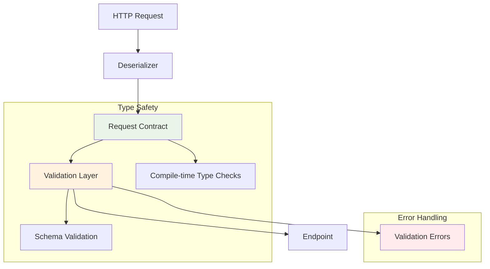

# Request Contracts: Deep Dive

Request contracts are the foundation of type-safe, robust input handling in Azu. They define the structure, validation, and deserialization rules for all incoming data, ensuring that endpoints receive only well-formed, validated, and type-checked input.

---

## Philosophy and Rationale

Azu's request contracts are designed to:

- **Enforce type safety at compile time**
- **Make input validation explicit and declarative**
- **Support multiple data sources (query, form, JSON, multipart)**
- **Enable self-documenting APIs**
- **Prevent common security vulnerabilities (injection, type confusion)**

> "A request contract is a single source of truth for what your endpoint expects."

---

## Anatomy of a Request Contract



### Example: Minimal Request Contract

```crystal
struct CreateUserRequest
  include Azu::Request

  getter name : String
  getter email : String
  getter age : Int32?

  # Default values and type safety
  def initialize(@name = "", @email = "", @age = nil)
  end
end
```

---

## Type Safety and Compile-Time Validation

Request contracts are checked at compile time:

- All fields must have explicit types
- Missing or extra fields cause compilation errors
- Endpoints can only access fields defined in the contract

```crystal
# Compile-time error: missing field
struct IncompleteRequest
  include Azu::Request
  getter name : String
  # Missing email field
end

# Compile-time error: wrong type
struct WrongTypeRequest
  include Azu::Request
  getter age : String  # Should be Int32
end
```

---

## Automatic Deserialization

Azu automatically deserializes data from:

- **Query parameters** (`GET /users?name=Alice`)
- **Form data** (`POST /users` with `application/x-www-form-urlencoded`)
- **JSON body** (`POST /users` with `application/json`)
- **Multipart form** (file uploads)

```crystal
struct RegisterRequest
  include Azu::Request
  getter username : String
  getter password : String
  getter avatar : FileUpload?  # For multipart
end

# All of these map to RegisterRequest fields automatically
```

---

## Validation: Schema and Custom

### Declarative Schema Validation

```crystal
struct ProductRequest
  include Azu::Request
  getter name : String
  getter price : Float64
  getter category : String
  getter description : String?

  validate name, presence: true, length: {min: 3, max: 100}
  validate price, presence: true, numericality: {greater_than: 0}
  validate category, presence: true, inclusion: {in: %w(electronics books clothing)}
  validate description, length: {max: 500}, allow_nil: true
end
```

### Custom Validation Logic

```crystal
struct SignupRequest
  include Azu::Request
  getter email : String
  getter password : String
  getter password_confirmation : String

  validate email, presence: true, format: /@/
  validate password, presence: true, length: {min: 8}

  def validate!
    super
    if password != password_confirmation
      errors.add(:password_confirmation, "Passwords must match")
    end
    unless password.match(/(?=.*[a-z])(?=.*[A-Z])(?=.*\d)/)
      errors.add(:password, "Password must contain uppercase, lowercase, and number")
    end
  end
end
```

---

## Error Aggregation and Reporting

All validation errors are aggregated and accessible via the `errors` object:

```crystal
request = SignupRequest.from_json(json_body)
unless request.valid?
  puts request.errors.full_messages
  # => ["Email is required", "Password must be at least 8 characters", ...]
end
```

In endpoints, raise a validation error to return a structured error response:

```crystal
unless request.valid?
  raise Azu::Response::ValidationError.new(request.errors.group_by(&.field).transform_values(&.map(&.message)))
end
```

---

## Nested and Complex Data Structures

Request contracts can contain nested objects and arrays:

```crystal
struct CreateOrderRequest
  include Azu::Request

  getter customer : CustomerInfo
  getter items : Array(OrderItem)
  getter shipping : Address
  getter billing : Address?

  struct CustomerInfo
    include Azu::Request
    getter name : String
    getter email : String
    validate name, presence: true
    validate email, presence: true, format: /@/
  end

  struct OrderItem
    include Azu::Request
    getter product_id : Int64
    getter quantity : Int32
    validate product_id, presence: true
    validate quantity, presence: true, numericality: {greater_than: 0}
  end

  struct Address
    include Azu::Request
    getter street : String
    getter city : String
    getter zip : String
    validate street, presence: true
    validate city, presence: true
    validate zip, presence: true, format: /^\d{5}$/
  end
end
```

---

## Usage in Endpoints

Azu generates a method for each request contract, providing type-safe access in endpoints:

```crystal
struct CreateUserEndpoint
  include Azu::Endpoint(CreateUserRequest, UserResponse)
  post "/users"

  def call : UserResponse
    request = create_user_request  # Method auto-generated
    unless request.valid?
      raise Azu::Response::ValidationError.new(request.errors)
    end
    user = User.create!(request.to_h)
    UserResponse.new(user)
  end
end
```

---

## Security Best Practices

- **Always validate all input** (never trust user data)
- **Use strict types** (avoid `String` for IDs, use `Int64`)
- **Sanitize HTML/text fields** to prevent XSS
- **Limit file upload types and sizes**
- **Avoid accepting arbitrary hashes or open structures**
- **Leverage contract validation for all endpoints**

---

## Real-World Patterns

### File Uploads

```crystal
struct UploadAvatarRequest
  include Azu::Request
  getter avatar : FileUpload
  validate avatar, presence: true
end
```

### Arrays and Nested Objects

```crystal
struct BulkInviteRequest
  include Azu::Request
  getter emails : Array(String)
  validate emails, presence: true, length: {min: 1, max: 100}
end
```

---

## Anti-Patterns and Troubleshooting

**Avoid:**

- Using `String` for all fields (lose type safety)
- Skipping validation (leads to runtime errors)
- Accepting open hashes or untyped params
- Relying on manual parsing in endpoints

**Troubleshooting:**

- If a field is missing, check the contract and deserialization logic
- If validation fails unexpectedly, inspect the `errors` object
- Use specs to test all request contracts with valid and invalid data

---

## Navigation

- [Endpoints →](endpoints.md)
- [Response Objects →](responses.md)
- [Routing →](routing.md)
- [Middleware →](../middleware.md)
- [Testing →](../testing.md)
- [Performance →](../architecture/performance.md)
