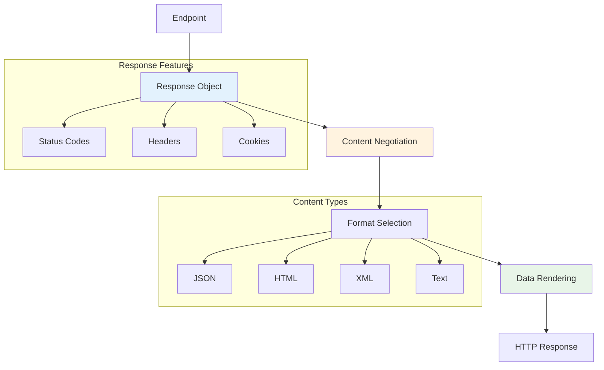

# Response Objects: Deep Dive

Response objects are the structured, type-safe way to return data from Azu endpoints. They encapsulate the complete response lifecycle, from data formatting to content negotiation, ensuring consistent and predictable output across your application.

---

## Philosophy and Rationale

Azu's response objects are designed to:

- **Provide type-safe, structured output**
- **Support multiple content types through negotiation**
- **Enable consistent error handling**
- **Facilitate caching and performance optimization**
- **Ensure security through proper headers**

> "A response object is a contract between your endpoint and the client."

---

## Anatomy of a Response Object



### Example: Basic Response Object

```crystal
struct UserResponse
  include Azu::Response

  def initialize(@user : User)
  end

  def render
    {
      id: @user.id,
      name: @user.name,
      email: @user.email,
      created_at: @user.created_at.to_rfc3339
    }.to_json
  end
end
```

---

## Type Safety and Compile-Time Guarantees

Response objects enforce type safety at compile time:

- All response objects must implement the `render` method
- Return types are checked at compile time
- Endpoints must return the exact response type specified

```crystal
# Compile-time error: missing render method
struct InvalidResponse
  include Azu::Response
  # Missing render method
end

# Compile-time error: wrong return type
struct WrongTypeResponse
  include Azu::Response
  def render : String  # Should return the rendered content
    "Hello World"
  end
end
```

---

## Content Negotiation

Response objects automatically handle content negotiation based on the `Accept` header:

```crystal
struct ProductResponse
  include Azu::Response

  def initialize(@product : Product)
  end

  def render
    case context.request.headers["Accept"]?
    when .try(&.includes?("application/json"))
      render_json
    when .try(&.includes?("text/html"))
      render_html
    when .try(&.includes?("application/xml"))
      render_xml
    when .try(&.includes?("text/plain"))
      render_text
    else
      render_json  # Default to JSON
    end
  end

  private def render_json
    context.response.content_type = "application/json"
    {
      id: @product.id,
      name: @product.name,
      price: @product.price,
      in_stock: @product.quantity > 0
    }.to_json
  end

  private def render_html
    context.response.content_type = "text/html"
    view "products/show.html", product: @product
  end

  private def render_xml
    context.response.content_type = "application/xml"
    <<-XML
    <?xml version="1.0" encoding="UTF-8"?>
    <product id="#{@product.id}">
      <name>#{@product.name}</name>
      <price>#{@product.price}</price>
      <in_stock>#{@product.quantity > 0}</in_stock>
    </product>
    XML
  end

  private def render_text
    context.response.content_type = "text/plain"
    "Product: #{@product.name} - $#{@product.price}"
  end
end
```

---

## Status Codes, Headers, and Cookies

Response objects can set HTTP status codes, headers, and cookies:

```crystal
struct CreateUserResponse
  include Azu::Response

  def initialize(@user : User)
  end

  def render
    # Set status code
    context.response.status_code = 201

    # Set headers
    context.response.headers["Location"] = "/users/#{@user.id}"
    context.response.headers["X-Resource-ID"] = @user.id.to_s

    # Set cookies
    cookie = HTTP::Cookie.new("last_created_user", @user.id.to_s, expires: 1.hour.from_now)
    context.response.cookies << cookie

    # Render response body
    {
      id: @user.id,
      name: @user.name,
      email: @user.email,
      message: "User created successfully"
    }.to_json
  end
end
```

---

## Error Responses and Custom Error Types

Azu provides built-in error response classes and allows custom error types:

```crystal
# Built-in error types
raise Azu::Response::ValidationError.new(field_errors)
raise Azu::Response::AuthenticationError.new("Invalid credentials")
raise Azu::Response::AuthorizationError.new("Insufficient permissions")
raise Azu::Response::NotFound.new("/users/999")
raise Azu::Response::RateLimitError.new(retry_after: 60)

# Custom error response
struct BusinessRuleError < Azu::Response::Error
  def initialize(business_context : String)
    super(
      title: "Business Rule Violation",
      status: HTTP::Status::UNPROCESSABLE_ENTITY,
      detail: "The operation violates business rules: #{business_context}",
      errors: [] of String
    )
  end
end

# Usage in endpoint
def call : UserResponse
  if user.quota_exceeded?
    raise BusinessRuleError.new("User quota exceeded")
  end
  UserResponse.new(user)
end
```

---

## Template Integration and Rendering

Response objects can integrate with the template system:

```crystal
struct UserProfileResponse
  include Azu::Response
  include Azu::Templates::Renderable

  def initialize(@user : User, @posts : Array(Post))
  end

  def render
    view "users/profile.html", {
      user: @user,
      posts: @posts,
      title: "#{@user.name}'s Profile",
      meta_description: "View #{@user.name}'s profile and recent posts"
    }
  end
end
```

---

## Streaming and Real-Time Responses

For large datasets or real-time data, use streaming responses:

```crystal
struct StreamingResponse
  include Azu::Response

  def initialize(@data_source : DataSource)
  end

  def render
    context.response.content_type = "text/event-stream"
    context.response.headers["Cache-Control"] = "no-cache"
    context.response.headers["Connection"] = "keep-alive"

    spawn do
      stream_data
    end

    ""  # Return empty string, data is streamed
  end

  private def stream_data
    @data_source.each_chunk do |chunk|
      context.response << "data: #{chunk.to_json}\n\n"
      Fiber.yield  # Allow other fibers to run
    end
  rescue ex : IO::Error
    # Handle client disconnection
  end
end
```

---

## Collection Responses and Pagination

Handle arrays and collections with pagination metadata:

```crystal
struct UsersIndexResponse
  include Azu::Response

  def initialize(@users : Array(User), @total_count : Int32, @page : Int32, @per_page : Int32)
  end

  def render
    {
      users: @users.map { |user| user_json(user) },
      pagination: {
        page: @page,
        per_page: @per_page,
        total_count: @total_count,
        total_pages: (@total_count / @per_page.to_f).ceil.to_i,
        has_next: (@page * @per_page) < @total_count,
        has_prev: @page > 1
      }
    }.to_json
  end

  private def user_json(user : User)
    {
      id: user.id,
      name: user.name,
      email: user.email,
      status: user.status
    }
  end
end
```

---

## Caching Strategies and ETags

Implement caching with ETags and conditional requests:

```crystal
struct CachedResponse
  include Azu::Response

  def initialize(@data : CachedData)
  end

  def render
    etag = generate_etag(@data)
    context.response.headers["ETag"] = etag

    # Check if client has latest version
    if_none_match = context.request.headers["If-None-Match"]?
    if if_none_match == etag
      context.response.status_code = 304  # Not Modified
      return ""
    end

    # Set cache headers
    context.response.headers["Cache-Control"] = "public, max-age=3600"
    context.response.headers["Last-Modified"] = @data.updated_at.to_rfc2822

    @data.to_json
  end

  private def generate_etag(data : CachedData) : String
    Digest::MD5.hexdigest("#{data.id}-#{data.updated_at.to_unix}")
  end
end
```

---

## Security Headers and CORS

Set security headers and handle CORS:

```crystal
struct SecureResponse
  include Azu::Response

  def initialize(@data : SecureData)
  end

  def render
    # Security headers
    context.response.headers["X-Content-Type-Options"] = "nosniff"
    context.response.headers["X-Frame-Options"] = "DENY"
    context.response.headers["X-XSS-Protection"] = "1; mode=block"
    context.response.headers["Referrer-Policy"] = "strict-origin-when-cross-origin"
    context.response.headers["Content-Security-Policy"] = "default-src 'self'"

    # CORS headers (if needed)
    context.response.headers["Access-Control-Allow-Origin"] = "*"
    context.response.headers["Access-Control-Allow-Methods"] = "GET, POST, PUT, DELETE"
    context.response.headers["Access-Control-Allow-Headers"] = "Content-Type, Authorization"

    @data.to_json
  end
end
```

---

## Real-World Patterns

### API Response with Metadata

```crystal
struct ApiResponse(T)
  include Azu::Response

  def initialize(@data : T, @meta : Hash(String, String) = {} of String => String)
  end

  def render
    {
      data: @data,
      meta: @meta.merge({
        "timestamp" => Time.utc.to_rfc3339,
        "version" => "1.0"
      })
    }.to_json
  end
end
```

### File Download Response

```crystal
struct FileDownloadResponse
  include Azu::Response

  def initialize(@file_path : String, @filename : String? = nil)
  end

  def render
    filename = @filename || File.basename(@file_path)

    context.response.content_type = mime_type(filename)
    context.response.headers["Content-Disposition"] = "attachment; filename=\"#{filename}\""
    context.response.headers["Content-Length"] = File.size(@file_path).to_s

    File.read(@file_path)
  end

  private def mime_type(filename : String) : String
    case File.extname(filename).downcase
    when ".pdf"
      "application/pdf"
    when ".jpg", ".jpeg"
      "image/jpeg"
    when ".png"
      "image/png"
    else
      "application/octet-stream"
    end
  end
end
```

### WebSocket Upgrade Response

```crystal
struct WebSocketResponse
  include Azu::Response

  def initialize(@channel : String)
  end

  def render
    # WebSocket upgrade headers
    context.response.status_code = 101
    context.response.headers["Upgrade"] = "websocket"
    context.response.headers["Connection"] = "Upgrade"
    context.response.headers["Sec-WebSocket-Accept"] = generate_accept_key

    ""
  end

  private def generate_accept_key : String
    # WebSocket accept key generation logic
    ""
  end
end
```

---

## Anti-Patterns and Troubleshooting

**Avoid:**

- Returning raw strings or hashes from endpoints
- Mixing response logic with business logic
- Hardcoding content types without negotiation
- Ignoring error handling in response objects
- Not setting appropriate status codes

**Troubleshooting:**

- If content negotiation isn't working, check the `Accept` header
- If templates aren't rendering, ensure `Templates::Renderable` is included
- If streaming isn't working, check for proper content type and headers
- If caching isn't working, verify ETag generation and conditional headers

---

## Performance Considerations

### Efficient JSON Serialization

```crystal
struct OptimizedResponse
  include Azu::Response

  def initialize(@data : OptimizedData)
  end

  def render
    # Use String.build for efficient string concatenation
    String.build do |str|
      str << "{\"id\":"
      str << @data.id
      str << ",\"name\":\""
      str << @data.name
      str << "\"}"
    end
  end
end
```

### Lazy Loading for Large Collections

```crystal
struct LazyCollectionResponse
  include Azu::Response

  def initialize(@collection : LazyCollection)
  end

  def render
    context.response.content_type = "application/json"

    context.response << "["
    first = true

    @collection.each do |item|
      context.response << "," unless first
      context.response << item.to_json
      first = false
      Fiber.yield  # Allow other fibers to run
    end

    context.response << "]"
  end
end
```

---

## Navigation

- [Endpoints →](endpoints.md)
- [Request Contracts →](requests.md)
- [Routing →](routing.md)
- [Middleware →](../middleware.md)
- [Testing →](../testing.md)
- [Performance →](../architecture/performance.md)
