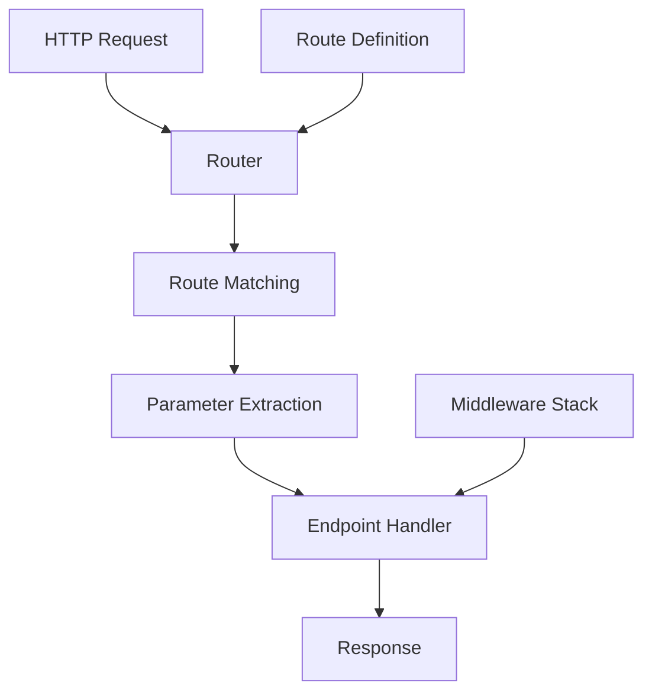

# Routing in Azu

Azu's routing system provides a powerful, type-safe way to define and handle HTTP requests. Built on the high-performance Radix tree, it offers both compile-time route registration and runtime pattern matching.

## Overview



## Basic Routing

### HTTP Method Registration

```crystal
struct UserEndpoint
  include Endpoint(UserRequest, UserResponse)

  # Standard HTTP methods
  get "/users"
  post "/users"
  put "/users/:id"
  patch "/users/:id"
  delete "/users/:id"

  # Custom methods
  head "/users"
  options "/users"

  def call : UserResponse
    case request.method
    when .get?
      list_users
    when .post?
      create_user
    when .put?, .patch?
      update_user
    when .delete?
      delete_user
    end
  end
end
```

### Route Parameters

```crystal
struct BlogEndpoint
  include Endpoint(BlogRequest, BlogResponse)

  # Simple parameter
  get "/posts/:id"

  # Multiple parameters
  get "/posts/:id/comments/:comment_id"

  # Optional parameters (using query strings)
  get "/posts"

  def call : BlogResponse
    case request.path
    when /^\/posts\/(\d+)$/
      show_post($1.to_i)
    when /^\/posts\/(\d+)\/comments\/(\d+)$/
      show_comment($1.to_i, $2.to_i)
    when /^\/posts$/
      list_posts
    end
  end
end
```

## Advanced Routing Patterns

### Nested Routes

```crystal
struct ApiEndpoint
  include Endpoint(ApiRequest, ApiResponse)

  # Nested resource routes
  get "/api/v1/users/:user_id/posts/:post_id"
  post "/api/v1/users/:user_id/posts"
  get "/api/v1/users/:user_id/posts"

  # Namespace routes
  get "/api/v1/admin/users"
  post "/api/v1/admin/users"

  def call : ApiResponse
    case request.path
    when /^\/api\/v1\/users\/(\d+)\/posts\/(\d+)$/
      show_user_post($1.to_i, $2.to_i)
    when /^\/api\/v1\/users\/(\d+)\/posts$/
      if request.post?
        create_user_post($1.to_i)
      else
        list_user_posts($1.to_i)
      end
    when /^\/api\/v1\/admin\/users$/
      if request.post?
        create_admin_user
      else
        list_admin_users
      end
    end
  end
end
```

### Wildcard Routes

```crystal
struct StaticEndpoint
  include Endpoint(StaticRequest, StaticResponse)

  # Catch-all route for static files
  get "/static/*"

  # Specific file types
  get "/images/*.jpg"
  get "/images/*.png"
  get "/documents/*.pdf"

  def call : StaticResponse
    case request.path
    when /^\/static\/(.+)$/
      serve_static_file($1)
    when /^\/images\/(.+)\.(jpg|png)$/
      serve_image($1, $2)
    when /^\/documents\/(.+)\.pdf$/
      serve_document($1)
    end
  end
end
```

## Route Constraints

### Type Constraints

```crystal
struct ConstrainedEndpoint
  include Endpoint(ConstrainedRequest, ConstrainedResponse)

  # Numeric constraints
  get "/users/:id", constraints: {id: /\d+/}
  get "/posts/:year/:month", constraints: {
    year: /\d{4}/,
    month: /\d{2}/
  }

  # Custom constraints
  get "/categories/:slug", constraints: {slug: /[a-z0-9-]+/}

  def call : ConstrainedResponse
    case request.path
    when /^\/users\/(\d+)$/
      show_user($1.to_i)
    when /^\/posts\/(\d{4})\/(\d{2})$/
      show_posts_by_month($1.to_i, $2.to_i)
    when /^\/categories\/([a-z0-9-]+)$/
      show_category($1)
    end
  end
end
```

### HTTP Method Constraints

```crystal
struct MethodConstrainedEndpoint
  include Endpoint(MethodRequest, MethodResponse)

  # Method-specific routes
  get "/api/users", only: [:index, :show]
  post "/api/users", only: [:create]
  put "/api/users/:id", only: [:update]
  delete "/api/users/:id", only: [:destroy]

  def call : MethodResponse
    case {request.method, request.path}
    when {.get?, /^\/api\/users$/}
      list_users
    when {.get?, /^\/api\/users\/(\d+)$/}
      show_user($1.to_i)
    when {.post?, /^\/api\/users$/}
      create_user
    when {.put?, /^\/api\/users\/(\d+)$/}
      update_user($1.to_i)
    when {.delete?, /^\/api\/users\/(\d+)$/}
      delete_user($1.to_i)
    end
  end
end
```

## Route Groups and Namespaces

### Grouped Routes

```crystal
struct GroupedEndpoint
  include Endpoint(GroupedRequest, GroupedResponse)

  # Route groups with common prefix
  group "/api/v1" do
    get "/users"
    post "/users"
    get "/users/:id"
    put "/users/:id"
    delete "/users/:id"
  end

  # Nested groups
  group "/api/v1" do
    group "/admin" do
      get "/users"
      post "/users"
    end

    group "/public" do
      get "/posts"
      get "/posts/:id"
    end
  end

  def call : GroupedResponse
    case request.path
    when /^\/api\/v1\/users$/
      handle_users
    when /^\/api\/v1\/users\/(\d+)$/
      handle_user($1.to_i)
    when /^\/api\/v1\/admin\/users$/
      handle_admin_users
    when /^\/api\/v1\/public\/posts$/
      handle_public_posts
    when /^\/api\/v1\/public\/posts\/(\d+)$/
      handle_public_post($1.to_i)
    end
  end
end
```

### Namespaced Routes

```crystal
struct NamespacedEndpoint
  include Endpoint(NamespacedRequest, NamespacedResponse)

  # Namespace with module organization
  namespace "/api/v1" do
    namespace "/users" do
      get "/"
      post "/"
      get "/:id"
      put "/:id"
      delete "/:id"
    end

    namespace "/posts" do
      get "/"
      post "/"
      get "/:id"
      put "/:id"
      delete "/:id"
    end
  end

  def call : NamespacedResponse
    case request.path
    when /^\/api\/v1\/users\/$/
      list_users
    when /^\/api\/v1\/users\/(\d+)$/
      handle_user($1.to_i)
    when /^\/api\/v1\/posts\/$/
      list_posts
    when /^\/api\/v1\/posts\/(\d+)$/
      handle_post($1.to_i)
    end
  end
end
```

## Route Helpers

### Named Routes

```crystal
struct NamedRouteEndpoint
  include Endpoint(NamedRequest, NamedResponse)

  # Named routes for easy reference
  get "/users/:id", as: :user_path
  get "/posts/:id", as: :post_path
  get "/categories/:slug", as: :category_path

  def call : NamedResponse
    # Generate URLs using route helpers
    user_url = user_path(id: 123)
    post_url = post_path(id: 456)
    category_url = category_path(slug: "technology")

    # Use in responses
    NamedResponse.new(
      links: {
        user: user_url,
        post: post_url,
        category: category_url
      }
    )
  end
end
```

### URL Generation

```crystal
# Route helper methods
def user_path(id : Int32) : String
  "/users/#{id}"
end

def post_path(id : Int32) : String
  "/posts/#{id}"
end

def category_path(slug : String) : String
  "/categories/#{slug}"
end

# With query parameters
def users_path(page : Int32? = nil, per_page : Int32? = nil) : String
  path = "/users"
  params = [] of String

  params << "page=#{page}" if page
  params << "per_page=#{per_page}" if per_page

  path += "?#{params.join("&")}" unless params.empty?
  path
end
```

## Route Middleware

### Route-Specific Middleware

```crystal
struct MiddlewareEndpoint
  include Endpoint(MiddlewareRequest, MiddlewareResponse)

  # Apply middleware to specific routes
  get "/admin/users", middleware: [AuthMiddleware, AdminMiddleware]
  get "/api/users", middleware: [ApiAuthMiddleware]
  get "/public/posts", middleware: [CacheMiddleware]

  def call : MiddlewareResponse
    case request.path
    when /^\/admin\/users$/
      list_admin_users
    when /^\/api\/users$/
      list_api_users
    when /^\/public\/posts$/
      list_public_posts
    end
  end
end
```

### Conditional Middleware

```crystal
struct ConditionalMiddlewareEndpoint
  include Endpoint(ConditionalRequest, ConditionalResponse)

  # Conditional middleware based on environment
  get "/api/users", middleware: conditional_middleware

  private def conditional_middleware
    if Azu::Environment.production?
      [RateLimitMiddleware, AuthMiddleware]
    else
      [AuthMiddleware]
    end
  end

  def call : ConditionalResponse
    list_users
  end
end
```

## Route Testing

### Unit Testing Routes

```crystal
describe "UserEndpoint" do
  it "routes GET /users to list_users" do
    endpoint = UserEndpoint.new
    request = create_request("GET", "/users")

    response = endpoint.call(request)

    assert response.status == 200
    assert response.body.includes?("users")
  end

  it "routes GET /users/:id to show_user" do
    endpoint = UserEndpoint.new
    request = create_request("GET", "/users/123")

    response = endpoint.call(request)

    assert response.status == 200
    assert response.body.includes?("user 123")
  end
end
```

### Integration Testing

```crystal
describe "Routing Integration" do
  it "handles nested routes correctly" do
    app = TestApp.new
    response = app.get("/api/v1/users/123/posts/456")

    assert response.status == 200
    assert response.body.includes?("user 123 post 456")
  end

  it "applies middleware correctly" do
    app = TestApp.new
    response = app.get("/admin/users")

    # Should be redirected if not authenticated
    assert response.status == 302
  end
end
```

## Performance Considerations

### Route Tree Optimization

```crystal
# Efficient route matching
struct OptimizedEndpoint
  include Endpoint(OptimizedRequest, OptimizedResponse)

  # Group similar routes together
  get "/api/v1/users"
  get "/api/v1/users/:id"
  get "/api/v1/users/:id/posts"

  # Use specific constraints to reduce matching time
  get "/api/v1/posts/:year/:month", constraints: {
    year: /\d{4}/,
    month: /\d{2}/
  }

  def call : OptimizedResponse
    # Fast path matching
    case request.path
    when /^\/api\/v1\/users$/
      list_users
    when /^\/api\/v1\/users\/(\d+)$/
      show_user($1.to_i)
    when /^\/api\/v1\/users\/(\d+)\/posts$/
      show_user_posts($1.to_i)
    when /^\/api\/v1\/posts\/(\d{4})\/(\d{2})$/
      show_posts_by_month($1.to_i, $2.to_i)
    end
  end
end
```

### Caching Routes

```crystal
# Cache compiled routes for better performance
class RouteCache
  @@compiled_routes = {} of String => Regex

  def self.get_route(pattern : String) : Regex
    @@compiled_routes[pattern] ||= Regex.new(pattern)
  end
end
```

## Best Practices

### 1. Use Descriptive Route Names

```crystal
# Good: Clear and descriptive
get "/api/v1/users/:id/posts/:post_id/comments"
get "/api/v1/admin/users/:id/permissions"

# Avoid: Unclear or ambiguous
get "/api/v1/u/:id/p/:pid/c"
get "/api/v1/a/u/:id/p"
```

### 2. Group Related Routes

```crystal
# Good: Logical grouping
group "/api/v1" do
  group "/users" do
    get "/"
    post "/"
    get "/:id"
    put "/:id"
    delete "/:id"
  end
end

# Avoid: Scattered routes
get "/api/v1/users"
post "/api/v1/users"
get "/api/v1/users/:id"
put "/api/v1/users/:id"
delete "/api/v1/users/:id"
```

### 3. Use Constraints for Validation

```crystal
# Good: Validate parameters at routing level
get "/users/:id", constraints: {id: /\d+/}
get "/posts/:year/:month", constraints: {
  year: /\d{4}/,
  month: /\d{2}/
}

# Avoid: No validation
get "/users/:id"
get "/posts/:year/:month"
```

### 4. Keep Routes RESTful

```crystal
# Good: RESTful conventions
get "/users"           # List users
post "/users"          # Create user
get "/users/:id"       # Show user
put "/users/:id"       # Update user
delete "/users/:id"    # Delete user

# Avoid: Non-RESTful patterns
get "/get_users"
post "/create_user"
get "/show_user/:id"
post "/update_user/:id"
post "/delete_user/:id"
```

## Next Steps

- [Endpoints](core-concepts/endpoints.md) - Learn about endpoint implementation
- [Request Contracts](core-concepts/requests.md) - Understand request handling
- [Response Objects](core-concepts/responses.md) - Explore response patterns
- [Middleware](middleware.md) - Add middleware to routes
