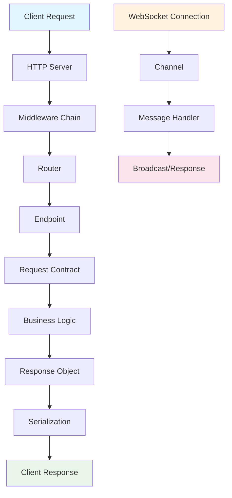
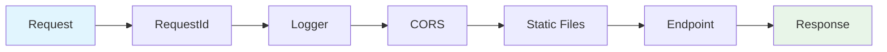
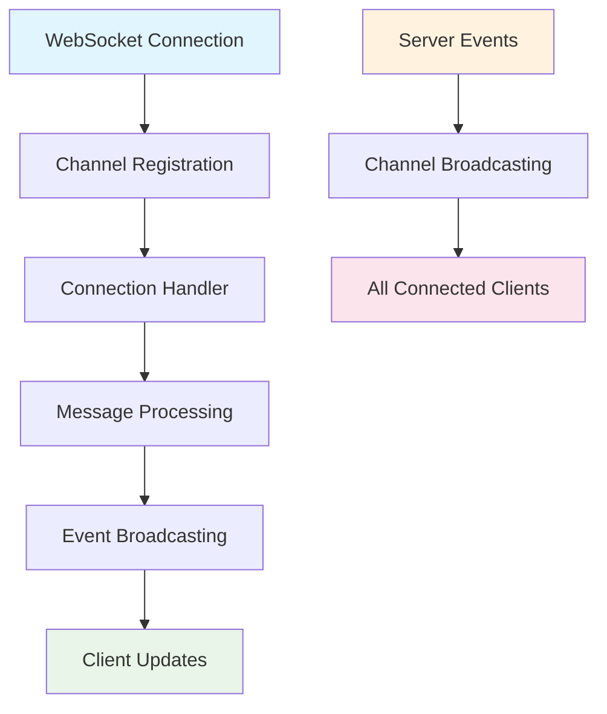

# Azu Architecture

Understanding Azu's architecture is key to building effective applications. This guide covers the core architectural patterns, request lifecycle, and design principles that make Azu powerful and type-safe.

## Core Architecture Principles

### Type Safety First

Azu is built around Crystal's powerful type system, providing compile-time guarantees for:

- **Request Validation**: All incoming data is validated at compile time
- **Response Structure**: Response objects are type-safe and consistent
- **Route Parameters**: URL parameters are typed and validated
- **WebSocket Messages**: Real-time communication is type-safe

### Component-Based Design

Azu follows a modular, component-based architecture:

- **Endpoints**: Self-contained request handlers
- **Request Contracts**: Type-safe input validation
- **Response Objects**: Structured output handling
- **Channels**: Real-time communication handlers
- **Components**: Reusable UI components

### Performance by Design

Built for high performance:

- **Compile-time Optimization**: Crystal's compiler optimizes your code
- **Memory Efficiency**: Predictable memory usage with no GC pauses
- **Concurrent Processing**: Handle thousands of connections efficiently
- **Minimal Overhead**: Framework adds minimal runtime cost

## Request-Response Lifecycle



### 1. Request Processing

When a request arrives:

1. **HTTP Server**: Crystal's built-in HTTP server receives the request
2. **Middleware Chain**: Request passes through configured middleware
3. **Router**: Routes the request to the appropriate endpoint
4. **Endpoint**: Type-safe endpoint processes the request

### 2. Request Validation

```crystal
struct UserRequest
  include Azu::Request

  @name : String
  @email : String

  validate name, presence: true, length: {min: 2, max: 50}
  validate email, presence: true, format: /\A[\w+\-.]+@[a-z\d\-]+(\.[a-z\d\-]+)*\.[a-z]+\z/i
end
```

Request contracts automatically:

- Parse and validate incoming data
- Provide type-safe access to parameters
- Generate detailed error messages
- Ensure data integrity

### 3. Business Logic

```crystal
struct UserEndpoint
  include Azu::Endpoint(UserRequest, UserResponse)

  post "/users"

  def call : UserResponse
    # Type-safe access to validated data
    user = create_user(user_request.name, user_request.email)
    UserResponse.new(user)
  end
end
```

### 4. Response Generation

```crystal
struct UserResponse
  include Azu::Response

  def initialize(@user : User)
  end

  def render
    {
      id: @user.id,
      name: @user.name,
      email: @user.email,
      created_at: @user.created_at.to_rfc3339
    }.to_json
  end
end
```

## Middleware Architecture

Azu uses a middleware chain pattern for request processing:



### Built-in Middleware

- **RequestId**: Adds unique request identifiers
- **Logger**: Request/response logging
- **CORS**: Cross-origin resource sharing
- **Static**: Static file serving
- **Rescuer**: Error handling and recovery

### Custom Middleware

```crystal
class CustomMiddleware
  include HTTP::Handler

  def call(context : HTTP::Server::Context)
    # Pre-processing
    Log.info { "Processing request: #{context.request.path}" }

    # Call next middleware
    call_next(context)

    # Post-processing
    Log.info { "Request completed: #{context.response.status_code}" }
  end
end
```

## Routing System

Azu uses a high-performance routing tree based on Radix:

```crystal
router do
  root :web, HomeEndpoint

  routes :web, "/api" do
    get "/users", ListUsersEndpoint
    get "/users/:id", ShowUserEndpoint
    post "/users", CreateUserEndpoint
    put "/users/:id", UpdateUserEndpoint
    delete "/users/:id", DeleteUserEndpoint
  end

  routes :web, "/admin" do
    get "/dashboard", AdminDashboardEndpoint
  end
end
```

### Route Features

- **HTTP Methods**: Support for all standard HTTP methods
- **Path Parameters**: Typed URL parameters (`:id`, `:slug`)
- **Route Groups**: Organize related routes
- **Nested Routes**: Hierarchical route organization
- **Route Constraints**: Additional validation rules

## WebSocket Architecture

Real-time communication in Azu:



### Channel Pattern

```crystal
class NotificationChannel < Azu::Channel
  CONNECTIONS = Set(HTTP::WebSocket).new

  ws "/notifications"

  def on_connect
    CONNECTIONS << socket.not_nil!
    send_welcome_message
  end

  def on_message(message : String)
    handle_message(JSON.parse(message))
  end

  def on_close(code, message)
    CONNECTIONS.delete(socket)
  end

  def self.broadcast_to_all(data)
    CONNECTIONS.each { |socket| socket.send(data.to_json) }
  end
end
```

## Component System

Live components for interactive UI:

```crystal
class CounterComponent
  include Azu::Component

  @count = 0

  def content
    div do
      text "Count: #{@count}"
      button "Increment", onclick: "increment"
    end
  end

  def on_event("increment", data)
    @count += 1
    update!
  end
end
```

### Component Lifecycle

1. **Mount**: Component is created and registered
2. **Render**: Initial HTML is generated
3. **Event Handling**: Client events are processed
4. **Update**: Component state changes trigger re-renders
5. **Unmount**: Component is cleaned up

## Template System

Azu includes a powerful template engine based on Jinja2:

### Template Features

- **Variable Interpolation**: `{{ variable }}`
- **Control Structures**: `` loops and conditionals
- **Template Inheritance**: Extend base templates
- **Hot Reload**: Automatic template reloading in development
- **Markup DSL**: Programmatic HTML generation

### Template Rendering

```crystal
struct UserPage
  include Azu::Response
  include Azu::Templates::Renderable

  def initialize(@user : User)
  end

  def render
    view "users/show.html", {
      user: @user,
      title: "User Profile"
    }
  end
end
```

## Configuration System

Centralized configuration with environment support:

```crystal
module MyApp
  include Azu

  configure do |config|
    # Server configuration
    config.host = "0.0.0.0"
    config.port = 3000
    config.env = "development"

    # Template configuration
    config.templates.path = ["templates"]
    config.template_hot_reload = config.env.development?

    # Upload configuration
    config.upload.max_file_size = 10.megabytes
    config.upload.temp_dir = "/tmp/uploads"

    # Logging configuration
    config.log.level = config.env.development? ? Log::Severity::DEBUG : Log::Severity::INFO
  end
end
```

## Error Handling

Comprehensive error handling system:

### Error Types

- **ValidationError**: Request validation failures
- **NotFound**: Resource not found (404)
- **Unauthorized**: Authentication failures (401)
- **Forbidden**: Authorization failures (403)
- **InternalServerError**: Server errors (500)

### Error Response Format

```json
{
  "Status": "Unprocessable Entity",
  "Title": "Validation Error",
  "Detail": "The request could not be processed due to validation errors.",
  "FieldErrors": {
    "name": ["Name must be between 2 and 50 characters"],
    "email": ["Email must be a valid email address"]
  },
  "ErrorId": "err_abc123",
  "Fingerprint": "validation_error_abc",
  "Timestamp": "2023-12-04T15:35:12Z"
}
```

## Performance Characteristics

### Compile-time Optimizations

- **Type Elimination**: Unused code is eliminated at compile time
- **Method Inlining**: Small methods are inlined for performance
- **Dead Code Elimination**: Unreachable code is removed
- **Constant Folding**: Compile-time constant evaluation

### Runtime Performance

- **Zero-cost Abstractions**: Framework abstractions have minimal overhead
- **Memory Efficiency**: Predictable memory usage patterns
- **Concurrent Processing**: Efficient handling of multiple requests
- **Connection Pooling**: Optimized database and external service connections

### Benchmarking

Azu is designed for high performance:

- **Request Throughput**: Handle thousands of requests per second
- **Memory Usage**: Low memory footprint with predictable patterns
- **Latency**: Sub-millisecond request processing overhead
- **Scalability**: Efficient resource usage for horizontal scaling

## Security Architecture

### Built-in Security Features

- **CSRF Protection**: Cross-site request forgery prevention
- **Input Validation**: Comprehensive request validation
- **XSS Prevention**: Automatic output escaping
- **SQL Injection Prevention**: Type-safe database queries
- **Secure Headers**: Security-focused HTTP headers

### Security Best Practices

- **Input Sanitization**: All user input is validated and sanitized
- **Output Encoding**: Automatic HTML/XML encoding
- **Authentication**: Secure session management
- **Authorization**: Role-based access control
- **HTTPS Enforcement**: Secure communication protocols

## Development vs Production

### Development Mode

- **Hot Reload**: Automatic code and template reloading
- **Debug Logging**: Detailed request/response logging
- **Error Pages**: Comprehensive error information
- **Performance Monitoring**: Development-time metrics

### Production Mode

- **Optimized Compilation**: Release-mode optimizations
- **Minimal Logging**: Production-appropriate logging levels
- **Error Handling**: User-friendly error responses
- **Performance Monitoring**: Production metrics and alerting

## Next Steps

Now that you understand Azu's architecture:

1. **[Endpoints](endpoints.md)** - Learn about endpoint patterns and best practices
2. **[Request Contracts](requests.md)** - Master request validation and type safety
3. **[Response Objects](responses.md)** - Structure your API responses
4. **[Routing](routing.md)** - Organize your application routes
5. **[Middleware](middleware.md)** - Customize request processing
6. **[WebSocket Channels](../features/websockets.md)** - Build real-time features
7. **[Components](../features/components.md)** - Create interactive UI components

---

_Understanding Azu's architecture gives you the foundation to build robust, type-safe, and performant web applications with confidence._
