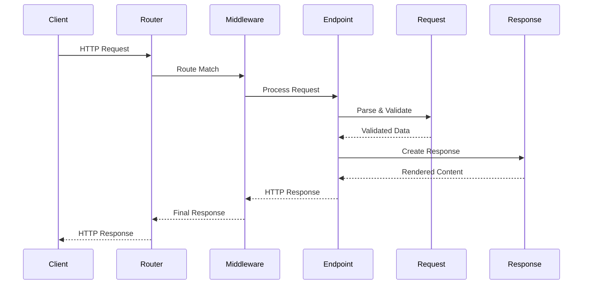

# Getting Started

This guide will walk you through installing Azu, creating your first application, and understanding the basic concepts needed to build web applications with the framework.

## Prerequisites

Before getting started with Azu, ensure you have:

- **Crystal** ≥ 0.35.0 installed ([Installation guide](https://crystal-lang.org/install/))
- **Basic understanding** of Crystal syntax and concepts
- **Text editor** with Crystal support (VS Code with Crystal extension recommended)

## Installation

### 1. Create a New Project

```bash
mkdir my_azu_app
cd my_azu_app
crystal init app my_azu_app
```

### 2. Add Azu to Dependencies

Edit your `shard.yml` file:

```yaml
name: my_azu_app
version: 0.1.0

dependencies:
  azu:
    github: azutoolkit/azu
    version: ~> 0.4.14

crystal: ">= 0.35.0"

targets:
  my_azu_app:
    main: src/my_azu_app.cr
```

### 3. Install Dependencies

```bash
shards install
```

## Your First Application

Let's build a simple "Hello World" application to understand Azu's basic structure.

### Application Structure

Create the following directory structure:

```
my_azu_app/
├── src/
│   ├── my_azu_app.cr          # Main application file
│   ├── endpoints/             # HTTP endpoints
│   ├── requests/              # Request contracts
│   ├── responses/             # Response objects
│   └── templates/             # View templates
├── spec/                      # Test files
└── shard.yml                  # Dependencies
```

### 1. Main Application File

Create `src/my_azu_app.cr`:

```crystal
require "azu"

# Define your application module
module MyAzuApp
  include Azu

  # Configure the application
  configure do
    port = ENV.fetch("PORT", "3000").to_i
    host = ENV.fetch("HOST", "localhost")
    env = Azu::Environment.parse(ENV.fetch("CRYSTAL_ENV", "development"))

    # Template configuration
    templates.path = "src/templates"
    template_hot_reload = env.development?
  end
end

# Load application components
require "./requests/*"
require "./responses/*"
require "./endpoints/*"

# Start the server with middleware
MyAzuApp.start([
  Azu::Handler::RequestId.new,    # Add request IDs for tracking
  Azu::Handler::Logger.new,       # Request/response logging
  Azu::Handler::Rescuer.new,      # Error handling
  Azu::Handler::Static.new,       # Static file serving
])
```

### 2. Create a Request Contract

Create `src/requests/hello_request.cr`:

```crystal
module MyAzuApp
  # Empty request for simple GET endpoints
  struct HelloRequest
    include Azu::Request

    # No parameters needed for hello world
    def initialize
    end
  end
end
```

### 3. Create a Response Object

Create `src/responses/hello_response.cr`:

```crystal
module MyAzuApp
  struct HelloResponse
    include Azu::Response

    def initialize(@message : String, @timestamp : Time = Time.utc)
    end

    def render
      {
        message: @message,
        timestamp: @timestamp,
        environment: MyAzuApp.env
      }.to_json
    end
  end
end
```

### 4. Create an Endpoint

Create `src/endpoints/hello_endpoint.cr`:

```crystal
module MyAzuApp
  struct HelloEndpoint
    include Endpoint(HelloRequest, HelloResponse)

    # Define the route
    get "/"

    # Handle the request
    def call : HelloResponse
      content_type "application/json"
      status 200

      HelloResponse.new("Hello, Azu! 🎉")
    end
  end
end
```

### 5. Run Your Application

```bash
crystal run src/my_azu_app.cr
```

You should see output similar to:

```
Server started at Sat 12/07/2024 02:30:45 PM.
   ⤑  Environment: development
   ⤑  Host: localhost
   ⤑  Port: 3000
   ⤑  Startup Time: 45.2 millis
```

Visit `http://localhost:3000` to see your application in action!

## Understanding the Request-Response Flow



Let's break down what happens:

1. **Router** receives the HTTP request and matches it to an endpoint
2. **Middleware chain** processes the request (logging, authentication, etc.)
3. **Endpoint** handles the request using the type-safe contract
4. **Request contract** validates and parses incoming data
5. **Response object** renders the output in the appropriate format
6. **Middleware chain** processes the response (headers, logging, etc.)
7. **Client** receives the final HTTP response

## Adding More Endpoints

Let's add a more complex endpoint that handles parameters and validation.

### 1. User Request Contract

Create `src/requests/user_request.cr`:

```crystal
module MyAzuApp
  struct UserRequest
    include Azu::Request

    @name : String
    @email : String
    @age : Int32?

    getter name, email, age

    def initialize(@name : String = "", @email : String = "", @age : Int32? = nil)
    end

    # Add validation rules
    validate :name, presence: true, size: 2..50
    validate :email, presence: true, format: /@/
    validate :age, range: 13..120, if: ->(req : UserRequest) { !req.age.nil? }
  end
end
```

### 2. User Response

Create `src/responses/user_response.cr`:

```crystal
module MyAzuApp
  struct UserResponse
    include Azu::Response

    def initialize(@user_data : UserRequest, @created_at : Time = Time.utc)
    end

    def render
      {
        user: {
          name: @user_data.name,
          email: @user_data.email,
          age: @user_data.age
        },
        created_at: @created_at,
        status: "success"
      }.to_json
    end
  end
end
```

### 3. User Endpoint

Create `src/endpoints/user_endpoint.cr`:

```crystal
module MyAzuApp
  struct UserEndpoint
    include Endpoint(UserRequest, UserResponse)

    post "/users"

    def call : UserResponse
      content_type "application/json"

      # Validate the request
      unless user_request.valid?
        return error("Validation failed", 422, user_request.error_messages)
      end

      status 201
      UserResponse.new(user_request)
    end
  end
end
```

Now you can test the endpoint:

```bash
curl -X POST http://localhost:3000/users \
  -H "Content-Type: application/json" \
  -d '{"name": "John Doe", "email": "john@example.com", "age": 30}'
```

## Configuration Options

Azu provides extensive configuration options. Here are the most commonly used:

### Basic Configuration

```crystal
module MyAzuApp
  include Azu

  configure do
    # Server settings
    port = 3000
    host = "0.0.0.0"
    port_reuse = true

    # Environment
    env = Azu::Environment::Development

    # Template settings
    templates.path = "src/templates"
    template_hot_reload = true

    # Logging
    log = Log.for("MyAzuApp")

    # SSL/TLS (optional)
    ssl_cert = "path/to/cert.pem"
    ssl_key = "path/to/key.pem"
  end
end
```

### Environment Variables

Azu automatically reads configuration from environment variables:

```bash
# Server configuration
export PORT=3000
export HOST=localhost
export CRYSTAL_ENV=development

# Template configuration
export TEMPLATES_PATH=src/templates
export TEMPLATE_HOT_RELOAD=true

# Upload configuration
export UPLOAD_MAX_FILE_SIZE=10485760  # 10MB
export UPLOAD_TEMP_DIR=/tmp/uploads

# SSL configuration
export SSL_CERT=path/to/cert.pem
export SSL_KEY=path/to/key.pem
```

## Development vs Production

### Development Mode

In development, Azu provides:

- **Hot template reloading** for instant updates
- **Detailed error pages** with stack traces
- **Request/response logging**
- **Automatic code recompilation** (using `watchexec` or similar)

### Production Mode

In production, Azu optimizes for:

- **Template caching** for better performance
- **Minimal error information** for security
- **Structured logging** for monitoring
- **SSL/TLS support**

## Testing Your Application

Create `spec/hello_endpoint_spec.cr`:

```crystal
require "spec"
require "../src/my_azu_app"

describe MyAzuApp::HelloEndpoint do
  it "returns hello message" do
    endpoint = MyAzuApp::HelloEndpoint.new
    response = endpoint.call

    response.should be_a(MyAzuApp::HelloResponse)
    JSON.parse(response.render)["message"].should eq("Hello, Azu! 🎉")
  end
end
```

Run tests with:

```bash
crystal spec
```

## Next Steps

Now that you have a basic Azu application running, you can explore:

1. **[Core Concepts](core-concepts.md)** - Deep dive into endpoints, requests, and responses
2. **[Routing](core-concepts/routing.md)** - Advanced routing patterns and parameters
3. **[Middleware](middleware.md)** - Built-in handlers and custom middleware
4. **[Real-Time Features](real-time.md)** - WebSocket channels and live components
5. **[Templates](templates.md)** - Template engine and markup DSL

## Common Pitfalls

### 1. Forgetting to Include Modules

```crystal
# ❌ Wrong - missing include
struct MyEndpoint
  get "/"
  def call; end
end

# ✅ Correct - include required modules
struct MyEndpoint
  include Endpoint(MyRequest, MyResponse)
  get "/"
  def call : MyResponse; end
end
```

### 2. Incorrect Type Annotations

```crystal
# ❌ Wrong - missing return type
def call
  MyResponse.new
end

# ✅ Correct - explicit return type
def call : MyResponse
  MyResponse.new
end
```

### 3. Missing Request/Response Requirements

```crystal
# ❌ Wrong - missing render method
struct MyResponse
  include Azu::Response
  # Missing render method
end

# ✅ Correct - implement render method
struct MyResponse
  include Azu::Response

  def render
    "Hello World"
  end
end
```

---

**Congratulations!** You've successfully created your first Azu application. The framework's type-safe approach ensures that many common web development errors are caught at compile time, leading to more reliable applications.

Continue to [Core Concepts](core-concepts.md) to learn about advanced features and patterns.
