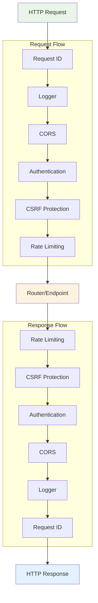

# Middleware

Middleware in Azu provides a powerful mechanism for handling cross-cutting concerns such as authentication, logging, CORS, and error handling. The middleware system is based on Crystal's HTTP::Handler interface, providing a clean chain-of-responsibility pattern for request processing.

## Middleware Architecture



### Middleware Execution Order

Middleware executes in a **nested** pattern:
1. **Request phase**: Middleware executes in registration order
2. **Endpoint processing**: The matched endpoint handles the request
3. **Response phase**: Middleware executes in reverse order

This pattern ensures that middleware can modify both incoming requests and outgoing responses.

## Built-in Middleware

Azu provides several built-in middleware handlers for common use cases.

### Request ID Handler

Adds unique request IDs for tracking and debugging:

```crystal
# Usage
MyApp.start([
  Azu::Handler::RequestId.new,
  # ... other middleware
])

# Features:
# - Generates unique request IDs
# - Adds X-Request-ID header to responses
# - Passes request ID to logger context
# - Supports custom ID generation

# Advanced configuration
MyApp.start([
  Azu::Handler::RequestId.new(
    header_name: "X-Custom-Request-ID",
    generator: ->(context : HTTP::Server::Context) {
      "#{Time.utc.to_unix_ms}-#{Random.hex(8)}"
    }
  )
])
```

### Logger Handler

Provides structured request/response logging:

```crystal
# Basic usage
MyApp.start([
  Azu::Handler::Logger.new,
  # ... other middleware
])

# Advanced configuration
MyApp.start([
  Azu::Handler::Logger.new(
    log: Log.for("MyApp::HTTP"),
    level: Log::Severity::INFO,
    format: :json, # :text, :json, or custom formatter
    include_request_body: false,
    include_response_body: false,
    max_body_size: 1024
  )
])

# Custom log format
custom_logger = Azu::Handler::Logger.new do |context, elapsed|
  {
    method: context.request.method,
    path: context.request.path,
    status: context.response.status_code,
    duration_ms: elapsed.total_milliseconds,
    user_agent: context.request.headers["User-Agent"]?,
    ip: context.request.remote_address,
    timestamp: Time.utc.to_rfc3339
  }.to_json
end
```

### CORS Handler

Handles Cross-Origin Resource Sharing:

```crystal
# Basic CORS (allows all origins)
MyApp.start([
  Azu::Handler::CORS.new,
  # ... other middleware
])

# Production CORS configuration
MyApp.start([
  Azu::Handler::CORS.new(
    allowed_origins: %w[https://myapp.com https://admin.myapp.com],
    allowed_methods: %w[GET POST PUT DELETE],
    allowed_headers: %w[Authorization Content-Type X-API-Key],
    exposed_headers: %w[X-Total-Count X-Rate-Limit],
    allow_credentials: true,
    max_age: 86400 # 24 hours
  )
])

# Dynamic origin validation
cors_handler = Azu::Handler::CORS.new do |origin, context|
  # Custom logic to validate origins
  return false unless origin

  # Allow all localhost origins in development
  return true if origin.includes?("localhost") && MyApp.env.development?

  # Check against whitelist in production
  allowed_domains = %w[myapp.com api.myapp.com]
  allowed_domains.any? { |domain| origin.ends_with?(domain) }
end
```

### CSRF Protection

Protects against Cross-Site Request Forgery attacks:

```crystal
# Basic CSRF protection
MyApp.start([
  Azu::Handler::CSRF.new(secret_key: ENV["CSRF_SECRET"]),
  # ... other middleware
])

# Advanced CSRF configuration
MyApp.start([
  Azu::Handler::CSRF.new(
    secret_key: ENV["CSRF_SECRET"],
    token_name: "authenticity_token",
    header_name: "X-CSRF-Token",
    cookie_name: "_csrf_token",
    secure: true, # HTTPS only
    same_site: :strict,
    skip_methods: %w[GET HEAD OPTIONS],
    skip_paths: %w[/api/webhooks /health],
    token_lifetime: 1.hour
  )
])

# Custom CSRF validation
csrf_handler = Azu::Handler::CSRF.new(secret_key: ENV["CSRF_SECRET"]) do |context|
  # Skip CSRF for API endpoints with valid API key
  if context.request.path.starts_with?("/api/")
    api_key = context.request.headers["X-API-Key"]?
    return true if api_key && valid_api_key?(api_key)
  end

  # Use default CSRF validation
  false
end
```

### Rate Limiting Handler

Implements request rate limiting:

```crystal
# Basic rate limiting (100 requests per minute per IP)
MyApp.start([
  Azu::Handler::Throttle.new(
    limit: 100,
    period: 1.minute
  ),
  # ... other middleware
])

# Advanced rate limiting with custom key generation
MyApp.start([
  Azu::Handler::Throttle.new(
    limit: 1000,
    period: 1.hour,
    key_generator: ->(context : HTTP::Server::Context) {
      # Rate limit by user ID if authenticated, otherwise by IP
      if user_id = extract_user_id(context)
        "user:#{user_id}"
      else
        "ip:#{context.request.remote_address}"
      end
    },
    storage: RedisStorage.new, # Custom storage backend
    on_limit_exceeded: ->(context : HTTP::Server::Context, key : String) {
      Log.warn { "Rate limit exceeded for #{key}" }
      context.response.headers["Retry-After"] = "3600"
    }
  )
])

# Multiple rate limits for different endpoints
api_throttle = Azu::Handler::Throttle.new(
  limit: 10000,
  period: 1.hour,
  condition: ->(context : HTTP::Server::Context) {
    context.request.path.starts_with?("/api/")
  }
)

auth_throttle = Azu::Handler::Throttle.new(
  limit: 5,
  period: 15.minutes,
  condition: ->(context : HTTP::Server::Context) {
    context.request.path == "/auth/login"
  }
)
```

### Static File Handler

Serves static files with caching and compression:

```crystal
# Basic static file serving
MyApp.start([
  Azu::Handler::Static.new(
    public_dir: "public",
    fallthrough: true # Continue to next handler if file not found
  ),
  # ... other middleware
])

# Advanced static file configuration
MyApp.start([
  Azu::Handler::Static.new(
    public_dir: "public",
    fallthrough: false,
    directory_listing: false,
    gzip_enabled: true,
    gzip_level: 6,
    cache_control: {
      "text/css" => "public, max-age=31536000", # 1 year for CSS
      "application/javascript" => "public, max-age=31536000", # 1 year for JS
      "image/*" => "public, max-age=2592000", # 30 days for images
      "default" => "public, max-age=3600" # 1 hour for everything else
    },
    etag_enabled: true,
    allowed_extensions: %w[.html .css .js .png .jpg .gif .svg .woff2]
  )
])
```

### Error Handler (Rescuer)

Provides centralized error handling and reporting:

```crystal
# Basic error handling
MyApp.start([
  Azu::Handler::Rescuer.new,
  # ... other middleware
])

# Advanced error handling with custom reporting
MyApp.start([
  Azu::Handler::Rescuer.new(
    reporter: CustomErrorReporter.new,
    show_stack_trace: MyApp.env.development?,
    log_errors: true,
    error_templates: {
      404 => "errors/not_found.html",
      500 => "errors/server_error.html"
    }
  )
])

# Custom error reporting
class CustomErrorReporter
  def report(error : Exception, context : HTTP::Server::Context)
    # Send to external service (Sentry, Rollbar, etc.)
    ExternalService.report_error({
      error: error.message,
      backtrace: error.backtrace,
      request: {
        method: context.request.method,
        path: context.request.path,
        headers: context.request.headers.to_h
      },
      user_agent: context.request.headers["User-Agent"]?,
      timestamp: Time.utc
    })
  end
end
```

## Custom Middleware Development

Create custom middleware by implementing the `HTTP::Handler` interface.

### Basic Custom Middleware

```crystal
class AuthenticationHandler
  include HTTP::Handler

  def initialize(@secret_key : String)
  end

  def call(context : HTTP::Server::Context)
    # Skip authentication for certain paths
    if skip_auth?(context.request.path)
      return call_next(context)
    end

    # Extract and verify token
    token = extract_token(context)
    unless token && valid_token?(token)
      return unauthorized_response(context)
    end

    # Add user to context for downstream handlers
    user = decode_user_from_token(token)
    context.set("current_user", user)

    # Continue to next handler
    call_next(context)
  end

  private def skip_auth?(path : String) : Bool
    AUTH_EXEMPT_PATHS.any? { |exempt_path| path.starts_with?(exempt_path) }
  end

  private def extract_token(context : HTTP::Server::Context) : String?
    # Try Authorization header first
    if auth_header = context.request.headers["Authorization"]?
      if match = auth_header.match(/Bearer (.+)/)
        return match[1]
      end
    end

    # Try cookie as fallback
    context.request.cookies["auth_token"]?.try(&.value)
  end

  private def valid_token?(token : String) : Bool
    begin
      JWT.decode(token, @secret_key)
      true
    rescue JWT::DecodeError
      false
    end
  end

  private def decode_user_from_token(token : String) : User
    payload = JWT.decode(token, @secret_key)
    User.find(payload["user_id"].as_i64)
  end

  private def unauthorized_response(context : HTTP::Server::Context)
    context.response.status_code = 401
    context.response.content_type = "application/json"
    context.response << {
      error: "Authentication required",
      message: "Please provide a valid authentication token"
    }.to_json
  end

  AUTH_EXEMPT_PATHS = %w[
    /auth/login
    /auth/register
    /health
    /public/
    /api/webhooks
  ]
end
```

### Advanced Middleware Patterns

#### Conditional Middleware

```crystal
class ConditionalHandler
  include HTTP::Handler

  def initialize(@condition : HTTP::Server::Context -> Bool, @handler : HTTP::Handler)
  end

  def call(context : HTTP::Server::Context)
    if @condition.call(context)
      @handler.call(context)
    else
      call_next(context)
    end
  end
end

# Usage
api_only_auth = ConditionalHandler.new(
  condition: ->(context : HTTP::Server::Context) {
    context.request.path.starts_with?("/api/")
  },
  handler: AuthenticationHandler.new(ENV["JWT_SECRET"])
)

MyApp.start([
  api_only_auth,
  # ... other middleware
])
```

#### Request/Response Transformation

```crystal
class RequestTransformHandler
  include HTTP::Handler

  def call(context : HTTP::Server::Context)
    # Transform request
    transform_request(context)

    # Process request
    call_next(context)

    # Transform response
    transform_response(context)
  end

  private def transform_request(context : HTTP::Server::Context)
    # Add default headers
    context.request.headers["X-App-Version"] = MyApp::VERSION

    # Normalize content type
    if context.request.headers["Content-Type"]?.try(&.includes?("application/json"))
      context.request.headers["Content-Type"] = "application/json; charset=utf-8"
    end

    # Parse and validate JSON body
    if json_request?(context)
      body = context.request.body.try(&.gets_to_end)
      if body && !body.empty?
        begin
          parsed = JSON.parse(body)
          context.set("parsed_json", parsed)
        rescue JSON::ParseException
          raise Azu::Response::BadRequest.new("Invalid JSON in request body")
        end
      end
    end
  end

  private def transform_response(context : HTTP::Server::Context)
    # Add security headers
    context.response.headers["X-Content-Type-Options"] = "nosniff"
    context.response.headers["X-Frame-Options"] = "DENY"
    context.response.headers["X-XSS-Protection"] = "1; mode=block"

    # Add CORS headers if needed
    if cors_request?(context)
      context.response.headers["Access-Control-Allow-Origin"] = "*"
    end

    # Compress response if applicable
    if compressible_response?(context) && accepts_gzip?(context)
      compress_response(context)
    end
  end

  private def json_request?(context : HTTP::Server::Context) : Bool
    content_type = context.request.headers["Content-Type"]?
    content_type.try(&.includes?("application/json")) || false
  end

  private def cors_request?(context : HTTP::Server::Context) : Bool
    context.request.headers["Origin"]? != nil
  end

  private def compressible_response?(context : HTTP::Server::Context) : Bool
    content_type = context.response.headers["Content-Type"]?
    return false unless content_type

    COMPRESSIBLE_TYPES.any? { |type| content_type.includes?(type) }
  end

  private def accepts_gzip?(context : HTTP::Server::Context) : Bool
    accept_encoding = context.request.headers["Accept-Encoding"]?
    accept_encoding.try(&.includes?("gzip")) || false
  end

  private def compress_response(context : HTTP::Server::Context)
    # Implementation would compress response body
    # and set appropriate headers
  end

  COMPRESSIBLE_TYPES = %w[
    text/html
    text/css
    text/javascript
    application/javascript
    application/json
    text/xml
    application/xml
  ]
end
```

#### Caching Middleware

```crystal
class CacheHandler
  include HTTP::Handler

  def initialize(@cache : Cache, @ttl : Time::Span = 5.minutes)
  end

  def call(context : HTTP::Server::Context)
    # Only cache GET requests
    unless context.request.method == "GET"
      return call_next(context)
    end

    cache_key = generate_cache_key(context)

    # Try to serve from cache
    if cached_response = @cache.get(cache_key)
      serve_cached_response(context, cached_response)
      return
    end

    # Capture response for caching
    original_io = context.response.output
    buffer = IO::Memory.new
    context.response.output = buffer

    # Process request
    call_next(context)

    # Cache successful responses
    if cacheable_response?(context)
      cached_data = {
        status: context.response.status_code,
        headers: context.response.headers.to_h,
        body: buffer.to_s
      }
      @cache.set(cache_key, cached_data, @ttl)
    end

    # Write response to original output
    context.response.output = original_io
    context.response.headers["X-Cache"] = "MISS"
    context.response << buffer.to_s
  end

  private def generate_cache_key(context : HTTP::Server::Context) : String
    # Include method, path, and relevant headers
    key_parts = [
      context.request.method,
      context.request.path,
      context.request.query || "",
      context.request.headers["Accept-Language"]? || "",
      context.request.headers["Authorization"]? ? "authenticated" : "anonymous"
    ]

    Digest::SHA256.hexdigest(key_parts.join("|"))
  end

  private def cacheable_response?(context : HTTP::Server::Context) : Bool
    # Only cache successful responses
    return false unless (200..299).includes?(context.response.status_code)

    # Don't cache responses with Set-Cookie headers
    return false if context.response.headers["Set-Cookie"]?

    # Don't cache private content
    cache_control = context.response.headers["Cache-Control"]?
    return false if cache_control.try(&.includes?("private"))

    true
  end

  private def serve_cached_response(context : HTTP::Server::Context, cached_data)
    context.response.status_code = cached_data["status"].as_i

    # Set cached headers
    cached_data["headers"].as_h.each do |key, value|
      context.response.headers[key] = value.as_s
    end

    # Add cache hit header
    context.response.headers["X-Cache"] = "HIT"

    # Write cached body
    context.response << cached_data["body"].as_s
  end
end
```

### Middleware Composition

Compose multiple middleware handlers for complex functionality:

```crystal
class SecurityStack
  include HTTP::Handler

  def initialize
    @handlers = [
      Azu::Handler::RequestId.new,
      SecurityHeadersHandler.new,
      Azu::Handler::CSRF.new(secret_key: ENV["CSRF_SECRET"]),
      RateLimitHandler.new(limit: 100, period: 1.minute),
      AuthenticationHandler.new(ENV["JWT_SECRET"])
    ]
  end

  def call(context : HTTP::Server::Context)
    # Chain all security-related handlers
    handler_chain = create_handler_chain(@handlers)
    handler_chain.call(context)
  end

  private def create_handler_chain(handlers : Array(HTTP::Handler))
    handlers.reverse.reduce(nil) do |next_handler, current_handler|
      current_handler.next = next_handler if next_handler
      current_handler
    end || handlers.first
  end
end

# Usage
MyApp.start([
  SecurityStack.new,
  CacheHandler.new(MemoryCache.new),
  Azu::Handler::Logger.new,
  # ... application handlers
])
```

## Error Handling in Middleware

Proper error handling is crucial for robust middleware:

```crystal
class SafeMiddleware
  include HTTP::Handler

  def call(context : HTTP::Server::Context)
    begin
      # Your middleware logic here
      perform_middleware_logic(context)
      call_next(context)

    rescue ex : Azu::Response::Error
      # Let Azu errors pass through to the error handler
      raise ex

    rescue ex : Exception
      # Convert unexpected errors to Azu errors
      Log.error(exception: ex) { "Middleware error in #{self.class.name}" }
      raise Azu::Response::Error.new(
        "Internal server error in middleware",
        HTTP::Status::INTERNAL_SERVER_ERROR,
        [] of String
      )

    ensure
      # Cleanup logic (if needed)
      cleanup_resources
    end
  end

  private def perform_middleware_logic(context : HTTP::Server::Context)
    # Your middleware implementation
  end

  private def cleanup_resources
    # Resource cleanup
  end
end
```

## Testing Middleware

Test middleware in isolation and as part of the full stack:

```crystal
require "spec"
require "../src/middleware/auth_handler"

class MockHandler
  include HTTP::Handler

  property called = false

  def call(context : HTTP::Server::Context)
    @called = true
    context.response.status_code = 200
    context.response << "OK"
  end
end

describe AuthenticationHandler do
  it "allows requests with valid tokens" do
    handler = AuthenticationHandler.new("secret")
    mock_next = MockHandler.new
    handler.next = mock_next

    context = create_test_context(
      method: "GET",
      path: "/api/users",
      headers: {"Authorization" => "Bearer #{valid_token}"}
    )

    handler.call(context)

    mock_next.called.should be_true
    context.response.status_code.should eq(200)
  end

  it "rejects requests with invalid tokens" do
    handler = AuthenticationHandler.new("secret")
    mock_next = MockHandler.new
    handler.next = mock_next

    context = create_test_context(
      method: "GET",
      path: "/api/users",
      headers: {"Authorization" => "Bearer invalid_token"}
    )

    handler.call(context)

    mock_next.called.should be_false
    context.response.status_code.should eq(401)
  end

  it "skips authentication for exempt paths" do
    handler = AuthenticationHandler.new("secret")
    mock_next = MockHandler.new
    handler.next = mock_next

    context = create_test_context(
      method: "GET",
      path: "/health"
    )

    handler.call(context)

    mock_next.called.should be_true
    context.response.status_code.should eq(200)
  end

  private def create_test_context(method = "GET", path = "/", headers = {} of String => String)
    request = HTTP::Request.new(method, path)
    headers.each { |key, value| request.headers[key] = value }

    response = HTTP::Server::Response.new(IO::Memory.new)
    HTTP::Server::Context.new(request, response)
  end

  private def valid_token
    payload = {"user_id" => 123, "exp" => Time.utc.to_unix + 3600}
    JWT.encode(payload, "secret", "HS256")
  end
end
```

## Performance Considerations

### Middleware Ordering

Order middleware for optimal performance:

```crystal
# ✅ Optimal ordering
MyApp.start([
  Azu::Handler::Static.new,          # 1. Static files (fastest exit)
  Azu::Handler::Throttle.new,        # 2. Rate limiting (early rejection)
  Azu::Handler::CORS.new,            # 3. CORS (before auth)
  AuthenticationHandler.new,          # 4. Authentication
  Azu::Handler::CSRF.new,            # 5. CSRF (after auth)
  CacheHandler.new,                  # 6. Caching (after auth/CSRF)
  Azu::Handler::Logger.new,          # 7. Logging (log everything)
  Azu::Handler::Rescuer.new,         # 8. Error handling (catch all)
])

# ❌ Suboptimal ordering
MyApp.start([
  Azu::Handler::Logger.new,          # Logs requests that might be rejected
  AuthenticationHandler.new,         # Authenticates requests for static files
  Azu::Handler::Static.new,          # Should be first
  Azu::Handler::Throttle.new,        # Should be earlier
])
```

### Caching and Memoization

Cache expensive operations in middleware:

```crystal
class ExpensiveMiddleware
  include HTTP::Handler

  # Cache expensive computations
  @cache = Hash(String, CachedResult).new
  @cache_mutex = Mutex.new

  def call(context : HTTP::Server::Context)
    cache_key = generate_cache_key(context)

    result = @cache_mutex.synchronize do
      if cached = @cache[cache_key]?
        # Check if cache is still valid
        if cached.expires_at > Time.utc
          cached.data
        else
          @cache.delete(cache_key)
          nil
        end
      end
    end

    result ||= perform_expensive_operation(context)

    # Cache the result
    @cache_mutex.synchronize do
      @cache[cache_key] = CachedResult.new(
        data: result,
        expires_at: Time.utc + 5.minutes
      )
    end

    # Apply result to context
    apply_result(context, result)
    call_next(context)
  end

  record CachedResult, data : String, expires_at : Time
end
```

---

## Summary

Azu's middleware system provides a flexible and powerful way to handle cross-cutting concerns:

- **Built-in handlers** cover common requirements like logging, CORS, and authentication
- **Custom middleware** can be created by implementing `HTTP::Handler`
- **Middleware composition** enables complex functionality through handler chains
- **Performance optimization** through proper ordering and caching
- **Error handling** ensures robust request processing

The middleware architecture enables clean separation of concerns while maintaining high performance and type safety.

**Next Steps:**
- [Templates & Views](templates.md) - Template engine and markup DSL
- [Testing](testing.md) - Testing strategies for middleware and applications
- [Performance](performance.md) - Optimization techniques and benchmarking
