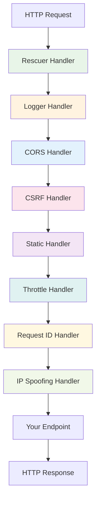

# Built-in Middleware Handlers

Azu provides a comprehensive set of built-in middleware handlers for common HTTP concerns, including error handling, logging, CORS, static file serving, and more.

## Overview

Built-in middleware enables:

- **Error handling**: Automatic exception catching and error page rendering
- **Logging**: Request/response logging with structured data
- **Security**: CORS, CSRF protection, and request validation
- **Performance**: Static file serving and caching
- **Monitoring**: Request throttling, rate limiting, and metrics
- **Reliability**: Request ID injection and IP spoofing protection

## Middleware Stack



## Handler Reference

### Rescuer Handler

Handles exceptions and renders error pages.

```crystal
# Basic usage
Azu::Handler::Rescuer.new

# With custom configuration
Azu::Handler::Rescuer.new(
  show_details: false,  # Hide error details in production
  log_errors: true,     # Log errors to console
  custom_templates: {   # Custom error templates
    404 => "errors/not_found.html",
    500 => "errors/server_error.html"
  }
)
```

**Features:**

- Automatic exception catching
- Custom error page templates
- Environment-aware error details
- Structured error logging

### Logger Handler

Logs request and response information.

```crystal
# Basic usage
Azu::Handler::Logger.new

# With custom configuration
Azu::Handler::Logger.new(
  level: :info,                    # Log level
  format: :json,                   # Log format (json, text)
  include_headers: false,          # Include request headers
  include_body: false,             # Include request body
  sensitive_fields: ["password"],  # Fields to redact
  custom_logger: MyLogger.new      # Custom logger instance
)
```

**Features:**

- Request/response logging
- Performance timing
- Sensitive data redaction
- Custom log formats
- Structured logging

### CORS Handler

Handles Cross-Origin Resource Sharing.

```crystal
# Basic usage
Azu::Handler::CORS.new

# With custom configuration
Azu::Handler::CORS.new(
  origins: ["https://example.com", "https://api.example.com"],
  methods: ["GET", "POST", "PUT", "DELETE"],
  headers: ["Content-Type", "Authorization"],
  credentials: true,
  max_age: 86400
)
```

**Features:**

- Configurable origins
- Method and header whitelisting
- Credential support
- Preflight request handling

### CSRF Handler

Protects against Cross-Site Request Forgery attacks.

```crystal
# Basic usage
Azu::Handler::CSRF.new

# With custom configuration
Azu::Handler::CSRF.new(
  secret: "your-secret-key",
  token_length: 32,
  cookie_name: "_csrf_token",
  header_name: "X-CSRF-Token",
  excluded_paths: ["/api/webhook"]
)
```

**Features:**

- Automatic token generation
- Token validation
- Cookie and header support
- Path exclusions

### Static Handler

Serves static files efficiently.

```crystal
# Basic usage
Azu::Handler::Static.new

# With custom configuration
Azu::Handler::Static.new(
  root: "public",           # Static files directory
  index: "index.html",      # Default index file
  cache_control: "public, max-age=31536000",  # Cache headers
  gzip: true,               # Enable gzip compression
  etag: true,               # Enable ETag headers
  mime_types: {             # Custom MIME types
    ".md" => "text/markdown",
    ".cson" => "application/cson"
  }
)
```

**Features:**

- Efficient file serving
- Automatic MIME type detection
- Caching headers
- Gzip compression
- ETag support

### Throttle Handler

Implements rate limiting and request throttling.

```crystal
# Basic usage
Azu::Handler::Throttle.new

# With custom configuration
Azu::Handler::Throttle.new(
  limit: 100,               # Requests per window
  window: 60,               # Time window in seconds
  key_by: :ip,              # Throttle by IP address
  store: RedisStore.new,    # Storage backend
  headers: {                # Custom headers
    "X-RateLimit-Limit" => "100",
    "X-RateLimit-Remaining" => "remaining",
    "X-RateLimit-Reset" => "reset_time"
  }
)
```

**Features:**

- Configurable rate limits
- Multiple storage backends
- Custom throttling keys
- Rate limit headers
- Sliding window algorithm

### Request ID Handler

Injects unique request IDs for tracing.

```crystal
# Basic usage
Azu::Handler::RequestID.new

# With custom configuration
Azu::Handler::RequestID.new(
  header_name: "X-Request-ID",
  generator: ->{ SecureRandom.uuid },
  include_in_response: true
)
```

**Features:**

- Unique request identification
- Request tracing
- Custom ID generation
- Response header injection

### IP Spoofing Handler

Protects against IP address spoofing.

```crystal
# Basic usage
Azu::Handler::IPSpoofing.new

# With custom configuration
Azu::Handler::IPSpoofing.new(
  trusted_proxies: ["10.0.0.0/8", "172.16.0.0/12"],
  header_names: ["X-Forwarded-For", "X-Real-IP"],
  fallback_to_direct: true
)
```

**Features:**

- IP spoofing detection
- Trusted proxy configuration
- Multiple header support
- Fallback mechanisms

## Configuration Examples

### Development Configuration

```crystal
# config/development.cr
ExampleApp.start [
  Azu::Handler::Rescuer.new(show_details: true),
  Azu::Handler::Logger.new(level: :debug),
  Azu::Handler::CORS.new(origins: ["http://localhost:3000"]),
  Azu::Handler::Static.new(root: "public"),
  Azu::Handler::RequestID.new
]
```

### Production Configuration

```crystal
# config/production.cr
ExampleApp.start [
  Azu::Handler::Rescuer.new(show_details: false),
  Azu::Handler::Logger.new(
    level: :info,
    format: :json,
    include_headers: false
  ),
  Azu::Handler::CORS.new(
    origins: ["https://yourdomain.com"],
    credentials: true
  ),
  Azu::Handler::CSRF.new(secret: ENV["CSRF_SECRET"]),
  Azu::Handler::Throttle.new(
    limit: 1000,
    window: 60,
    store: RedisStore.new(ENV["REDIS_URL"])
  ),
  Azu::Handler::Static.new(
    root: "public",
    cache_control: "public, max-age=31536000"
  ),
  Azu::Handler::RequestID.new,
  Azu::Handler::IPSpoofing.new(
    trusted_proxies: ["10.0.0.0/8"]
  )
]
```

### API-Only Configuration

```crystal
# config/api.cr
ExampleApp.start [
  Azu::Handler::Rescuer.new,
  Azu::Handler::Logger.new(format: :json),
  Azu::Handler::CORS.new(
    origins: ["*"],
    methods: ["GET", "POST", "PUT", "DELETE", "OPTIONS"]
  ),
  Azu::Handler::Throttle.new(limit: 100, window: 60),
  Azu::Handler::RequestID.new
]
```

## Performance Considerations

### Handler Order

The order of handlers affects performance:

```crystal
# Optimal order for performance
ExampleApp.start [
  # 1. Error handling (always first)
  Azu::Handler::Rescuer.new,

  # 2. Logging (early for timing)
  Azu::Handler::Logger.new,

  # 3. Security (before processing)
  Azu::Handler::CORS.new,
  Azu::Handler::CSRF.new,

  # 4. Static files (fast path)
  Azu::Handler::Static.new,

  # 5. Rate limiting (before expensive operations)
  Azu::Handler::Throttle.new,

  # 6. Request processing
  Azu::Handler::RequestID.new,
  Azu::Handler::IPSpoofing.new
]
```

### Caching Strategies

```crystal
# Aggressive caching for static assets
Azu::Handler::Static.new(
  cache_control: "public, max-age=31536000, immutable",
  etag: true,
  gzip: true
)

# No caching for API responses
Azu::Handler::Cache.new(
  cache_control: "no-cache, no-store, must-revalidate",
  etag: false
)
```

## Security Best Practices

### CORS Configuration

```crystal
# Restrictive CORS for security
Azu::Handler::CORS.new(
  origins: ["https://yourdomain.com"],  # Specific origins only
  methods: ["GET", "POST"],             # Minimal methods
  headers: ["Content-Type"],            # Minimal headers
  credentials: false,                   # Disable credentials
  max_age: 3600                         # Short preflight cache
)
```

### CSRF Protection

```crystal
# Secure CSRF configuration
Azu::Handler::CSRF.new(
  secret: SecureRandom.hex(32),         # Strong secret
  token_length: 32,                     # Long tokens
  cookie_name: "__Host-csrf",           # Secure cookie
  header_name: "X-CSRF-Token",          # Custom header
  excluded_paths: ["/api/webhook"]      # Exclude webhooks
)
```

### Rate Limiting

```crystal
# Defensive rate limiting
Azu::Handler::Throttle.new(
  limit: 100,                           # Conservative limits
  window: 60,                           # 1-minute windows
  key_by: :ip,                          # IP-based limiting
  store: RedisStore.new,                # Persistent storage
  retry_after: true                     # Include Retry-After header
)
```

## Monitoring and Debugging

### Logging Configuration

```crystal
# Comprehensive logging
Azu::Handler::Logger.new(
  level: :info,
  format: :json,
  include_headers: true,
  include_body: false,
  sensitive_fields: ["password", "token", "secret"],
  custom_logger: StructuredLogger.new
)
```

### Error Tracking

```crystal
# Error tracking integration
class ErrorTrackingHandler
  include Azu::Handler

  def call(request : HttpRequest, response : Response) : Response
    @next.call(request, response)
  rescue ex : Exception
    # Send to error tracking service
    ErrorTracker.capture_exception(ex, {
      request_id: request.headers["X-Request-ID"]?,
      user_id: request.current_user?.id,
      path: request.path,
      method: request.method
    })

    # Re-raise for Rescuer to handle
    raise ex
  end
end
```

## Customization Examples

### Custom Error Pages

```crystal
# Custom error page templates
Azu::Handler::Rescuer.new(
  custom_templates: {
    404 => "errors/not_found.html",
    500 => "errors/server_error.html",
    422 => "errors/validation_error.html"
  }
)
```

### Custom Rate Limiting

```crystal
# User-based rate limiting
class UserRateLimitHandler
  include Azu::Handler

  def call(request : HttpRequest, response : Response) : Response
    user_id = request.current_user?.id

    if user_id && rate_limit_exceeded?(user_id)
      return Response.new(
        status: 429,
        body: {error: "Rate limit exceeded"}.to_json,
        headers: {"Content-Type" => "application/json"}
      )
    end

    @next.call(request, response)
  end

  private def rate_limit_exceeded?(user_id : String) : Bool
    # Custom rate limiting logic
    false
  end
end
```

## Next Steps

- [Custom Middleware](custom.md) - Creating your own middleware handlers
- [Error Handling](errors.md) - Advanced error handling strategies
- [API Reference: Handlers](../api-reference/handlers.md) - Complete handler API documentation
- [Performance Tuning](../advanced/performance-tuning.md) - Optimizing middleware performance

---

_Built-in middleware provides a solid foundation for common web application concerns while maintaining flexibility for customization._
