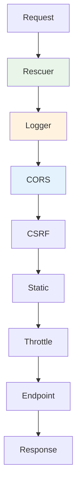

# Built-in Middleware Handlers

Azu provides a set of built-in middleware handlers for common HTTP concerns, including error handling, logging, CORS, static file serving, and more.

## Summary

Built-in middleware enables:

- Error page rendering
- Request/response logging
- CORS and CSRF protection
- Static file serving
- Request throttling and rate limiting
- Request ID and IP spoofing protection

## Middleware Stack



## List of Built-in Handlers

- `Azu::Handler::Rescuer` — Error page rendering
- `Azu::Handler::Logger` — Request/response logging
- `Azu::Handler::CORS` — Cross-Origin Resource Sharing
- `Azu::Handler::CSRF` — CSRF protection
- `Azu::Handler::Static` — Static file serving
- `Azu::Handler::Throttle` — Rate limiting
- `Azu::Handler::RequestID` — Request ID injection
- `Azu::Handler::IPSpoofing` — IP spoofing protection

## Usage Example

```crystal
ExampleApp.start [
  Azu::Handler::Rescuer.new,
  Azu::Handler::Logger.new,
  Azu::Handler::CORS.new,
  Azu::Handler::Static.new
]
```

## Next Steps

- [Custom Middleware](custom.md)
- [Error Handling](errors.md)
- [API Reference: Handlers](../api-reference/handlers.md)
