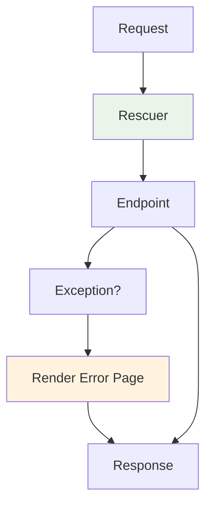

# Error Handling Middleware

Azu provides robust error handling middleware to catch exceptions, render error pages, and return appropriate status codes.

## Summary

Error handling middleware enables:

- Catching and logging exceptions
- Rendering custom error pages
- Returning proper HTTP status codes
- Aggregating validation errors

## Error Handling Flow

## Custom Error Pages

You can customize error pages by overriding the default templates in `src/azu/templates/`.

## Next Steps

- [Built-in Handlers](built-in.md)
- [Custom Middleware](custom.md)
- [API Reference: Handlers](../api-reference/handlers.md)
