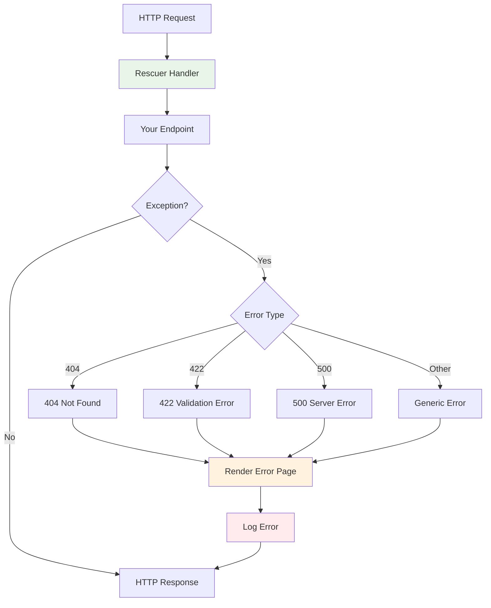

# Error Handling Middleware

Azu provides robust error handling middleware to catch exceptions, render error pages, and return appropriate status codes. This ensures your application gracefully handles errors while providing meaningful feedback to users and developers.

## Overview

Error handling middleware enables:

- **Exception Catching**: Automatic catching and logging of exceptions
- **Error Page Rendering**: Custom error pages with appropriate styling
- **Status Code Management**: Proper HTTP status codes for different error types
- **Validation Error Aggregation**: Collection and display of form validation errors
- **Environment-Aware Error Details**: Different error information for development vs production
- **Error Tracking Integration**: Integration with external error tracking services

## Error Handling Flow



## Built-in Error Handler

### Rescuer Handler

The `Azu::Handler::Rescuer` is the primary error handling middleware.

```crystal
# Basic usage
Azu::Handler::Rescuer.new

# With custom configuration
Azu::Handler::Rescuer.new(
  show_details: false,           # Hide error details in production
  log_errors: true,              # Log errors to console
  custom_templates: {            # Custom error templates
    404 => "errors/not_found.html",
    500 => "errors/server_error.html",
    422 => "errors/validation_error.html"
  },
  error_tracker: ErrorTracker.new # External error tracking
)
```

**Configuration Options:**

- `show_details`: Whether to show detailed error information (default: `true` in development)
- `log_errors`: Whether to log errors (default: `true`)
- `custom_templates`: Custom error page templates for specific status codes
- `error_tracker`: External error tracking service integration

## Error Types and Handling

### HTTP Status Errors

```crystal
# 404 Not Found
class NotFoundError < Azu::Response::Error
  def initialize(message : String = "Resource not found")
    super(404, message)
  end
end

# 403 Forbidden
class ForbiddenError < Azu::Response::Error
  def initialize(message : String = "Access denied")
    super(403, message)
  end
end

# 401 Unauthorized
class UnauthorizedError < Azu::Response::Error
  def initialize(message : String = "Authentication required")
    super(401, message)
  end
end

# 422 Validation Error
class ValidationError < Azu::Response::Error
  def initialize(@errors : Hash(String, Array(String)))
    super(422, "Validation failed")
  end
end
```

### Custom Error Classes

```crystal
# Business logic errors
class BusinessLogicError < Azu::Response::Error
  def initialize(message : String, @code : String)
    super(400, message)
  end
end

# Service unavailable errors
class ServiceUnavailableError < Azu::Response::Error
  def initialize(service : String)
    super(503, "Service #{service} is temporarily unavailable")
  end
end

# Rate limit errors
class RateLimitError < Azu::Response::Error
  def initialize(limit : Int32, window : Time::Span)
    super(429, "Rate limit exceeded: #{limit} requests per #{window}")
  end
end
```

## Error Handling in Endpoints

### Basic Error Handling

```crystal
struct UserEndpoint
  include Endpoint(UserRequest, UserResponse)

  get "/users/:id"

  def call : UserResponse
    user = User.find(params["id"])

    if user
      UserResponse.new(user)
    else
      raise NotFoundError.new("User not found")
    end
  end
end
```

### Validation Error Handling

```crystal
struct CreateUserEndpoint
  include Endpoint(CreateUserRequest, UserResponse)

  post "/users"

  def call : UserResponse
    # Validate request
    unless request.valid?
      raise ValidationError.new(request.errors)
    end

    # Create user
    user = User.create(request.to_user_params)

    if user.valid?
      UserResponse.new(user)
    else
      raise ValidationError.new(user.errors)
    end
  end
end
```

### Conditional Error Handling

```crystal
struct AdminEndpoint
  include Endpoint(AdminRequest, AdminResponse)

  get "/admin/users"

  def call : AdminResponse
    user = request.context(:current_user)?.try(&.as(User))

    unless user
      raise UnauthorizedError.new
    end

    unless user.admin?
      raise ForbiddenError.new("Admin access required")
    end

    AdminResponse.new(User.all)
  end
end
```

## Custom Error Pages

### HTML Error Templates

```html
<!-- templates/errors/404.html -->
<!DOCTYPE html>
<html>
  <head>
    <title>Page Not Found</title>
    <style>
      .error-page {
        text-align: center;
        padding: 50px;
        font-family: Arial, sans-serif;
      }
      .error-code {
        font-size: 72px;
        color: #e74c3c;
        margin-bottom: 20px;
      }
      .error-message {
        font-size: 24px;
        color: #2c3e50;
        margin-bottom: 30px;
      }
      .back-link {
        color: #3498db;
        text-decoration: none;
      }
    </style>
  </head>
  <body>
    <div class="error-page">
      <div class="error-code">404</div>
      <div class="error-message">Page Not Found</div>
      <p>The page you're looking for doesn't exist.</p>
      <a href="/" class="back-link">Go back home</a>
    </div>
  </body>
</html>
```

### JSON Error Responses

```crystal
# For API endpoints
class APIErrorHandler
  include Azu::Handler

  def initialize(@next : Azu::Handler)
  end

  def call(request : HttpRequest, response : Response) : Response
    @next.call(request, response)
  rescue ex : Azu::Response::Error
    # Return JSON error response
    Response.new(
      status: ex.status,
      body: {
        error: ex.message,
        status: ex.status,
        timestamp: Time.utc.to_s
      }.to_json,
      headers: {"Content-Type" => "application/json"}
    )
  rescue ex : Exception
    # Handle unexpected errors
    Response.new(
      status: 500,
      body: {
        error: "Internal server error",
        status: 500,
        timestamp: Time.utc.to_s
      }.to_json,
      headers: {"Content-Type" => "application/json"}
    )
  end
end
```

## Error Tracking Integration

### Sentry Integration

```crystal
class SentryErrorHandler
  include Azu::Handler

  def initialize(@next : Azu::Handler, @sentry_dsn : String)
  end

  def call(request : HttpRequest, response : Response) : Response
    @next.call(request, response)
  rescue ex : Exception
    # Send to Sentry
    Sentry.capture_exception(ex, {
      request_id: request.headers["X-Request-ID"]?,
      user_id: request.context(:current_user)?.try(&.as(User).id),
      path: request.path,
      method: request.method,
      params: request.params.to_h
    })

    # Re-raise for Rescuer to handle
    raise ex
  end
end
```

### Custom Error Tracking

```crystal
class CustomErrorTracker
  def capture_exception(exception : Exception, context : Hash(String, Any))
    # Send to your error tracking service
    error_data = {
      message: exception.message,
      backtrace: exception.backtrace,
      context: context,
      timestamp: Time.utc
    }

    HTTP::Client.post(
      "https://your-error-tracker.com/api/errors",
      headers: HTTP::Headers{"Content-Type" => "application/json"},
      body: error_data.to_json
    )
  end
end

# Usage
Azu::Handler::Rescuer.new(
  error_tracker: CustomErrorTracker.new
)
```

## Validation Error Handling

### Form Validation Errors

```crystal
struct ValidationError
  include Response

  def initialize(@errors : Hash(String, Array(String)))
  end

  def render
    view "errors/validation.html", {
      errors: @errors,
      form_data: request.params
    }
  end
end

# Template: templates/errors/validation.html
```

```html
<!DOCTYPE html>
<html>
  <head>
    <title>Validation Error</title>
  </head>
  <body>
    <h1>Please correct the following errors:</h1>

    <ul class="errors">
      
      <li>
        <strong>{{ field }}:</strong>
        <ul>
          
          <li>{{ message }}</li>
          
        </ul>
      </li>
      
    </ul>

    <form method="post" action="{{ request.path }}">
      <!-- Re-populate form with original data -->
      <input type="text" name="name" value="{{ form_data["name"]? }}"> <input
      type="email" name="email" value="{{ form_data["email"]? }}">
      <button type="submit">Submit</button>
    </form>
  </body>
</html>
```

### API Validation Errors

```crystal
struct APIValidationError
  include Response

  def initialize(@errors : Hash(String, Array(String)))
  end

  def render
    Response.new(
      status: 422,
      body: {
        error: "Validation failed",
        errors: @errors,
        status: 422
      }.to_json,
      headers: {"Content-Type" => "application/json"}
    )
  end
end
```

## Environment-Specific Error Handling

### Development Environment

```crystal
# config/development.cr
ExampleApp.start [
  Azu::Handler::Rescuer.new(
    show_details: true,           # Show detailed error information
    log_errors: true,             # Log all errors
    custom_templates: {           # Development-specific templates
      500 => "errors/dev_server_error.html"
    }
  ),
  # Other middleware...
]
```

### Production Environment

```crystal
# config/production.cr
ExampleApp.start [
  Azu::Handler::Rescuer.new(
    show_details: false,          # Hide sensitive error details
    log_errors: true,             # Log errors for monitoring
    custom_templates: {           # Production error templates
      404 => "errors/prod_not_found.html",
      500 => "errors/prod_server_error.html"
    },
    error_tracker: SentryTracker.new(ENV["SENTRY_DSN"])
  ),
  # Other middleware...
]
```

## Error Recovery Strategies

### Retry Logic

```crystal
class RetryHandler
  include Azu::Handler

  def initialize(@next : Azu::Handler, @max_retries : Int32 = 3)
  end

  def call(request : HttpRequest, response : Response) : Response
    retries = 0

    begin
      @next.call(request, response)
    rescue ex : TemporaryError
      retries += 1

      if retries <= @max_retries
        sleep(2 ** retries)  # Exponential backoff
        retry
      else
        raise ex
      end
    end
  end
end
```

### Fallback Responses

```crystal
class FallbackHandler
  include Azu::Handler

  def initialize(@next : Azu::Handler, @fallback_service : FallbackService)
  end

  def call(request : HttpRequest, response : Response) : Response
    @next.call(request, response)
  rescue ex : ServiceUnavailableError
    # Use fallback service
    fallback_data = @fallback_service.get_fallback_data(request)

    Response.new(
      status: 200,
      body: fallback_data.to_json,
      headers: {"Content-Type" => "application/json", "X-Fallback" => "true"}
    )
  end
end
```

## Error Monitoring and Alerting

### Error Metrics

```crystal
class ErrorMetricsHandler
  include Azu::Handler

  def initialize(@next : Azu::Handler, @metrics : MetricsCollector)
  end

  def call(request : HttpRequest, response : Response) : Response
    start_time = Time.monotonic

    begin
      result = @next.call(request, response)

      # Record success metrics
      @metrics.increment("requests.success", {
        path: request.path,
        method: request.method
      })

      result
    rescue ex : Exception
      # Record error metrics
      @metrics.increment("requests.error", {
        path: request.path,
        method: request.method,
        error_type: ex.class.name
      })

      # Alert on high error rates
      if @metrics.get_error_rate > 0.05  # 5% error rate
        send_alert("High error rate detected: #{@metrics.get_error_rate}")
      end

      raise ex
    end
  end
end
```

### Health Checks

```crystal
class HealthCheckEndpoint
  include Endpoint(HealthCheckRequest, HealthCheckResponse)

  get "/health"

  def call : HealthCheckResponse
    # Check various system components
    checks = {
      database: check_database,
      redis: check_redis,
      external_api: check_external_api
    }

    overall_status = checks.values.all? ? "healthy" : "unhealthy"

    HealthCheckResponse.new(
      status: overall_status,
      checks: checks,
      timestamp: Time.utc
    )
  end

  private def check_database : Bool
    # Database health check
    true
  end

  private def check_redis : Bool
    # Redis health check
    true
  end

  private def check_external_api : Bool
    # External API health check
    true
  end
end
```

## Testing Error Handling

### Unit Testing

```crystal
require "spec"

describe "Error Handling" do
  it "handles 404 errors" do
    endpoint = NotFoundEndpoint.new

    response = endpoint.call(HttpRequest.new("GET", "/nonexistent"))

    response.status.should eq(404)
    response.body.should contain("Page Not Found")
  end

  it "handles validation errors" do
    endpoint = CreateUserEndpoint.new

    request = CreateUserRequest.new(email: "invalid-email")

    expect_raises(ValidationError) do
      endpoint.call(request)
    end
  end

  it "handles authentication errors" do
    endpoint = ProtectedEndpoint.new

    request = HttpRequest.new("GET", "/protected")

    response = endpoint.call(request)

    response.status.should eq(401)
  end
end
```

### Integration Testing

```crystal
describe "Error Handling Integration" do
  it "renders error pages correctly" do
    app = ExampleApp.new([
      Azu::Handler::Rescuer.new,
      ErrorProneEndpoint.new
    ])

    response = app.get("/error")

    response.status.should eq(500)
    response.body.should contain("Server Error")
  end

  it "tracks errors in production" do
    error_tracker = MockErrorTracker.new
    error_tracker.should_receive(:capture_exception)

    app = ExampleApp.new([
      Azu::Handler::Rescuer.new(error_tracker: error_tracker),
      ErrorProneEndpoint.new
    ])

    app.get("/error")
  end
end
```

## Best Practices

### 1. Use Appropriate Error Types

```crystal
# Good: Specific error types
raise NotFoundError.new("User not found") if user.nil?
raise ValidationError.new(errors) unless request.valid?
raise UnauthorizedError.new unless user.authenticated?

# Bad: Generic errors
raise Exception.new("Something went wrong")
```

### 2. Provide Meaningful Error Messages

```crystal
# Good: Descriptive error messages
raise ValidationError.new({
  "email" => ["must be a valid email address"],
  "password" => ["must be at least 8 characters long"]
})

# Bad: Generic error messages
raise ValidationError.new({"form" => ["invalid"]})
```

### 3. Log Errors Appropriately

```crystal
# Good: Structured error logging
Log.error { {
  error: ex.message,
  backtrace: ex.backtrace,
  request_id: request.headers["X-Request-ID"]?,
  user_id: request.context(:current_user)?.try(&.as(User).id),
  path: request.path
} }

# Bad: Simple error logging
Log.error { ex.message }
```

### 4. Handle Errors Gracefully

```crystal
# Good: Graceful error handling
def call : Response
  user = User.find(params["id"])

  if user
    UserResponse.new(user)
  else
    raise NotFoundError.new("User not found")
  end
rescue ex : DatabaseError
  # Handle database errors specifically
  Log.error { "Database error: #{ex.message}" }
  raise ServiceUnavailableError.new("Database")
end
```

### 5. Use Error Context

```crystal
# Good: Rich error context
class ContextualError < Azu::Response::Error
  def initialize(message : String, @context : Hash(String, Any))
    super(500, message)
  end
end

# Usage
raise ContextualError.new("Processing failed", {
  user_id: user.id,
  operation: "user_update",
  data: request.params
})
```

## Next Steps

- [Built-in Handlers](built-in.md) - Using Azu's built-in middleware
- [Custom Middleware](custom.md) - Creating your own middleware handlers
- [API Reference: Handlers](../api-reference/handlers.md) - Complete handler API documentation
- [Testing Strategies](../testing/unit.md) - Testing error handling

---

_Effective error handling ensures your application remains robust and provides a good user experience even when things go wrong._
