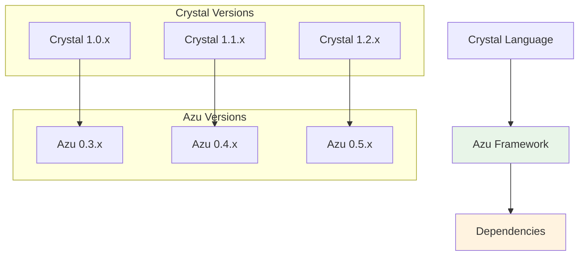

# Migration & Compatibility

Azu provides smooth migration paths and maintains backward compatibility across versions. This section covers version upgrades, breaking changes, and compatibility guidelines.

## Overview

Azu's migration features are designed for:

- **Smooth version upgrades** with clear migration paths
- **Backward compatibility** where possible
- **Breaking change documentation** with migration guides
- **Deprecation warnings** with clear upgrade instructions
- **Compatibility matrices** for dependencies

## Version Compatibility



## Compatibility Matrix

| Azu Version | Crystal Version | Status        | End of Life |
| ----------- | --------------- | ------------- | ----------- |
| 0.5.x       | 1.2.x+          | ✅ Current    | -           |
| 0.4.x       | 1.1.x+          | ✅ Supported  | 2024-12-31  |
| 0.3.x       | 1.0.x+          | ⚠️ Deprecated | 2024-06-30  |
| 0.2.x       | 0.36.x+         | ❌ EOL        | 2023-12-31  |

## Version Upgrades

### Upgrading to Azu 0.5.x

Azu 0.5.x introduces several improvements and breaking changes:

#### New Features

- Enhanced WebSocket support with connection pooling
- Improved template engine with better error handling
- New middleware for rate limiting and IP spoofing protection
- Better performance monitoring and metrics

#### Breaking Changes

- Removed deprecated `Azu::Handler::Session` (use `Azu::Handler::Session::Redis` instead)
- Changed WebSocket channel API for better type safety
- Updated template engine configuration format
- Modified response serialization interface

#### Migration Steps

1. **Update Crystal Version**

   ```bash
   # Ensure you're using Crystal 1.2.x or later
   crystal --version
   ```

2. **Update Azu Version**

   ```crystal
   # shard.yml
   dependencies:
     azu:
       github: your-org/azu
       version: ~> 0.5.0
   ```

3. **Update WebSocket Channels**

   ```crystal
   # Before (0.4.x)
   class ChatChannel < Azu::Channel
     ws "/chat"

     def on_message(message)
       # Old API
     end
   end

   # After (0.5.x)
   class ChatChannel < Azu::Channel
     ws "/chat"

     def on_message(message : String)
       # New typed API
     end
   end
   ```

4. **Update Template Configuration**

   ```crystal
   # Before (0.4.x)
   Azu::Templates.configure do |config|
     config.template_path = "templates"
   end

   # After (0.5.x)
   Azu::Configuration.configure do |config|
     config.template_path = "templates"
     config.template_cache = true
   end
   ```

[Learn more about Version Upgrades →](migration/upgrades.md)

## Breaking Changes

### Azu 0.5.x Breaking Changes

#### 1. **WebSocket Channel API Changes**

**Before (0.4.x):**

```crystal
class ChatChannel < Azu::Channel
  def on_message(message)
    # message was untyped
  end
end
```

**After (0.5.x):**

```crystal
class ChatChannel < Azu::Channel
  def on_message(message : String)
    # message is now typed as String
  end
end
```

#### 2. **Session Handler Removal**

**Before (0.4.x):**

```crystal
# This is no longer supported
Azu::Handler::Session.new
```

**After (0.5.x):**

```crystal
# Use Redis session handler instead
Azu::Handler::Session::Redis.new(
  redis_url: ENV["REDIS_URL"]
)
```

#### 3. **Response Serialization Changes**

**Before (0.4.x):**

```crystal
struct UserResponse
  include Response

  def initialize(@user : User)
  end

  def render
    @user.to_json
  end
end
```

**After (0.5.x):**

```crystal
struct UserResponse
  include Response

  def initialize(@user : User)
  end

  def render
    {
      id: @user.id,
      name: @user.name,
      email: @user.email
    }.to_json
  end
end
```

[Learn more about Breaking Changes →](migration/breaking-changes.md)

## Deprecation Warnings

Azu provides deprecation warnings to help you identify code that needs to be updated:

### Common Deprecation Warnings

#### 1. **Deprecated Handler Usage**

```crystal
# Warning: Azu::Handler::Session is deprecated
# Use Azu::Handler::Session::Redis instead
Azu::Handler::Session.new
```

#### 2. **Deprecated Template Methods**

```crystal
# Warning: render_template is deprecated
# Use view instead
render_template("user.html", user: user)

# Use this instead
view("user.html", user: user)
```

#### 3. **Deprecated Configuration**

```crystal
# Warning: Azu::Templates.configure is deprecated
# Use Azu::Configuration.configure instead
Azu::Templates.configure do |config|
  config.template_path = "templates"
end
```

### Handling Deprecation Warnings

1. **Enable Deprecation Warnings**

   ```crystal
   # Enable deprecation warnings in development
   Azu::Configuration.configure do |config|
     config.deprecation_warnings = true
   end
   ```

2. **Suppress Specific Warnings**

   ```crystal
   # Suppress specific deprecation warnings
   @[Deprecated("Use new_method instead")]
   def old_method
     # Implementation
   end
   ```

3. **Update Deprecated Code**

   ```crystal
   # Replace deprecated code with new API
   # Old
   render_template("template.html", data)

   # New
   view("template.html", data)
   ```

## Compatibility Guidelines

### 1. **API Compatibility**

#### Stable APIs

- Core endpoint interface
- Request/response contracts
- Basic middleware interface
- Template rendering API

#### Evolving APIs

- WebSocket channel API (improvements in 0.5.x)
- Configuration interface (consolidated in 0.5.x)
- Session handling (Redis-only in 0.5.x)

### 2. **Dependency Compatibility**

#### Required Dependencies

```crystal
# shard.yml
dependencies:
  crystal: ">= 1.2.0"
  radix: "~> 0.1.0"
  schema: "~> 0.1.0"
  crinja: "~> 0.1.0"
```

#### Optional Dependencies

```crystal
# For Redis sessions
redis: "~> 0.1.0"

# For database integration
db: "~> 0.1.0"
```

### 3. **Environment Compatibility**

#### Development Environment

```crystal
# Development configuration
Azu::Environment.configure :development do |config|
  config.log_level = :debug
  config.hot_reload = true
  config.deprecation_warnings = true
end
```

#### Production Environment

```crystal
# Production configuration
Azu::Environment.configure :production do |config|
  config.log_level = :info
  config.deprecation_warnings = false
  config.performance_mode = true
end
```

## Migration Tools

### 1. **Automated Migration Scripts**

Azu provides migration scripts to help automate common upgrades:

```bash
# Run migration script for 0.4.x to 0.5.x
crystal run scripts/migrate_0_5.cr

# Check for deprecated code
crystal run scripts/check_deprecations.cr
```

### 2. **Compatibility Checker**

```crystal
# Check compatibility with current version
Azu::Compatibility.check do |check|
  check.crystal_version(">= 1.2.0")
  check.azu_version(">= 0.5.0")
  check.dependencies
end
```

### 3. **Upgrade Assistant**

```bash
# Interactive upgrade assistant
crystal run scripts/upgrade_assistant.cr
```

## Testing Migrations

### 1. **Test Suite Updates**

Update your test suite to work with new versions:

```crystal
# spec/spec_helper.cr
require "spec"
require "../src/azu"

# Configure test environment for new version
Azu::Environment.configure :test do |config|
  config.log_level = :error
  config.deprecation_warnings = false
end
```

### 2. **Compatibility Tests**

```crystal
# Test compatibility with new APIs
describe "Azu 0.5.x Compatibility" do
  it "supports new WebSocket API" do
    channel = TestChannel.new
    channel.should respond_to(:on_message)
  end

  it "supports new configuration" do
    Azu::Configuration.configure do |config|
      config.template_cache = true
    end
  end
end
```

## Support and Resources

### 1. **Migration Support**

- [Migration Guide](migration/upgrades.md) - Step-by-step upgrade instructions
- [Breaking Changes](migration/breaking-changes.md) - Detailed breaking change documentation
- [GitHub Issues](https://github.com/your-org/azu/issues) - Report migration issues

### 2. **Community Resources**

- [Discord Community](https://discord.gg/azu) - Get help with migrations
- [Migration Examples](../examples/migrations/) - Working migration examples
- [FAQ](faq.md) - Common migration questions

## Next Steps

- [Version Upgrades](migration/upgrades.md) - Step-by-step upgrade guides
- [Breaking Changes](migration/breaking-changes.md) - Detailed breaking change documentation
- [Compatibility Matrix](migration/compatibility.md) - Version compatibility information

## Examples

Check out the [migration examples](../examples/migrations/) for complete working examples of:

- 0.4.x to 0.5.x upgrades
- Breaking change migrations
- Compatibility testing
- Automated migration scripts

---

**Need help with migration?** Start with the [Version Upgrades guide](migration/upgrades.md) for step-by-step instructions, then check [Breaking Changes](migration/breaking-changes.md) for detailed information about API changes.
