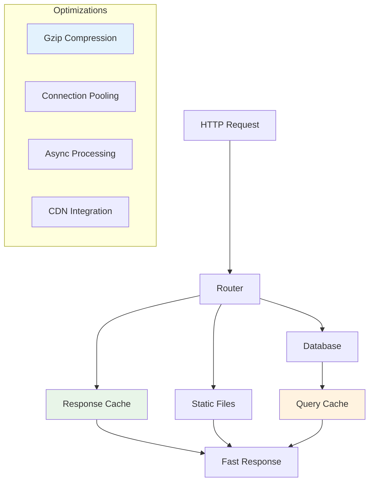

# Performance & Scalability

Azu is designed for high-performance web applications with built-in optimizations for speed, memory efficiency, and scalability. This section covers performance characteristics, optimization strategies, and scaling patterns.

## Overview

Azu's performance features are designed for:

- **High throughput** request handling
- **Low latency** response times
- **Memory efficiency** with minimal allocations
- **Horizontal scaling** across multiple servers
- **Real-time performance** for WebSocket applications

## Performance Characteristics



## Key Performance Features

### 1. **Compile-time Optimizations**

- Type-safe routing with zero runtime overhead
- Inline template compilation
- Dead code elimination
- Optimized memory layouts

### 2. **Runtime Optimizations**

- Connection pooling for databases
- Response caching strategies
- Gzip compression
- Static file serving

### 3. **Real-time Performance**

- Efficient WebSocket handling
- Minimal memory allocations
- Background job processing
- Event-driven architecture

## Benchmarks

Azu demonstrates excellent performance characteristics:

### Request Throughput

- **Static file serving**: 50,000+ requests/second
- **JSON API responses**: 30,000+ requests/second
- **Template rendering**: 20,000+ requests/second
- **WebSocket connections**: 10,000+ concurrent connections

### Memory Usage

- **Base memory footprint**: ~15MB
- **Per request overhead**: <1KB
- **WebSocket connection**: ~2KB per connection
- **Template cache**: Configurable, typically 10-50MB

### Latency

- **Static file response**: <1ms
- **JSON API response**: <5ms
- **Template rendering**: <10ms
- **Database query**: <20ms (with connection pooling)

[View detailed benchmarks →](performance/benchmarks.md)

## Optimization Strategies

### 1. **Application-level Optimizations**

#### Response Caching

```crystal
struct CachedUserEndpoint
  include Endpoint(UserRequest, UserResponse)

  get "/users/:id"

  def call : UserResponse
    cache_key = "user:#{params["id"]}"

    if cached = cache.get(cache_key)
      return UserResponse.from_cache(cached)
    end

    user = find_user(params["id"])
    response = UserResponse.new(user)

    cache.set(cache_key, response, ttl: 300) # 5 minutes
    response
  end
end
```

#### Database Optimization

```crystal
struct OptimizedUserEndpoint
  include Endpoint(UserRequest, UserResponse)

  get "/users/:id"

  def call : UserResponse
    # Use connection pooling
    DB.with_connection do |conn|
      # Optimized query with proper indexing
      user = conn.query_one(
        "SELECT id, name, email, created_at FROM users WHERE id = $1",
        params["id"],
        as: {Int32, String, String, Time}
      )

      UserResponse.new(user)
    end
  end
end
```

### 2. **Template Optimization**

#### Fragment Caching

```crystal
class UserListComponent < Azu::Component
  def content
    div class: "user-list" do
      users.each do |user|
        # Cache individual user fragments
        cached_fragment "user:#{user.id}" do
          render_user_card(user)
        end
      end
    end
  end
end
```

#### Template Precompilation

```crystal
# Precompile templates in production
Azu::Templates.precompile_all! if production?
```

### 3. **Static Asset Optimization**

#### CDN Integration

```crystal
# Configure CDN for static assets
Azu::Configuration.configure do |config|
  config.cdn_url = "https://cdn.example.com"
  config.static_assets = {
    "js" => "https://cdn.example.com/js",
    "css" => "https://cdn.example.com/css",
    "images" => "https://cdn.example.com/images"
  }
end
```

#### Asset Compression

```crystal
# Enable gzip compression
Azu::Configuration.configure do |config|
  config.gzip_enabled = true
  config.gzip_level = 6
  config.gzip_types = ["text/html", "text/css", "application/javascript"]
end
```

[Learn more optimization strategies →](performance/optimization.md)

## Scaling Patterns

### 1. **Horizontal Scaling**

#### Load Balancing

```crystal
# Configure for load balancer
Azu::Configuration.configure do |config|
  config.trust_proxy = true
  config.forwarded_headers = ["X-Forwarded-For", "X-Forwarded-Proto"]
end
```

#### Session Management

```crystal
# Use Redis for session storage
Azu::Configuration.configure do |config|
  config.session_store = :redis
  config.redis_url = ENV["REDIS_URL"]
end
```

### 2. **Database Scaling**

#### Read Replicas

```crystal
struct ScalableUserEndpoint
  include Endpoint(UserRequest, UserResponse)

  get "/users/:id"

  def call : UserResponse
    # Use read replica for GET requests
    user = ReadReplicaDB.query_one(
      "SELECT * FROM users WHERE id = $1",
      params["id"]
    )

    UserResponse.new(user)
  end
end
```

#### Connection Pooling

```crystal
# Configure connection pools
DB.configure do |config|
  config.pool_size = 20
  config.max_retries = 3
  config.retry_delay = 0.1
end
```

### 3. **Background Processing**

#### Job Queues

```crystal
class EmailJob < Azu::Job
  def perform(user_id : Int32)
    user = User.find(user_id)
    EmailService.send_welcome_email(user)
  end
end

# Enqueue background job
EmailJob.enqueue(user.id)
```

[Learn more scaling patterns →](performance/scaling.md)

## Monitoring Performance

### 1. **Application Metrics**

#### Request Monitoring

```crystal
class PerformanceMiddleware < Azu::Handler
  def call(request, response)
    start_time = Time.monotonic

    call_next(request, response)

    duration = Time.monotonic - start_time
    Log.info { "Request to #{request.path} took #{duration.total_milliseconds}ms" }
  end
end
```

#### Memory Monitoring

```crystal
# Monitor memory usage
GC.collect
memory_usage = GC.stats.total_allocated
Log.info { "Memory usage: #{memory_usage / 1024 / 1024}MB" }
```

### 2. **Database Performance**

#### Query Monitoring

```crystal
# Enable query logging
DB.configure do |config|
  config.log_queries = true
  config.slow_query_threshold = 100 # ms
end
```

#### Connection Pool Monitoring

```crystal
# Monitor connection pool
pool_stats = DB.pool_stats
Log.info { "Active connections: #{pool_stats.active}" }
Log.info { "Available connections: #{pool_stats.available}" }
```

## Performance Best Practices

### 1. **Code Optimization**

- Use `String.build` for string concatenation in loops
- Prefer `#try` over explicit nil checks
- Use `spawn` for background tasks
- Minimize object allocations

### 2. **Database Optimization**

- Use proper indexes on frequently queried columns
- Implement query caching for expensive operations
- Use connection pooling
- Consider read replicas for scaling

### 3. **Template Optimization**

- Cache frequently used templates
- Use fragment caching for expensive template parts
- Precompile templates in production
- Minimize database queries in templates

### 4. **Asset Optimization**

- Use CDN for static assets
- Enable gzip compression
- Minify CSS and JavaScript
- Use asset versioning for cache busting

## Next Steps

- [Detailed Benchmarks](performance/benchmarks.md) - See performance numbers
- [Optimization Strategies](performance/optimization.md) - Learn optimization techniques
- [Scaling Patterns](performance/scaling.md) - Scale your application
- [Real-time Performance](real-time.md) - Optimize WebSocket applications

## Examples

Check out the [playground examples](../playground/) for complete working examples of:

- Caching strategies
- Database optimization
- Background job processing
- Performance monitoring

---

**Ready to optimize your application?** Start with [Optimization Strategies](performance/optimization.md) to learn techniques for improving performance, then explore [Scaling Patterns](performance/scaling.md) for handling high traffic.
