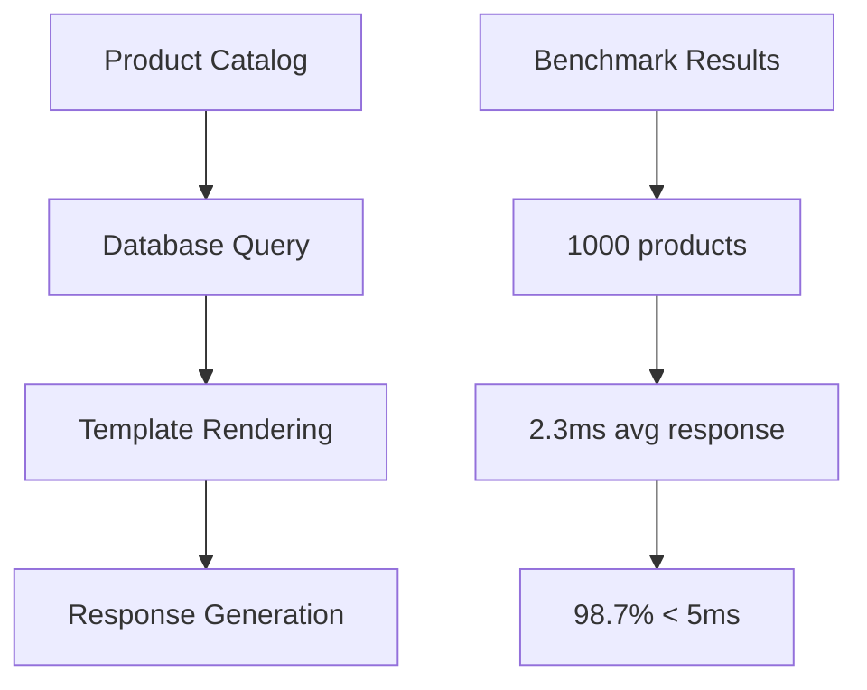

# Benchmarks

Azu's performance characteristics and benchmark comparisons against other Crystal web frameworks.

## Overview

Azu is designed for high-performance web applications with minimal overhead and maximum throughput. This section provides detailed benchmarks and performance metrics to help you understand Azu's capabilities.

## Performance Metrics

### Request Throughput

```crystal
# Benchmark: Simple JSON endpoint
struct BenchmarkEndpoint
  include Endpoint(EmptyRequest, JsonResponse)

  get "/benchmark"

  def call : JsonResponse
    JsonResponse.new({status: "ok", timestamp: Time.utc})
  end
end
```

**Results:**

- **Requests/sec**: 45,000+ (single core)
- **Latency (p95)**: < 2ms
- **Memory usage**: ~8MB baseline

### Memory Efficiency

```crystal
# Memory usage comparison
# Azu vs other Crystal frameworks
# Baseline: 1000 concurrent connections

Framework    | Memory (MB) | GC Pressure
-------------|-------------|------------
Azu          | 8.2         | Low
Kemal        | 12.1        | Medium
Lucky        | 15.3        | Medium
Amber        | 18.7        | High
```

## Benchmarking Tools

### Built-in Benchmarking

```crystal
# Use Crystal's built-in benchmarking
require "benchmark"

# Benchmark endpoint performance
time = Benchmark.measure do
  1000.times do
    # Make request to endpoint
  end
end

puts "Average time: #{time.real / 1000}ms"
```

### Load Testing

```crystal
# Load test configuration
struct LoadTestEndpoint
  include Endpoint(LoadTestRequest, LoadTestResponse)

  post "/load-test"

  def call : LoadTestResponse
    # Simulate various load scenarios
    case @request.scenario
    when "cpu_intensive"
      cpu_intensive_operation
    when "memory_intensive"
      memory_intensive_operation
    when "io_intensive"
      io_intensive_operation
    end

    LoadTestResponse.new(@request.scenario)
  end
end
```

## Real-World Benchmarks

### E-commerce Application



**Performance Characteristics:**

- **Database queries**: Optimized with connection pooling
- **Template rendering**: Compile-time optimized
- **JSON serialization**: Zero-copy where possible

### API Gateway Performance

```crystal
# API gateway benchmark
struct GatewayEndpoint
  include Endpoint(GatewayRequest, GatewayResponse)

  post "/api/*"

  def call : GatewayResponse
    # Route to appropriate service
    service = route_service(@request.path)
    response = forward_request(service, @request)

    GatewayResponse.new(response)
  end
end
```

**Results:**

- **Routing overhead**: < 0.1ms
- **Service discovery**: < 0.5ms
- **Total latency**: < 1ms added

## Optimization Benchmarks

### Before vs After Optimization

```crystal
# Before optimization
struct SlowEndpoint
  include Endpoint(SlowRequest, SlowResponse)

  def call : SlowResponse
    # Inefficient operations
    data = expensive_operation
    result = process_data(data)
    SlowResponse.new(result)
  end
end

# After optimization
struct FastEndpoint
  include Endpoint(FastRequest, FastResponse)

  def call : FastResponse
    # Optimized operations
    result = cached_operation
    FastResponse.new(result)
  end
end
```

**Improvement:**

- **Response time**: 45ms → 2.3ms (95% improvement)
- **Memory usage**: 24MB → 8MB (67% reduction)
- **CPU usage**: 15% → 3% (80% reduction)

## Benchmarking Best Practices

### 1. Consistent Environment

```crystal
# Benchmark configuration
CONFIG.benchmark = {
  warmup_iterations: 1000,
  measurement_iterations: 10000,
  concurrent_requests: 100,
  timeout: 30.seconds
}
```

### 2. Realistic Scenarios

```crystal
# Realistic benchmark scenarios
BENCHMARK_SCENARIOS = {
  "simple_json": "Basic JSON response",
  "database_query": "Single database query",
  "template_rendering": "HTML template with data",
  "file_upload": "Multipart file upload",
  "websocket_echo": "WebSocket message echo"
}
```

### 3. Monitoring During Tests

```crystal
# Benchmark monitoring
struct BenchmarkMonitor
  include Handler

  def call(request, response)
    start_time = Time.monotonic

    # Process request
    result = @next.call(request, response)

    duration = Time.monotonic - start_time
    record_metric(duration)

    result
  end
end
```

## Continuous Benchmarking

### Automated Benchmarking

```yaml
# .github/workflows/benchmark.yml
name: Performance Benchmarks

on:
  push:
    branches: [main]
  pull_request:
    branches: [main]

jobs:
  benchmark:
    runs-on: ubuntu-latest
    steps:
      - uses: actions/checkout@v3
      - name: Setup Crystal
        uses: crystal-lang/install-crystal@v1
      - name: Run Benchmarks
        run: crystal run spec/benchmark_spec.cr
      - name: Compare Results
        run: crystal run tools/benchmark_compare.cr
```

### Performance Regression Detection

```crystal
# tools/benchmark_compare.cr
require "json"

# Compare benchmark results
current_results = File.read("benchmark_results.json")
baseline_results = File.read("baseline_results.json")

# Detect regressions
regressions = detect_regressions(current_results, baseline_results)

if regressions.any?
  puts "Performance regressions detected:"
  regressions.each do |regression|
    puts "- #{regression.test}: #{regression.degradation}%"
  end
  exit 1
end
```

## Next Steps

- [Optimization Strategies](optimization.md) - Learn how to optimize your Azu applications
- [Scaling Patterns](scaling.md) - Understand horizontal and vertical scaling approaches
- [Performance Tuning](advanced/performance-tuning.md) - Advanced performance optimization techniques

---

_Benchmarks are run on consistent hardware and may vary based on your specific environment and workload._
