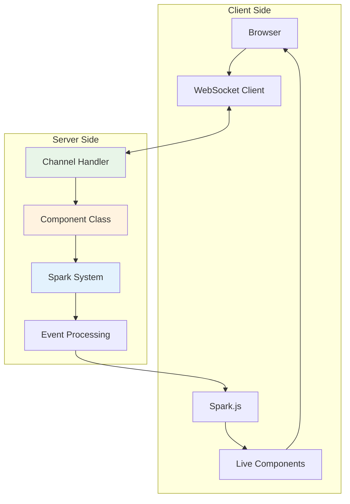

# Real-Time Features

Azu provides first-class support for real-time applications through WebSocket channels, live components, and the Spark system. These features enable building responsive, interactive applications with minimal complexity.

## Real-Time Architecture



## WebSocket Channels

Channels handle WebSocket connections and provide a clean interface for real-time communication between clients and servers.

### Basic Channel Structure

```crystal
class ChatChannel < Azu::Channel
  # Define WebSocket route
  ws "/chat/:room_id"

  def on_connect
    # Called when client connects
    room_id = params["room_id"]
    join_room(room_id)
    broadcast_to_room(room_id, {
      type: "user_joined",
      user: current_user.name,
      timestamp: Time.utc.to_rfc3339
    })
  end

  def on_message(message : String)
    # Called when client sends message
    data = JSON.parse(message)
    handle_chat_message(data)
  end

  def on_close(code, message)
    # Called when client disconnects
    room_id = params["room_id"]
    leave_room(room_id)
    broadcast_to_room(room_id, {
      type: "user_left",
      user: current_user.name,
      timestamp: Time.utc.to_rfc3339
    })
  end
end
```

### Connection Management

Azu provides automatic connection management with room-based broadcasting:

```crystal
class NotificationChannel < Azu::Channel
  # Class-level connection tracking
  CONNECTIONS = Hash(String, Set(HTTP::WebSocket)).new

  ws "/notifications/:user_id"

  def on_connect
    user_id = params["user_id"]

    # Add to user-specific connection pool
    CONNECTIONS[user_id] ||= Set(HTTP::WebSocket).new
    CONNECTIONS[user_id] << socket.not_nil!

    # Send connection confirmation
    send_to_client({
      type: "connected",
      message: "Connected to notifications for user #{user_id}",
      timestamp: Time.utc.to_rfc3339
    })

    Log.info { "User #{user_id} connected. Total connections: #{total_connections}" }
  end

  def on_close(code, message)
    user_id = params["user_id"]
    CONNECTIONS[user_id]?.try(&.delete(socket))

    # Clean up empty connection sets
    if CONNECTIONS[user_id]?.try(&.empty?)
      CONNECTIONS.delete(user_id)
    end

    Log.info { "User #{user_id} disconnected. Total connections: #{total_connections}" }
  end

  # Broadcast to specific user
  def self.notify_user(user_id : String, notification : Hash)
    if connections = CONNECTIONS[user_id]?
      connections.each do |socket|
        spawn socket.send(notification.to_json)
      end
    end
  end

  # Broadcast to all connected users
  def self.broadcast_to_all(notification : Hash)
    CONNECTIONS.each_value do |connections|
      connections.each do |socket|
        spawn socket.send(notification.to_json)
      end
    end
  end

  private def total_connections
    CONNECTIONS.sum(&.last.size)
  end

  private def send_to_client(data)
    socket.not_nil!.send(data.to_json)
  end
end
```

### Message Handling Patterns

Implement different message handling patterns for various use cases:

```crystal
class GameChannel < Azu::Channel
  ws "/game/:game_id"

  def on_message(message : String)
    begin
      data = JSON.parse(message)
      action = data["action"]?.try(&.as_s)

      case action
      when "move"
        handle_player_move(data)
      when "chat"
        handle_chat_message(data)
      when "ping"
        handle_ping
      when "join"
        handle_player_join(data)
      when "leave"
        handle_player_leave
      else
        send_error("Unknown action: #{action}")
      end
    rescue JSON::ParseException
      send_error("Invalid JSON format")
    rescue ex
      Log.error(exception: ex) { "Error handling message" }
      send_error("Server error processing message")
    end
  end

  private def handle_player_move(data)
    game_id = params["game_id"]
    move_data = {
      type: "player_move",
      game_id: game_id,
      player: current_user.id,
      position: data["position"],
      timestamp: Time.utc.to_rfc3339
    }

    # Validate move
    unless valid_move?(data["position"])
      return send_error("Invalid move")
    end

    # Update game state
    update_game_state(game_id, move_data)

    # Broadcast to other players
    broadcast_to_game(game_id, move_data, exclude: socket)
  end

  private def handle_chat_message(data)
    message = data["message"]?.try(&.as_s)
    return send_error("Message is required") unless message

    chat_data = {
      type: "chat",
      user: current_user.name,
      message: message,
      timestamp: Time.utc.to_rfc3339
    }

    broadcast_to_game(params["game_id"], chat_data)
  end

  private def send_error(message : String)
    send_to_client({
      type: "error",
      message: message,
      timestamp: Time.utc.to_rfc3339
    })
  end
end
```

### Authentication and Authorization

Secure WebSocket connections with authentication:

```crystal
class SecureChannel < Azu::Channel
  ws "/secure/:channel_id"

  def on_connect
    # Authenticate user from token
    token = context.request.headers["Authorization"]?
    unless token && (user = authenticate_token(token))
      close_with_error("Authentication required")
      return
    end

    # Authorize access to channel
    channel_id = params["channel_id"]
    unless user.can_access_channel?(channel_id)
      close_with_error("Access denied")
      return
    end

    @current_user = user
    setup_user_session(user, channel_id)
  end

  private def authenticate_token(token : String) : User?
    # Extract and verify JWT token
    jwt_token = token.sub(/^Bearer /, "")
    payload = JWT.decode(jwt_token, secret_key)
    User.find(payload["user_id"])
  rescue JWT::DecodeError
    nil
  end

  private def close_with_error(message : String)
    socket.not_nil!.send({
      type: "error",
      message: message
    }.to_json)
    socket.not_nil!.close
  end
end
```

## Live Components

Live components provide reactive UI updates without page reloads. They automatically synchronize state between client and server.

### Basic Live Component

```crystal
class CounterComponent
  include Azu::Component

  # Component state
  property count : Int32 = 0
  property step : Int32 = 1

  # Render the component HTML
  def content
    div(class: "counter-widget") do
      h2 { text "Count: #{@count}" }
      div(class: "controls") do
        button(onclick: "decrement") { text "-" }
        input(type: "number", value: @step, onchange: "set_step")
        button(onclick: "increment") { text "+" }
      end
      button(onclick: "reset", class: "reset") { text "Reset" }
    end
  end

  # Handle client events
  def on_event(name : String, data)
    case name
    when "increment"
      @count += @step
      refresh # Automatically updates client
    when "decrement"
      @count -= @step
      refresh
    when "reset"
      @count = 0
      refresh
    when "set_step"
      if new_step = data["value"]?.try(&.as_s.to_i?)
        @step = new_step
        refresh
      end
    end
  end

  # Lifecycle hooks
  def on_mount
    # Called when component is first mounted
    Log.info { "Counter component mounted with initial count: #{@count}" }
  end

  def on_unmount
    # Called when component is unmounted
    Log.info { "Counter component unmounted" }
  end
end
```

### Advanced Component Features

Build complex interactive components with state management:

```crystal
class TodoListComponent
  include Azu::Component

  property todos : Array(Todo) = [] of Todo
  property filter : String = "all"
  property new_todo_text : String = ""

  def content
    div(class: "todo-app") do
      header do
        h1 { text "Todo List" }
        form(onsubmit: "add_todo") do
          input(
            type: "text",
            placeholder: "What needs to be done?",
            value: @new_todo_text,
            oninput: "update_new_todo_text"
          )
          button(type: "submit") { text "Add" }
        end
      end

      main do
        render_filters
        render_todo_list
      end

      footer do
        render_stats
      end
    end
  end

  def on_event(name : String, data)
    case name
    when "add_todo"
      add_todo(@new_todo_text.strip)
    when "update_new_todo_text"
      @new_todo_text = data["value"]?.try(&.as_s) || ""
      refresh
    when "toggle_todo"
      if id = data["id"]?.try(&.as_s.to_i?)
        toggle_todo(id)
      end
    when "delete_todo"
      if id = data["id"]?.try(&.as_s.to_i?)
        delete_todo(id)
      end
    when "set_filter"
      @filter = data["filter"]?.try(&.as_s) || "all"
      refresh
    when "clear_completed"
      clear_completed_todos
    end
  end

  private def add_todo(text : String)
    return if text.empty?

    todo = Todo.new(text: text)
    @todos << todo
    @new_todo_text = ""
    refresh
  end

  private def toggle_todo(id : Int32)
    if todo = @todos.find(&.id.== id)
      todo.completed = !todo.completed
      refresh
    end
  end

  private def delete_todo(id : Int32)
    @todos.reject! { |todo| todo.id == id }
    refresh
  end

  private def clear_completed_todos
    @todos.reject!(&.completed)
    refresh
  end

  private def filtered_todos
    case @filter
    when "active"
      @todos.reject(&.completed)
    when "completed"
      @todos.select(&.completed)
    else
      @todos
    end
  end

  private def render_filters
    div(class: "filters") do
      %w(all active completed).each do |filter_name|
        button(
          onclick: "set_filter",
          data: {filter: filter_name},
          class: @filter == filter_name ? "active" : ""
        ) do
          text filter_name.capitalize
        end
      end
    end
  end

  private def render_todo_list
    ul(class: "todo-list") do
      filtered_todos.each do |todo|
        li(class: todo.completed ? "completed" : "") do
          input(
            type: "checkbox",
            checked: todo.completed,
            onchange: "toggle_todo",
            data: {id: todo.id}
          )
          span(class: "text") { text todo.text }
          button(
            onclick: "delete_todo",
            data: {id: todo.id},
            class: "delete"
          ) { text "×" }
        end
      end
    end
  end

  private def render_stats
    total = @todos.size
    completed = @todos.count(&.completed)
    active = total - completed

    div(class: "stats") do
      span { text "#{active} items left" }
      if completed > 0
        button(onclick: "clear_completed") { text "Clear completed" }
      end
    end
  end
end
```

### Component Communication

Components can communicate with each other through events and shared state:

```crystal
class ChatRoomComponent
  include Azu::Component

  property messages : Array(Message) = [] of Message
  property current_user : User
  property online_users : Array(User) = [] of User

  def content
    div(class: "chat-room") do
      render_user_list
      render_message_area
      render_input_area
    end
  end

  def on_event(name : String, data)
    case name
    when "send_message"
      send_message(data["text"]?.try(&.as_s) || "")
    when "user_typing"
      broadcast_typing_indicator
    when "load_history"
      load_message_history
    end
  end

  # External events from WebSocket
  def handle_external_event(event_type : String, data)
    case event_type
    when "new_message"
      add_message(Message.from_json(data["message"].to_json))
    when "user_joined"
      add_online_user(User.from_json(data["user"].to_json))
    when "user_left"
      remove_online_user(data["user_id"].as_s)
    when "typing_indicator"
      show_typing_indicator(data["user"].as_s)
    end
  end

  private def send_message(text : String)
    return if text.strip.empty?

    message = Message.new(
      text: text.strip,
      user: @current_user,
      timestamp: Time.utc
    )

    # Add to local state immediately
    @messages << message
    refresh

    # Broadcast to other users via WebSocket
    ChatChannel.broadcast_message(message)
  end

  private def add_message(message : Message)
    @messages << message
    refresh
  end

  private def add_online_user(user : User)
    unless @online_users.any?(&.id.== user.id)
      @online_users << user
      refresh
    end
  end

  private def remove_online_user(user_id : String)
    @online_users.reject! { |u| u.id.to_s == user_id }
    refresh
  end
end
```

## The Spark System

The Spark system enables seamless real-time updates by automatically synchronizing component state between server and client.

### Spark Integration

Include Spark in your templates to enable live components:

```html
<!DOCTYPE html>
<html>
  <head>
    <title>My Azu App</title>
    <script src="/js/azu-spark.js"></script>
  </head>
  <body>
    <!-- Mount live components -->
    <div id="counter-widget">
      <%= CounterComponent.mount(count: 10).render %>
    </div>

    <div id="todo-list">
      <%= TodoListComponent.mount(todos: @todos).render %>
    </div>

    <!-- Initialize Spark -->
    <script>
      Spark.connect("ws://localhost:4000/spark");
    </script>
  </body>
</html>
```

### Spark JavaScript API

The client-side Spark API provides methods for component interaction:

```javascript
// azu-spark.js features
class Spark {
  // Connect to WebSocket
  static connect(url) {
    this.ws = new WebSocket(url);
    this.setupEventHandlers();
    return this;
  }

  // Send event to server component
  static sendEvent(componentId, eventName, data = {}) {
    this.ws.send(
      JSON.stringify({
        type: "component_event",
        component_id: componentId,
        event: eventName,
        data: data,
      })
    );
  }

  // Update component content
  static updateComponent(componentId, html) {
    const element = document.getElementById(componentId);
    if (element) {
      element.innerHTML = html;
      this.bindEvents(element);
    }
  }

  // Bind event handlers to component elements
  static bindEvents(container) {
    // Automatically bind onclick, onchange, etc.
    container.querySelectorAll("[onclick]").forEach((element) => {
      const eventName = element.getAttribute("onclick");
      const componentId = this.findComponentId(element);

      element.addEventListener("click", (e) => {
        e.preventDefault();
        const data = this.extractEventData(element);
        this.sendEvent(componentId, eventName, data);
      });
    });
  }

  // Handle incoming messages
  static handleMessage(message) {
    const data = JSON.parse(message.data);

    switch (data.type) {
      case "component_update":
        this.updateComponent(data.component_id, data.html);
        break;
      case "component_flash":
        this.showFlashMessage(data.message, data.type);
        break;
      case "component_redirect":
        window.location.href = data.url;
        break;
    }
  }
}
```

### Performance Optimizations

Spark includes several optimizations for efficient real-time updates:

```crystal
module Azu
  class SparkSystem
    # Batch updates for performance
    class UpdateBatcher
      @pending_updates = Hash(String, ComponentUpdate).new
      @update_timer : Timer? = nil

      def schedule_update(component_id : String, update : ComponentUpdate)
        @pending_updates[component_id] = update

        # Batch updates within 16ms (60fps)
        @update_timer ||= Timer.new(16.milliseconds) do
          flush_updates
        end
      end

      private def flush_updates
        return if @pending_updates.empty?

        # Send batched updates to clients
        updates = @pending_updates.dup
        @pending_updates.clear
        @update_timer = nil

        broadcast_batch_update(updates)
      end
    end

    # Efficient DOM diffing
    class DOMDiffer
      def diff(old_html : String, new_html : String) : Array(DOMPatch)
        # Implement efficient DOM diffing algorithm
        # Only send minimal patches to client
        patches = [] of DOMPatch

        # Compare elements and generate minimal patch set
        # ... diffing logic ...

        patches
      end
    end
  end
end
```

---

**Next Steps:**

- **[Templates & Views →](templates.md)** - Learn template rendering and markup DSL
- **[Performance →](performance.md)** - Optimize real-time applications for scale
- **[Testing →](testing.md)** - Test WebSocket channels and live components
