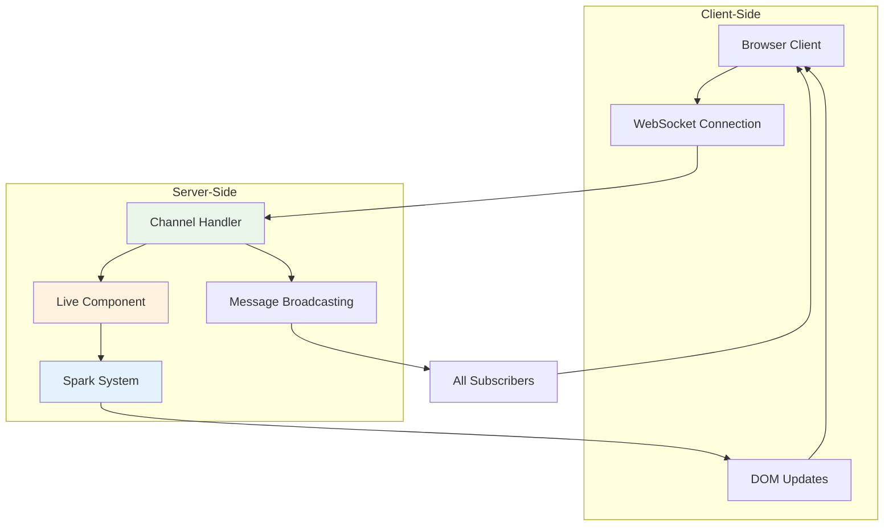

# Real-Time Features

Azu provides first-class support for real-time web applications through **WebSocket channels** and **live components**. These features enable bidirectional communication between clients and servers, making it possible to build interactive applications with instant updates.

## Architecture Overview

Azu's real-time architecture consists of three main components:



### Key Components

1. **WebSocket Channels**: Handle persistent connections and message routing
2. **Live Components**: Server-side components that sync with client DOM
3. **Spark System**: Client-side JavaScript for real-time DOM updates

## WebSocket Channels

Channels provide a high-level abstraction for WebSocket connections, handling connection lifecycle, message routing, and broadcasting.

### Basic Channel Structure

```crystal
class ChatChannel < Azu::Channel
  # Define the WebSocket route
  ws "/chat/:room_id"
  
  # Connection tracking
  @@connections = Hash(String, Set(HTTP::WebSocket)).new { |h, k| h[k] = Set(HTTP::WebSocket).new }
  
  def on_connect
    room_id = params["room_id"]
    @@connections[room_id] << socket
    
    # Send welcome message
    send_message({
      type: "system",
      message: "Welcome to room #{room_id}",
      timestamp: Time.utc.to_rfc3339
    })
    
    # Notify others in the room
    broadcast_to_room(room_id, {
      type: "user_joined",
      message: "A user joined the room",
      count: @@connections[room_id].size
    }, exclude: socket)
    
    Log.info { "User connected to room #{room_id}. Total: #{@@connections[room_id].size}" }
  end
  
  def on_message(message : String)
    begin
      data = JSON.parse(message)
      handle_message_type(data)
    rescue JSON::ParseException
      send_error("Invalid JSON format")
    rescue ex
      Log.error(exception: ex) { "Error processing message" }
      send_error("Internal server error")
    end
  end
  
  def on_binary(binary : Bytes)
    # Handle binary data (file uploads, images, etc.)
    if binary.size > 1.megabyte
      send_error("File too large")
      return
    end
    
    # Process binary data
    file_info = process_binary_upload(binary)
    broadcast_file_upload(file_info)
  end
  
  def on_ping(message : String)
    # Respond to ping with pong
    socket.pong(message)
  end
  
  def on_pong(message : String)
    # Client responded to our ping
    Log.debug { "Pong received: #{message}" }
  end
  
  def on_close(code : HTTP::WebSocket::CloseCode?, message : String?)
    room_id = params["room_id"]
    @@connections[room_id].delete(socket)
    
    # Notify remaining users
    if @@connections[room_id].any?
      broadcast_to_room(room_id, {
        type: "user_left",
        message: "A user left the room",
        count: @@connections[room_id].size
      })
    end
    
    Log.info { "User disconnected from room #{room_id}. Remaining: #{@@connections[room_id].size}" }
  end
  
  private def handle_message_type(data)
    room_id = params["room_id"]
    
    case data["type"]?.try(&.as_s)
    when "chat_message"
      handle_chat_message(room_id, data)
    when "typing_start"
      handle_typing_indicator(room_id, data, true)
    when "typing_stop"
      handle_typing_indicator(room_id, data, false)
    when "ping"
      send_message({type: "pong", timestamp: Time.utc.to_rfc3339})
    else
      send_error("Unknown message type: #{data["type"]?}")
    end
  end
  
  private def handle_chat_message(room_id : String, data)
    message = data["message"]?.try(&.as_s)
    return send_error("Message is required") unless message
    
    # Validate message
    return send_error("Message too long") if message.size > 1000
    return send_error("Message cannot be empty") if message.strip.empty?
    
    # Broadcast to all users in room
    broadcast_to_room(room_id, {
      type: "chat_message",
      message: message,
      timestamp: Time.utc.to_rfc3339,
      user_id: current_user_id
    })
  end
  
  private def handle_typing_indicator(room_id : String, data, is_typing : Bool)
    broadcast_to_room(room_id, {
      type: is_typing ? "user_typing" : "user_stopped_typing",
      user_id: current_user_id,
      timestamp: Time.utc.to_rfc3339
    }, exclude: socket)
  end
  
  private def broadcast_to_room(room_id : String, data, exclude : HTTP::WebSocket? = nil)
    message = data.to_json
    @@connections[room_id].each do |connection|
      next if connection == exclude
      spawn { connection.send(message) }
    end
  end
  
  private def send_message(data)
    socket.send(data.to_json)
  end
  
  private def send_error(message : String)
    send_message({
      type: "error",
      message: message,
      timestamp: Time.utc.to_rfc3339
    })
  end
  
  private def current_user_id
    # Extract user ID from authentication token or session
    "user_#{socket.object_id}"
  end
end
```

### Channel Authentication

Implement authentication for secure channels:

```crystal
class PrivateChannel < Azu::Channel
  ws "/private/:channel_id"
  
  def on_connect
    # Authenticate user before allowing connection
    unless authenticate_user
      socket.close(HTTP::WebSocket::CloseCode::PolicyViolation, "Authentication required")
      return
    end
    
    # Check authorization for specific channel
    unless authorize_channel_access(params["channel_id"])
      socket.close(HTTP::WebSocket::CloseCode::PolicyViolation, "Access denied")
      return
    end
    
    # User is authenticated and authorized
    join_channel(params["channel_id"])
  end
  
  private def authenticate_user : Bool
    # Extract token from query parameters or headers
    token = extract_auth_token
    return false unless token
    
    begin
      @current_user = AuthService.authenticate(token)
      true
    rescue AuthenticationError
      false
    end
  end
  
  private def authorize_channel_access(channel_id : String) : Bool
    return false unless @current_user
    
    # Check if user has access to this channel
    ChannelPermissions.can_access?(@current_user, channel_id)
  end
  
  private def extract_auth_token : String?
    # Try query parameter first
    if token = context.request.query_params["token"]?
      return token
    end
    
    # Try Authorization header
    if auth_header = context.request.headers["Authorization"]?
      if match = auth_header.match(/Bearer (.+)/)
        return match[1]
      end
    end
    
    nil
  end
end
```

### Connection Management

Handle connection state and cleanup:

```crystal
class ManagedChannel < Azu::Channel
  ws "/managed/:topic"
  
  # Connection registry with metadata
  @@connections = Hash(HTTP::WebSocket, ConnectionInfo).new
  
  record ConnectionInfo,
    user_id : String,
    topic : String,
    connected_at : Time,
    last_activity : Time
  
  def on_connect
    topic = params["topic"]
    user_id = authenticate_and_get_user_id
    
    # Register connection with metadata
    @@connections[socket] = ConnectionInfo.new(
      user_id: user_id,
      topic: topic,
      connected_at: Time.utc,
      last_activity: Time.utc
    )
    
    # Send connection confirmation
    send_message({
      type: "connected",
      topic: topic,
      user_id: user_id,
      server_time: Time.utc.to_rfc3339
    })
    
    # Start heartbeat
    start_heartbeat
  end
  
  def on_message(message : String)
    # Update last activity
    if info = @@connections[socket]?
      @@connections[socket] = info.copy_with(last_activity: Time.utc)
    end
    
    # Process message
    super(message)
  end
  
  def on_close(code, message)
    # Clean up connection
    @@connections.delete(socket)
    
    Log.info { "Connection closed. Active connections: #{@@connections.size}" }
  end
  
  private def start_heartbeat
    spawn(name: "heartbeat-#{socket.object_id}") do
      loop do
        sleep 30.seconds
        
        begin
          socket.ping("heartbeat")
        rescue
          # Connection is dead, will be cleaned up in on_close
          break
        end
      end
    end
  end
  
  # Class method to broadcast to all connections on a topic
  def self.broadcast_to_topic(topic : String, data)
    message = data.to_json
    @@connections.each do |socket, info|
      if info.topic == topic
        spawn { socket.send(message) }
      end
    end
  end
  
  # Class method to get connection statistics
  def self.connection_stats
    stats = Hash(String, Int32).new(0)
    @@connections.each do |socket, info|
      stats[info.topic] += 1
    end
    stats
  end
end
```

## Live Components

Live components enable server-side rendered content that automatically syncs with the client DOM. They provide reactive UI updates without full page reloads.

### Basic Component Structure

```crystal
class CounterComponent
  include Azu::Component
  
  # Component state
  property count : Int32 = 0
  property step : Int32 = 1
  
  def initialize(@count = 0, @step = 1)
  end
  
  # Render the component's HTML
  def content
    div(class: "counter-component", id: component_id) do
      h2 { text "Counter: #{count}" }
      
      div(class: "controls") do
        button(
          type: "button",
          onclick: spark_click("decrement"),
          class: "btn btn-danger"
        ) { text "-#{step}" }
        
        input(
          type: "number",
          value: step.to_s,
          onchange: spark_change("set_step"),
          class: "form-control step-input",
          min: "1"
        )
        
        button(
          type: "button", 
          onclick: spark_click("increment"),
          class: "btn btn-success"
        ) { text "+#{step}" }
      end
      
      div(class: "actions") do
        button(
          onclick: spark_click("reset"),
          class: "btn btn-secondary"
        ) { text "Reset" }
        
        button(
          onclick: spark_click("double"),
          class: "btn btn-info"
        ) { text "Double" }
      end
    end
  end
  
  # Handle component events
  def on_event(name : String, data : Hash(String, JSON::Any))
    case name
    when "increment"
      @count += @step
      refresh # Update the client
      
    when "decrement"
      @count -= @step
      refresh
      
    when "reset"
      @count = 0
      refresh
      
    when "double"
      @count *= 2
      refresh
      
    when "set_step"
      if new_step = data["value"]?.try(&.as_i?)
        @step = new_step if new_step > 0
        refresh
      end
      
    else
      Log.warn { "Unknown event: #{name}" }
    end
  end
  
  # Component lifecycle hooks
  def on_mount
    Log.info { "Counter component mounted with count: #{count}" }
  end
  
  def on_unmount
    Log.info { "Counter component unmounted" }
  end
  
  def on_update
    Log.debug { "Counter updated to: #{count}" }
  end
end
```

### Advanced Component Patterns

#### Data-Driven Components

```crystal
class UserListComponent
  include Azu::Component
  
  property users : Array(User) = [] of User
  property filter : String = ""
  property sort_by : String = "name"
  property sort_order : String = "asc"
  
  def initialize(@users = [] of User)
  end
  
  def content
    div(class: "user-list-component") do
      # Search and filter controls
      div(class: "filters") do
        input(
          type: "search",
          placeholder: "Search users...",
          value: filter,
          oninput: spark_input("filter_users"),
          class: "form-control"
        )
        
        select(onchange: spark_change("sort_users"), class: "form-control") do
          option(value: "name", selected: sort_by == "name") { text "Name" }
          option(value: "email", selected: sort_by == "email") { text "Email" }
          option(value: "created_at", selected: sort_by == "created_at") { text "Join Date" }
        end
        
        button(
          onclick: spark_click("toggle_sort_order"),
          class: "btn btn-outline-secondary"
        ) { text sort_order == "asc" ? "↑" : "↓" }
      end
      
      # User list
      div(class: "user-grid") do
        filtered_users.each do |user|
          render_user_card(user)
        end
        
        if filtered_users.empty?
          div(class: "empty-state") do
            p { text "No users found matching your criteria" }
          end
        end
      end
      
      # Pagination
      render_pagination if users.size > 20
    end
  end
  
  def on_event(name : String, data)
    case name
    when "filter_users"
      @filter = data["value"]?.try(&.as_s) || ""
      refresh
      
    when "sort_users"
      @sort_by = data["value"]?.try(&.as_s) || "name"
      refresh
      
    when "toggle_sort_order"
      @sort_order = sort_order == "asc" ? "desc" : "asc"
      refresh
      
    when "remove_user"
      if user_id = data["user_id"]?.try(&.as_i64?)
        remove_user(user_id)
      end
      
    when "edit_user"
      if user_id = data["user_id"]?.try(&.as_i64?)
        show_edit_modal(user_id)
      end
    end
  end
  
  private def filtered_users
    result = users
    
    # Apply filter
    if !filter.empty?
      result = result.select do |user|
        user.name.downcase.includes?(filter.downcase) ||
        user.email.downcase.includes?(filter.downcase)
      end
    end
    
    # Apply sorting
    result = case sort_by
    when "name"
      result.sort_by(&.name)
    when "email"
      result.sort_by(&.email)
    when "created_at"
      result.sort_by(&.created_at)
    else
      result
    end
    
    # Apply sort order
    result = result.reverse if sort_order == "desc"
    
    result
  end
  
  private def render_user_card(user : User)
    div(class: "user-card", data_user_id: user.id.to_s) do
      div(class: "user-avatar") do
        img(src: user.avatar_url, alt: user.name)
      end
      
      div(class: "user-info") do
        h4 { text user.name }
        p { text user.email }
        small { text "Joined #{user.created_at.to_s("%B %Y")}" }
      end
      
      div(class: "user-actions") do
        button(
          onclick: spark_click("edit_user", {user_id: user.id}),
          class: "btn btn-sm btn-primary"
        ) { text "Edit" }
        
        button(
          onclick: spark_click("remove_user", {user_id: user.id}),
          class: "btn btn-sm btn-danger",
          confirm: "Are you sure you want to remove #{user.name}?"
        ) { text "Remove" }
      end
    end
  end
  
  private def remove_user(user_id : Int64)
    @users = users.reject { |u| u.id == user_id }
    refresh
    
    # Notify about the change
    notify("User removed successfully", type: "success")
  end
  
  private def show_edit_modal(user_id : Int64)
    # This would trigger a modal component or navigate to edit page
    emit_event("show_edit_modal", {user_id: user_id})
  end
end
```

#### Real-Time Chat Component

```crystal
class ChatComponent
  include Azu::Component
  
  property messages : Array(ChatMessage) = [] of ChatMessage
  property current_user : User
  property room_id : String
  property typing_users : Set(String) = Set(String).new
  
  def initialize(@current_user, @room_id)
    # Subscribe to chat channel for this room
    subscribe_to_channel("/chat/#{room_id}")
  end
  
  def content
    div(class: "chat-component", id: component_id) do
      # Chat header
      div(class: "chat-header") do
        h3 { text "Chat Room #{room_id}" }
        span(class: "user-count") { text "#{online_users_count} users online" }
      end
      
      # Messages area
      div(class: "chat-messages", id: "messages-#{component_id}") do
        messages.each do |message|
          render_message(message)
        end
        
        # Typing indicators
        if typing_users.any?
          div(class: "typing-indicator") do
            text "#{typing_users.join(", ")} #{typing_users.size == 1 ? "is" : "are"} typing..."
          end
        end
      end
      
      # Message input
      div(class: "chat-input") do
        div(class: "input-group") do
          input(
            type: "text",
            placeholder: "Type your message...",
            value: "",
            onkeydown: spark_keydown("handle_keydown"),
            oninput: spark_input("handle_typing"),
            id: "message-input-#{component_id}",
            class: "form-control"
          )
          
          button(
            onclick: spark_click("send_message"),
            class: "btn btn-primary"
          ) { text "Send" }
        end
      end
    end
  end
  
  def on_event(name : String, data)
    case name
    when "send_message"
      send_chat_message
      
    when "handle_keydown"
      if data["key"]?.try(&.as_s) == "Enter"
        send_chat_message
      end
      
    when "handle_typing"
      handle_typing_event
      
    when "clear_typing"
      clear_typing_indicator
    end
  end
  
  # Handle messages from WebSocket channel
  def on_channel_message(message_type : String, data)
    case message_type
    when "chat_message"
      add_message(ChatMessage.from_json(data.to_json))
      
    when "user_typing"
      user_id = data["user_id"]?.try(&.as_s)
      if user_id && user_id != current_user.id.to_s
        @typing_users << user_id
        refresh
        
        # Clear typing indicator after 3 seconds
        spawn do
          sleep 3.seconds
          @typing_users.delete(user_id)
          refresh
        end
      end
      
    when "user_stopped_typing"
      user_id = data["user_id"]?.try(&.as_s)
      if user_id
        @typing_users.delete(user_id)
        refresh
      end
      
    when "user_joined", "user_left"
      # Update user count or show notification
      refresh
    end
  end
  
  private def send_chat_message
    message_text = get_input_value("message-input-#{component_id}")
    return if message_text.strip.empty?
    
    # Send to WebSocket channel
    send_channel_message("chat_message", {
      message: message_text,
      user_id: current_user.id,
      room_id: room_id
    })
    
    # Clear input
    set_input_value("message-input-#{component_id}", "")
    clear_typing_indicator
  end
  
  private def handle_typing_event
    # Send typing indicator to other users
    send_channel_message("typing_start", {
      user_id: current_user.id,
      room_id: room_id
    })
    
    # Set timer to stop typing indicator
    @typing_timer.try(&.cancel)
    @typing_timer = spawn do
      sleep 2.seconds
      clear_typing_indicator
    end
  end
  
  private def clear_typing_indicator
    send_channel_message("typing_stop", {
      user_id: current_user.id,
      room_id: room_id
    })
  end
  
  private def add_message(message : ChatMessage)
    @messages << message
    refresh
    
    # Scroll to bottom
    execute_js("document.getElementById('messages-#{component_id}').scrollTop = document.getElementById('messages-#{component_id}').scrollHeight")
  end
  
  private def render_message(message : ChatMessage)
    div(class: "chat-message #{message.user_id == current_user.id ? "own-message" : "other-message"}") do
      div(class: "message-header") do
        strong { text message.user_name }
        span(class: "timestamp") { text message.created_at.to_s("%H:%M") }
      end
      div(class: "message-content") { text message.content }
    end
  end
end

record ChatMessage,
  id : Int64,
  content : String,
  user_id : Int64,
  user_name : String,
  room_id : String,
  created_at : Time
```

## Spark System

The Spark system provides the client-side JavaScript that handles real-time DOM updates and WebSocket communication.

### Client-Side Integration

Include the Spark JavaScript in your templates:

```html
<!DOCTYPE html>
<html>
<head>
  <title>Real-Time App</title>
  <script src="/js/azu-spark.js"></script>
</head>
<body>
  <div id="app">
    <!-- Your live components will be rendered here -->
  </div>
  
  <script>
    // Initialize Spark system
    const spark = new AzuSpark({
      // WebSocket endpoint for component updates
      componentEndpoint: '/ws/components',
      
      // WebSocket endpoint for channels
      channelEndpoint: '/ws/channels',
      
      // Global event handlers
      onConnect: function() {
        console.log('Connected to Azu server');
      },
      
      onDisconnect: function() {
        console.log('Disconnected from Azu server');
        // Show offline indicator
      },
      
      onError: function(error) {
        console.error('Spark error:', error);
      }
    });
    
    // Mount components
    spark.mount();
  </script>
</body>
</html>
```

### Event Handling

The Spark system automatically handles component events:

```crystal
# In your component
def content
  div do
    // Click events
    button(onclick: spark_click("increment")) { text "+" }
    
    // Form events
    input(oninput: spark_input("update_value"), value: @value)
    select(onchange: spark_change("select_option")) do
      option(value: "1") { text "Option 1" }
      option(value: "2") { text "Option 2" }
    end
    
    // Keyboard events
    input(onkeydown: spark_keydown("handle_key"))
    
    // Custom events with data
    button(onclick: spark_click("custom_action", {id: 123, type: "special"})) do
      text "Custom Action"
    end
    
    // Form submission
    form(onsubmit: spark_submit("submit_form")) do
      input(name: "email", type: "email")
      button(type: "submit") { text "Submit" }
    end
  end
end
```

### Performance Optimization

The Spark system includes several optimizations:

```javascript
// Differential DOM updates
class AzuSpark {
  updateComponent(componentId, newHtml) {
    const element = document.getElementById(componentId);
    if (!element) return;
    
    // Use morphdom for efficient DOM diffing
    morphdom(element, newHtml, {
      onBeforeElUpdated: function(fromEl, toEl) {
        // Preserve focus state
        if (fromEl === document.activeElement) {
          return false;
        }
        return true;
      }
    });
  }
  
  // Batch multiple updates
  batchUpdate(updates) {
    requestAnimationFrame(() => {
      updates.forEach(update => {
        this.updateComponent(update.id, update.html);
      });
    });
  }
  
  // Debounce rapid events
  debounce(func, wait) {
    let timeout;
    return function executedFunction(...args) {
      const later = () => {
        clearTimeout(timeout);
        func(...args);
      };
      clearTimeout(timeout);
      timeout = setTimeout(later, wait);
    };
  }
}
```

## Integration Examples

### Real-Time Dashboard

```crystal
class DashboardPage
  include Azu::Response
  include Azu::Templates::Renderable
  
  def initialize(@user : User)
  end
  
  def render
    view "dashboard.html", {
      user: @user,
      components: [
        MetricsComponent.new,
        ActivityFeedComponent.new(@user),
        NotificationComponent.new(@user),
        ChatComponent.new(@user, "general")
      ]
    }
  end
end

# Template: dashboard.html
```

```html
<div class="dashboard">
  <header>
    <h1>Welcome, {{ user.name }}</h1>
  </header>
  
  <div class="dashboard-grid">
    <div class="metrics-panel">
      {{ components[0].render | safe }}
    </div>
    
    <div class="activity-panel">
      {{ components[1].render | safe }}
    </div>
    
    <div class="notifications-panel">
      {{ components[2].render | safe }}
    </div>
    
    <div class="chat-panel">
      {{ components[3].render | safe }}
    </div>
  </div>
</div>

<script>
  // Connect to real-time updates
  spark.connect();
  
  // Subscribe to user-specific channel
  spark.subscribe('/private/user_{{ user.id }}');
</script>
```

### Live Collaboration

```crystal
class DocumentEditor
  include Azu::Component
  
  property document : Document
  property collaborators : Array(User) = [] of User
  property cursor_positions : Hash(String, Int32) = Hash(String, Int32).new
  
  def initialize(@document, @current_user : User)
    subscribe_to_channel("/document/#{document.id}")
  end
  
  def content
    div(class: "document-editor") do
      // Editor toolbar
      div(class: "editor-toolbar") do
        button(onclick: spark_click("save")) { text "Save" }
        button(onclick: spark_click("share")) { text "Share" }
        
        div(class: "collaborators") do
          collaborators.each do |user|
            img(src: user.avatar_url, title: user.name, class: "collaborator-avatar")
          end
        end
      end
      
      // Editor content
      div(class: "editor-content") do
        textarea(
          value: document.content,
          oninput: spark_input("content_changed"),
          onselect: spark_event("cursor_moved"),
          id: "editor-#{component_id}"
        )
      end
      
      // Status bar
      div(class: "status-bar") do
        span { text "#{document.content.size} characters" }
        span { text "#{collaborators.size} collaborators" }
        span { text "Last saved: #{document.updated_at.to_s("%H:%M")}" }
      end
    end
  end
  
  def on_event(name : String, data)
    case name
    when "content_changed"
      content = data["value"]?.try(&.as_s) || ""
      broadcast_content_change(content)
      
    when "cursor_moved"
      position = data["selectionStart"]?.try(&.as_i) || 0
      broadcast_cursor_position(position)
      
    when "save"
      save_document
    end
  end
  
  def on_channel_message(type : String, data)
    case type
    when "content_changed"
      if data["user_id"] != @current_user.id
        update_content(data["content"].as_s)
      end
      
    when "cursor_moved"
      user_id = data["user_id"].as_s
      position = data["position"].as_i
      @cursor_positions[user_id] = position
      show_cursor_indicator(user_id, position)
      
    when "user_joined"
      user = User.from_json(data["user"].to_json)
      @collaborators << user unless collaborators.includes?(user)
      refresh
      
    when "user_left"
      user_id = data["user_id"].as_s
      @collaborators.reject! { |u| u.id.to_s == user_id }
      @cursor_positions.delete(user_id)
      refresh
    end
  end
end
```

---

## Summary

Azu's real-time features provide a comprehensive foundation for building interactive applications:

- **WebSocket Channels** handle persistent connections and message broadcasting
- **Live Components** enable reactive server-side rendered UI
- **Spark System** provides efficient client-side DOM updates
- **Integration patterns** support complex real-time applications

These features work together to create seamless real-time experiences while maintaining Azu's core principles of type safety and performance.

**Next Steps:**
- [Templates & Views](templates.md) - Template engine and markup DSL
- [Middleware](middleware.md) - Built-in handlers and custom middleware
- [Testing Real-Time Features](testing/websockets.md) - Testing WebSocket channels and components
