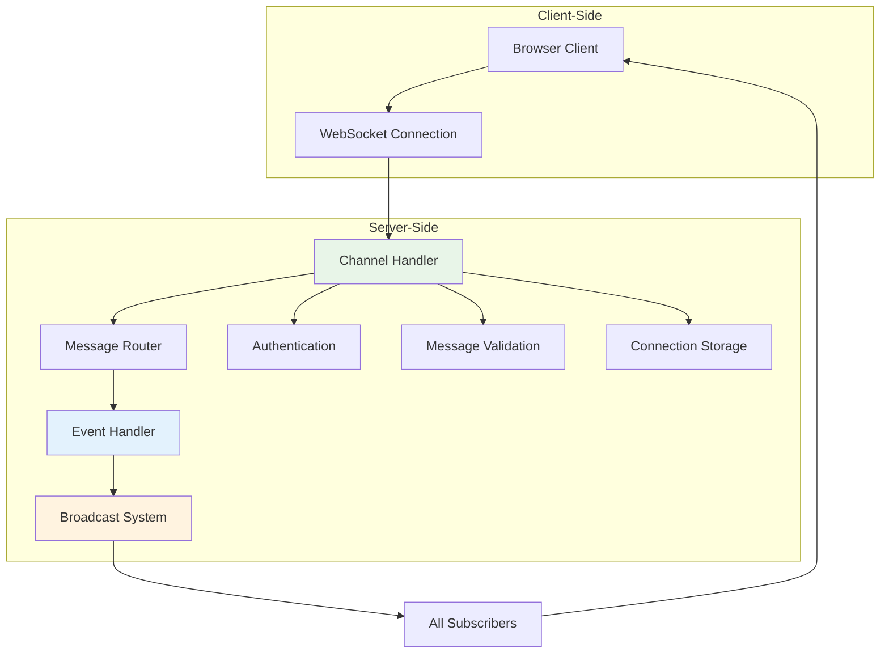

# WebSocket Channels

Azu provides first-class WebSocket support through **channels**, which handle persistent connections, message routing, and broadcasting. Channels enable real-time bidirectional communication between clients and servers.

## Overview

WebSocket channels provide:

- **Persistent connections** for real-time communication
- **Message routing** and event handling
- **Connection management** and lifecycle events
- **Broadcasting** to multiple clients
- **Type-safe message handling** with Crystal's type system

## Architecture



## Basic Channel Structure

### Simple Chat Channel

```crystal
class ChatChannel < Azu::Channel
  # Define the WebSocket route
  ws "/chat/:room_id"

  # Connection tracking
  @@connections = Hash(String, Set(HTTP::WebSocket)).new { |h, k| h[k] = Set(HTTP::WebSocket).new }

  def on_connect
    room_id = params["room_id"]
    @@connections[room_id] << socket

    # Send welcome message
    send_message({
      type: "system",
      message: "Welcome to room #{room_id}",
      timestamp: Time.utc.to_rfc3339
    })

    # Notify others in the room
    broadcast_to_room(room_id, {
      type: "user_joined",
      message: "A user joined the room",
      count: @@connections[room_id].size
    }, exclude: socket)

    Log.info { "User connected to room #{room_id}. Total: #{@@connections[room_id].size}" }
  end

  def on_message(message : String)
    begin
      data = JSON.parse(message)
      handle_message_type(data)
    rescue JSON::ParseException
      send_error("Invalid JSON format")
    rescue ex
      Log.error(exception: ex) { "Error processing message" }
      send_error("Internal server error")
    end
  end

  def on_close(code : HTTP::WebSocket::CloseCode?, message : String?)
    room_id = params["room_id"]
    @@connections[room_id].delete(socket)

    # Notify remaining users
    if @@connections[room_id].any?
      broadcast_to_room(room_id, {
        type: "user_left",
        message: "A user left the room",
        count: @@connections[room_id].size
      })
    end

    Log.info { "User disconnected from room #{room_id}. Remaining: #{@@connections[room_id].size}" }
  end

  private def handle_message_type(data)
    room_id = params["room_id"]

    case data["type"]?.try(&.as_s)
    when "chat_message"
      handle_chat_message(room_id, data)
    when "typing_start"
      handle_typing_indicator(room_id, data, true)
    when "typing_stop"
      handle_typing_indicator(room_id, data, false)
    when "ping"
      send_message({type: "pong", timestamp: Time.utc.to_rfc3339})
    else
      send_error("Unknown message type: #{data["type"]?}")
    end
  end

  private def handle_chat_message(room_id : String, data)
    message = data["message"]?.try(&.as_s)
    return send_error("Message is required") unless message

    # Validate message
    return send_error("Message too long") if message.size > 1000
    return send_error("Message cannot be empty") if message.strip.empty?

    # Broadcast to all users in room
    broadcast_to_room(room_id, {
      type: "chat_message",
      message: message,
      timestamp: Time.utc.to_rfc3339,
      user_id: current_user_id
    })
  end

  private def handle_typing_indicator(room_id : String, data, is_typing : Bool)
    broadcast_to_room(room_id, {
      type: is_typing ? "user_typing" : "user_stopped_typing",
      user_id: current_user_id,
      timestamp: Time.utc.to_rfc3339
    }, exclude: socket)
  end

  private def broadcast_to_room(room_id : String, data, exclude : HTTP::WebSocket? = nil)
    message = data.to_json
    @@connections[room_id].each do |connection|
      next if connection == exclude
      spawn { connection.send(message) }
    end
  end

  private def send_message(data)
    socket.send(data.to_json)
  end

  private def send_error(message : String)
    send_message({
      type: "error",
      message: message,
      timestamp: Time.utc.to_rfc3339
    })
  end

  private def current_user_id
    # Extract user ID from authentication token or session
    "user_#{socket.object_id}"
  end
end
```

## Channel Lifecycle

### Connection Events

```crystal
class NotificationChannel < Azu::Channel
  ws "/notifications"

  def on_connect
    # Called when a client connects
    user_id = authenticate_user
    return reject_connection("Unauthorized") unless user_id

    # Store connection
    store_connection(user_id, socket)

    # Send initial data
    send_notifications(user_id)

    Log.info { "User #{user_id} connected to notifications" }
  end

  def on_message(message : String)
    # Called when a client sends a message
    handle_message(message)
  end

  def on_binary(binary : Bytes)
    # Called when a client sends binary data
    handle_binary_data(binary)
  end

  def on_ping(message : String)
    # Called when a client sends a ping
    socket.pong(message)
  end

  def on_pong(message : String)
    # Called when a client responds to a ping
    Log.debug { "Pong received: #{message}" }
  end

  def on_close(code : HTTP::WebSocket::CloseCode?, message : String?)
    # Called when a client disconnects
    user_id = get_user_id(socket)
    remove_connection(user_id, socket)

    Log.info { "User #{user_id} disconnected from notifications" }
  end
end
```

## Message Handling

### Type-Safe Message Processing

```crystal
class GameChannel < Azu::Channel
  ws "/game/:game_id"

  # Define message types
  enum MessageType
    JOIN_GAME
    MOVE
    CHAT
    LEAVE_GAME
  end

  # Message structures
  struct JoinGameMessage
    include JSON::Serializable
    getter player_name : String
    getter color : String
  end

  struct MoveMessage
    include JSON::Serializable
    getter from : String
    getter to : String
    getter piece : String
  end

  struct ChatMessage
    include JSON::Serializable
    getter message : String
    getter player_id : String
  end

  def on_message(message : String)
    begin
      data = JSON.parse(message)
      message_type = MessageType.parse(data["type"].as_s)

      case message_type
      when .join_game?
        handle_join_game(JoinGameMessage.from_json(message))
      when .move?
        handle_move(MoveMessage.from_json(message))
      when .chat?
        handle_chat(ChatMessage.from_json(message))
      when .leave_game?
        handle_leave_game
      end
    rescue ex
      send_error("Invalid message format: #{ex.message}")
    end
  end

  private def handle_join_game(data : JoinGameMessage)
    game_id = params["game_id"]

    # Validate game exists and has space
    return send_error("Game not found") unless game_exists?(game_id)
    return send_error("Game is full") unless game_has_space?(game_id)

    # Add player to game
    add_player_to_game(game_id, data.player_name, data.color)

    # Broadcast to all players
    broadcast_to_game(game_id, {
      type: "player_joined",
      player_name: data.player_name,
      color: data.color
    })
  end

  private def handle_move(data : MoveMessage)
    game_id = params["game_id"]
    player_id = get_player_id(socket)

    # Validate move
    return send_error("Invalid move") unless valid_move?(game_id, data)

    # Apply move
    apply_move(game_id, data)

    # Broadcast move to all players
    broadcast_to_game(game_id, {
      type: "move_made",
      from: data.from,
      to: data.to,
      piece: data.piece,
      player_id: player_id
    })
  end

  private def handle_chat(data : ChatMessage)
    game_id = params["game_id"]

    # Validate message
    return send_error("Message too long") if data.message.size > 200

    # Broadcast chat message
    broadcast_to_game(game_id, {
      type: "chat_message",
      message: data.message,
      player_id: data.player_id,
      timestamp: Time.utc.to_rfc3339
    })
  end
end
```

## Broadcasting

### Room-Based Broadcasting

```crystal
class RoomChannel < Azu::Channel
  ws "/room/:room_id"

  @@rooms = Hash(String, Set(HTTP::WebSocket)).new { |h, k| h[k] = Set(HTTP::WebSocket).new }

  def on_connect
    room_id = params["room_id"]
    @@rooms[room_id] << socket

    # Send room info
    send_message({
      type: "room_info",
      room_id: room_id,
      user_count: @@rooms[room_id].size
    })
  end

  def on_close(code : HTTP::WebSocket::CloseCode?, message : String?)
    room_id = params["room_id"]
    @@rooms[room_id].delete(socket)

    # Clean up empty rooms
    @@rooms.delete(room_id) if @@rooms[room_id].empty?
  end

  # Broadcast to specific room
  def broadcast_to_room(room_id : String, data, exclude : HTTP::WebSocket? = nil)
    return unless @@rooms[room_id]?

    message = data.to_json
    @@rooms[room_id].each do |connection|
      next if connection == exclude
      spawn { connection.send(message) }
    end
  end

  # Broadcast to all rooms
  def broadcast_to_all(data)
    message = data.to_json
    @@rooms.each_value do |connections|
      connections.each do |connection|
        spawn { connection.send(message) }
      end
    end
  end

  # Broadcast to multiple rooms
  def broadcast_to_rooms(room_ids : Array(String), data)
    message = data.to_json
    room_ids.each do |room_id|
      next unless @@rooms[room_id]?
      @@rooms[room_id].each do |connection|
        spawn { connection.send(message) }
      end
    end
  end
end
```

### User-Based Broadcasting

```crystal
class UserChannel < Azu::Channel
  ws "/user"

  @@users = Hash(String, HTTP::WebSocket).new

  def on_connect
    user_id = authenticate_user
    return reject_connection("Unauthorized") unless user_id

    @@users[user_id] = socket

    # Send user-specific data
    send_user_data(user_id)
  end

  def on_close(code : HTTP::WebSocket::CloseCode?, message : String?)
    user_id = get_user_id(socket)
    @@users.delete(user_id) if user_id
  end

  # Send message to specific user
  def send_to_user(user_id : String, data)
    return unless connection = @@users[user_id]?

    spawn { connection.send(data.to_json) }
  end

  # Send message to multiple users
  def send_to_users(user_ids : Array(String), data)
    message = data.to_json
    user_ids.each do |user_id|
      next unless connection = @@users[user_id]?
      spawn { connection.send(message) }
    end
  end

  # Broadcast to all users except sender
  def broadcast_to_all(data, exclude_user_id : String? = nil)
    message = data.to_json
    @@users.each do |user_id, connection|
      next if user_id == exclude_user_id
      spawn { connection.send(message) }
    end
  end
end
```

## Authentication and Authorization

### Token-Based Authentication

```crystal
class AuthenticatedChannel < Azu::Channel
  ws "/secure/:resource_id"

  def on_connect
    # Extract token from query parameters or headers
    token = extract_token
    return reject_connection("No token provided") unless token

    # Validate token
    user = validate_token(token)
    return reject_connection("Invalid token") unless user

    # Check resource access
    resource_id = params["resource_id"]
    return reject_connection("Access denied") unless can_access?(user, resource_id)

    # Store user context
    set_user_context(user)

    Log.info { "User #{user.id} connected to secure channel" }
  end

  def on_message(message : String)
    # Ensure user is authenticated for each message
    user = get_user_context
    return send_error("Not authenticated") unless user

    handle_authenticated_message(user, message)
  end

  private def extract_token : String?
    # Extract from query parameters
    token = params["token"]?
    return token if token

    # Extract from headers
    auth_header = request.headers["Authorization"]?
    return nil unless auth_header

    if auth_header.starts_with?("Bearer ")
      auth_header[7..]
    end
  end

  private def validate_token(token : String) : User?
    # Implement your token validation logic
    JWT.decode(token, secret_key, algorithm: JWT::Algorithm::HS256) do |payload|
      user_id = payload["user_id"].as_i
      User.find(user_id)
    end
  rescue ex
    Log.error(exception: ex) { "Token validation failed" }
    nil
  end

  private def can_access?(user : User, resource_id : String) : Bool
    # Implement your access control logic
    user.has_permission?("read", resource_id)
  end
end
```

## Error Handling

### Comprehensive Error Handling

```crystal
class RobustChannel < Azu::Channel
  ws "/robust"

  def on_connect
    begin
      # Connection setup
      setup_connection
    rescue ex
      Log.error(exception: ex) { "Connection setup failed" }
      reject_connection("Setup failed")
    end
  end

  def on_message(message : String)
    begin
      # Validate message format
      data = JSON.parse(message)

      # Process message
      process_message(data)
    rescue JSON::ParseException
      send_error("Invalid JSON format")
    rescue ValidationError < ex
      send_error("Validation failed: #{ex.message}")
    rescue AuthorizationError < ex
      send_error("Access denied: #{ex.message}")
    rescue ex
      Log.error(exception: ex) { "Message processing failed" }
      send_error("Internal server error")
    end
  end

  def on_close(code : HTTP::WebSocket::CloseCode?, message : String?)
    begin
      # Cleanup
      cleanup_connection
    rescue ex
      Log.error(exception: ex) { "Cleanup failed" }
    end
  end

  private def send_error(message : String, code : String? = nil)
    error_data = {
      type: "error",
      message: message,
      timestamp: Time.utc.to_rfc3339
    }

    error_data["code"] = code if code

    socket.send(error_data.to_json)
  end

  private def send_success(data)
    success_data = {
      type: "success",
      data: data,
      timestamp: Time.utc.to_rfc3339
    }

    socket.send(success_data.to_json)
  end
end
```

## Performance Optimization

### Connection Pooling

```crystal
class OptimizedChannel < Azu::Channel
  ws "/optimized"

  # Use connection pools for external services
  @@redis_pool = ConnectionPool.new(
    factory: ->{ Redis.new(url: ENV["REDIS_URL"]) },
    initial_pool_size: 5,
    max_pool_size: 20
  )

  def on_message(message : String)
    # Use connection pool for Redis operations
    @@redis_pool.with_connection do |redis|
      # Perform Redis operations
      redis.set("key", "value")
    end

    # Process message
    handle_message(message)
  end
end
```

### Message Batching

```crystal
class BatchedChannel < Azu::Channel
  ws "/batched"

  @@message_queue = Channel(Message).new
  @@batch_size = 10
  @@batch_timeout = 100.milliseconds

  def on_message(message : String)
    # Add message to queue
    @@message_queue.send(Message.new(socket, message))
  end

  # Process messages in batches
  spawn do
    batch = [] of Message
    timeout = Time.monotonic + @@batch_timeout

    loop do
      select
      when message = @@message_queue.receive
        batch << message

        if batch.size >= @@batch_size
          process_batch(batch)
          batch.clear
          timeout = Time.monotonic + @@batch_timeout
        end
      when timeout_reached = timeout
        if batch.any?
          process_batch(batch)
          batch.clear
        end
        timeout = Time.monotonic + @@batch_timeout
      end
    end
  end

  private def process_batch(messages : Array(Message))
    # Process multiple messages efficiently
    messages.each do |message|
      spawn { handle_message(message) }
    end
  end
end
```

## Testing Channels

### Channel Testing

```crystal
# spec/channels/chat_channel_spec.cr
require "spec"
require "../src/azu"

describe ChatChannel do
  it "handles chat messages" do
    # Create test channel
    channel = ChatChannel.new

    # Simulate connection
    socket = Azu::Test::WebSocket.new
    channel.on_connect(socket, {"room_id" => "general"})

    # Send message
    message = {
      "type" => "chat_message",
      "message" => "Hello, world!"
    }.to_json

    channel.on_message(socket, message)

    # Assert broadcast was sent
    socket.sent_messages.should contain(message)
  end

  it "validates message format" do
    channel = ChatChannel.new
    socket = Azu::Test::WebSocket.new

    # Send invalid JSON
    channel.on_message(socket, "invalid json")

    # Assert error was sent
    socket.sent_messages.should contain("error")
  end
end
```

## Best Practices

### 1. **Connection Management**

- Implement proper connection cleanup
- Use connection pools for external services
- Monitor connection health
- Handle reconnection gracefully

### 2. **Message Handling**

- Validate all incoming messages
- Use type-safe message structures
- Implement proper error handling
- Log important events

### 3. **Performance**

- Use connection pooling
- Implement message batching
- Monitor memory usage
- Optimize broadcasting

### 4. **Security**

- Authenticate all connections
- Validate message content
- Implement rate limiting
- Use secure WebSocket connections

## Next Steps

- [Live Components](components.md) - Build real-time UI components
- [Spark System](spark.md) - Client-side real-time updates
- [Channel Examples](../playground/channels/) - Working examples

---

**Ready to build real-time features?** Start with the basic channel examples above, then explore [Live Components](components.md) for interactive UI components.
