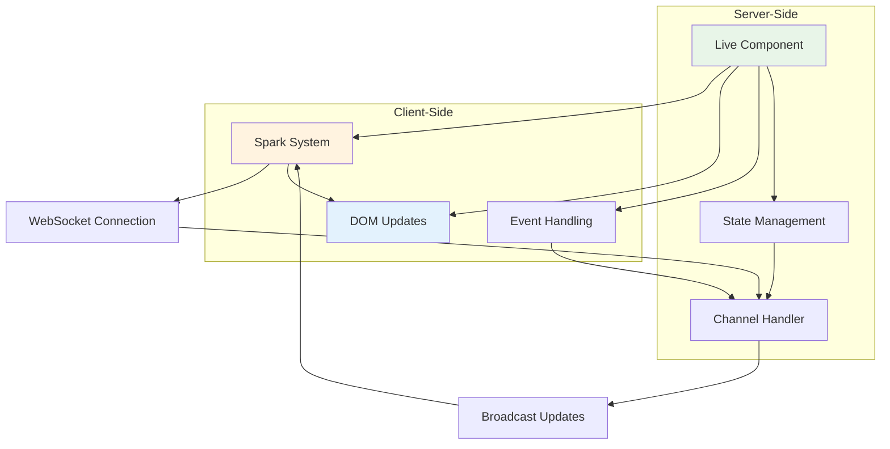

# Live Components

Azu's live components enable real-time UI updates through WebSocket connections. These components automatically sync with the server and update the DOM in real-time, providing a seamless interactive experience.

## Overview

Live components provide:

- **Real-time DOM updates** without page refreshes
- **Server-side state management** with client synchronization
- **Event-driven interactions** with immediate feedback
- **Component lifecycle management** for proper cleanup
- **Type-safe event handling** with Crystal's type system

## Architecture



## Basic Live Component

### Simple Counter Component

```crystal
class CounterComponent < Azu::Component
  def initialize(@initial_count : Int32 = 0)
    @count = @initial_count
  end

  def content
    div class: "counter", id: "counter-#{object_id}" do
      h3 "Counter"
      span id: "count", class: "count" do
        text @count.to_s
      end

      div class: "controls" do
        button onclick: "increment()", class: "btn btn-primary" do
          text "Increment"
        end
        button onclick: "decrement()", class: "btn btn-secondary" do
          text "Decrement"
        end
        button onclick: "reset()", class: "btn btn-danger" do
          text "Reset"
        end
      end
    end
  end

  def on_event("increment", data)
    @count += 1
    update_element "count", @count.to_s
  end

  def on_event("decrement", data)
    @count -= 1
    update_element "count", @count.to_s
  end

  def on_event("reset", data)
    @count = @initial_count
    update_element "count", @count.to_s
  end
end
```

### Using the Component

```crystal
struct CounterEndpoint
  include Endpoint(CounterRequest, CounterResponse)

  get "/counter"

  def call : CounterResponse
    component = CounterComponent.new(10)
    CounterResponse.new(component)
  end
end
```

## Component Lifecycle

### Lifecycle Methods

```crystal
class LifecycleComponent < Azu::Component
  def initialize(@user_id : String)
    @connected = false
    @data = [] of String
  end

  def content
    div class: "lifecycle-component", id: "lifecycle-#{object_id}" do
      h3 "Lifecycle Component"
      div id: "status" do
        text @connected ? "Connected" : "Disconnected"
      end
      div id: "data" do
        @data.each do |item|
          div class: "item" do
            text item
          end
        end
      end
    end
  end

  # Called when component is mounted
  def on_mount
    @connected = true
    update_element "status", "Connected"

    # Load initial data
    load_data
  end

  # Called when component is unmounted
  def on_unmount
    @connected = false
    # Cleanup resources
    cleanup_resources
  end

  # Called when WebSocket connects
  def on_connect
    Log.info { "Component #{object_id} connected" }
  end

  # Called when WebSocket disconnects
  def on_disconnect
    Log.info { "Component #{object_id} disconnected" }
    @connected = false
    update_element "status", "Disconnected"
  end

  private def load_data
    # Simulate loading data
    @data = ["Item 1", "Item 2", "Item 3"]
    render_data
  end

  private def render_data
    content = @data.map do |item|
      "<div class='item'>#{item}</div>"
    end.join

    update_element "data", content
  end

  private def cleanup_resources
    # Clean up any resources
    @data.clear
  end
end
```

## Event Handling

### Client-Side Events

```crystal
class InteractiveComponent < Azu::Component
  def initialize(@user : User)
    @likes = @user.likes_count
    @comments = [] of Comment
  end

  def content
    div class: "interactive-component", id: "interactive-#{object_id}" do
      h3 @user.name

      div class: "stats" do
        span id: "likes" do
          text "#{@likes} likes"
        end
        span id: "comments" do
          text "#{@comments.size} comments"
        end
      end

      div class: "actions" do
        button onclick: "like()", class: "btn btn-primary" do
          text "Like"
        end
        button onclick: "comment()", class: "btn btn-secondary" do
          text "Comment"
        end
      end

      div id: "comments-list" do
        @comments.each do |comment|
          div class: "comment" do
            text comment.text
          end
        end
      end
    end
  end

  def on_event("like", data)
    @likes += 1
    update_element "likes", "#{@likes} likes"

    # Broadcast to other users
    broadcast_update({
      type: "user_liked",
      user_id: @user.id,
      likes: @likes
    })
  end

  def on_event("comment", data)
    comment_text = data["text"]?.try(&.as_s)
    return unless comment_text

    comment = Comment.new(comment_text, @user.id)
    @comments << comment

    # Add comment to DOM
    append_element "comments-list" do
      div class: "comment" do
        text comment.text
      end
    end

    # Update comment count
    update_element "comments", "#{@comments.size} comments"

    # Broadcast to other users
    broadcast_update({
      type: "new_comment",
      user_id: @user.id,
      comment: comment_text
    })
  end
end
```

### Form Handling

```crystal
class FormComponent < Azu::Component
  def initialize
    @errors = {} of String => String
    @form_data = {} of String => String
  end

  def content
    form onsubmit: "submitForm(event)", class: "form-component", id: "form-#{object_id}" do
      div class: "form-group" do
        label "Name", for: "name"
        input type: "text", id: "name", name: "name", value: @form_data["name"]?
        if error = @errors["name"]?
          span class: "error" do
            text error
          end
        end
      end

      div class: "form-group" do
        label "Email", for: "email"
        input type: "email", id: "email", name: "email", value: @form_data["email"]?
        if error = @errors["email"]?
          span class: "error" do
            text error
          end
        end
      end

      button type: "submit", class: "btn btn-primary" do
        text "Submit"
      end
    end
  end

  def on_event("submit_form", data)
    # Clear previous errors
    @errors.clear
    @form_data = data

    # Validate form
    validate_form

    if @errors.empty?
      # Process form
      process_form
    else
      # Show errors
      render_errors
    end
  end

  private def validate_form
    name = @form_data["name"]?
    email = @form_data["email"]?

    @errors["name"] = "Name is required" if name.try(&.strip.empty?)
    @errors["email"] = "Email is required" if email.try(&.strip.empty?)
    @errors["email"] = "Invalid email format" if email && !email.matches?(/\A[^@\s]+@[^@\s]+\z/)
  end

  private def render_errors
    @errors.each do |field, message|
      update_element "#{field}-error", message
    end
  end

  private def process_form
    # Process the form data
    user = User.create(@form_data)

    # Show success message
    update_element "form-#{object_id}" do
      div class: "success" do
        text "Form submitted successfully!"
      end
    end
  end
end
```

## State Management

### Component State

```crystal
class StatefulComponent < Azu::Component
  def initialize(@initial_state : Hash(String, JSON::Any))
    @state = @initial_state
    @listeners = [] of Proc(Hash(String, JSON::Any), Nil)
  end

  def content
    div class: "stateful-component", id: "stateful-#{object_id}" do
      h3 "Stateful Component"

      div id: "state-display" do
        render_state
      end

      div class: "controls" do
        button onclick: "updateState()", class: "btn" do
          text "Update State"
        end
        button onclick: "resetState()", class: "btn" do
          text "Reset State"
        end
      end
    end
  end

  def on_event("update_state", data)
    # Update state
    new_state = data["state"]?.try(&.as_h)
    return unless new_state

    @state.merge!(new_state)
    notify_listeners
    render_state
  end

  def on_event("reset_state", data)
    @state = @initial_state
    notify_listeners
    render_state
  end

  # Add state change listener
  def on_state_change(&block : Hash(String, JSON::Any) -> Nil)
    @listeners << block
  end

  # Get current state
  def state : Hash(String, JSON::Any)
    @state
  end

  # Set state
  def set_state(new_state : Hash(String, JSON::Any))
    @state = new_state
    notify_listeners
    render_state
  end

  private def render_state
    content = @state.map do |key, value|
      "<div><strong>#{key}:</strong> #{value}</div>"
    end.join

    update_element "state-display", content
  end

  private def notify_listeners
    @listeners.each do |listener|
      listener.call(@state)
    end
  end
end
```

## Real-time Updates

### Broadcasting Updates

```crystal
class ChatComponent < Azu::Component
  def initialize(@room_id : String)
    @messages = [] of Message
    @users = Set(String).new
  end

  def content
    div class: "chat-component", id: "chat-#{object_id}" do
      h3 "Chat Room: #{@room_id}"

      div id: "users" do
        text "Users: #{@users.size}"
      end

      div id: "messages", class: "messages" do
        @messages.each do |message|
          div class: "message" do
            span class: "user" do
              text message.user
            end
            span class: "text" do
              text message.text
            end
            time message.timestamp.to_s("%H:%M")
          end
        end
      end

      form onsubmit: "sendMessage(event)" do
        input type: "text", id: "message-input", placeholder: "Type a message..."
        button type: "submit" do
          text "Send"
        end
      end
    end
  end

  def on_event("send_message", data)
    message_text = data["text"]?.try(&.as_s)
    user = data["user"]?.try(&.as_s)
    return unless message_text && user

    message = Message.new(user, message_text)
    @messages << message

    # Add message to DOM
    append_element "messages" do
      div class: "message" do
        span class: "user" do
          text message.user
        end
        span class: "text" do
          text message.text
        end
        time message.timestamp.to_s("%H:%M")
      end
    end

    # Broadcast to room
    broadcast_to_room(@room_id, {
      type: "new_message",
      user: user,
      text: message_text,
      timestamp: message.timestamp.to_rfc3339
    })
  end

  def on_event("user_joined", data)
    user = data["user"]?.try(&.as_s)
    return unless user

    @users << user
    update_element "users", "Users: #{@users.size}"

    # Add join message
    append_element "messages" do
      div class: "system-message" do
        text "#{user} joined the room"
      end
    end
  end

  def on_event("user_left", data)
    user = data["user"]?.try(&.as_s)
    return unless user

    @users.delete(user)
    update_element "users", "Users: #{@users.size}"

    # Add leave message
    append_element "messages" do
      div class: "system-message" do
        text "#{user} left the room"
      end
    end
  end
end
```

## Component Composition

### Reusable Components

```crystal
class ButtonComponent < Azu::Component
  def initialize(@text : String, @variant : String = "primary", @size : String = "md")
  end

  def content
    button class: "btn btn-#{@variant} btn-#{@size}" do
      text @text
    end
  end
end

class ModalComponent < Azu::Component
  def initialize(@title : String, @id : String)
  end

  def content
    div class: "modal", id: @id do
      div class: "modal-dialog" do
        div class: "modal-content" do
          div class: "modal-header" do
            h5 class: "modal-title" do
              text @title
            end
            button type: "button", class: "btn-close", onclick: "closeModal('#{@id}')"
          end
          div class: "modal-body" do
            yield
          end
        end
      end
    end
  end
end

class UserListComponent < Azu::Component
  def initialize(@users : Array(User))
  end

  def content
    div class: "user-list" do
      @users.each do |user|
        UserCardComponent.new(user).render
      end

      div class: "actions" do
        ButtonComponent.new("Add User", "success").render
        ButtonComponent.new("Export", "secondary").render
      end
    end
  end
end
```

## Performance Optimization

### Lazy Loading

```crystal
class LazyListComponent < Azu::Component
  def initialize(@items : Array(Item), @page_size : Int32 = 20)
    @current_page = 0
    @loaded_items = [] of Item
  end

  def content
    div class: "lazy-list", id: "lazy-list-#{object_id}" do
      div id: "items-container" do
        load_items(@current_page)
      end

      if @items.size > (@current_page + 1) * @page_size
        button onclick: "loadMore()", class: "btn btn-secondary" do
          text "Load More"
        end
      end
    end
  end

  def on_event("load_more", data)
    @current_page += 1
    new_items = load_items(@current_page)

    append_element "items-container", new_items
  end

  private def load_items(page : Int32) : String
    start_index = page * @page_size
    end_index = Math.min(start_index + @page_size, @items.size)

    @items[start_index...end_index].map do |item|
      "<div class='item'>#{item.name}</div>"
    end.join
  end
end
```

### Caching

```crystal
class CachedComponent < Azu::Component
  def initialize(@cache_key : String)
    @cache_ttl = 300 # 5 minutes
  end

  def content
    cached_fragment @cache_key, ttl: @cache_ttl do
      div class: "cached-component" do
        h3 "Cached Content"
        p "This content is cached for #{@cache_ttl} seconds"

        # Expensive operation
        expensive_data = load_expensive_data
        div class: "data" do
          text expensive_data
        end
      end
    end
  end

  private def load_expensive_data : String
    # Simulate expensive operation
    sleep 1.second
    "Expensive data loaded at #{Time.utc}"
  end
end
```

## Testing Components

### Component Testing

```crystal
# spec/components/counter_component_spec.cr
require "spec"
require "../src/azu"

describe CounterComponent do
  it "increments counter" do
    component = CounterComponent.new(5)

    # Simulate increment event
    component.on_event("increment", {} of String => JSON::Any)

    # Check internal state
    component.instance_variable_get(:@count).should eq(6)
  end

  it "updates DOM element" do
    component = CounterComponent.new(0)

    # Mock DOM update
    component.stub(:update_element, ->(id : String, content : String) {
      # Verify update was called
      id.should eq("count")
      content.should eq("1")
    })

    component.on_event("increment", {} of String => JSON::Any)
  end
end
```

## Best Practices

### 1. **Component Design**

- Keep components focused and single-purpose
- Use composition over inheritance
- Implement proper lifecycle management
- Handle cleanup in on_unmount

### 2. **State Management**

- Use immutable state updates
- Implement proper state serialization
- Minimize state complexity
- Use state change listeners

### 3. **Performance**

- Implement lazy loading for large lists
- Use caching for expensive operations
- Minimize DOM updates
- Optimize event handlers

### 4. **Event Handling**

- Validate all event data
- Use type-safe event structures
- Implement proper error handling
- Log important events

## Next Steps

- [WebSocket Channels](channels.md) - Build real-time communication
- [Spark System](spark.md) - Client-side real-time updates
- [Component Examples](../playground/components/) - Working examples

---

**Ready to build interactive components?** Start with the basic examples above, then explore [WebSocket Channels](channels.md) for real-time communication.
