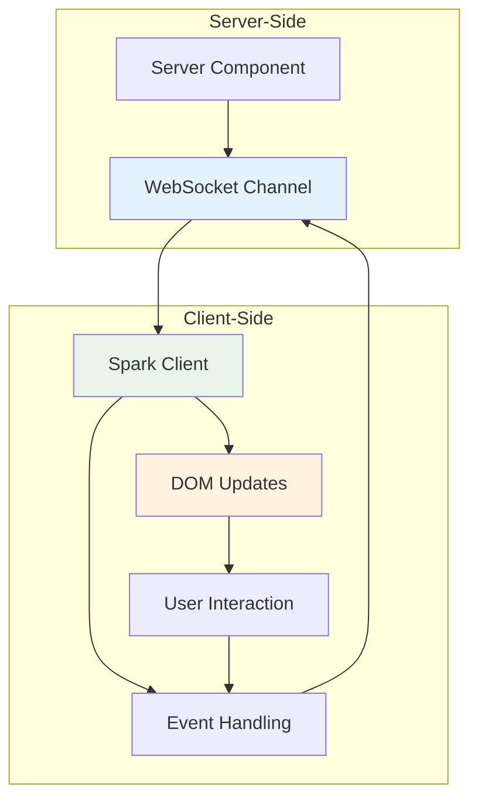

# Spark System

Azu's Spark system provides client-side JavaScript for real-time DOM updates and WebSocket communication. It enables seamless real-time interactions between server-side components and client-side JavaScript.

## Overview

The Spark system provides:

- **Automatic WebSocket management** for real-time connections
- **DOM manipulation** with server-sent updates
- **Event handling** for client-server communication
- **Component synchronization** between server and client
- **Error handling** and reconnection logic

## Architecture



## Basic Setup

### Including Spark

```html
<!-- Include Spark in your HTML template -->
<!DOCTYPE html>
<html>
  <head>
    <title>Azu Application</title>
  </head>
  <body>
    <!-- Your content here -->

    <!-- Include Spark JavaScript -->
    <script src="/js/azu-spark.js"></script>
    <script>
      // Initialize Spark
      Spark.init({
        host: window.location.hostname,
        port: 3000,
        secure: window.location.protocol === "https:",
      });
    </script>
  </body>
</html>
```

### Component Integration

```crystal
class CounterComponent < Azu::Component
  def initialize(@initial_count : Int32 = 0)
    @count = @initial_count
  end

  def content
    div class: "counter", id: "counter-#{object_id}", data_spark_id: object_id do
      h3 "Counter"
      span id: "count", class: "count" do
        text @count.to_s
      end

      div class: "controls" do
        button onclick: "Spark.emit('increment')", class: "btn btn-primary" do
          text "Increment"
        end
        button onclick: "Spark.emit('decrement')", class: "btn btn-secondary" do
          text "Decrement"
        end
        button onclick: "Spark.emit('reset')", class: "btn btn-danger" do
          text "Reset"
        end
      end
    end
  end

  def on_event("increment", data)
    @count += 1
    update_element "count", @count.to_s
  end

  def on_event("decrement", data)
    @count -= 1
    update_element "count", @count.to_s
  end

  def on_event("reset", data)
    @count = @initial_count
    update_element "count", @count.to_s
  end
end
```

## Spark API

### Core Methods

```javascript
// Initialize Spark
Spark.init({
  host: "localhost",
  port: 3000,
  secure: false,
  reconnectInterval: 5000,
  maxReconnectAttempts: 10,
});

// Emit events to server
Spark.emit("event_name", { data: "value" });

// Listen for server events
Spark.on("update", function (data) {
  console.log("Received update:", data);
});

// Update DOM elements
Spark.updateElement("element-id", "new content");

// Append content to elements
Spark.appendElement("element-id", "<div>New item</div>");

// Remove elements
Spark.removeElement("element-id");

// Get component instance
const component = Spark.getComponent("component-id");
```

### Event Handling

```javascript
// Listen for specific events
Spark.on("counter_updated", function (data) {
  const { count } = data;
  document.getElementById("count").textContent = count;
});

Spark.on("user_joined", function (data) {
  const { user } = data;
  const userList = document.getElementById("user-list");
  userList.innerHTML += `<li>${user.name} joined</li>`;
});

Spark.on("error", function (error) {
  console.error("Spark error:", error);
  showNotification("Connection error", "error");
});

// Remove event listeners
Spark.off("counter_updated");
```

### DOM Manipulation

```javascript
// Update element content
Spark.updateElement("message", "Hello, World!");

// Update element with HTML
Spark.updateElement("content", "<h1>Title</h1><p>Content</p>");

// Append content
Spark.appendElement("list", "<li>New item</li>");

// Prepend content
Spark.prependElement("list", "<li>First item</li>");

// Remove element
Spark.removeElement("old-message");

// Add/remove CSS classes
Spark.addClass("button", "active");
Spark.removeClass("button", "disabled");

// Toggle CSS classes
Spark.toggleClass("element", "highlighted");

// Set attributes
Spark.setAttribute("input", "value", "new value");
Spark.setAttribute("img", "src", "/new-image.jpg");
```

## WebSocket Management

### Connection Handling

```javascript
// Connection status
Spark.isConnected(); // Returns boolean

// Manual connection/disconnection
Spark.connect();
Spark.disconnect();

// Connection events
Spark.on("connect", function () {
  console.log("Connected to server");
  document.body.classList.add("connected");
});

Spark.on("disconnect", function () {
  console.log("Disconnected from server");
  document.body.classList.remove("connected");
});

Spark.on("reconnect", function (attempt) {
  console.log(`Reconnected on attempt ${attempt}`);
});

Spark.on("reconnect_failed", function () {
  console.log("Failed to reconnect");
  showNotification("Connection lost", "error");
});
```

### Error Handling

```javascript
// Handle connection errors
Spark.on("error", function (error) {
  console.error("WebSocket error:", error);

  switch (error.type) {
    case "connection_failed":
      showNotification("Failed to connect", "error");
      break;
    case "message_parse_error":
      console.error("Invalid message format");
      break;
    case "timeout":
      showNotification("Request timeout", "warning");
      break;
  }
});

// Handle specific error types
Spark.on("auth_error", function (error) {
  console.error("Authentication failed:", error.message);
  redirectToLogin();
});

Spark.on("permission_error", function (error) {
  console.error("Permission denied:", error.message);
  showNotification("Access denied", "error");
});
```

## Component Communication

### Server to Client

```crystal
class ChatComponent < Azu::Component
  def on_event("send_message", data)
    message_text = data["text"]?.try(&.as_s)
    return unless message_text

    # Add message to server state
    @messages << Message.new(message_text)

    # Update DOM for sender
    append_element "messages" do
      div class: "message own" do
        text message_text
      end
    end

    # Broadcast to other clients
    broadcast_update({
      type: "new_message",
      message: message_text,
      timestamp: Time.utc.to_rfc3339
    })
  end
end
```

```javascript
// Client-side handling
Spark.on("new_message", function (data) {
  const { message, timestamp } = data;

  const messagesContainer = document.getElementById("messages");
  const messageElement = document.createElement("div");
  messageElement.className = "message";
  messageElement.innerHTML = `
    <span class="text">${message}</span>
    <time>${new Date(timestamp).toLocaleTimeString()}</time>
  `;

  messagesContainer.appendChild(messageElement);
  messagesContainer.scrollTop = messagesContainer.scrollHeight;
});
```

### Client to Server

```javascript
// Send form data
document
  .getElementById("message-form")
  .addEventListener("submit", function (e) {
    e.preventDefault();

    const input = document.getElementById("message-input");
    const message = input.value.trim();

    if (message) {
      Spark.emit("send_message", { text: message });
      input.value = "";
    }
  });

// Send button clicks
document.getElementById("like-button").addEventListener("click", function () {
  Spark.emit("like_post", { post_id: this.dataset.postId });
});

// Send user interactions
document.getElementById("typing-input").addEventListener("input", function () {
  Spark.emit("typing", { is_typing: true });
});

document.getElementById("typing-input").addEventListener("blur", function () {
  Spark.emit("typing", { is_typing: false });
});
```

## Advanced Features

### Component State Management

```javascript
// Get component state
const state = Spark.getComponentState("counter-123");

// Set component state
Spark.setComponentState("counter-123", { count: 5 });

// Listen for state changes
Spark.onComponentStateChange("counter-123", function (newState, oldState) {
  console.log("State changed:", oldState, "->", newState);
});

// Subscribe to component updates
Spark.subscribeToComponent("counter-123", function (updates) {
  updates.forEach((update) => {
    switch (update.type) {
      case "element_update":
        Spark.updateElement(update.elementId, update.content);
        break;
      case "element_append":
        Spark.appendElement(update.elementId, update.content);
        break;
      case "element_remove":
        Spark.removeElement(update.elementId);
        break;
    }
  });
});
```

### Batch Updates

```javascript
// Batch multiple DOM updates
Spark.batch(function () {
  Spark.updateElement("counter", "5");
  Spark.updateElement("status", "Active");
  Spark.addClass("button", "highlighted");
});

// Or use the batch method directly
Spark.batch([
  { type: "update", elementId: "counter", content: "5" },
  { type: "update", elementId: "status", content: "Active" },
  { type: "addClass", elementId: "button", className: "highlighted" },
]);
```

### Custom Event Handlers

```javascript
// Register custom event handlers
Spark.registerHandler("custom_event", function (data) {
  // Handle custom event
  console.log("Custom event:", data);
});

// Register DOM update handlers
Spark.registerUpdateHandler("special-element", function (content) {
  // Custom update logic
  const element = document.getElementById("special-element");
  element.innerHTML = content;
  element.classList.add("updated");

  // Trigger animation
  element.style.animation = "fadeIn 0.3s ease-in";
});
```

## Performance Optimization

### Debounced Events

```javascript
// Debounce frequent events
const debouncedTyping = Spark.debounce(function (isTyping) {
  Spark.emit("typing", { is_typing: isTyping });
}, 300);

document.getElementById("message-input").addEventListener("input", function () {
  debouncedTyping(true);
});

document.getElementById("message-input").addEventListener("blur", function () {
  debouncedTyping(false);
});
```

### Throttled Updates

```javascript
// Throttle DOM updates
const throttledUpdate = Spark.throttle(function (elementId, content) {
  Spark.updateElement(elementId, content);
}, 100);

// Use throttled update for frequent changes
setInterval(function () {
  throttledUpdate("clock", new Date().toLocaleTimeString());
}, 50);
```

### Connection Pooling

```javascript
// Configure connection pooling
Spark.init({
  host: "localhost",
  port: 3000,
  poolSize: 5,
  maxConnections: 20,
  connectionTimeout: 5000,
});
```

## Error Recovery

### Automatic Reconnection

```javascript
// Configure reconnection
Spark.init({
  host: "localhost",
  port: 3000,
  reconnectInterval: 5000,
  maxReconnectAttempts: 10,
  backoffMultiplier: 1.5,
});

// Handle reconnection events
Spark.on("reconnect_attempt", function (attempt) {
  console.log(`Reconnection attempt ${attempt}`);
  showNotification(`Reconnecting... (${attempt})`, "info");
});

Spark.on("reconnect_success", function () {
  console.log("Successfully reconnected");
  showNotification("Reconnected successfully", "success");
});

Spark.on("reconnect_failed", function () {
  console.log("Failed to reconnect");
  showNotification("Connection lost. Please refresh the page.", "error");
});
```

### Message Queuing

```javascript
// Enable message queuing during disconnection
Spark.init({
  host: "localhost",
  port: 3000,
  queueMessages: true,
  maxQueueSize: 100,
});

// Messages sent while disconnected are queued and sent when reconnected
Spark.on("disconnect", function () {
  console.log("Disconnected - messages will be queued");
});

Spark.on("reconnect", function () {
  console.log("Reconnected - sending queued messages");
});
```

## Debugging

### Debug Mode

```javascript
// Enable debug mode
Spark.init({
  host: "localhost",
  port: 3000,
  debug: true,
});

// Debug events
Spark.on("debug", function (message) {
  console.log("Spark Debug:", message);
});

// Log all events
Spark.on("*", function (event, data) {
  console.log(`Spark Event [${event}]:`, data);
});
```

### Performance Monitoring

```javascript
// Monitor performance
Spark.on("performance", function (metrics) {
  console.log("Performance metrics:", metrics);
  // metrics includes: latency, messageCount, errorRate, etc.
});

// Monitor connection quality
Spark.on("connection_quality", function (quality) {
  console.log("Connection quality:", quality);
  // quality includes: rtt, packetLoss, bandwidth, etc.
});
```

## Best Practices

### 1. **Event Management**

- Use descriptive event names
- Validate event data on both client and server
- Clean up event listeners when components are destroyed
- Use namespaced events for complex applications

### 2. **DOM Updates**

- Batch multiple DOM updates when possible
- Use specific element IDs for updates
- Avoid updating large DOM trees frequently
- Use CSS classes for state changes

### 3. **Error Handling**

- Always handle connection errors
- Implement proper reconnection logic
- Provide user feedback for connection issues
- Log errors for debugging

### 4. **Performance**

- Debounce frequent events
- Throttle DOM updates
- Use connection pooling for multiple components
- Monitor performance metrics

## Next Steps

- [WebSocket Channels](channels.md) - Server-side WebSocket handling
- [Live Components](components.md) - Real-time UI components
- [Spark Examples](../playground/spark/) - Working examples

---

**Ready to add real-time interactivity?** Start with the basic Spark setup above, then explore [Live Components](components.md) for complete real-time solutions.
