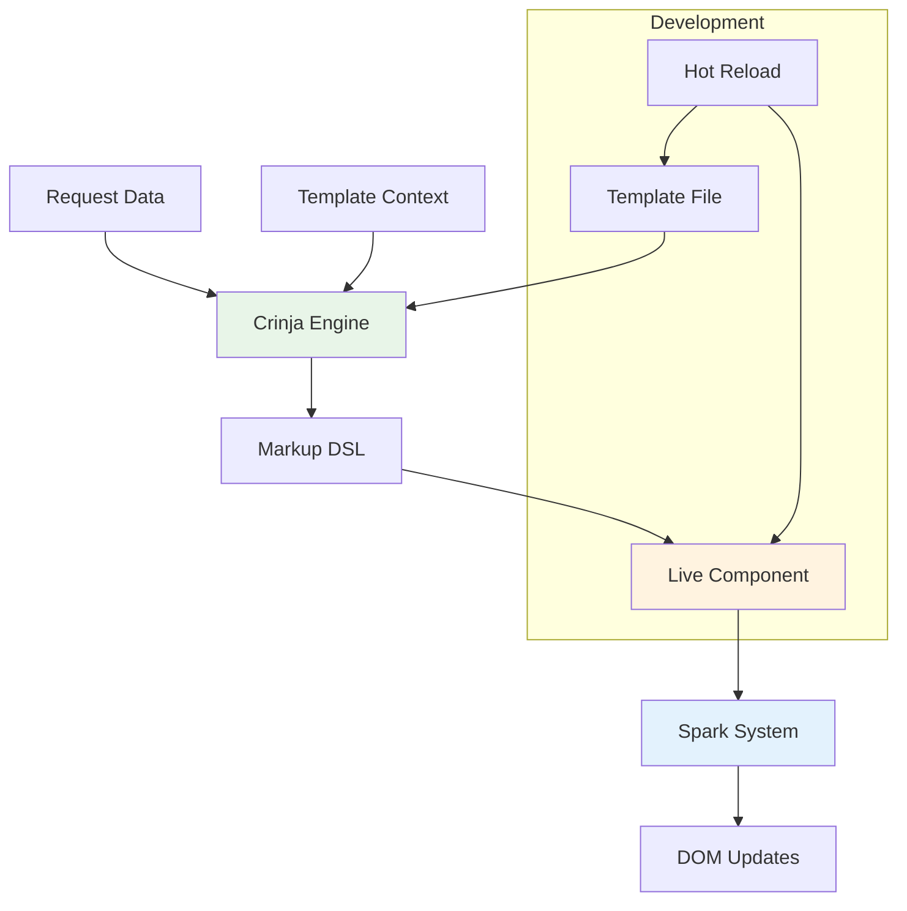

# Templates & Views

Azu provides a powerful templating system that combines server-side rendering with real-time capabilities. The template engine is built on top of **Crinja** (a Jinja2-compatible engine) and includes a **Markup DSL** for building dynamic HTML components.

## Overview

Azu's templating system is designed for:

- **Server-side rendering** with type-safe data binding
- **Real-time updates** through live components
- **Hot reloading** during development
- **Component-based architecture** for reusable UI elements
- **Type safety** throughout the template pipeline

## Architecture



## Key Features

### 1. **Template Engine**

- Jinja2-compatible syntax
- Type-safe data binding
- Automatic escaping and security
- Template inheritance and includes

### 2. **Markup DSL**

- Crystal-native HTML generation
- Component composition
- Real-time event handling
- Type-safe attribute binding

### 3. **Hot Reloading**

- Instant template updates during development
- Component state preservation
- Automatic browser refresh
- Development productivity boost

## Quick Start

### Basic Template Rendering

```crystal
struct UserProfileResponse
  include Response
  include Templates::Renderable

  def initialize(@user : User)
  end

  def render
    view "user_profile.html", {
      user: @user,
      is_admin: @user.admin?
    }
  end
end
```

### Template File (`user_profile.html`)

```html
 
<div class="user-profile">
  <h1>{{ user.name }}</h1>
  <p>Email: {{ user.email }}</p>

  
  <div class="admin-badge">Administrator</div>
  

  <div class="user-stats">
    <span>Posts: {{ user.posts.size }}</span>
    <span>Joined: {{ user.created_at | date("%B %Y") }}</span>
  </div>
</div>

```

### Live Component with Markup DSL

```crystal
class UserCounter < Azu::Component
  def content
    div class: "user-counter" do
      h2 "Active Users"
      span id: "count", class: "count" do
        text @active_users
      end
      button onclick: "increment()", class: "btn" do
        text "Add User"
      end
    end
  end

  def on_event("increment", data)
    @active_users += 1
    update_element "count", @active_users.to_s
  end
end
```

## Template Engine

The template engine provides the foundation for server-side rendering with features like:

- **Variable interpolation** with type safety
- **Control structures** (if, for, while)
- **Template inheritance** and includes
- **Filters and functions** for data transformation
- **Automatic escaping** for security

[Learn more about the Template Engine →](templates/engine.md)

## Markup DSL

The Markup DSL allows you to build HTML components directly in Crystal code with:

- **Type-safe HTML generation**
- **Component composition**
- **Event handling**
- **Real-time updates**

[Learn more about the Markup DSL →](templates/markup.md)

## Hot Reloading

During development, Azu provides hot reloading capabilities that:

- **Automatically refresh** when templates change
- **Preserve component state** during updates
- **Show instant feedback** for template modifications
- **Boost development productivity**

[Learn more about Hot Reloading →](templates/hot-reload.md)

## Best Practices

### 1. **Template Organization**

- Use template inheritance for consistent layouts
- Keep templates focused and single-purpose
- Organize templates in logical directory structures

### 2. **Data Binding**

- Always validate data before passing to templates
- Use type-safe data structures
- Avoid complex logic in templates

### 3. **Performance**

- Cache frequently used templates
- Minimize database queries in template rendering
- Use pagination for large datasets

### 4. **Security**

- Always escape user input
- Use CSRF protection for forms
- Validate all template data

## Next Steps

- [Template Engine Deep Dive](templates/engine.md) - Learn about Jinja2 syntax and features
- [Markup DSL Guide](templates/markup.md) - Build components with Crystal code
- [Hot Reloading Setup](templates/hot-reload.md) - Configure development workflow
- [Real-Time Components](real-time.md) - Add live updates to your templates

## Examples

Check out the [playground examples](../playground/) for complete working examples of:

- Template inheritance and includes
- Form handling with validation
- Real-time component updates
- Complex data binding scenarios

---

**Ready to build dynamic templates?** Start with the [Template Engine guide](templates/engine.md) to learn the fundamentals, then explore the [Markup DSL](templates/markup.md) for component-based development.
