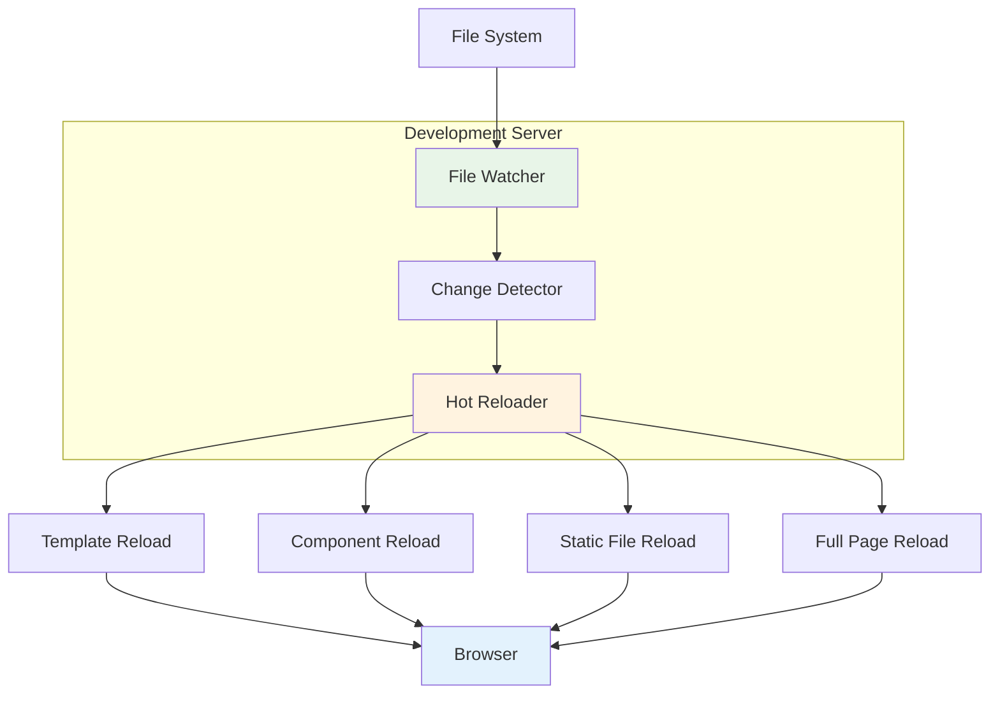

# Hot Reloading

Azu provides hot reloading capabilities that automatically refresh your application when templates, components, or other files change during development. This feature significantly improves development productivity by eliminating the need for manual server restarts.

## Overview

Hot reloading in Azu provides:

- **Instant template updates** when template files change
- **Component state preservation** during updates
- **Automatic browser refresh** for file changes
- **Development productivity boost** with fast feedback loops
- **Selective reloading** for different file types

## Architecture



## Configuration

### Basic Setup

```crystal
# Enable hot reloading in development
Azu::Environment.configure :development do |config|
  config.hot_reload = true
  config.hot_reload_port = 35729
  config.hot_reload_host = "localhost"
end
```

### Advanced Configuration

```crystal
# Detailed hot reload configuration
Azu::Configuration.configure do |config|
  # Enable hot reloading
  config.hot_reload = development?

  # WebSocket connection settings
  config.hot_reload_port = 35729
  config.hot_reload_host = "localhost"

  # File watching settings
  config.hot_reload_watch_paths = [
    "templates/**/*",
    "src/**/*.cr",
    "playground/**/*.cr"
  ]

  # File extensions to watch
  config.hot_reload_extensions = [
    ".html", ".cr", ".css", ".js"
  ]

  # Ignore patterns
  config.hot_reload_ignore = [
    "**/node_modules/**",
    "**/.git/**",
    "**/tmp/**"
  ]

  # Reload strategies
  config.hot_reload_strategies = {
    ".html" => :template_reload,
    ".cr" => :component_reload,
    ".css" => :css_reload,
    ".js" => :js_reload
  }
end
```

## File Types and Reload Strategies

### Template Files (`.html`)

Template files trigger template-specific reloads:

```html
<!-- templates/user_profile.html -->
<div class="user-profile">
  <h1>{{ user.name }}</h1>
  <p>{{ user.email }}</p>
</div>
```

When this file changes:

1. **Template is recompiled** with new content
2. **Component state is preserved**
3. **Only affected components are updated**
4. **No full page reload required**

### Crystal Files (`.cr`)

Crystal source files trigger component reloads:

```crystal
# playground/components/user_card.cr
class UserCardComponent < Azu::Component
  def initialize(@user : User)
  end

  def content
    div class: "user-card" do
      h3 @user.name
      p @user.email
    end
  end
end
```

When this file changes:

1. **Component is recompiled**
2. **Component instances are updated**
3. **DOM is patched with changes**
4. **State is preserved where possible**

### Static Files (`.css`, `.js`)

Static files trigger browser refresh:

```css
/* public/css/app.css */
.user-card {
  border: 1px solid #ccc;
  padding: 1rem;
}
```

When this file changes:

1. **Browser refreshes the page**
2. **New CSS/JS is loaded**
3. **Full page state is reset**

## Development Workflow

### Starting Development Server

```bash
# Start development server with hot reloading
crystal run playground/example_app.cr -- --hot-reload

# Or set environment variable
HOT_RELOAD=true crystal run playground/example_app.cr
```

### Development Process

1. **Make changes** to templates, components, or static files
2. **Save the file** - hot reloader detects the change
3. **Automatic update** - browser updates without manual refresh
4. **Continue development** - see changes instantly

### File Change Examples

#### Template Change

```html
<!-- Before -->
<h1>{{ user.name }}</h1>

<!-- After -->
<h1 class="user-title">{{ user.name }}</h1>
```

**Result**: Only the heading element is updated, preserving all other content and state.

#### Component Change

```crystal
# Before
def content
  div class: "user-card" do
    h3 @user.name
  end
end

# After
def content
  div class: "user-card" do
    h3 @user.name
    p @user.email  # Added line
  end
end
```

**Result**: Component is re-rendered with new content, preserving any component state.

#### CSS Change

```css
/* Before */
.user-card {
  border: 1px solid #ccc;
}

/* After */
.user-card {
  border: 2px solid #007bff;
  box-shadow: 0 2px 4px rgba(0, 0, 0, 0.1);
}
```

**Result**: Browser refreshes to load new CSS styles.

## Hot Reload Strategies

### Template Reload

For template file changes:

```crystal
# Template reload strategy
class TemplateReloadStrategy < Azu::HotReload::Strategy
  def handle_change(file_path : String)
    # Recompile template
    template = Azu::Templates.compile(file_path)

    # Update components using this template
    components = find_components_using_template(file_path)
    components.each do |component|
      component.reload_template(template)
    end

    # Send update to browser
    send_template_update(file_path, template)
  end
end
```

### Component Reload

For Crystal component file changes:

```crystal
# Component reload strategy
class ComponentReloadStrategy < Azu::HotReload::Strategy
  def handle_change(file_path : String)
    # Recompile component
    component_class = compile_component(file_path)

    # Find component instances
    instances = find_component_instances(component_class)
    instances.each do |instance|
      # Preserve state
      state = instance.state

      # Create new instance
      new_instance = component_class.new
      new_instance.restore_state(state)

      # Update DOM
      update_component_in_dom(instance, new_instance)
    end
  end
end
```

### CSS Reload

For CSS file changes:

```crystal
# CSS reload strategy
class CSSReloadStrategy < Azu::HotReload::Strategy
  def handle_change(file_path : String)
    # Send CSS reload command to browser
    send_css_reload(file_path)
  end
end
```

## Browser Integration

### WebSocket Connection

The hot reloader establishes a WebSocket connection with the browser:

```javascript
// Client-side hot reload script
class HotReloader {
  constructor() {
    this.connect();
  }

  connect() {
    this.ws = new WebSocket("ws://localhost:35729/hot-reload");
    this.ws.onmessage = (event) => this.handleMessage(event);
    this.ws.onclose = () => this.reconnect();
  }

  handleMessage(event) {
    const data = JSON.parse(event.data);

    switch (data.type) {
      case "template_update":
        this.updateTemplate(data);
        break;
      case "component_update":
        this.updateComponent(data);
        break;
      case "css_reload":
        this.reloadCSS(data);
        break;
      case "full_reload":
        this.reloadPage();
        break;
    }
  }
}
```

### Template Updates

```javascript
// Handle template updates
updateTemplate(data) {
  const { template_id, content } = data;

  // Find elements using this template
  const elements = document.querySelectorAll(`[data-template="${template_id}"]`);

  elements.forEach(element => {
    // Update content while preserving state
    const state = this.extractState(element);
    element.innerHTML = content;
    this.restoreState(element, state);
  });
}
```

### Component Updates

```javascript
// Handle component updates
updateComponent(data) {
  const { component_id, content, state } = data;

  // Find component element
  const element = document.getElementById(component_id);
  if (element) {
    // Preserve current state
    const currentState = this.extractState(element);

    // Update content
    element.innerHTML = content;

    // Restore state
    this.restoreState(element, state || currentState);
  }
}
```

## State Preservation

### Component State

```crystal
# Component with state
class CounterComponent < Azu::Component
  def initialize(@initial_count : Int32 = 0)
    @count = @initial_count
  end

  def content
    div class: "counter", id: "counter-#{object_id}" do
      span id: "count" do
        text @count.to_s
      end
      button onclick: "increment()" do
        text "Increment"
      end
    end
  end

  # State serialization for hot reload
  def state : Hash(String, JSON::Any)
    {
      "count" => @count.to_json
    }
  end

  # State restoration after hot reload
  def restore_state(state : Hash(String, JSON::Any))
    @count = state["count"].as_i
  end
end
```

### Form State

```crystal
# Form component with state preservation
class UserFormComponent < Azu::Component
  def initialize(@user : User? = nil)
    @form_data = {} of String => String
    @errors = {} of String => String
  end

  def content
    form method: "POST", class: "user-form" do
      input type: "text", name: "name", value: @form_data["name"]?,
            class: @errors["name"]? ? "error" : nil
      # ... more form fields
    end
  end

  def state : Hash(String, JSON::Any)
    {
      "form_data" => @form_data.to_json,
      "errors" => @errors.to_json
    }
  end

  def restore_state(state : Hash(String, JSON::Any))
    @form_data = Hash(String, String).from_json(state["form_data"].to_s)
    @errors = Hash(String, String).from_json(state["errors"].to_s)
  end
end
```

## Performance Optimization

### Selective Watching

```crystal
# Watch only necessary files
Azu::Configuration.configure do |config|
  config.hot_reload_watch_paths = [
    "templates/**/*.html",      # Template files
    "playground/components/**/*.cr",  # Component files
    "public/css/**/*.css",      # CSS files
    "public/js/**/*.js"         # JavaScript files
  ]

  # Ignore unnecessary files
  config.hot_reload_ignore = [
    "**/node_modules/**",
    "**/.git/**",
    "**/tmp/**",
    "**/*.log"
  ]
end
```

### Debounced Updates

```crystal
# Debounce file change events
class DebouncedHotReloader < Azu::HotReload::Reloader
  def initialize
    @debounce_timer = nil
    @debounce_delay = 100.milliseconds
  end

  def handle_file_change(file_path : String)
    # Cancel existing timer
    @debounce_timer.try(&.cancel)

    # Set new timer
    @debounce_timer = spawn do
      sleep @debounce_delay
      perform_reload(file_path)
    end
  end
end
```

## Troubleshooting

### Common Issues

#### Hot Reload Not Working

```bash
# Check if hot reload is enabled
echo $HOT_RELOAD

# Check WebSocket connection
curl -I http://localhost:35729/hot-reload

# Check file permissions
ls -la templates/
```

#### Template Changes Not Reflecting

```crystal
# Ensure template auto-reload is enabled
Azu::Configuration.configure do |config|
  config.template_auto_reload = true
  config.template_cache = false  # Disable caching in development
end
```

#### Component State Lost

```crystal
# Implement proper state serialization
class MyComponent < Azu::Component
  def state : Hash(String, JSON::Any)
    {
      "important_data" => @important_data.to_json
    }
  end

  def restore_state(state : Hash(String, JSON::Any))
    @important_data = ImportantData.from_json(state["important_data"].to_s)
  end
end
```

### Debug Mode

```crystal
# Enable hot reload debugging
Azu::Configuration.configure do |config|
  config.hot_reload_debug = true
  config.hot_reload_log_level = :debug
end
```

## Best Practices

### 1. **File Organization**

- Keep templates in `templates/` directory
- Organize components in `components/` directory
- Use consistent file naming conventions
- Separate concerns between files

### 2. **State Management**

- Implement proper state serialization
- Preserve important user input
- Handle state restoration gracefully
- Test state preservation during development

### 3. **Performance**

- Use selective file watching
- Implement debounced updates
- Avoid watching unnecessary files
- Monitor hot reload performance

### 4. **Development Workflow**

- Use hot reloading during development
- Test changes immediately
- Keep browser console open for errors
- Use development tools for debugging

## Next Steps

- [Template Engine](engine.md) - Learn about Jinja2 templates
- [Markup DSL](markup.md) - Build components with Crystal code
- [Development Setup](../contributing/setup.md) - Set up your development environment

---

**Ready to boost your development productivity?** Enable hot reloading in your development environment and experience instant feedback when making changes to templates and components.
