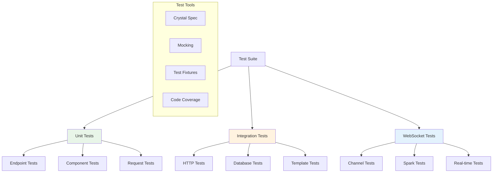

# Testing

Azu provides comprehensive testing support for building reliable web applications. This section covers unit testing, integration testing, and WebSocket testing strategies.

## Overview

Azu's testing features are designed for:

- **Unit testing** individual components and endpoints
- **Integration testing** complete request-response cycles
- **WebSocket testing** real-time communication flows
- **Test-driven development** with fast feedback loops
- **Continuous integration** with automated test suites

## Testing Architecture



## Key Testing Features

### 1. **Unit Testing**

- Isolated component testing
- Mock and stub support
- Fast execution times
- Comprehensive coverage

### 2. **Integration Testing**

- Full request-response testing
- Database integration
- Template rendering tests
- Middleware testing

### 3. **WebSocket Testing**

- Channel behavior testing
- Real-time event testing
- Connection lifecycle testing
- Message broadcasting tests

## Quick Start

### Basic Endpoint Test

```crystal
require "spec"
require "../src/azu"

describe UserEndpoint do
  it "returns user data" do
    # Create test request
    request = Azu::Test::Request.new(
      method: "GET",
      path: "/users/123",
      params: {"id" => "123"}
    )

    # Create endpoint instance
    endpoint = UserEndpoint.new

    # Execute endpoint
    response = endpoint.call(request)

    # Assert response
    response.status_code.should eq(200)
    response.content_type.should eq("application/json")

    data = JSON.parse(response.body)
    data["id"].should eq("123")
    data["name"].should eq("John Doe")
  end
end
```

### Request Contract Test

```crystal
describe UserRequest do
  it "validates required fields" do
    # Valid request
    valid_data = {
      "name" => "John Doe",
      "email" => "john@example.com"
    }

    request = UserRequest.new(valid_data)
    request.valid?.should be_true
    request.errors.should be_empty

    # Invalid request
    invalid_data = {
      "name" => "",
      "email" => "invalid-email"
    }

    request = UserRequest.new(invalid_data)
    request.valid?.should be_false
    request.errors.should contain("Name is required")
    request.errors.should contain("Email is invalid")
  end
end
```

### WebSocket Channel Test

```crystal
describe ChatChannel do
  it "handles chat messages" do
    # Create test channel
    channel = ChatChannel.new

    # Simulate connection
    socket = Azu::Test::WebSocket.new
    channel.on_connect(socket, {"room_id" => "general"})

    # Send message
    message = {
      "type" => "chat_message",
      "message" => "Hello, world!"
    }.to_json

    channel.on_message(socket, message)

    # Assert broadcast was sent
    socket.sent_messages.should contain(message)
  end
end
```

## Unit Testing

Unit testing focuses on testing individual components in isolation:

### Endpoint Testing

- Test endpoint logic without HTTP overhead
- Mock dependencies and external services
- Test error handling and edge cases
- Verify response format and content

### Component Testing

- Test live component behavior
- Verify event handling
- Test DOM updates and state changes
- Mock WebSocket connections

### Request/Response Testing

- Test request validation logic
- Verify response serialization
- Test error scenarios
- Validate data transformations

[Learn more about Unit Testing →](testing/unit.md)

## Integration Testing

Integration testing verifies that components work together correctly:

### HTTP Testing

- Test complete request-response cycles
- Verify middleware behavior
- Test routing and parameter handling
- Validate response headers and status codes

### Database Testing

- Test database interactions
- Use test databases and fixtures
- Test transaction handling
- Verify data persistence

### Template Testing

- Test template rendering
- Verify data binding
- Test template inheritance
- Validate output format

[Learn more about Integration Testing →](testing/integration.md)

## WebSocket Testing

WebSocket testing focuses on real-time communication:

### Channel Testing

- Test connection lifecycle
- Verify message handling
- Test broadcasting behavior
- Validate error handling

### Spark Testing

- Test client-side JavaScript
- Verify DOM updates
- Test event handling
- Validate real-time synchronization

### Real-time Testing

- Test end-to-end real-time flows
- Verify component updates
- Test concurrent connections
- Validate performance under load

[Learn more about WebSocket Testing →](testing/websockets.md)

## Test Organization

### Directory Structure

```
spec/
├── unit/
│   ├── endpoints/
│   ├── components/
│   └── requests/
├── integration/
│   ├── http/
│   ├── database/
│   └── templates/
├── websocket/
│   ├── channels/
│   ├── spark/
│   └── realtime/
└── support/
    ├── fixtures/
    ├── helpers/
    └── mocks/
```

### Test Naming Conventions

- Use descriptive test names
- Group related tests with `describe` blocks
- Use `context` blocks for different scenarios
- Follow the pattern: `describe ClassName do`

### Test Data Management

```crystal
# Use factories for test data
class UserFactory
  def self.create(attributes = {} of String => String)
    User.new(
      name: attributes["name"]? || "Test User",
      email: attributes["email"]? || "test@example.com"
    )
  end
end

# Use in tests
it "creates user" do
  user = UserFactory.create({"name" => "John"})
  user.name.should eq("John")
end
```

## Mocking and Stubbing

### Mock External Services

```crystal
# Mock database calls
describe UserEndpoint do
  it "handles database errors" do
    # Mock database to raise error
    User.stub(:find, ->(id : String) { raise "Database error" })

    request = Azu::Test::Request.new(
      method: "GET",
      path: "/users/123"
    )

    endpoint = UserEndpoint.new
    response = endpoint.call(request)

    response.status_code.should eq(500)
  end
end
```

### Mock WebSocket Connections

```crystal
# Mock WebSocket for testing
describe ChatChannel do
  it "broadcasts messages" do
    mock_socket = Azu::Test::WebSocket.new
    channel = ChatChannel.new

    # Mock connection
    channel.on_connect(mock_socket, {"room_id" => "general"})

    # Send message
    message = {"type" => "chat", "text" => "Hello"}.to_json
    channel.on_message(mock_socket, message)

    # Verify broadcast
    mock_socket.broadcast_messages.should contain(message)
  end
end
```

## Test Configuration

### Environment Setup

```crystal
# spec/spec_helper.cr
require "spec"
require "../src/azu"

# Configure test environment
Azu::Environment.configure :test do |config|
  config.database_url = "postgresql://localhost/azu_test"
  config.log_level = :error
  config.cache_enabled = false
end

# Load test helpers
require "./support/helpers"
require "./support/factories"
```

### Database Testing

```crystal
# Use test database
Spec.before_each do
  # Clean database before each test
  DB.exec("TRUNCATE users, posts CASCADE")
end

Spec.after_each do
  # Clean up after each test
  DB.exec("TRUNCATE users, posts CASCADE")
end
```

## Continuous Integration

### GitHub Actions

```yaml
# .github/workflows/test.yml
name: Tests
on: [push, pull_request]

jobs:
  test:
    runs-on: ubuntu-latest
    steps:
      - uses: actions/checkout@v3
      - uses: crystal-lang/install-crystal@v1
      - run: crystal spec
```

### Test Coverage

```crystal
# Enable code coverage
crystal spec --coverage

# View coverage report
crystal tool coverage
```

## Best Practices

### 1. **Test Organization**

- Group related tests together
- Use descriptive test names
- Keep tests focused and single-purpose
- Use setup and teardown appropriately

### 2. **Test Data**

- Use factories for test data
- Keep test data minimal and focused
- Use realistic but simple data
- Clean up test data after tests

### 3. **Mocking Strategy**

- Mock external dependencies
- Don't mock the code under test
- Use mocks to isolate units
- Verify mock interactions

### 4. **Performance**

- Keep tests fast
- Use parallel test execution
- Avoid slow operations in tests
- Use test databases for database tests

## Next Steps

- [Unit Testing Guide](testing/unit.md) - Test individual components
- [Integration Testing](testing/integration.md) - Test component interactions
- [WebSocket Testing](testing/websockets.md) - Test real-time features
- [Test Examples](../spec/) - View existing test examples

## Examples

Check out the [spec directory](../spec/) for complete working examples of:

- Endpoint testing patterns
- Component testing strategies
- WebSocket testing approaches
- Integration test scenarios

---

**Ready to write tests?** Start with [Unit Testing](testing/unit.md) to test individual components, then explore [Integration Testing](testing/integration.md) for testing component interactions.
